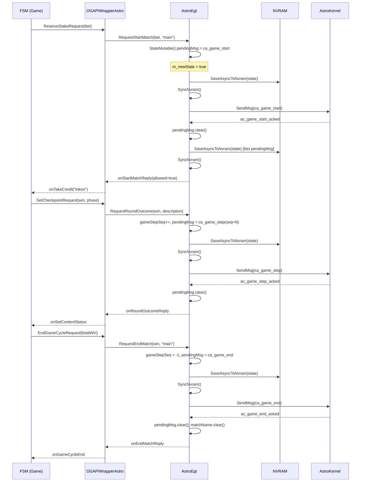
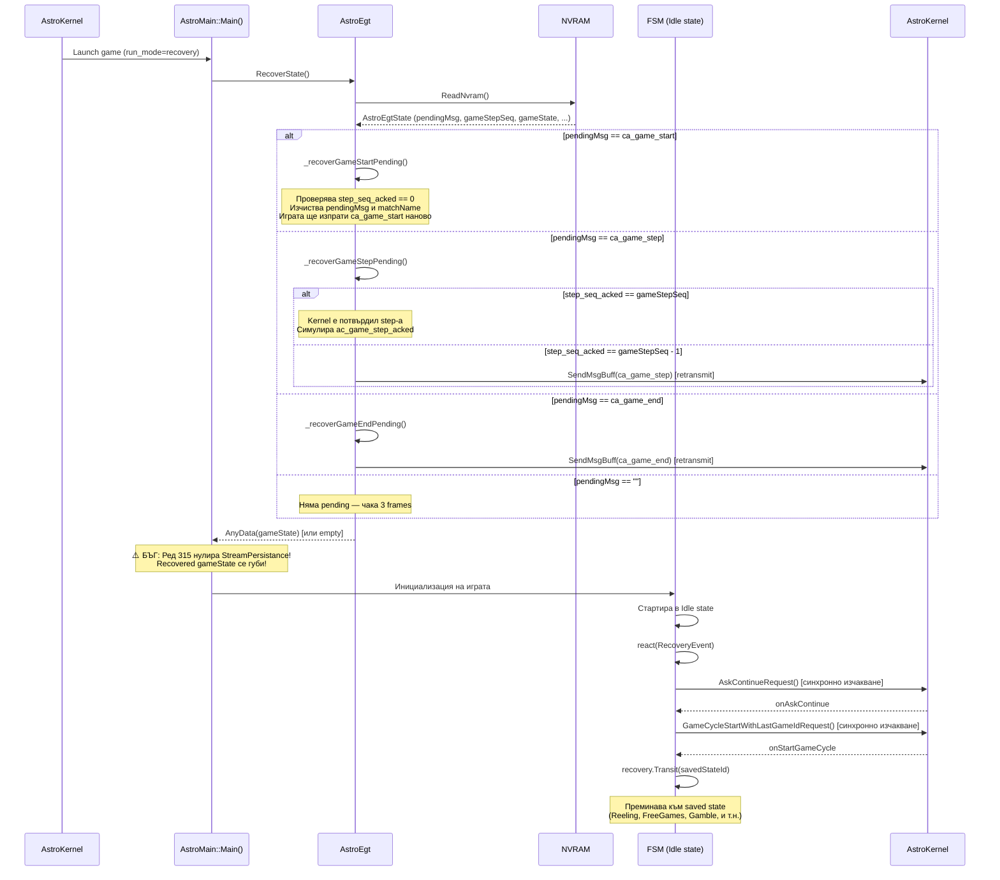
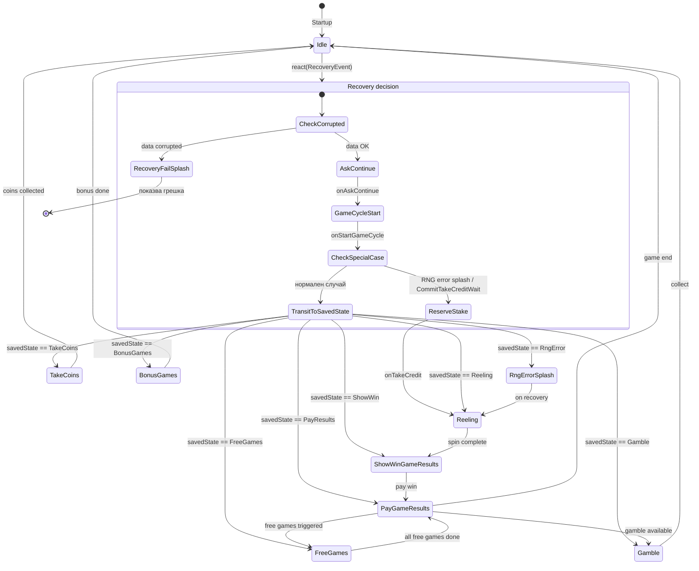

# Анализ на Recovery процеса — Astro (Sisal) интеграция

**Дата:** 2026-03-06
**Проект:** italy_games / Astro (Sisal)
**Статус:** За преглед

---

## Съдържание

1. [Въведение](#въведение)
2. [Официални изисквания (Astro документация v3.2)](#официални-изисквания)
3. [Имплементация в italy_games](#имплементация-в-italy_games)
4. [Recovery timeline — кога се случва](#recovery-timeline)
5. [Sequence диаграма на recovery flow](#sequence-диаграма)
6. [FSM State диаграма при recovery](#fsm-state-диаграма)
7. [Ключови code snippets](#ключови-code-snippets)
8. [Критичен анализ — разминавания и проблеми](#критичен-анализ)
9. [Заключение и оценка](#заключение)

---

## Въведение

Recovery е механизмът, чрез който игровата програма се възстановява до точно предишното си състояние след **power failure** (загуба на захранване) или **abnormal termination** (срив). В контекста на VLT (Video Lottery Terminal), recovery е **регулаторно изискване** — невъзможността да се върне коректно до прекъснатото игрово събитие означава финансов риск за играча и автоматично проваляне на сертификацията.

При Astro (Sisal) платформата, AstroKernel автоматично рестартира играта след прекъсване и я пуска в режим `run_mode = recovery`. Играта има **пълна отговорност** да разпознае този режим и да се върне в предишното си състояние.

Имплементацията в italy_games обхваща два независими слоя:
- **AstroEgt layer** (`AstroEgt.cpp`): Синхронизация на протокол-ниво с AstroKernel — pending messages, sequence numbers, NVRAM на integration state.
- **FSM layer** (`GameFsm`, `StateRecovery`, `Idle.cpp`): Възстановяване на вътрешното игрово FSM състояние — кой state, bet данни, free games count и т.н.

---

## Официални изисквания

*Референция: `docs/astro/Astro Game Development Kits - Programming Guide - v3.2.md`, Section 3.3*

### 3.1 NVRAM — три задължителни случая

Документацията изисква играта да allocate **8192 байта (8KB) NVRAM** и да различава три случая при startup:

| NVRAM съдържание | Интерпретация | Очаквано действие |
|------------------|---------------|-------------------|
| Всички нули (zeros) | Нормален старт от Game Lobby | Инициализира NVRAM, стартира в idle |
| Валидни данни | Re-launch след crash/power loss | **Прави recovery** |
| Corrupted данни | Непоправима грешка | **Излиза с exit code 12** |

> Ключово: AstroKernel **нулира NVRAM преди нормален старт** от лобито. Следователно ненулеви данни при startup означават recovery — не "случайно остатъчни данни".

### 3.2 Exit codes

| Код | Смисъл | Поведение на AstroKernel |
|-----|--------|--------------------------|
| 0 | Нормален изход в idle | Пуска Game Lobby |
| 11 | RNG timeout | Връща залога, пуска Game Lobby |
| **12** | **Inner logic error / NVRAM corrupted** | **Блокира терминала завинаги** — само "force detach" от оператор |
| 13, 14, 19, 20 | Recoverable грешки | Рестартира терминала, след което прави recovery |

Exit code 12 е **необратим** — изисква ръчна намеса от оператора. Трябва да се използва само при:
- Corrupted NVRAM (не може да се прочете коректно)
- Desync между играта и AstroKernel (логически невъзможно състояние)

### 3.3 Принципи на recovery

**Principle of Retransmission (Принцип на повторно изпращане):**
Ако играта е изпратила съобщение (`ca_game_start`, `ca_game_step`, `ca_game_end`) и е претърпяла power failure преди получаване на ack, при recovery трябва да изпрати съобщението отново.

**Atomic action (Атомарна операция):**
State и данни трябва да се запишат в NVRAM **напълно или изобщо** — не може да има частично записано състояние. Записването трябва да завърши **преди** изпращане на съобщението към kernel-а.

**`step_seq_acked` механизъм:**
AstroKernel предоставя в конфигурацията `run_mode/step_seq_acked` последния потвърден sequence number. Играта го използва при recovery за да определи дали `ca_game_step` е получен от kernel-а:

- `step_seq_acked == gameStepSeq` → ack е получен, трябва само да се симулира и да се продължи
- `step_seq_acked == gameStepSeq - 1` → ack НЕ е получен, трябва да се изпрати отново

### 3.4 Button lights при recovery

> "When game recovery is required, also restore states of button lights."

Изрично изискване, макар и кратко описано в документацията.

---

## Имплементация в italy_games

### 4.1 Entry point — `AstroEgt::RecoverState()`

Файл: `integrations/Astro/libs/src/Egt/AstroEgt/AstroEgt.cpp`, ред 59

```cpp
AnyData AstroEgt::RecoverState()
{
    AnyData gameState;
    auto mode = Tools::ReadStringCfg("run_mode", "mode");
    StateMutable() = {};  // Нулира в-паметта state
    Tools::SendMsg("ca_flow_start");

    if (mode == "puppet" || mode == "demo" || mode == "normal")
    {
        if (mode != "normal")
            Tools::SetNvramDummyMode();
    }
    else if (mode == "recovery")
    {
        gameState = _recoverImpl();  // Единственият path, при който recovery се извършва
    }
    else
    {
        throw std::logic_error("Unknown game mode!");
    }
    return gameState;
}
```

`RecoverState()` се извиква **веднъж при startup**, преди инициализацията на играта. Тя:
1. Чете `run_mode.mode` от Astro конфигурацията
2. Ако режимът е `"recovery"` → извиква `_recoverImpl()`
3. Връща сериализираното FSM state като `AnyData`

### 4.2 Ядрото на recovery — `_recoverImpl()`

Файл: `AstroEgt.cpp`, ред 392

```cpp
AnyData AstroEgt::_recoverImpl()
{
    auto nvram = Tools::ReadNvram();
    if (!nvram.empty())
    {
        DataTools::UnpackIData(StateMutable(), nvram);  // Десериализира AstroEgtState от NVRAM
    }
    else
    {
        return {};  // NVRAM е празен — нищо за recovery
    }

    auto pendingMsgName = Tools::GetMsgName(State().pendingMsg);

    if (pendingMsgName == "ca_game_start")
        _recoverGameStartPending();
    else if (pendingMsgName == "ca_game_step")
        _recoverGameStepPending();
    else if (pendingMsgName == "ca_game_end")
        _recoverGameEndPending();
    else if (pendingMsgName == "")
        m_waitFlowStartFrames = 3;  // Нормален recovery без pending message
    else
        throw std::runtime_error("Unknown pending msg");

    return State().gameState;  // Връща вложения FSM state
}
```

Стратегията е **фазово-специфична**: гледа кое съобщение е останало `pending` (незаключено с ack) и прилага различна логика за всяка фаза.

### 4.3 Три фазови handler-и

#### `_recoverGameStartPending()` — прекъсване при `ca_game_start`

```cpp
void AstroEgt::_recoverGameStartPending()
{
    auto seq = Tools::ReadIntCfg("run_mode", "step_seq_acked");
    if (seq != 0)
    {
        // Desync — step_seq_acked не трябва да е ненулев при game start
        ExitAstro(IAstroEgtApi::ExitCodes::GENERAL_ERROR);
    }

    // Коментар от май 2025: "better duplicate game start then no game start at all"
    // Изчиства pendingMsg и matchName, за да може играта да изпрати ca_game_start отново
    StateMutable().pendingMsg.clear();
    StateMutable().matchName.clear();
    m_waitFlowStartFrames = 3;
}
```

Логиката: ако е имало power failure преди получаване на `ac_game_start_acked`, kernel-ът може или да не е получил `ca_game_start`, или да го е получил но не е успял да изпрати ack. **Избраното решение е да се изпрати отново** — по-безопасно дублиране, отколкото пропускане.

#### `_recoverGameStepPending()` — прекъсване при `ca_game_step`

```cpp
void AstroEgt::_recoverGameStepPending()
{
    auto seq = Tools::ReadIntCfg("run_mode", "step_seq_acked");

    if (seq == State().gameStepSeq)
    {
        // Kernel-ът е получил step-а — симулира ac_game_step_acked
        auto msg = Tools::PackAstroMsg(Tools::EmptyAstroMsg<Tools::HeaderOnly>(), "ac_game_step_acked");
        m_incommingMsgs.push(std::move(msg));
    }
    else if (seq == State().gameStepSeq - 1)
    {
        // Kernel-ът НЕ е получил step-а — изпраща го отново
        Tools::SendMsgBuff(State().pendingMsg);
        m_isPendingMsgSent = true;
    }
    // ← Няма else — ако seq не съответства на нито едно от двете, нищо не се случва
}
```

#### `_recoverGameEndPending()` — прекъсване при `ca_game_end`

```cpp
void AstroEgt::_recoverGameEndPending()
{
    auto seq = Tools::ReadIntCfg("run_mode", "step_seq_acked");
    if (seq == 0)
    {
        StateMutable() = {};  // Нулира state напълно — играта ще стартира clean
    }
    else
    {
        if ((State().gameStepSeq != -1) && (seq != State().gameStepSeq))
            ExitAstro(IAstroEgtApi::ExitCodes::GENERAL_ERROR);  // Desync
        Tools::SendMsgBuff(State().pendingMsg);  // Изпраща ca_game_end отново
        m_isPendingMsgSent = true;
    }
}
```

### 4.4 NVRAM save/load цикъл

Файл: `AstroEgt.cpp`, ред 261

```cpp
bool AstroEgt::EndMainLoopTick()
{
    if (m_waitFlowStartFrames != 0)
        --m_waitFlowStartFrames;

    if (m_newState && !m_isSuspended && (m_waitFlowStartFrames == 0))
    {
        m_newState = false;
        Tools::SaveAsyncToNvram(DataTools::PackIData(State()));  // 1. Async запис в NVRAM
        _processPendingMessage();  // 2. Sync + изпращане на pending съобщение
        return true;
    }
    return false;
}
```

```cpp
void AstroEgt::_processPendingMessage()
{
    if (!State().pendingMsg.empty() && !m_isPendingMsgSent)
    {
        Tools::SyncNvram();         // Изчаква async записът да завърши
        Tools::SendMsgBuff(State().pendingMsg);  // СЛЕД sync — изпраща съобщението
        m_isPendingMsgSent = true;
    }
}
```

**Гаранцията за атомарност:** Записването в NVRAM (`SaveAsyncToNvram` + `SyncNvram`) **винаги предхожда** изпращането на съобщението. Ако power failure настъпи между двете, NVRAM ще съдържа `pendingMsg`, и при recovery то ще бъде изпратено отново. Принципът на retransmission е спазен.

`m_newState` се вдига при всяко извикване на `StateMutable()`, което маркира необходимостта от запис в NVRAM при следващия tick.

### 4.5 Как се запазва FSM state

Файл: `AstroMain.h`, ред 196 (главен loop)

```cpp
while (!wrapperImpl.IsExitRequested())
{
    astroEgtApiPtr->StartMainLoopTick();
    game.Update(deltaTime);  // FSM обновяване

    if (streamPersistance.IsChanged())
    {
        Storage storage;
        storage.gameState = streamPersistance.Dump();  // Сериализира FSM данните
        astroEgtApiPtr->SaveState(storage);            // Записва в AstroEgtState
    }
    astroEgtApiPtr->EndMainLoopTick();  // Тригерира NVRAM запис ако state е сменен
}
```

`StreamPersistance` следи промените в FSM game data. Когато се промени, сериализира цялото FSM state (`Dump()`) и го подава на `AstroEgt::SaveState()`, което го вгражда в `AstroEgtState.gameState`. Оттам `EndMainLoopTick` записва целия `AstroEgtState` (включително `gameState`) в NVRAM.

### 4.6 FSM StateRecovery система

Файл: `games/libs/src/Egt/.../GameFsm/StateRecovery/StateRecovery.h`

Всяка игра регистрира своите FSM states в `StateRecovery`:

```cpp
bool GameFsm::InitStateRecovery()
{
    m_stateRecovery.Register<ReelingState>();
    m_stateRecovery.Register<ShowWinGameResultsState>();
    m_stateRecovery.Register<FreeGamesState>();
    m_stateRecovery.Register<GambleState>();
    m_stateRecovery.Register<PayGameResultsState>();
    m_stateRecovery.Register<RngErrorSplash>();
    m_stateRecovery.Register<Idle>();
    // ...
    return true;
}
```

При нормален gameplay, `GameFsm::SaveGameState<State>()` записва ID-то на текущия state:

```cpp
// В Idle.cpp при OnTakeCreditEvent:
gameFsm.SaveGameState<Idle>(GameFsm::eGameData);

// В Idle.cpp при OnStartGameCycleEvent (ако gameCycleEnabled):
gameFsm.SaveGameState<Idle>(GameFsm::eGameData);
```

State ID-то се персистира независимо чрез `PersistantClass<StateData>` (файлово-базирана персистентност, отделна от NVRAM `StreamPersistance`).

### 4.7 `Idle::react(RecoveryEvent)` — FSM recovery entry point

Файл: `games/libs/src/Egt/20SuperHot/GameFsm/States/Idle.cpp`, ред 616

```cpp
sc::result Idle::react(const RecoveryEvent& event)
{
    if (event.m_recoveryDataCorrupted)
        return transit<RecoveryFailSplash>();  // Показва грешка на играча

    auto& gameFsm = context<GameFsm>();

    // Стъпка 1: AskContinue — синхронно изчакване
    if (!m_recoverAfterAskContinue)
    {
        m_recoverAfterAskContinue = true;
        gameFsm.GetCommComponent().AskContinueRequest();
        while (!m_askToContinueSucceeded)
            OGAPI::OGAPIWrapper::Instance()->Update();
    }

    // Стъпка 2: GameCycleStart с последното game ID — синхронно изчакване
    gameFsm.GetCommComponent().GameCycleStartWithLastGameIdRequest();
    while (!m_startGameCycleSucceeded)
        OGAPI::OGAPIWrapper::Instance()->Update();

    auto stateId = context<GameFsm>().GetStateRecovery().GetStateId();

    // Специални случаи — директно запитване за stake:
    if (stateId == StateRecovery<Idle>::GenerateId<RngErrorSplash>()
        || gameFsm.GetGameImpl().GetWaitingForRngInReeling()
        || (mainGameScene.GetGameData().GetCommitTakeCreditReqWait()
            && stateId == StateRecovery<Idle>::GenerateId<Idle>()))
    {
        int bet = mainGameScene.GetBetPerLine() * mainGameScene.GetSelectedLineCount();
        gameFsm.GetCommComponent().ReserveStakeRequest(bet);
        m_askToContinueSucceeded = true;
        m_beginGameRequested = true;
        return discard_event();
    }

    // Стандартен path — transit към записания state
    return recovery.Transit(stateId, *this);
}
```

FSM recovery se осъществява в `Idle` state — тя е началният state на FSM. При recovery, играта стартира в `Idle`, получава `RecoveryEvent`, и от там се транзитира към записания state.

---

## Recovery timeline

### Кога се случва recovery?

Recovery се осъществява **при стартиране на играта**, ако `run_mode.mode == "recovery"`. Последователността е:

1. AstroKernel открива, че играта е прекъсната (power failure, crash)
2. AstroKernel **не нулира NVRAM** (нулира само при нормален старт от лобито)
3. AstroKernel стартира игровия процес с `run_mode.mode = "recovery"`
4. Играта извиква `AstroEgt::RecoverState()` → `_recoverImpl()` → четене на NVRAM
5. Integration layer (AstroEgt) се синхронизира с kernel-а (resend/emulate acks)
6. FSM стартира в `Idle`, получава `RecoveryEvent`
7. FSM се транзитира към записания state (Reeling, FreeGames, Gamble, и т.н.)

**Recovery се случва изцяло при startup — НЕ по времето на нормален gameplay.**

---

## Sequence диаграма

### Нормален gameplay flow (без прекъсване)



### Recovery flow след power failure



---

## FSM State диаграма



---

## Ключови code snippets

### Snippet 1: Атомарност — save преди send

```cpp
// AstroEgt.cpp, EndMainLoopTick() + _processPendingMessage()

// Стъпка 1: Async запис в NVRAM (не блокира)
Tools::SaveAsyncToNvram(DataTools::PackIData(State()));

// Стъпка 2: В _processPendingMessage():
Tools::SyncNvram();          // Изчаква NVRAM записът да завърши
Tools::SendMsgBuff(State().pendingMsg);  // СЛЕД sync — изпраща към kernel-а
```

Ако power failure настъпи ПРЕДИ `SyncNvram()`: NVRAM съдържа предишното state без pendingMsg → при recovery нищо не се resend-ва. Правилно, защото kernel-ът никога не е получил съобщението.

Ако power failure настъпи СЛЕД `SyncNvram()` но ПРЕДИ `SendMsgBuff()`: NVRAM съдържа pendingMsg → при recovery се resend-ва. Правилно, принципът на retransmission е спазен.

### Snippet 2: Whitelist на recoverable messages

```cpp
// AstroEgt.cpp, ред 38
const static std::set<std::string> s_recoverableMsgsWhitelist = {
    "ca_game_start", "ca_game_step", "ca_game_end"
};

template<typename AstroMsg>
void AstroEgt::_saveAndSendMsg(AstroMsg msg, const std::string& msgName)
{
    if (s_recoverableMsgsWhitelist.find(msgName) == s_recoverableMsgsWhitelist.end())
        throw std::logic_error("Please add your msg to the whitelist and PLEASE TAKE CARE OF THE RECOVERY");
    if (!State().pendingMsg.empty())
        throw std::logic_error("Cannot send second recoverable msg");
    StateMutable().pendingMsg = Tools::PackAstroMsg(msg, msgName);
    m_isPendingMsgSent = false;
}
```

Само тези три съобщения са recoverable. Защитата с whitelist + `throw` е добра практика — нов разработчик не може да добави recoverable съобщение без да помисли за recovery логиката му.

### Snippet 3: Критичният бъг — AstroMain.h:315

```cpp
// AstroMain.h, ред 307-315
AnyData anyDataStorage = astroEgtApiPtr->RecoverState();  // Връща recovered FSM state
if (false == anyDataStorage.IsEmpty())
{
    auto storage = *anyDataStorage.Cast<Storage>();
    streamPersistanceRowPtr->SetInitialStreamData(storage.gameState);  // ✅ Задава recovered data
}

// TODO: Read nvram buffer
streamPersistanceRowPtr->SetInitialStreamData({});  // ❌ БЪГ: ВИНАГИ нулира данните!
```

### Snippet 4: StateRecovery Transit

```cpp
// StateHolder.hpp
template<class T, class InitialState>
sc::result StateHolder<T, InitialState>::Transit(InitialState& context) {
    context.template context<GameFsm>().GetMainGameScene().OnGameRecovery();
    return context.template transit<T>();  // Транзитира към concrete state T
}
```

### Snippet 5: `RequestStartMatch` при recovery

```cpp
// AstroEgt.cpp, ред 111
void AstroEgt::RequestStartMatch(uint64_t bet, const Name& name)
{
    if (!State().matchName.empty())
    {
        if (State().gameStepSeq == 0)
        {
            // Recovery: ca_game_start ack е получен, симулира го
            auto emulatedReply = Tools::EmptyAstroMsg<ak2msg_ac_game_start_acked>();
            emulatedReply.bool_enabled = true;
            auto msg = Tools::PackAstroMsg(emulatedReply, "ac_game_start_acked");
            m_incommingMsgs.push(std::move(msg));
            return;
        }
        throw std::logic_error("Overlapping start match requests");
    }
    // ... нормален path
}
```

---

## Критичен анализ

### ❌ КРИТИЧЕН БЪГ — FSM State recovery е счупено (AstroMain.h:315)

**Местоположение:** `AstroIntegration/AstroMain.h`, ред 315

```cpp
streamPersistanceRowPtr->SetInitialStreamData({});  // Нулира всичко!
```

Тази линия **унищожава recovery данните**, дори когато са коректно прочетени и зададени на редове 310-311. Последователността е:

1. Ред 307: `RecoverState()` → NVRAM се чете, FSM state се десериализира ✅
2. Ред 310-311: `SetInitialStreamData(storage.gameState)` → Задава recovered данните ✅
3. **Ред 315: `SetInitialStreamData({})` → НУЛИРА данните** ❌

Резултатът: `StreamPersistance` винаги стартира с празен state, независимо от recovery режима. FSM game data (bet, free games count, reel positions и т.н.) **никога не се възстановяват** след power failure.

**Какво НЕ е счупено:** `StateRecovery` (коя state да се транзитира) персистира чрез отделен механизъм (`PersistantClass<StateData>`, файлово базиран), и **не** минава през `StreamPersistance`. Затова FSM-ът ще транзитира към правилния state (например `FreeGames`), но ще го намери с нулирани данни (0 free games, неправилен bet и т.н.).

**Тежест:** КРИТИЧНА — провал на сертификация, потенциален финансов ущърб за играча. Коментарът `// TODO: Read nvram buffer` потвърждава, че линията е placeholder, който никога не е бил завършен/заменен.

---

### ❌ УМЕРЕН ПРОБЛЕМ — Непълна обработка в `_recoverGameStepPending()`

```cpp
void AstroEgt::_recoverGameStepPending()
{
    auto seq = Tools::ReadIntCfg("run_mode", "step_seq_acked");

    if (seq == State().gameStepSeq)       { /* emulate ack */ }
    else if (seq == State().gameStepSeq - 1) { /* resend */ }
    // ← НЕТ else!
}
```

Документацията (Section 3.3) казва:
> Ако сме в match state и `step_seq_acked` не съответства на нито едно от очакваните стойности → **завърши с exit code 12**.

В кода: ако `seq` не съответства на нито едно условие, функцията завършва мълчаливо без действие. Играта продължава с incorrect state без да сигнализира проблема. Според документацията това е desync ситуация и трябва да завърши с exit code 12 (INNER_LOGIC).

---

### ⚠️ СЪМНЕНИЕ — Exit code при desync е GENERAL_ERROR вместо INNER_LOGIC (код 12)

В `_recoverGameStartPending()` и `_recoverGameEndPending()`:

```cpp
ExitAstro(IAstroEgtApi::ExitCodes::GENERAL_ERROR);
```

В `AstroMain.h`:
```cpp
EXIT_PROGRAM(IAstroEgtApi::ExitCodes::INNER_LOGIC);
```

Документацията изисква **exit code 12** (INNER_LOGIC) за desync/corruption ситуации, защото само тогава AstroKernel блокира терминала за ръчна намеса. Ако `GENERAL_ERROR` съответства на код 13 или 14, AstroKernel ще рестартира терминала и ще опита recovery отново — рискувайки безкраен цикъл.

Числовото съответствие на `ExitCodes::GENERAL_ERROR` трябва да се провери в `IAstroEgtApi.h`.

---

### ⚠️ ИЗИСКВАНЕ НЕ Е ИЗРИЧНО ИЗПЪЛНЕНО — Button light restoration

Документацията изисква:
> "When game recovery is required, also restore states of button lights."

В кода няма изричен "restore lights" call при recovery. `SetLights()` се извиква от FSM states по нормалния rendering cycle, така че светлините **ще се възстановят след няколко frame-а**, но не моментално при завършване на recovery-то.

Технически играта ще изглежда коректно след 1-2 frames, но формалното изискване за моментално възстановяване при recovery не е изпълнено.

---

### ℹ️ НАБЛЮДЕНИЕ — Async save е правилно имплементиран

Въпреки че `SaveAsyncToNvram` изглежда потенциално проблематично, атомарността е спазена защото:
- Save е **async**, но `SyncNvram` блокира преди изпращане на съобщение
- Редът save → sync → send е строго спазен в `EndMainLoopTick` + `_processPendingMessage`

Това е коректна имплементация на "atomic action" изискването от документацията.

---

### ℹ️ НАБЛЮДЕНИЕ — Dead macro `DO_NOT_REPEATE_START_MATCH_REQUEST_OPTION_1`

```cpp
#define DO_NOT_REPEATE_START_MATCH_REQUEST_OPTION_1
```

Тази макрос е дефинирана в AstroEgt.cpp но **никъде не се използва**. Наименованието подсказва, че е имало алтернативна имплементация ("Option 1") на recovery при `ca_game_start`. Артефакт от предишен дизайн — код за изчистване.

---

### ℹ️ НАБЛЮДЕНИЕ — Blocking waits в `react(RecoveryEvent)`

```cpp
gameFsm.GetCommComponent().AskContinueRequest();
while (!m_askToContinueSucceeded)
    OGAPI::OGAPIWrapper::Instance()->Update();
```

Recovery в `Idle::react(RecoveryEvent)` използва blocking while loops с `Update()` calls. Това е нестандартен pattern (повечето игрови системи използват async state transitions), но е функционален защото:
- Recovery се случва само веднъж при startup
- Не може да настъпи нов game cycle докато recovery не завърши
- `Update()` обработва incoming messages, така че не е истинско busy-waiting

Потенциален проблем: ако AskContinue никога не дойде (kernel crash по време на recovery), играта зависва безкрайно. Документацията не адресира явно timeout в recovery.

---

## Заключение

### Обобщена оценка

| Аспект | Оценка | Коментар |
|--------|--------|---------|
| Protocol-ниво recovery (AstroEgt layer) | **Добро** | Принципът на retransmission е спазен; атомарността е коректно имплементирана |
| FSM state recovery | **❌ Счупено** | AstroMain.h:315 нулира recovered state — критичен бъг |
| Exit code handling | **Съмнително** | GENERAL_ERROR може да е грешен код при desync |
| Button light restoration | **Частично** | Не е изрично, но се случва при следващия render frame |
| Error detection в `_recoverGameStepPending` | **Непълно** | Няма обработка за unexpected `step_seq_acked` стойности |
| Code качество | **Умерено** | TODO коментари, dead macro, blocking waits |

### Приоритетна оценка на проблемите

1. **[P0 — БЛОКЕР]** `AstroMain.h:315` — нулиране на FSM state след recovery. Трябва да се поправи преди сертификация.
2. **[P1 — ВИСОК]** Проверка на числовия код на `ExitCodes::GENERAL_ERROR`. Ако не е 12, трябва да се смени на `INNER_LOGIC`.
3. **[P2 — УМЕРЕН]** Добавяне на error handling в `_recoverGameStepPending()` за unexpected `step_seq_acked` стойности.
4. **[P3 — НИЗ]** Изрично възстановяване на button lights при recovery.
5. **[P4 — ИЗЧИСТВАНЕ]** Премахване на dead macro `DO_NOT_REPEATE_START_MATCH_REQUEST_OPTION_1`.

### Поправката на P0

Ред 315 трябва да се **премахне** или да се замени с условна проверка:

```cpp
// ПРЕДИ (бъг):
AnyData anyDataStorage = astroEgtApiPtr->RecoverState();
if (false == anyDataStorage.IsEmpty())
{
    auto storage = *anyDataStorage.Cast<Storage>();
    streamPersistanceRowPtr->SetInitialStreamData(storage.gameState);
}
// TODO: Read nvram buffer
streamPersistanceRowPtr->SetInitialStreamData({});  // ❌

// СЛЕД (поправка):
AnyData anyDataStorage = astroEgtApiPtr->RecoverState();
if (false == anyDataStorage.IsEmpty())
{
    auto storage = *anyDataStorage.Cast<Storage>();
    streamPersistanceRowPtr->SetInitialStreamData(storage.gameState);  // ✅ Задава и не презаписва
}
// Ако anyDataStorage е empty — streamPersistance остава с default (празен) state. Коректно.
```

---

*Анализът е генериран на 2026-03-06 въз основа на изходен код от `C:/mklinks/italy_games_sisal_r1/` и официалната Astro документация v3.2.*
