# FSM-Communication Architecture (italy_games)

Този документ описва архитектурата на комуникацията между FSM state машината на играта и интеграционния слой (OGAPIWrapper) в проекта `italy_games`.

> **Забележка:** Проектът `italy_games` използва различна архитектура от `games`. Тук играта комуникира с интеграцията през `CommComponent → OGAPIWrapper`, а не през `IGameflow → IKernelApi` както в `games`.

---

## 1. Основни понятия

### 1.1 Game Cycle (Игрален цикъл)

**Game Cycle** е една игрална сесия — от натискането на бутон "Start" до завършване на цикъла. Аналог на "Match" от проекта `games`.

- Започва с: `AskContinue → StartGameCycle → ReserveStake`
- Завършва с: `AwardWinnings → EndGameCycle → AskContinue`
- Съдържа: един main spin + опционални free spins, bonus games и gamble

```
┌───────────────────────────────────────────────────────────────────┐
│                          GAME CYCLE                               │
│                                                                   │
│  ┌──────────┐   ┌──────────┐   ┌──────────┐   ┌──────────┐      │
│  │  Main    │ → │  Free    │ → │  Bonus   │ → │  Gamble  │      │
│  │  Spin    │   │  Games   │   │  Games   │   │  Round   │      │
│  └──────────┘   └──────────┘   └──────────┘   └──────────┘      │
│                  (опционални)   (опционални)   (опционален)       │
│                                                                   │
│  Кредит: bet се удържа при ReserveStake, win се добавя при       │
│          AwardWinnings                                            │
└───────────────────────────────────────────────────────────────────┘
```

### 1.2 Phase (Фаза)

**Phase** описва типа на текущия етап в game cycle:

| Phase | Описание |
|-------|----------|
| `GAME_PHASE_PRIMARY` | Основен spin (main game) |
| `GAME_PHASE_GAMBLE` | Gamble round (рисков залог) |
| `GAME_PHASE_FREE_GAMES` | Free spins |
| `GAME_PHASE_BONUS` | Bonus game |
| `GAME_PHASE_SHINY_CASH` | ShinyCash/Jackpot feature |

Всяка фаза се отчита към kernel-а чрез `SetCheckpointRequest(summary, phaseInfo)`.

### 1.3 State (Състояние)

**State** е FSM състояние, реализирано чрез **Boost.Statechart**. States са организирани йерархично с compound states и substates:

```
GameFsm (root)
├── Idle                         # Чакане за игра
├── ReelingState                 # Въртене на барабаните
│   ├── ReelingSubstate          #   Анимация + RNG заявка
│   └── StoppingSubstate         #   Спиране + определяне на следващ state
├── SpecialSymbol                # Разширяване на специален символ
│   ├── SpecialSymbolIntro
│   └── SpecialSymbolOutro
├── ShowWinGameResultsState      # Показване на печалба, избор Gamble/Collect
├── Gamble                       # Gamble feature (red/black)
│   ├── GambleIntroSubstate
│   ├── GambleIdleSubstate
│   ├── GambleShowResultsSubstate
│   └── GambleOutroSubstate
├── FreeGamesAresState           # Free games (Ares/Astro вариант)
│   ├── FreeGamesIntroAresSubstate
│   ├── FreeGamesIdleAres
│   ├── FreeSpinStartedAres
│   │   ├── FreeGamesReelingAresSubstate
│   │   └── StoppingFreeSpinAresSubstate
│   ├── ShowWinFreeGamesResultsAresState
│   ├── FreeGamesRetriggerAresSubstate
│   └── FreeGamesOutroAresSubstate
├── FreeGamesInspiredState       # Free games (Inspired вариант)
├── BonusGameState               # Bonus game feature
│   ├── BonusGameIntro
│   ├── BonusGameIdle
│   ├── BonusSpin
│   ├── ShowWinBonusGameResultsState
│   ├── BonusGameCollectState
│   └── BonusGameOutro
├── ShinyCashState               # Jackpot pick feature
│   ├── ShinyCashIntro
│   ├── ShinyCashIdle
│   ├── ShowWinShinyCashResultsState
│   └── ShinyCashOutro
├── TakeCoins                    # Coin pick feature
├── PayGameResultsState          # Изплащане на печалба
├── GameEndedState               # Приключване на game cycle
├── Collect                      # Cashout / ticket print
│   ├── PayoutInProgressSubstate
│   └── TicketPrintFailedSubstate
├── ShowTaxationSplash           # Показване на данъчна информация
├── TimeAmountLimitsState        # Gaming limits breach
└── RngErrorSplash               # RNG грешка
```

---

## 2. Архитектурни слоеве

```
┌─────────────────────────────────────────────────────────────────────────────┐
│                              FSM STATES                                     │
│   Idle, ReelingState, ShowWinGameResultsState, Gamble, ...                  │
│                                                                             │
│   - Реагира на user input (бутони, touch)                                   │
│   - Управлява UI/анимации/сцени                                             │
│   - Извиква CommComponent за kernel комуникация                             │
│   - Използва Boost.Statechart events                                        │
└──────────────────────────────┬──────────────────────────────────────────────┘
                               │ FSM Events (OnRandomNumbersEvent, etc.)
                               │
┌──────────────────────────────┴──────────────────────────────────────────────┐
│                       CommComponent (per-game)                              │
│                                                                             │
│   - Мост между FSM events и OGAPIWrapper requests                           │
│   - Превежда OGAPIWrapper callbacks → Boost.Statechart events               │
│   - Всяка игра има собствен CommComponent                                   │
│   - Инстанция: CommComponent(GameFsm&, OGAPIWrapper&)                       │
└──────────────────────────────┬──────────────────────────────────────────────┘
                               │ Virtual method calls
                               │
┌──────────────────────────────┴──────────────────────────────────────────────┐
│                    OGAPIWrapper (abstract interface)                         │
│                                                                             │
│   Requests:                           Callbacks (via ICommComponent):       │
│   - AskContinueRequest()              - onAskContinue()                     │
│   - StartGameCycleRequest()           - onStartGameCycle()                  │
│   - ReserveStakeRequest()             - onTakeCredit(token)                 │
│   - RngNumbersRequest()               - onRandoms(success, randoms)        │
│   - SetCheckpointRequest()            - onSetContentStatus(success, ok)     │
│   - CommitStakeRequest()              - onCommitCredit(success, ok)         │
│   - AwardWinningsRequest()            - onAwardWinning()                    │
│   - EndGameCycleRequest()             - onGameCycleEnd()                    │
│   - CashoutRequest()                  - onCreditChange(credit)             │
│   - ExitingRequest()                  - onTaxEvent(msg)                     │
└──────────────────────────────┬──────────────────────────────────────────────┘
                               │
            ┌──────────────────┼──────────────────┐
            ▼                  ▼                  ▼
     ┌──────────────┐  ┌──────────────┐   ┌──────────────┐
     │ OGAPIWrapper │  │ OGAPIWrapper │   │ OGAPIWrapper │
     │    Ares      │  │   Astro     │   │  Inspired   │
     │              │  │             │   │             │
     │  (Ares API)  │  │ (виж 2a)   │   │  (iKernel   │
     │              │  │             │   │   OGAPI)    │
     └──────────────┘  └──────┬───────┘   └──────────────┘
                              │
                   ┌──────────┴───────────┐
                   │    IAstroEgtApi      │
                   │  (extends IKernelApi)│
                   │                      │
                   │  Match/Round модел   │
                   │  + Astro events      │
                   └──────────┬───────────┘
                              │
                   ┌──────────┴───────────┐
                   │      AstroEgt       │
                   │                      │
                   │  IKernelApi → AK2API │
                   │  NVRAM persistence   │
                   │  Recovery            │
                   └──────────┬───────────┘
                              │ ca_*/ac_* messages
                   ┌──────────┴───────────┐
                   │      AK2API         │
                   │  (Astro framework)  │
                   └──────────────────────┘
```

### Сравнение с проекта `games`

| Аспект | `games` (нова генерация) | `italy_games` (legacy) |
|--------|--------------------------|------------------------|
| FSM framework | Custom state машина | Boost.Statechart |
| Communication bridge | `IGameflow` (AlphaFamilyGameflow) | `CommComponent` (per-game) |
| Integration abstraction | `IKernelApi` директно | `OGAPIWrapper` (OGAPI-style) |
| Game cycle модел | Match → Rounds (Start/End Match, Start/End Round) | OGAPI-style (AskContinue → StartGameCycle → ... → EndGameCycle) |
| Math калкулация | В Gameflow (RequestRandoms loop) | В FSM states (Simulate в ReelingSubstate) |
| Recovery | Автоматичен чрез kernel | StateRecovery + memento/NVRAM |

---

## 2a. Astro Integration Stack (пълна верига при Astro)

Документът по-горе спира на ниво `OGAPIWrapper`. Тази секция описва **пълния stack** под него при Astro интеграцията — класовете, техните роли, зависимости и как OGAPI заявките се превеждат към AK2API съобщения.

### 2a.1 Mermaid Class Diagram

```mermaid
classDiagram
    direction TB

    class GameFsm {
        Boost.Statechart FSM
        States: Idle, Reeling, Gamble...
        react(Event) → transit / discard
    }

    class CommComponent {
        per-game bridge
        GameFsm& m_fsm
        OGAPIWrapper& m_wrapper
        ──────────────
        FSM → OGAPI requests
        OGAPI callbacks → FSM events
    }

    class OGAPIWrapper {
        <<abstract>>
        AskContinueRequest()
        StartGameCycleRequest()
        ReserveStakeRequest()
        RngNumbersRequest()
        SetCheckpointRequest()
        CommitStakeRequest()
        AwardWinningsRequest()
        EndGameCycleRequest()
        CashoutRequest()
    }

    class ICommComponent {
        <<interface>>
        onAskContinue()
        onStartGameCycle()
        onTakeCredit()
        onRandoms()
        onSetContentStatus()
        onCommitCredit()
        onAwardWinning()
        onGameCycleEnd()
        onCreditChange()
        onTaxEvent()
    }

    class OGAPIWrapperAstro {
        Ptr‹IAstroEgtApi› m_astroEgtApi
        ICommComponent* m_commComponent
        vector‹bool› m_simulateEvents
        ──────────────
        OGAPI заявки:
          симулирани → директен callback
          реални → IAstroEgtApi
        ──────────────
        Слуша IAstroEgtApi::Events
        → превежда към ICommComponent callbacks
    }

    class IKernelApi {
        <<interface>>
        RequestStartMatch(bet, name)
        RequestStartRound(otherBets, name)
        RequestRoundOutcome(win, description)
        RequestStartGambleRound(bet, name)
        RequestGambleRoundOutcome(win, desc)
        RequestEndMatch(win, description)
        RequestRandoms(count, maxValue, name)
        RequestCashout()
        StartMainLoopTick()
        EndMainLoopTick() bool
        SaveState(gameState)
        RecoverState() AnyData
        ──────────────
        Events: onStartMatchReply
                onRoundOutcomeReply
                onEndMatchReply
                onRandomsReply
                creditChanged
                terminateRequested
                suspendRequested
    }

    class IAstroEgtApi {
        <<interface extends IKernelApi>>
        InitAstro(initData, argc, argv)
        ExitAstro(exitCode)
        GameSnapshot(monitor)
        SetButtonLights(key, isOn)
        SetAtmosphereScenario(scenario)
        ──────────────
        AstroEvents extends Events:
          touchPressed / touchReleased
          buttonDown / buttonUp
    }

    class AstroEgt {
        имплементира IAstroEgtApi
        ──────────────
        AstroEgtState m_state
        queue‹msg› m_incommingMsgs
        ──────────────
        IKernelApi → AK2API:
          RequestStartMatch → ca_game_start
          RequestRoundOutcome → ca_game_step
          RequestEndMatch → ca_game_end
          RequestRandoms → ca_rng_request
          RequestCashout → ca_credit_payout
        ──────────────
        AK2API → Events:
          ac_game_start_acked → onStartMatchReply
          ac_game_step_acked → onRoundOutcomeReply
          ac_game_end_acked → onEndMatchReply
          ac_rng_result → onRandomsReply
          ac_credit_changed → creditChanged
        ──────────────
        NVRAM persistence
        Pending message recovery
    }

    class AK2API {
        <<external library>>
        ak2api_init()
        ak2api_init_until_complete()
        ak2api_exit()
        ──────────────
        Message-based protocol
        ca_* (game → framework)
        ac_* (framework → game)
    }

    GameFsm --> CommComponent : извиква requests
    CommComponent --> OGAPIWrapper : OGAPI requests
    OGAPIWrapper <|-- OGAPIWrapperAstro : имплементира
    CommComponent ..|> ICommComponent : имплементира
    OGAPIWrapperAstro --> ICommComponent : callbacks
    OGAPIWrapperAstro --> IAstroEgtApi : реални заявки
    IKernelApi <|-- IAstroEgtApi : extends
    IAstroEgtApi <|.. AstroEgt : имплементира
    IAstroEgtApi --> OGAPIWrapperAstro : Events (event system)
    AstroEgt --> AK2API : ca_* съобщения
    AK2API --> AstroEgt : ac_* съобщения
```



### 2a.2 Роля на всеки клас

| Клас | Роля | Файл |
|------|------|------|
| **GameFsm** | Boost.Statechart FSM — управлява game states и UI. Реагира на потребителски input и FSM events от CommComponent. | `games/.../GameFsm/GameFsm.h` |
| **CommComponent** | Per-game мост. Превежда FSM заявки → OGAPIWrapper requests и OGAPIWrapper callbacks → Boost.Statechart events. | `games/.../CommComponent.h/.cpp` |
| **OGAPIWrapper** | Абстрактен интерфейс за всички интеграции. Дефинира OGAPI-style API (AskContinue, ReserveStake, SetCheckpoint, ...). | `games/.../OGAPIWrapper.h` |
| **ICommComponent** | Callback интерфейс — интеграцията уведомява играта за резултати (onRandoms, onTakeCredit, onGameCycleEnd, ...). | `games/.../ICommComponent.h` |
| **OGAPIWrapperAstro** | Astro имплементация на OGAPIWrapper. Превежда OGAPI заявки — **част симулира** (AskContinue, CommitStake), а **част делегира** към IAstroEgtApi. Слуша IAstroEgtApi::Events и ги превежда обратно към ICommComponent callbacks. | `integrations/Astro/.../OGAPIWrapperAstro.h/.cpp` |
| **IKernelApi** | Унифициран kernel interface (споделен с `games` проекта). Дефинира Match/Round модел: RequestStartMatch → RequestStartRound → RequestRoundOutcome → RequestEndMatch. Включва event system (Events struct). | `integrations/CommonIntegrations/.../IKernelApi.h` |
| **IAstroEgtApi** | Extends IKernelApi с Astro-специфични методи (InitAstro, ExitAstro, GameSnapshot, бутони, atmosphere). Extends Events с touch и button events. | `integrations/Astro/.../IAstroEgtApi.h` |
| **AstroEgt** | **Ядрото на Astro комуникацията.** Имплементира IAstroEgtApi. Превежда IKernelApi заявки в AK2API съобщения (ca_*), обработва входящи съобщения (ac_*), управлява NVRAM persistence и recovery. | `integrations/Astro/.../AstroEgt.h/.cpp` |
| **AK2API** | Външна C библиотека от Astro framework-а. Message-based протокол — играта изпраща `ca_*` съобщения и получава `ac_*` отговори. | `<AstroGDK/ak2api.h>` |
| **GameRoundHelper** | Помощен клас, който форматира `outcome_detail` описание за `ca_game_step` съобщенията — описва типа на рунда, печалба, random числа. | `integrations/Astro/.../GameRoundHelper.h/.cpp` |

### 2a.3 OGAPI → IKernelApi Mapping (реално vs симулирано)

`OGAPIWrapperAstro` е ключовият adapter — той превежда OGAPI-style извиквания (от CommComponent) към IKernelApi/AK2API протокол. **Не всички OGAPI заявки имат реален аналог в Astro** — някои се симулират локално:

| OGAPI заявка | Реална / Симулирана | IKernelApi метод | AK2API съобщение | Бележки |
|---|---|---|---|---|
| `AskContinueRequest` | **Симулирана** | — | — | Директно извиква `onAskContinue()` (няма Astro еквивалент) |
| `StartGameCycleRequest` | **Симулирана** | — | — | Директно извиква `onStartGameCycle(id)` |
| `ReserveStakeRequest` | **Реална** | `RequestStartMatch(bet)` | `ca_game_start` | **Тук реално започва match-ът** — bet се изпраща на framework-а |
| `RngNumbersRequest` | **Реална** | `RequestRandoms(count, max)` | `ca_rng_request` | Получава `ac_rng_result` обратно |
| `SetCheckpointRequest` | **Реална** | `RequestRoundOutcome(win, desc)` | `ca_game_step` | Описанието идва от GameRoundHelper |
| `SetCheckpointNoReelsResultReq` | **Симулирана** | — | — | Директно извиква `onSetContentStatusNoReelResult()` |
| `CommitStakeRequest` | **Симулирана** | — | — | Директно извиква `onCommitCredit()` |
| `AwardWinningsRequest` | **Симулирана** | — | — | Извиква `onAwardWinning()` + hack за кредит update |
| `EndGameCycleRequest` | **Реална** | `RequestEndMatch(win, desc)` | `ca_game_end` | Завършва match-а в Astro |
| `CashoutRequest` | **Реална** | `RequestCashout()` | `ca_credit_payout` | След cashout → exit при resume |

**Забележка:** Симулираните заявки работят чрез `m_simulateEvents` вектор — флагът се вдига при заявката и се обработва в следващия `Update()` цикъл. Това осигурява асинхронно поведение, съвместимо с game loop-а.

### 2a.4 AstroEgt: IKernelApi → AK2API превод

`AstroEgt` е класът, който реално комуникира с Astro framework-а. Той:

1. **Превежда IKernelApi заявки в AK2API съобщения:**

| IKernelApi метод | AK2API съобщение | Поведение |
|---|---|---|
| `RequestStartMatch(bet, name)` | `ca_game_start` | Запазва bet и name в state; изпраща чрез `_saveAndSendMsg` (persist → send) |
| `RequestStartRound(name)` | — | Локално — само Post-ва `onStartRoundReply` (Astro няма отделен round start) |
| `RequestRoundOutcome(win, desc)` | `ca_game_step` | Увеличава `gameStepSeq`; изпраща с outcome detail |
| `RequestStartGambleRound(bet, name)` | — | Като RequestStartRound, но маркира `isCurrentRoundGamble = true` |
| `RequestGambleRoundOutcome(win, desc)` | `ca_game_step` | Делегира към `RequestRoundOutcome` (същото AK2API съобщение) |
| `RequestEndMatch(win, desc)` | `ca_game_end` | Задава `gameStepSeq = -1`; изпраща чрез `_saveAndSendMsg` |
| `RequestRandoms(count, max, name)` | `ca_rng_request` | Директно изпраща (без pending msg — не е recoverable) |
| `RequestCashout()` | `ca_credit_payout` | Директно изпраща |

2. **Обработва входящи AK2API съобщения (`_processIncommingMsg`):**

| AK2API съобщение | Event | Обработка |
|---|---|---|
| `ac_game_start_acked` | `onStartMatchReply(enabled, name)` | Изчиства pendingMsg; ако `enabled=false` — match-ът е отхвърлен |
| `ac_game_step_acked` | `onRoundOutcomeReply(name)` или `onGambleRoundOutcomeReply(name)` | Зависи от `isCurrentRoundGamble` флага |
| `ac_game_end_acked` | `onEndMatchReply(net_won, name)` | Изчиства pendingMsg и matchName |
| `ac_rng_result` | `onRandomsReply(randoms, maxValue, name)` | Парсва random числата от msg.random_nums[] |
| `ac_credit_changed` | `creditChanged(credits)` | Кредитът се е променил от framework-а |
| `ac_meter_info` | `onCurrentCreditReply(current_ce)` | Отговор на `ca_meter_query` |
| `ac_touch_pressed/released` | `touchPressed/Released(x, y)` | Touch input от framework |
| `ac_key_down/up` | `buttonDown/Up(key)` | Бутон от физическия панел |
| `ac_flow_terminate` | `terminateRequested` | Framework иска затваряне |
| `ac_flow_suspend` | `suspendRequested` | Framework паузира играта |
| `ac_flow_resume` | `resumeRequested` | Framework възстановява играта |

### 2a.5 Main Loop (AstroMain)

`AstroMain::Main<Game>()` инициализира всички компоненти и стартира main loop. Структурата на цикъла:

```
AstroMain::Main<Game>()
│
├── Създаване на AstroEgt и OGAPIWrapperAstro
├── astroEgtApi->InitAstro()         ← ak2api_init() + ak2api_init_until_complete()
├── wrapperImpl.SetAstroEgtApi()     ← свързва двата класа
├── astroEgtApi->RecoverState()      ← чете NVRAM, изпраща ca_flow_start, recover ако трябва
├── Game::LoadGame() + game->Init()
│
└── while (!wrapperImpl.IsExitRequested())    ← MAIN LOOP
    │
    ├── astroEgtApi->StartMainLoopTick()
    │   ├── Tools::SyncNvram()
    │   ├── Обработка на всички входящи AK2API съобщения
    │   │   └── _processIncommingMsg() × N
    │   └── _processRngRetryIfNeeded()       ← retry RNG на всеки 500ms, до 3 пъти
    │
    ├── game.Update(deltaTime)               ← FSM tick, анимации, UI
    │
    ├── if (streamPersistance.IsChanged())
    │   └── astroEgtApi->SaveState(storage)  ← запазва game state
    │
    ├── astroEgtApi->EndMainLoopTick()
    │   ├── if (m_newState && !m_isSuspended)
    │   │   ├── Tools::SaveAsyncToNvram(state)  ← persist AstroEgtState
    │   │   └── _processPendingMessage()        ← изпраща pending ca_* msg ако има
    │   └── return true/false                   ← true = има промени, tick ASAP
    │
    └── Render + deltaTime + Sleep
```

**Ключов момент:** `_processPendingMessage()` се извиква в `EndMainLoopTick()` — **след** като state-ът е записан в NVRAM. Това осигурява, че при crash съобщението може да се преизпрати (recovery).

### 2a.6 Pending Message и Recovery

AstroEgt използва **save-before-send** модел за recoverable съобщения (`ca_game_start`, `ca_game_step`, `ca_game_end`):

```
1. _saveAndSendMsg(msg, name):
   ├── Проверява msg name в whitelist (ca_game_start/step/end)
   ├── Записва msg в state.pendingMsg
   └── Задава m_isPendingMsgSent = false

2. EndMainLoopTick():
   ├── SaveAsyncToNvram(state)     ← state + pendingMsg → NVRAM
   └── _processPendingMessage():
       └── Ако pendingMsg != empty && !sent → SendMsgBuff() + sent=true

3. При получаване на ack (ac_*_acked):
   └── Изчиства state.pendingMsg
```

При **recovery** (restart след crash):
- `RecoverState()` чете NVRAM, изпраща `ca_flow_start`
- Проверява `state.pendingMsg`:
  - `ca_game_start` pending → чете `step_seq_acked` от config; изчиства и оставя играта да преизпрати
  - `ca_game_step` pending → сравнява `step_seq_acked` с `gameStepSeq`:
    - Ако равни → емулира `ac_game_step_acked` (framework вече е обработил)
    - Ако seq-1 → преизпраща pending msg
  - `ca_game_end` pending → преизпраща или reset-ва в зависимост от `step_seq_acked`

### 2a.7 AstroEgtState (persisted state)

```cpp
struct AstroEgtState {
    int gameStepSeq = 0;              // Текущ номер на game step (seq в ca_game_step)
    vector<uint8_t> pendingMsg;       // Pending recoverable съобщение
    bool isCurrentRoundGamble = false; // Текущият round е gamble ли?
    string matchName;                 // Име на текущия match ("main")
    string roundName;                 // Име на текущия round
    uint64_t matchInitialBet = 0;     // Начален bet за текущия match
    AnyData gameState;                // Game-specific state (от StreamPersistance)
};
```

Целият `AstroEgtState` се записва в NVRAM при всяка промяна (маркирана чрез `StateMutable()`). Полето `gameStepSeq` е ключово за recovery — стойност `-1` означава `ca_game_end` е изпратен.

---

## 3. Communication Flow

### 3.1 Game Begin Flow (Idle → Reeling)

```
┌──────────────┐     ┌────────────────┐     ┌──────────────┐     ┌──────────────┐
│    Idle      │     │  CommComponent │     │ OGAPIWrapper │     │   Kernel     │
└──────┬───────┘     └───────┬────────┘     └──────┬───────┘     └──────┬───────┘
       │                     │                     │                     │
       │ [Player натиска     │                     │                     │
       │  Start бутон]       │                     │                     │
       │                     │                     │                     │
       │ AskContinueRequest()│                     │                     │
       │─────────────────────>                     │                     │
       │                     │ AskContinueRequest()│                     │
       │                     │─────────────────────>                     │
       │                     │                     │ AskContinue()       │
       │                     │                     │─────────────────────>
       │                     │                     │                     │
       │                     │                     │   callback(1)       │
       │                     │                     │<─────────────────────
       │                     │ onAskContinue()     │                     │
       │                     │<─────────────────────                     │
       │ OnAskContinueEvent  │                     │                     │
       │<─────────────────────                     │                     │
       │                     │                     │                     │
       │ GameCycleStartReq() │                     │                     │
       │─────────────────────>                     │                     │
       │                     │─────────────────────>                     │
       │                     │                     │─────────────────────>
       │                     │                     │                     │
       │                     │                     │   callback(id)      │
       │                     │                     │<─────────────────────
       │                     │ onStartGameCycle(id)│                     │
       │                     │<─────────────────────                     │
       │ OnStartGameCycleEvt │                     │                     │
       │<─────────────────────                     │                     │
       │                     │                     │                     │
       │ ReserveStakeReq(bet)│                     │                     │
       │─────────────────────>                     │                     │
       │                     │─────────────────────>                     │
       │                     │                     │─────────────────────>
       │                     │                     │   [Kernel удържа    │
       │                     │                     │    кредит]          │
       │                     │                     │   callback(token)   │
       │                     │                     │<─────────────────────
       │                     │ onTakeCredit(token)  │                     │
       │                     │<─────────────────────                     │
       │ OnTakeCreditEvent   │                     │                     │
       │<─────────────────────                     │                     │
       │                     │                     │                     │
       │ transit<ReelingState>                     │                     │
       │                     │                     │                     │
```

### 3.2 Reeling Flow (RNG + SetCheckpoint + CommitStake)

```
┌──────────────┐     ┌────────────────┐     ┌──────────────┐     ┌──────────────┐
│ Reeling      │     │  CommComponent │     │ OGAPIWrapper │     │   Kernel     │
│  Substate    │     │                │     │              │     │              │
└──────┬───────┘     └───────┬────────┘     └──────┬───────┘     └──────┬───────┘
       │                     │                     │                     │
       │ [Стартира анимация  │                     │                     │
       │  на въртене]        │                     │                     │
       │                     │                     │                     │
       │ RandomNumbersReq()  │                     │                     │
       │─────────────────────>                     │                     │
       │                     │ RngNumbersRequest() │                     │
       │                     │─────────────────────>                     │
       │                     │                     │ [RNG заявка]        │
       │                     │                     │─────────────────────>
       │                     │                     │                     │
       │                     │                     │ [Random числа]      │
       │                     │                     │<─────────────────────
       │                     │ onRandoms(true, []) │                     │
       │                     │<─────────────────────                     │
       │ OnRandomNumbersEvt  │                     │                     │
       │<─────────────────────                     │                     │
       │                     │                     │                     │
       │ Simulate(randoms)   │                     │                     │
       │ [Изчислява резултат]│                     │                     │
       │                     │                     │                     │
       │ SetContentStatusReq │                     │                     │
       │ (summary, phaseInfo)│                     │                     │
       │─────────────────────>                     │                     │
       │                     │ SetCheckpointReq()  │                     │
       │                     │─────────────────────>                     │
       │                     │                     │─────────────────────>
       │                     │                     │   callback()        │
       │                     │                     │<─────────────────────
       │                     │ onSetContentStatus()│                     │
       │                     │<─────────────────────                     │
       │ OnSetContentStatus  │                     │                     │
       │<─────────────────────                     │                     │
       │                     │                     │                     │
       │ CommitStakeRequest  │                     │                     │
       │ (token)             │                     │                     │
       │─────────────────────>                     │                     │
       │                     │─────────────────────>                     │
       │                     │                     │─────────────────────>
       │                     │                     │   callback()        │
       │                     │                     │<─────────────────────
       │                     │ onCommitCredit()    │                     │
       │                     │<─────────────────────                     │
       │ OnCommitTakeCredit  │                     │                     │
       │<─────────────────────                     │                     │
       │                     │                     │                     │
       │ [Спиране на барабани]                     │                     │
       │ transit<StoppingSub>│                     │                     │
       │                     │                     │                     │
```

**Времеви ограничения:**
- Reeling анимация: **0.7 секунди** минимум
- RNG timeout: **8.0 секунди** (след което → RngErrorSplash)

### 3.3 Win Presentation Flow

```
StoppingSubstate
  │
  ├── [HasWild?] → SpecialSymbol → ShowWinGameResultsState
  │
  ├── [IsLastGameWinning?] → ShowWinGameResultsState
  │
  └── [No win] → GameEndedState (пропуска PayGameResults)
```

В `ShowWinGameResultsState` играчът вижда печеливши линии и може да избере:
- **Gamble** → transit\<Gamble\>
- **Collect** → transit\<PayGameResultsState\>
- **Bonus/ShinyCash** (ако е спечелил) → съответният state

### 3.4 Game End Flow (Pay → EndGameCycle → Idle)

```
┌──────────────┐     ┌────────────────┐     ┌──────────────┐     ┌──────────────┐
│ PayGameResult│     │  CommComponent │     │ OGAPIWrapper │     │   Kernel     │
└──────┬───────┘     └───────┬────────┘     └──────┬───────┘     └──────┬───────┘
       │                     │                     │                     │
       │ [win > 0]           │                     │                     │
       │ AwardWinningsReq()  │                     │                     │
       │─────────────────────>                     │                     │
       │                     │─────────────────────>                     │
       │                     │                     │─────────────────────>
       │                     │                     │   callback()        │
       │                     │                     │<─────────────────────
       │                     │ onAwardWinning()    │                     │
       │                     │<─────────────────────                     │
       │ OnAwardWinningsEvt  │                     │                     │
       │<─────────────────────                     │                     │
       │                     │                     │                     │
       │ transit<GameEnded>  │                     │                     │
       │                     │                     │                     │

┌──────────────┐     ┌────────────────┐     ┌──────────────┐     ┌──────────────┐
│  GameEnded   │     │  CommComponent │     │ OGAPIWrapper │     │   Kernel     │
└──────┬───────┘     └───────┬────────┘     └──────┬───────┘     └──────┬───────┘
       │                     │                     │                     │
       │ GameCycleEndReq     │                     │                     │
       │ (summaryInfo)       │                     │                     │
       │─────────────────────>                     │                     │
       │                     │─────────────────────>                     │
       │                     │                     │─────────────────────>
       │                     │                     │   callback()        │
       │                     │                     │<─────────────────────
       │                     │ onGameCycleEnd()    │                     │
       │                     │<─────────────────────                     │
       │ OnGameCycleEndEvt   │                     │                     │
       │<─────────────────────                     │                     │
       │                     │                     │                     │
       │ AskContinueReq()    │                     │                     │
       │─────────────────────>                     │                     │
       │                     │─────────────────────>                     │
       │                     │                     │─────────────────────>
       │                     │                     │   callback(1)       │
       │                     │                     │<─────────────────────
       │                     │ onAskContinue()     │                     │
       │                     │<─────────────────────                     │
       │ OnAskContinueEvent  │                     │                     │
       │<─────────────────────                     │                     │
       │                     │                     │                     │
       │ transit<Idle>       │                     │                     │
```

### 3.5 Complete Game Cycle Lifecycle

```
┌─────────────────────────────────────────────────────────────────────────────┐
│                      ПЪЛЕН GAME CYCLE LIFECYCLE                            │
├─────────────────────────────────────────────────────────────────────────────┤
│                                                                             │
│  IDLE STATE                                                                 │
│  ══════════                                                                 │
│  • Чака Start бутон                                                         │
│  • Проверява кредит >= bet                                                  │
│       │                                                                     │
│       │ [Start Button]                                                      │
│       ▼                                                                     │
│  AskContinueRequest() → callback(1=OK)                                      │
│  GameCycleStartRequest() → callback(gameCycleId)                            │
│  ReserveStakeRequest(bet) → callback(token)                                 │
│  [OnCreditChangedEvent — кредит намалява]                                    │
│       │                                                                     │
│       ▼                                                                     │
│  REELING STATE                                                              │
│  ═════════════                                                              │
│  • Стартира анимация на въртене                                              │
│  • RngNumbersRequest(min, max, count)                                       │
│  • Чака OnRandomNumbersEvent (timeout: 8s)                                  │
│  • Simulate(randoms) — изчислява резултат                                   │
│  • SetCheckpointRequest(summary, phaseInfo)                                 │
│  • CommitStakeRequest(token)                                                │
│       │                                                                     │
│       ▼                                                                     │
│  ┌─────────────────────────────────────────────────────────────────────┐    │
│  │ FEATURE LOOP (опционален — зависи от резултата)                     │    │
│  │                                                                     │    │
│  │  [SpecialSymbol?] → SpecialSymbol → ShowWinGameResults              │    │
│  │  [Free Games?]    → FreeGamesAres/Inspired (N spins, всеки с RNG)  │    │
│  │  [Bonus Game?]    → BonusGameState (pick feature)                   │    │
│  │  [ShinyCash?]     → ShinyCashState (jackpot pick)                   │    │
│  │  [Gamble?]        → Gamble (red/black, до 5 опита)                  │    │
│  │                                                                     │    │
│  │  Всяка feature стъпка изисква:                                      │    │
│  │  • RngNumbersRequest() (за нови random числа)                       │    │
│  │  • SetCheckpointRequest() (отчитане на фазата)                      │    │
│  └─────────────────────────────────────────────────────────────────────┘    │
│       │                                                                     │
│       ▼                                                                     │
│  PAY GAME RESULTS                                                           │
│  ════════════════                                                           │
│  • [win > 0] AwardWinningsRequest(win)                                      │
│  • Чака OnAwardWinningsEvent                                                │
│  • [Може да получи OnTaxWin ако win > данъчен лимит]                        │
│       │                                                                     │
│       ▼                                                                     │
│  GAME ENDED                                                                 │
│  ══════════                                                                 │
│  • GameCycleEndRequest(summaryInfo)                                         │
│  • AskContinueRequest()                                                     │
│  • [OnCreditChangedEvent — кредит нараства с печалбата]                      │
│       │                                                                     │
│       ▼                                                                     │
│  IDLE STATE  ◄──────────────────────────────────────────────────────────    │
│                                                                             │
└─────────────────────────────────────────────────────────────────────────────┘
```

---

## 4. State Transitions

### 4.1 Основни преходи

```
                              ┌──────────────┐
                              │     Idle     │◄───────────────────────────────┐
                              └──────┬───────┘                               │
                                     │ [Start + AskContinue +                │
                                     │  GameCycleStart + ReserveStake]       │
                                     ▼                                       │
                              ┌──────────────┐                               │
                              │   Reeling    │                               │
                              │   State      │                               │
                              └──────┬───────┘                               │
                                     │                                       │
                    ┌────────────────┼────────────────┐                      │
                    ▼                ▼                ▼                      │
             ┌────────────┐  ┌──────────────┐  ┌──────────────┐             │
             │  Special   │  │  ShowWin     │  │  GameEnded  │─────────────┘
             │  Symbol    │  │  GameResults │  │  (no win)   │
             └─────┬──────┘  └──────┬───────┘  └─────────────┘
                   │                │
                   └────────────────┤
                                    │
                    ┌───────────────┼───────────────┐
                    ▼               ▼               ▼
             ┌────────────┐  ┌──────────┐  ┌──────────────┐
             │   Gamble   │  │  Bonus   │  │  ShinyCash   │
             │            │  │  Game    │  │              │
             └─────┬──────┘  └────┬─────┘  └──────┬───────┘
                   │              │               │
                   └──────────────┼───────────────┘
                                  ▼
                           ┌──────────────┐
                           │ PayGameResult│
                           └──────┬───────┘
                                  │
                                  ▼
                           ┌──────────────┐
                           │  GameEnded   │──────────────────────────────────┘
                           └──────────────┘
```

### 4.2 State Event Reactions (Boost.Statechart)

Всеки state дефинира `reactions` списък с `custom_reaction<EventType>`:

```cpp
// games/libs/src/Egt/10ShiningDiamondSCCoins/GameFsm/States/Idle.h
struct Idle : sc::state<Idle, GameFsm> {
    using reactions = mpl::list<
        sc::custom_reaction<UpdateEvent>,
        sc::custom_reaction<UserHitBetEvent>,
        sc::custom_reaction<OnAskContinueEvent>,
        sc::custom_reaction<OnStartGameCycleEvent>,
        sc::custom_reaction<OnTakeCreditEvent>,
        sc::custom_reaction<OnCreditChanged>,
        sc::custom_reaction<CollectRequest>,
        sc::custom_reaction<RecoveryEvent>,
        sc::custom_reaction<GamingLimits>,
        // ...
    >;

    sc::result react(const UserHitBetEvent&) {
        // Проверява кредит, инициира AskContinueRequest
        return discard_event();
    }

    sc::result react(const OnTakeCreditEvent& e) {
        // Кредитът е удържан, преминава към въртене
        return transit<ReelingState>();
    }
};
```

---

## 5. OGAPIWrapper Interface

### 5.1 Requests (Game → Integration)

| Метод | Сигнатура | Описание |
|-------|-----------|----------|
| `AskContinueRequest` | `()` | Може ли играчът да продължи? |
| `StartGameCycleRequest` | `(const char* gameId)` | Започни нов game cycle (null=нов, id=recovery) |
| `ReserveStakeRequest` | `(int amount, bool isMaxBet)` | Удържи bet от кредита |
| `RngNumbersRequest` | `(uint32_t from, uint32_t to, uint32_t count)` | Заяви random числа |
| `SetCheckpointRequest` | `(GameCycleSummaryInfo, EgtPhaseInfo)` | Отчети резултат от фаза |
| `SetCheckpointNoReelsResultReq` | `(GameCycleSummaryInfo, EgtPhaseInfo)` | Отчети фаза без reel резултат |
| `CommitStakeRequest` | `(const char* token)` | Потвърди stake |
| `AwardWinningsRequest` | `(int amount)` | Изплати печалба |
| `EndGameCycleRequest` | `(GameCycleSummaryInfo, EgtPhaseInfo*)` | Завърши game cycle |
| `RollbackStakeRequest` | `(const char* token)` | Отмени stake |
| `CashoutRequest` | `()` | Принтиране на ticket / cashout |
| `ExitingRequest` | `()` | Играта се затваря |

### 5.2 Callbacks (Integration → Game via ICommComponent)

| Callback | Параметри | Описание |
|----------|-----------|----------|
| `onCreditChange` | `int64_t credit` | Кредитът се е променил |
| `onAskContinue` | — | Играчът може да продължи |
| `onStartGameCycle` | `const char* gameCycleId` | Game cycle е стартиран |
| `onGameCycleEnd` | — | Game cycle е завършен |
| `onCommitCredit` | `bool success, bool respOK` | Stake commit потвърден |
| `onAwardWinning` | — | Печалба изплатена |
| `onSetContentStatus` | `bool success, bool respOK` | Фаза отчетена |
| `onSetContentStatusNoReelResult` | `bool success, bool respOK` | Фаза без reels отчетена |
| `onRandoms` | `bool success, vector<uint32_t>& rngs` | Random числа получени |
| `onRollbackEnd` | — | Stake rollback завършен |
| `onTakeCredit` | `const char* token` | Кредит удържан (token за CommitStake) |
| `onBreachLimits` | `int remainingCents, int remainingTime` | Лимити надхвърлени |
| `onExitDeferred` | — | Изход в края на цикъла |
| `onTicketPrintStart` | — | Ticket принтирането започва |
| `onTicketPrintEnd` | — | Ticket принтиран успешно |
| `onTicketPrintFailed` | — | Ticket принтирането е неуспешно |
| `onTaxEvent` | `const string& taxMsg` | Данъчно събитие |
| `onStopRecovery` | — | Спри recovery |
| `onTouchDown/Dragging/Up` | `int x, int y` | Touch input |

### 5.3 FSM Events (CommComponent → GameFsm mapping)

| ICommComponent Callback | Boost.Statechart Event | Обработва се от |
|-------------------------|------------------------|-----------------|
| `onCreditChange(credit)` | `OnCreditChanged(credit)` | Множество states |
| `onAskContinue()` | `OnAskContinueEvent` | Idle, GameEnded |
| `onStartGameCycle(id)` | `OnStartGameCycleEvent(enabled)` | Idle |
| `onGameCycleEnd()` | `OnGameCycleEndEvent` | GameEnded |
| `onCommitCredit(s, ok)` | `OnCommitTakeCreditEvent` | ReelingSubstate |
| `onAwardWinning()` | `OnAwardWinningsEvent` | PayGameResults |
| `onSetContentStatus(s, ok)` | `OnSetContentStatusEvent` | Reeling, Gamble, Free/Bonus |
| `onSetContentStatusNoReelResult(s, ok)` | `OnSetContentStatusNoReelsResultEvent` | FreeGamesIntro |
| `onRandoms(true, rngs)` | `OnRandomNumbersEvent(rngs)` | Всички reeling states |
| `onRandoms(false, [])` | `OnRandomNumbersFailureEvent` | Всички reeling states |
| `onTakeCredit(token)` | `OnTakeCreditEvent(token)` | Idle |
| `onBreachLimits(c, t)` | `GamingLimits(c, t)` | Idle |
| `onTicketPrintEnd()` | `OnTicketPrintEndEvent` | PayoutInProgress |
| `onTicketPrintFailed()` | `OnTicketPrintFailedEvent` | PayoutInProgress |
| `onTaxEvent(msg)` | `OnTaxWin(...)` | PayGameResults |
| `onTouchDown(x, y)` | `OnMouseButtonDown(Point)` | Множество states |

---

## 6. Специални потоци

### 6.1 Free Games (Ares/Astro вариант)

```
ShowWinGameResultsState
  → FreeGamesAresState
    → FreeGamesIntroAresSubstate
      • RandomNumbersRequest() × 2 (ex symbol + first spin)
      • SetCheckpointNoReelsResultRequest() (feature start)
    → FreeGamesIdleAres (кратка пауза)
    → FreeSpinStartedAres
      → FreeGamesReelingAresSubstate
        • RandomNumbersRequest() (за всеки spin)
        • Simulate() + SetCheckpointRequest()
      → StoppingFreeSpinAresSubstate
    → ShowWinFreeGamesResultsAresState
    → [Retrigger?] FreeGamesRetriggerAresSubstate → FreeGamesIdleAres
    → FreeGamesOutroAresSubstate
  → ShowWinGameResultsState (обща сума от FG)
```

### 6.2 Gamble Flow

```
ShowWinGameResultsState [играч избира Gamble]
  → Gamble
    → GambleIntroSubstate (0.27s анимация)
    → GambleIdleSubstate
      • Играч избира Red/Black
      • RandomNumbersRequest(0, 3, 1) — 1 число за карта
      • Simulate gamble резултат
      • SetCheckpointRequest(gamble phaseInfo)
    → GambleShowResultsSubstate (1.5s reveal)
      • [Win] → GambleIntroSubstate (ново gamble, до 5 пъти)
      • [Lose] → GambleOutroSubstate
      • [Collect] → GambleOutroSubstate
    → GambleOutroSubstate (0.5s + 0.5s fade)
      • [win > 0] → PayGameResultsState
      • [win = 0] → GameEndedState
```

### 6.3 Collect/Cashout Flow

```
Idle [кредит > 0, играч натиска Collect]
  → Collect
    → PayoutInProgressSubstate
      • CashoutRequest()
      • Чака OnTicketPrintEndEvent или OnTicketPrintFailedEvent
      • [Success] → Idle
      • [Failure] → TicketPrintFailedSubstate (5s съобщение) → Idle
```

### 6.4 Recovery Flow

При crash/restart, StateRecovery класът определя в кой state да възстанови играта:

1. Чете persisted state ID от memento/NVRAM
2. Определя recovery state
3. Изпраща `RecoveryEvent(corrupted)` към FSM
4. FSM преминава към съответния state и продължава game cycle-а

---

## 7. Разлики от проекта `games`

| Аспект | `games` | `italy_games` |
|--------|---------|---------------|
| FSM | Custom `Transit<>`, `Forward()`, `Discard()` | Boost.Statechart `transit<>`, `discard_event()` |
| Gameflow | `AlphaFamilyGameflow` — централен обект | Няма — логиката е в FSM states |
| Match/Round | Ясно разделение Match → Rounds | Единен Game Cycle с phases |
| Kernel API | `IKernelApi` (RequestStartMatch/Round/EndMatch) | `OGAPIWrapper` (AskContinue, StartGameCycle, ..., EndGameCycle) |
| Math | В Gameflow с iterative RequestRandoms | В ReelingSubstate::Simulate() |
| Recovery | Kernel управлява state persistence | StateRecovery + memento файлове |
| Free Games | Единен FreeRound state | Отделни FreeGamesAres / FreeGamesInspired states |
| Events | Custom event system | Boost.Statechart events |
| Per-game code | Минимален (конфигурация) | CommComponent + GameFsm + GameImpl per game |

---

## 8. Key Files Reference

Всички пътища спрямо `C:/mklinks/italy_games_sisal_r1/`:

| Файл | Описание |
|------|----------|
| **Game layer** | |
| `games/libs/src/Egt/GamesCommon/OGAPIWrapper.h` | OGAPIWrapper абстрактен интерфейс |
| `games/libs/src/Egt/GamesCommon/ICommComponent.h` | ICommComponent callback интерфейс |
| `games/libs/src/Egt/GamesCommon/GameBase.h` | GameBase абстрактен клас |
| `games/libs/src/Egt/10ShiningDiamondSCCoins/GameFsm/GameFsm.h` | FSM дефиниция (репрезентативна игра) |
| `games/libs/src/Egt/10ShiningDiamondSCCoins/GameFsm/GameEvents.h` | Boost.Statechart events |
| `games/libs/src/Egt/10ShiningDiamondSCCoins/CommComponent.h/.cpp` | CommComponent имплементация |
| `games/libs/src/Egt/10ShiningDiamondSCCoins/GameFsm/States/` | Всички FSM states |
| `games/libs/src/Egt/10ShiningDiamondSCCoins/GameFsm/GameImpl.h/.cpp` | Game logic bridge |
| **Kernel API (common)** | |
| `integrations/CommonIntegrations/libs/src/Egt/KernelApi/IKernelApi.h` | IKernelApi унифициран интерфейс |
| **Astro integration** | |
| `integrations/Astro/libs/src/Egt/AstroIntegration/OGAPIWrapperAstro.h/.cpp` | Astro wrapper — OGAPI → IKernelApi adapter |
| `integrations/Astro/libs/src/Egt/AstroIntegration/AstroMain.h` | Entry point + main loop template |
| `integrations/Astro/libs/src/Egt/AstroIntegration/GameRoundHelper.h/.cpp` | Форматиране на outcome_detail за ca_game_step |
| `integrations/Astro/libs/src/Egt/AstroEgtApi/IAstroEgtApi.h` | IAstroEgtApi интерфейс (extends IKernelApi) |
| `integrations/Astro/libs/src/Egt/AstroEgt/AstroEgt.h/.cpp` | **Ядро** — IKernelApi ↔ AK2API комуникация |
| `integrations/Astro/libs/src/Egt/AstroEgt/AstroEgt.data.h` | AstroEgtState — persisted state за NVRAM |
| **Inspired integration** | |
| `integrations/Inspired/libs/src/Egt/InspiredIntegration/OGAPIWrapperInspired.h` | Inspired wrapper |

---

## Времеви константи

| Компонент | Стойност | Описание |
|-----------|----------|----------|
| Reeling анимация | 0.7s | Минимално време на въртене |
| RNG timeout | 8.0s | Максимално чакане за random числа |
| Gamble intro | 0.27s | Анимация преди gamble |
| Gamble reveal | 1.5s | Показване на резултат от карта |
| Gamble outro | 1.0s | 0.5s + 0.5s fade |
| Tax wait timeout | 10.0s | Чакане за данъчно събитие |
| Ticket print fail | 5.0s | Минимално показване на грешка |
| RNG error splash | 5.0s | Показване на RNG грешка |
| No credit exit | 30s | Чакане преди auto-exit без кредит |
| Low credit exit | 120s | Чакане преди auto-exit с нисък кредит |
