# Inter-Process Communication (IPC) — Механизми, библиотеки и приложение в нашите интеграции

**Дата:** 2026-03-05
**Таск:** `tasks/ipc-mechanisms-analysis`

---

## Съдържание

1. [Какво е IPC](#1-какво-е-ipc)
2. [OS-Level IPC механизми](#2-os-level-ipc-механизми)
3. [Сравнителна таблица](#3-сравнителна-таблица)
4. [C++ библиотеки за IPC](#4-c-библиотеки-за-ipc)
5. [Python и JavaScript аналози](#5-python-и-javascript-аналози)
6. [OGAPI (Inspired) — DLL-based In-Process Interface Loading](#6-ogapi-inspired--dll-based-in-process-interface-loading)
7. [Astro (Sisal) — AK2API Message-Based IPC](#7-astro-sisal--ak2api-message-based-ipc)
8. [Сравнение на двата подхода](#8-сравнение-на-двата-подхода)

---

## 1. Какво е IPC

**Inter-Process Communication (IPC)** е набор от механизми, чрез които отделни процеси на операционната система обменят данни и координират действията си. IPC е фундаментален за всяка система, в която множество процеси трябва да работят заедно — включително VLT терминали, където game процесът комуникира с kernel процеса.


Границата е ясна: всеки процес има собствено **address space**, собствен **stack** и **heap**. За да обменят данни, процесите трябва да използват механизъм, предоставен от ОС или от споделена библиотека.

> **Забележка:** Когато два модула живеят в **един и същ процес** (например чрез DLL loading), технически няма IPC — данните се споделят директно в общото address space. Това е важно разграничение за нашия анализ.

---

## 2. OS-Level IPC механизми

### 2.1 Pipes (Named и Unnamed)

**Unnamed pipes** (анонимни канали) са еднопосочни потоци от байтове между parent и child процес.

**Named pipes** (FIFO на Linux, named pipes на Windows) позволяват комуникация между несвързани процеси чрез именуван файл в файловата система.

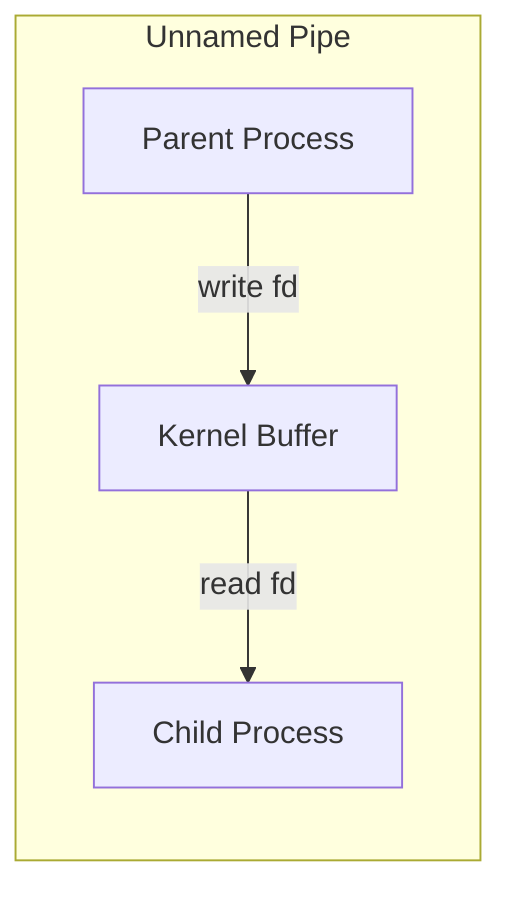

**Характеристики:**
- **Посока:** Еднопосочна (за двупосочна — два pipe-а)
- **Данни:** Stream от байтове (без message boundaries)
- **Scope:** Unnamed — само parent/child; Named — всякакви процеси
- **OS Support:** POSIX (`pipe()`, `mkfifo()`), Windows (`CreatePipe()`, `CreateNamedPipe()`)
- **Буфер:** Kernel buffer (обикновено 64KB на Linux)

**Плюсове:** Прост API, вграден в ОС, нисък overhead.
**Минуси:** Еднопосочен, stream-based (без message framing), ограничен до локалната машина.

---

### 2.2 Sockets (Unix Domain и TCP/IP)

**Unix Domain Sockets (UDS)** комуникират между процеси на една машина чрез файлов път. **TCP/IP Sockets** работят и по мрежа.

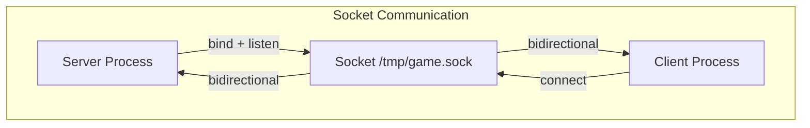

**Характеристики:**
- **Посока:** Двупосочна (full-duplex)
- **Данни:** Stream (`SOCK_STREAM`) или datagram (`SOCK_DGRAM`)
- **Scope:** UDS — локална машина; TCP/IP — мрежова
- **API:** `socket()`, `bind()`, `listen()`, `accept()`, `connect()`, `send()`, `recv()`
- **Performance:** UDS ~2-3x по-бърз от TCP loopback (избягва network stack)

**Плюсове:** Двупосочен, поддържа и stream, и datagram, може да работи по мрежа (TCP).
**Минуси:** По-сложен API от pipes, overhead при сериализация, TCP добавя latency.

---

### 2.3 Shared Memory

Два или повече процеса mapping-ват обща област от паметта в своите address space-ове.

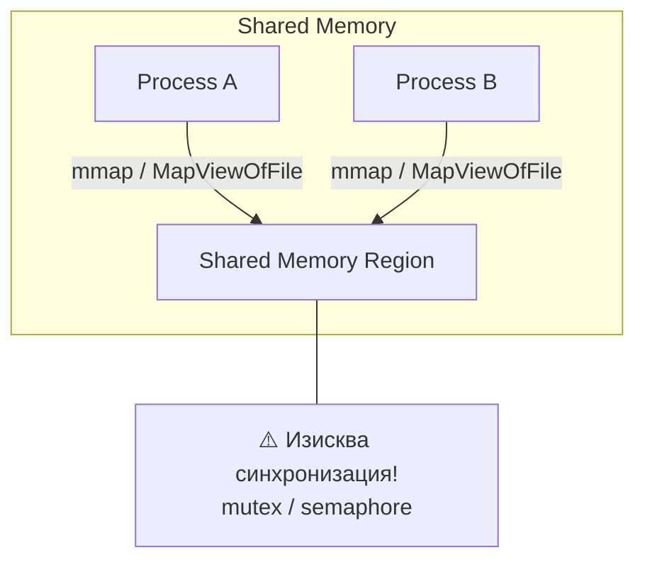

**Характеристики:**
- **Посока:** Двупосочна
- **Данни:** Произволни структури директно в паметта
- **API:** POSIX — `shm_open()`, `mmap()`; Windows — `CreateFileMapping()`, `MapViewOfFile()`
- **Performance:** Най-бързият IPC — zero-copy, данните са директно достъпни
- **Синхронизация:** **Задължителна** — mutex, semaphore, или atomic operations

**Плюсове:** Най-висока скорост, zero-copy, подходяща за големи обеми данни.
**Минуси:** Сложна синхронизация, risk от race conditions, трудна за debug-ване, няма вграден message framing.

---

### 2.4 Message Queues

Kernel-managed опашки за съобщения с дефинирани message boundaries.


**Характеристики:**
- **Посока:** Еднопосочна (по конвенция), може да се използва двупосочно с две опашки
- **Данни:** Дискретни съобщения с type/priority
- **API:** System V — `msgget()`, `msgsnd()`, `msgrcv()`; POSIX — `mq_open()`, `mq_send()`, `mq_receive()`
- **Persistence:** Живеят в kernel-а, преживяват restart на процесите

**Плюсове:** Вградени message boundaries, приоритизация, persistence.
**Минуси:** Ограничен размер на съобщенията, по-бавна от shared memory, System V API е архаичен.

---

### 2.5 Memory-Mapped Files

Файл, mapping-нат директно в address space-а на процеса. Промените се отразяват в двата процеса (и на диска, ако е file-backed).

**Характеристики:**
- **API:** `mmap()` (POSIX), `CreateFileMapping()` + `MapViewOfFile()` (Windows)
- **Persistence:** File-backed вариантът преживява restart
- **Performance:** Близка до shared memory

**Плюсове:** Persistence, използва файловата система за naming, ефективен за големи обеми.
**Минуси:** Изисква синхронизация, сложен lifecycle management.

---

### 2.6 Signals

Асинхронни уведомления от ОС или друг процес (напр. `SIGTERM`, `SIGUSR1`).

**Характеристики:**
- **Данни:** Минимални — само signal number (+ `siginfo_t` за real-time signals)
- **API:** `kill()`, `signal()`, `sigaction()`
- **Асинхронност:** Signal handler прекъсва текущото изпълнение

**Плюсове:** Много лек, вграден в ОС.
**Минуси:** Почти никакви данни, сложен за правилна обработка (async-signal-safe functions), не е подходящ за data exchange.

---

### 2.7 DLL / Shared Library Loading

Не е класически IPC, но заслужава внимание: два модула живеят в **един процес** чрез dynamic library loading.

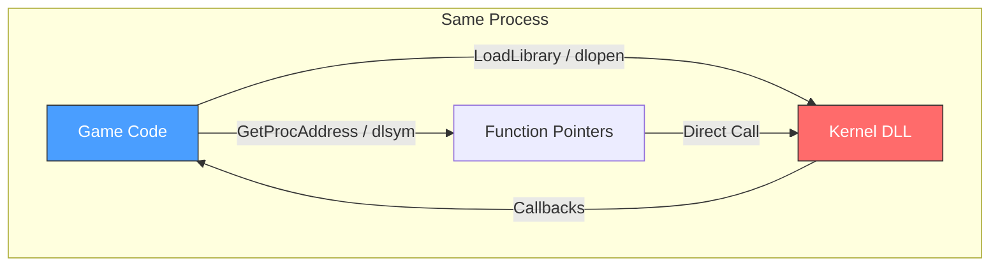

**Характеристики:**
- **Посока:** Двупосочна (function calls + callbacks)
- **Данни:** Директен достъп до структури — zero overhead
- **API:** POSIX — `dlopen()`, `dlsym()`, `dlclose()`; Windows — `LoadLibrary()`, `GetProcAddress()`, `FreeLibrary()`
- **Изолация:** **Никаква** — споделен address space, crash в DLL-а = crash на процеса

**Плюсове:** Zero overhead, пълен достъп до данни, прост interface design (function pointers).
**Минуси:** Няма process isolation, няма fault tolerance, tight coupling, versioning е трудно.

---

## 3. Сравнителна таблица

| Механизъм | Скорост | Изолация | Сложност | Мрежа | Message Framing | Fault Tolerance |
|-----------|---------|----------|----------|-------|-----------------|-----------------|
| **Unnamed Pipes** | ⭐⭐⭐ | ✅ | Ниска | ❌ | ❌ (stream) | Средна |
| **Named Pipes** | ⭐⭐⭐ | ✅ | Ниска | ❌ | ❌ (stream) | Средна |
| **Unix Domain Sockets** | ⭐⭐⭐⭐ | ✅ | Средна | ❌ | По избор | Добра |
| **TCP/IP Sockets** | ⭐⭐ | ✅ | Средна | ✅ | По избор | Добра |
| **Shared Memory** | ⭐⭐⭐⭐⭐ | ✅ | Висока | ❌ | ❌ | Ниска |
| **Message Queues** | ⭐⭐⭐ | ✅ | Средна | ❌ | ✅ | Добра |
| **Memory-Mapped Files** | ⭐⭐⭐⭐⭐ | ✅ | Висока | ❌ | ❌ | Средна |
| **Signals** | ⭐⭐⭐⭐⭐ | ✅ | Висока | ❌ | ❌ | Ниска |
| **DLL Loading** | ⭐⭐⭐⭐⭐ | ❌ | Ниска | ❌ | N/A | ❌ |

---

## 4. C++ библиотеки за IPC

### 4.1 Boost.Interprocess

Част от Boost — предоставя cross-platform абстракция за shared memory, message queues, memory-mapped files, и синхронизационни примитиви.

```cpp
#include <boost/interprocess/shared_memory_object.hpp>
#include <boost/interprocess/mapped_region.hpp>

namespace bip = boost::interprocess;

// Създаване на shared memory
bip::shared_memory_object shm(bip::create_only, "GameKernelShm", bip::read_write);
shm.truncate(4096);
bip::mapped_region region(shm, bip::read_write);

// Писане
std::memcpy(region.get_address(), &data, sizeof(data));
```

**Плюсове:** Cross-platform (Windows/Linux), богат набор от примитиви (mutex, condition, semaphore), header-only опция.
**Минуси:** Голяма зависимост (Boost), steeп learning curve за пълния API.

---

### 4.2 ZeroMQ (ØMQ / libzmq)

High-performance asynchronous messaging library. Поддържа множество transport-и: `inproc://`, `ipc://`, `tcp://`, `pgm://`.

```cpp
#include <zmq.hpp>

// Server (REP pattern)
zmq::context_t context(1);
zmq::socket_t socket(context, zmq::socket_type::rep);
socket.bind("ipc:///tmp/game-kernel");

zmq::message_t request;
socket.recv(request, zmq::recv_flags::none);
// ... process ...
socket.send(zmq::buffer("ACK"), zmq::send_flags::none);
```

**Patterns:** REQ/REP, PUB/SUB, PUSH/PULL, PAIR.
**Плюсове:** Високо ниво на абстракция, automatic reconnection, message framing, множество транспорти.
**Минуси:** Външна зависимост, не е подходящ за zero-copy сценарии.

---

### 4.3 gRPC

Google's RPC framework — базиран на Protocol Buffers и HTTP/2.

```protobuf
// game_kernel.proto
service KernelService {
  rpc GetCredit (CreditRequest) returns (CreditResponse);
  rpc StartGameCycle (GameStartRequest) returns (GameStartResponse);
  rpc GetRandomNumbers (RngRequest) returns (RngResponse);
}
```

```cpp
// Client
auto stub = KernelService::NewStub(grpc::CreateChannel("localhost:50051",
    grpc::InsecureChannelCredentials()));
ClientContext context;
CreditResponse response;
stub->GetCredit(&context, request, &response);
```

**Плюсове:** Силна типизация (protobuf), code generation, streaming, language-agnostic.
**Минуси:** Тежка зависимост, значителен overhead за локална IPC, по-подходящ за мрежови сценарии.

---

### 4.4 Boost.Asio

Асинхронна I/O библиотека — подходяща за sockets (TCP, UDP, Unix Domain).

```cpp
#include <boost/asio.hpp>
using boost::asio::local::stream_protocol;

boost::asio::io_context io;
stream_protocol::socket socket(io);
socket.connect(stream_protocol::endpoint("/tmp/game-kernel.sock"));

boost::asio::write(socket, boost::asio::buffer(message));
```

**Плюсове:** Mature, cross-platform, асинхронен модел, част от C++ networking TS.
**Минуси:** Ниско ниво — изисква ръчен message framing и сериализация.

---

### 4.5 D-Bus (libdbus / sd-bus)

Linux IPC система, широко използвана в desktop/system services.

**Плюсове:** Стандарт за Linux services, introspection, signal-based notifications.
**Минуси:** Linux-only, overhead за real-time приложения, не е подходящ за game workloads.

---

### 4.6 Обобщение на C++ библиотеки

| Библиотека | Transport | Ниво | Cross-Platform | Overhead | Use Case |
|------------|-----------|------|----------------|----------|----------|
| **Boost.Interprocess** | SharedMem, MQ | Средно | ✅ | Нисък | Високоскоростен локален IPC |
| **ZeroMQ** | inproc/ipc/tcp | Високо | ✅ | Среден | Messaging patterns |
| **gRPC** | HTTP/2 + Protobuf | Високо | ✅ | Висок | Мрежови RPC |
| **Boost.Asio** | Sockets | Ниско | ✅ | Нисък | Async socket I/O |
| **D-Bus** | Unix socket | Средно | ❌ (Linux) | Среден | System services |

---

## 5. Python и JavaScript аналози

### 5.1 Python

| Модул | Аналог на | Пример |
|-------|-----------|--------|
| `multiprocessing.Pipe` | Unnamed Pipes | `parent_conn, child_conn = Pipe()` |
| `multiprocessing.Queue` | Message Queues | `q = Queue(); q.put(data); q.get()` |
| `multiprocessing.shared_memory` | Shared Memory | `shm = SharedMemory(create=True, size=4096)` |
| `socket` | Sockets (TCP/UDS) | `s = socket.socket(AF_UNIX, SOCK_STREAM)` |
| `mmap` | Memory-Mapped Files | `mm = mmap.mmap(fd, 0)` |
| `subprocess.Popen` | Pipes (stdin/stdout) | `Popen(['cmd'], stdin=PIPE, stdout=PIPE)` |
| `signal` | Signals | `signal.signal(SIGTERM, handler)` |
| `xmlrpc` / `grpcio` | RPC | High-level RPC abstraction |
| `zmq` (pyzmq) | ZeroMQ | Идентичен API |

### 5.2 JavaScript / Node.js

| Модул / API | Аналог на | Пример |
|-------------|-----------|--------|
| `child_process.fork()` | Pipes + Message Passing | `child.send(msg); child.on('message', cb)` |
| `worker_threads` | Shared Memory (SharedArrayBuffer) | `new Worker('./worker.js', { workerData })` |
| `net.createServer()` | Unix Domain Sockets | `net.createConnection({ path: '/tmp/sock' })` |
| `dgram` | UDP Sockets | `dgram.createSocket('udp4')` |
| `WebSocket` (ws) | TCP Sockets | Full-duplex messaging |
| `SharedArrayBuffer` + `Atomics` | Shared Memory | Lock-free atomic operations |

**Забележка:** Node.js `child_process.fork()` използва вътрешно pipes за JSON-serialized message passing — концептуално подобен на нашия Astro AK2API подход (parent-child + messages).

---

## 6. OGAPI (Inspired) — DLL-based In-Process Interface Loading

### 6.1 Архитектура

В Inspired интеграцията играта и kernel-ът живеят в **един и същ процес**. Kernel-ът е пакетиран като DLL (`ogapiDLL_Release.dll`), която играта зарежда при стартиране.

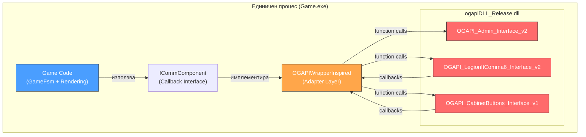

### 6.2 Инициализация — DLL Loading

Процесът на зареждане (от `OGAPIWrapperInspired.cpp`):

```cpp
// 1. Зареждане на DLL-а
void* dll_handle = ::LoadLibraryA("ogapiDLL_Release.dll");
const ::HMODULE module = reinterpret_cast<::HMODULE>(dll_handle);

// 2. Получаване на entry point function
void* proc = reinterpret_cast<void*>(
    ::GetProcAddress(module, "RequestAdminInterface"));
InterfaceRequesterType RequestAdminInterface =
    reinterpret_cast<InterfaceRequesterType>(proc);

// 3. Получаване на admin interface (factory)
m_adminInterface = (OGAPI_Admin_Interface_v2*)
    RequestAdminInterface("admin_v2");

// 4. Получаване на специализирани интерфейси чрез admin-а
m_buttonsInterface = (OGAPI_CabinetButtons_Interface_v1*)
    m_adminInterface->RequestInterface("cabinet_buttons_v1");
m_legionInterface = (OGAPI_LegionItComma6_Interface_v2*)
    m_adminInterface->RequestInterface("legion_it_comma_6_v2");
```

**Технологичен анализ:**
- `LoadLibraryA()` зарежда DLL-а в address space-а на текущия процес
- `GetProcAddress()` връща function pointer към exported функция
- DLL-ът expose-ва единствен entry point: `RequestAdminInterface`
- Admin interface-ът играе ролята на **Factory Pattern** — произвежда останалите интерфейси

### 6.3 Комуникационен модел — Callbacks

Целият data flow е чрез **C-style callback functions**:

```cpp
// Регистрация на callback
m_legionInterface->GetCredit(GetCreditCb, nullptr);

// Callback функция (static)
static void GetCreditCb(void* userData,
                        const ErrorInfo* error,
                        const CreditInfo* responseData) {
    // Обработка на отговора
    int64_t credit = responseData->credit;
    // ... уведомяване на играта чрез ICommComponent
}
```

**Request-Response поток:**

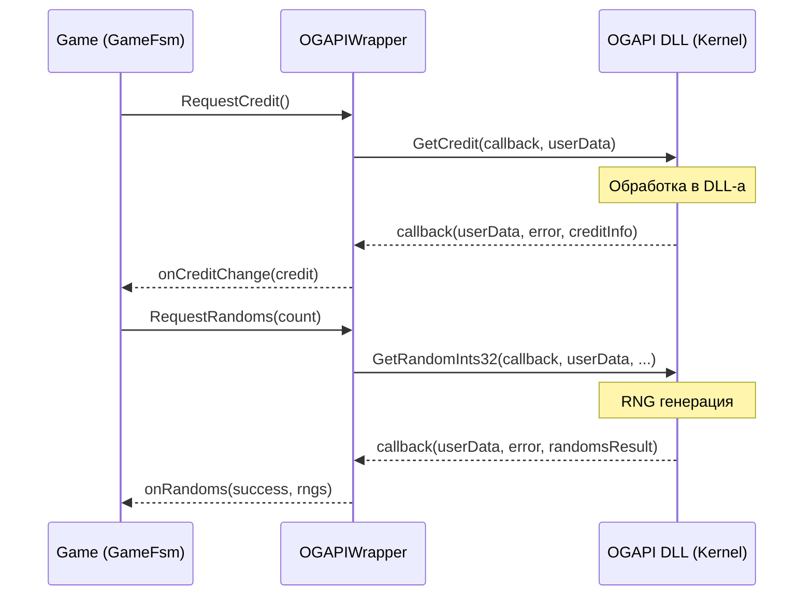

### 6.4 Main Loop — Polling модел

```cpp
// InspiredMain.hpp — Main loop
while (running) {
    // 1. Windows message pump
    ProcessWindowsMessages();

    // 2. Обработка на kernel callbacks
    m_adminInterface->ProcessCallbacks();
    m_buttonsInterface->ProcessCallbacks();

    // 3. Game update
    game.Update(deltaTime);
}
```

`ProcessCallbacks()` проверява за pending callbacks от DLL-а и ги изпълнява в контекста на main thread-а. Това гарантира **single-threaded execution** — всички callbacks се изпълняват в main loop-а.

### 6.5 IPC класификация

| Аспект | OGAPI (Inspired) |
|--------|------------------|
| **Тип** | Не е класически IPC — in-process DLL loading |
| **Комуникация** | Direct function calls + callback function pointers |
| **Сериализация** | Никаква — данните се предават като C struct pointers |
| **Синхронизация** | Single-threaded polling (`ProcessCallbacks()`) |
| **Изолация** | ❌ Споделен address space |
| **Fault Tolerance** | ❌ DLL crash = game crash |
| **Performance** | Максимална — zero-copy, direct memory access |

---

## 7. Astro (Sisal) — AK2API Message-Based IPC

### 7.1 Архитектура

В Astro системата играта е **отделен child process**, стартиран от AstroKernel (AK2). Комуникацията е чрез **message-based protocol** — binary-serialized C structures.

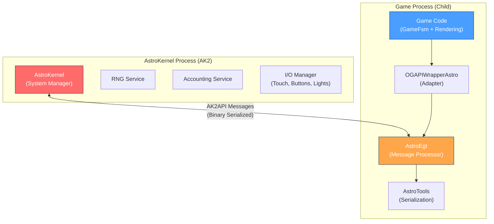

### 7.2 Message Protocol

Всяко съобщение е C struct с header:

```cpp
struct ak2msg_base {
    int size;           // Размер на цялото съобщение
    char code[24];      // Идентификатор (напр. "ca_game_start")
};
```

**Конвенция за имена:**
- `ca_` → **Content → AstroKernel** (от играта към kernel-а)
- `ac_` → **AstroKernel → Content** (от kernel-а към играта)

### 7.3 API Functions

```cpp
// Инициализация
int ak2api_init(ak2msg_init_control* ctrl);

// Изпращане на съобщение
int ak2api_send_message(const void* msg);

// Получаване на съобщение (non-blocking)
int ak2api_get_message(void* buff);

// Терминиране
void ak2api_exit(int exit_code);
```

### 7.4 Message Serialization

От `AstroTools.cpp`:

```cpp
template<typename AstroMsg>
static std::vector<uint8_t> PackAstroMsg(AstroMsg msg, const std::string& name) {
    msg.header.size = sizeof(AstroMsg);
    SafeStrCopy(msg.header.code, name);  // "ca_game_start", "ca_rng_request", etc.

    std::vector<uint8_t> result(sizeof(AstroMsg));
    std::memcpy(result.data(), &msg, result.size());
    return result;
}

void SendMsgBuff(std::vector<uint8_t> msgBuff) {
    ak2api_send_message(msgBuff.data());
}

bool DownloadIncommingMsg(std::queue<std::vector<uint8_t>>& messages) {
    static char s_buff[AK2API_MAX_MESSAGE_SIZE];
    if (int result = ak2api_get_message(s_buff)) {
        std::vector<uint8_t> v(AK2API_MAX_MESSAGE_SIZE);
        std::memcpy(v.data(), s_buff, AK2API_MAX_MESSAGE_SIZE);
        messages.push(std::move(v));
        return true;
    }
    return false;
}
```

### 7.5 Основни Message Types

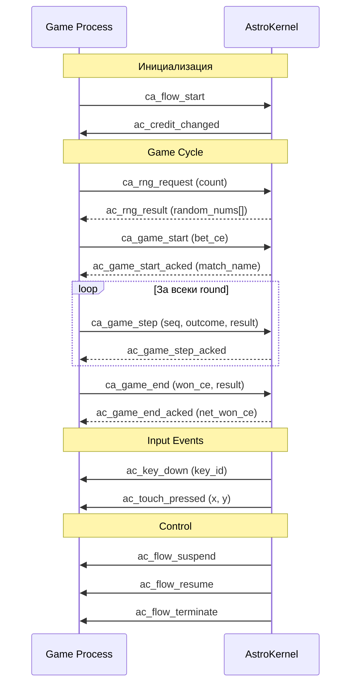

### 7.6 Recovery механизъм (NVRAM)

Astro поддържа **recovery** при crash — game state се записва в NVRAM преди изпращане на recoverable messages.

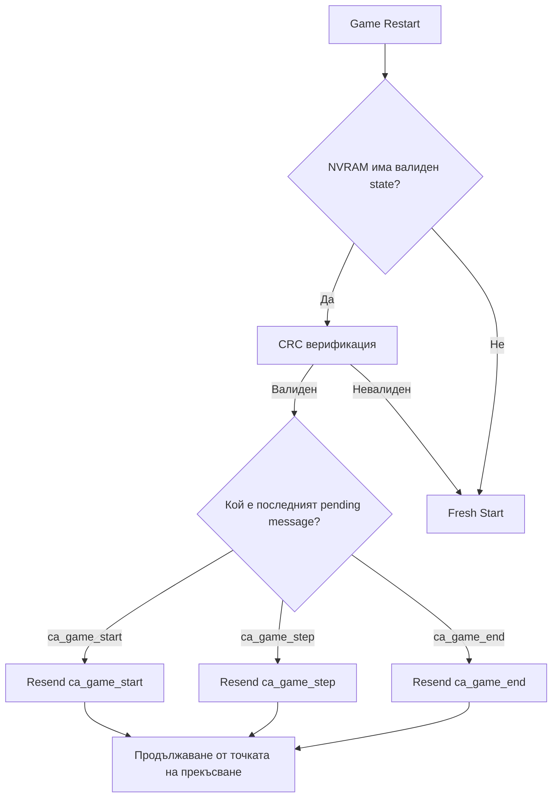

```cpp
void SaveAsyncToNvram(const std::vector<uint8_t>& buff) {
    Tools::NvramHeader header;
    header.payloadSize = buff.size();
    header.version = 100'010'001;
    header.crc = BuffCrc(buff.data(), buff.size());

    std::memcpy(nvramBuffPtr, &header, sizeof(header));
    std::memcpy(nvramBuffPtr + sizeof(header), buff.data(), buff.size());
    ak2api_nvbuf_commit();  // Persist to non-volatile storage
}
```

### 7.7 IPC класификация

| Аспект | Astro (Sisal) |
|--------|---------------|
| **Тип** | Message-based IPC (вероятно shared memory или pipe под капака на AK2API) |
| **Комуникация** | `ak2api_send_message()` / `ak2api_get_message()` |
| **Сериализация** | Binary — директно `memcpy` на C structs |
| **Синхронизация** | Non-blocking polling в main loop |
| **Изолация** | ✅ Отделни процеси (parent-child) |
| **Fault Tolerance** | ✅ NVRAM recovery, process restart |
| **Performance** | Висока — binary protocol, минимален overhead |

> **Забележка:** Вътрешната имплементация на `ak2api_send_message()` / `ak2api_get_message()` е скрита в AK2API библиотеката (предоставена от Sisal/Novomatic). Вероятният transport е **shared memory** или **Unix domain socket**, но точният механизъм не е документиран публично. Важното е, че API-то абстрахира транспорта — играта работи само с messages.

---

## 8. Сравнение на двата подхода

### 8.1 Архитектурно сравнение

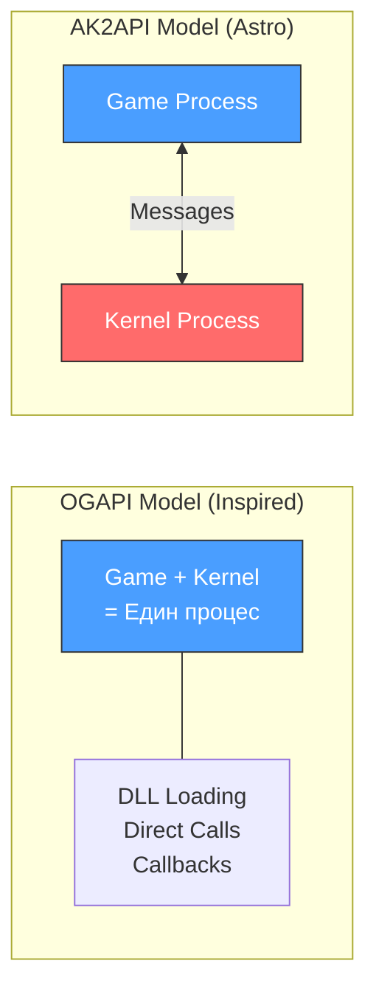

### 8.2 Детайлно сравнение

| Характеристика | OGAPI (Inspired) | Astro AK2API (Sisal) |
|----------------|------------------|----------------------|
| **Процесен модел** | Един процес (game + DLL) | Два процеса (parent-child) |
| **IPC тип** | In-process (DLL loading) | Message-based (binary) |
| **Coupling** | Tight (споделен address space) | Loose (message passing) |
| **API стил** | C++ virtual interfaces + callbacks | C-style send/receive messages |
| **Data transfer** | Pointer-based (zero-copy) | memcpy на C structs |
| **Crash isolation** | ❌ DLL crash → game crash | ✅ Game може да се рестартира |
| **Recovery** | Ограничена | ✅ NVRAM-based recovery |
| **Debugging** | По-лесно (един процес) | По-трудно (два процеса) |
| **Latency** | Минимална (~наносекунди) | Ниска (~микросекунди) |
| **OS** | Windows (LoadLibraryA) | Linux CentOS 7 (ak2api) |
| **Versioning** | Interface versioning (string-based) | Message versioning (struct size) |

### 8.3 Концептуално mapping към IPC механизми

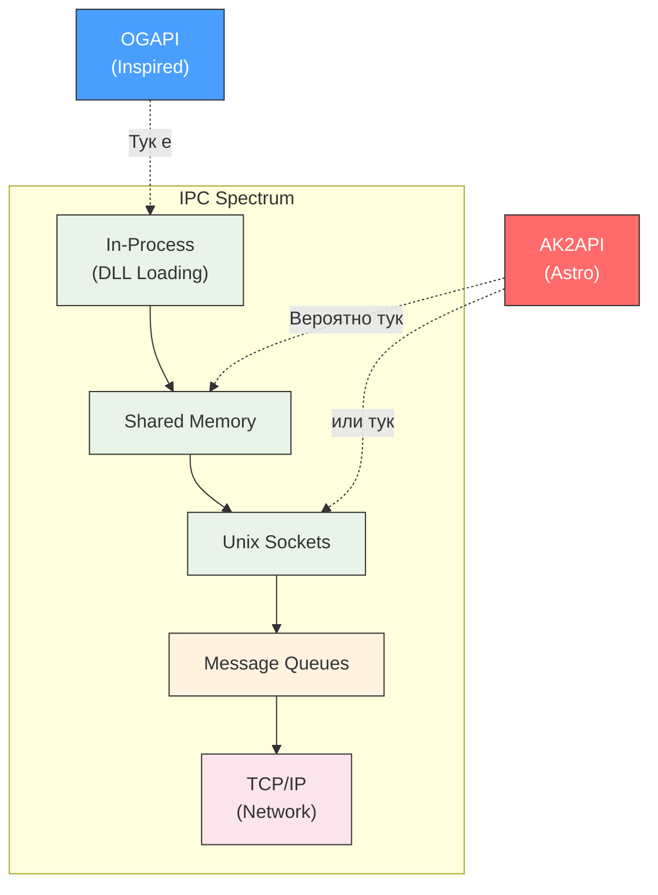

### 8.4 Как нашият wrapper унифицира двата подхода

Въпреки фундаменталните разлики в IPC механизмите, нашият код абстрахира и двата подхода чрез общ interface pattern:

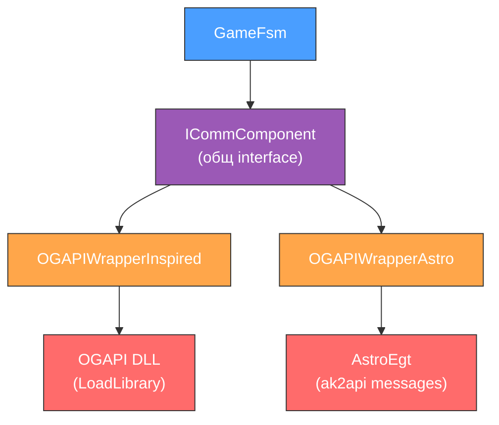

Играта взаимодейства с `ICommComponent` — абстрактен C++ interface с virtual methods. Конкретният IPC механизъм е скрит зад wrapper-а. Това позволява:

1. **Един и същ game code** за двете интеграции
2. **Adapter Pattern** — wrapper-ите преобразуват от `ICommComponent` към конкретния protocol
3. **Тестваемост** — Standalone wrapper-ът симулира kernel без реален IPC

---

## Заключение

Двата подхода представляват два края на IPC spectrum-а:

- **OGAPI (Inspired)** избира **максимална производителност** чрез in-process DLL loading, но жертва изолацията
- **Astro (Sisal)** избира **надеждност и изолация** чрез separate process model с message passing, с малко повече overhead

И двата подхода са валидни за VLT контекста — изборът зависи от приоритетите на платформата. Нашият adapter pattern (`ICommComponent` → `OGAPIWrapper*`) успешно абстрахира тези разлики, позволявайки на game кода да работи и с двете интеграции без промени.
