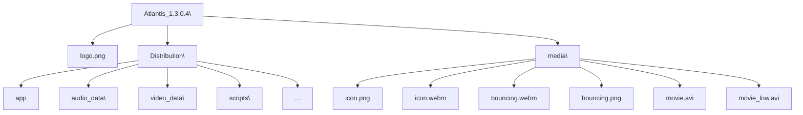
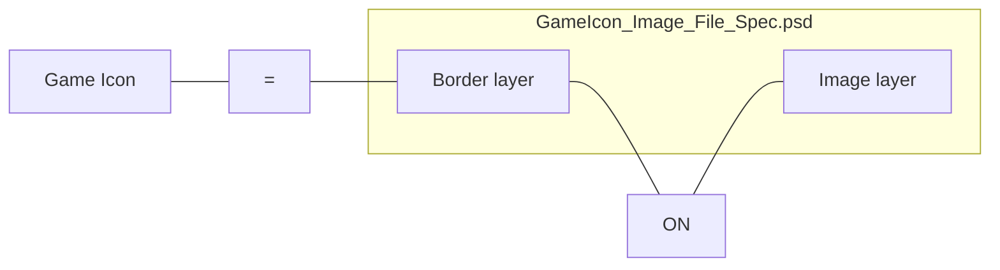

Astro Logo

# Astro Game Development Kits
## Game Submission for Integration Test

AstroGDK version 3.2
For Italian VLT (Comma 6b) and Morocco VLT

S/N: SYSDEV-AGDK-003

Copyright © 2017-2022 Astro Corp. All Rights Reserved.

Astro Logo

THE INFORMATION IN THIS DOCUMENT IS CONFIDENTIAL, IT MAY NOT BE REPRODUCED, STORED, COPIED OR OTHERWISE RETRIEVED AND/OR RECORDED IN ANY FORM IN WHOLE, OR IN PART, NOR MAY ANY OF THE INFORMATION CONTAINED THEREIN BE DISCLOSED.

Astro Game Development Kits – Game Submission for Integration Test
AstroGDK version 3.2
Astro

# Revision History

<table>
  <tbody>
    <tr>
        <td>Revision</td>
        <td>Date (Y/M/D)</td>
        <td>Comments</td>
    </tr>
    <tr>
        <th>1.6.1</th>
        <th>2018/9/28</th>
        <th>● Independent document from Section 5 of AstroGDK 1.6.1 with Game submission form added.</th>
    </tr>
    <tr>
        <th>2.0</th>
        <th>2019/2/8</th>
        <th>● For new multi-tab Game lobby (Unity3D), different media files are defined.</th>
    </tr>
    <tr>
        <th>2.0 r1</th>
        <th>2019/2/21</th>
        <th>● Add lost media file bouncing.png<br/>● Add examples of conversion of video files<br/>● Add “Line number” in Game submission form.<br/>● Modify: video resolution should be 1280x800 or 800x600.<br/>● Few typo fixed.</th>
    </tr>
    <tr>
        <th>2.0 r2</th>
        <th>2019/5/2</th>
        <th>● Add specification requirement of game logo for NEXT System. (A.3)<br/>● Explain and request that it’s better to making the first frame and the last frame of bouncing.webm, and the bouncing.png all the same look.</th>
    </tr>
    <tr>
        <th>2.0r3</th>
        <th>2019/5/8</th>
        <th>● Clarify more detail about game icon of NEXT System<br/>● Provide .psd file as standard template and sample game icons for reference while making game icons.<br/>● Indicate that VP9-encoded .webm file is not supported.<br/>● Indicate that option "-auto-alt-ref 0": is essential for FFmpeg utility to generate alpha channel into .webm file.</th>
    </tr>
    <tr>
        <th>2.1</th>
        <th>2019/5/19</th>
        <th>● Add and define media file movie_low.avi. It is the low resolution version of movie.avi for Astro H61 platform only. Game team must provide it for game.</th>
    </tr>
    <tr>
        <th>2.6</th>
        <th>2019/9/30</th>
        <th>● Clarify that symlink/hyperlink-type files are not allowed put into package. (sect 1.2.2)<br/>● Lack of ‘-‘ in prefix of option ‘-metadata’ of ffmpeg. (sect B.1.3)</th>
    </tr>
    <tr>
        <th>2.7</th>
        <th>2020/10/1</th>
        <th>● (No changed)<br/>● Indicate that the document is also for Morocco VLT.</th>
    </tr>
    <tr>
        <th>2.9-3.2</th>
        <th>2022/7/15</th>
        <th>● (No changed)</th>
    </tr>
  </tbody>
</table>

Copyright © 2017-2022 By Astro Corp. All Rights Reserved. Page 2
The information in this document is confidential, it may not be reproduced, stored, copied or otherwise retrieved and/or recorded in any form in whole, or in part, nor may any of the information contained therein be disclosed.

Astro Game Development Kits – Game Submission for Integration Test
AstroGDK version 3.2
Astro

# Content

Revision History ..................................................................................................................................... 2
Content .................................................................................................................................................. 3
1 Introduction ........................................................................................................................................ 4
* 1.1 Game Submission Form ........................................................................................................... 5
* 1.2 Game Submission Package ...................................................................................................... 6
    - 1.2.1 File Types....................................................................................................................... 6
    - 1.2.2 Directory Structure ....................................................................................................... 7
Appendix A – Specification of Media Files............................................................................................. 9
* A.1 Specification of Media File for Downloader ............................................................................ 9
    - A.1.1 Introduction .................................................................................................................. 9
    - A.1.2 Specification of Downloader Game Logo - Image ........................................................ 9
* A.2 Specification of Media Files for Game Lobby ........................................................................ 10
    - A.2.1 Introduction ................................................................................................................ 10
* A.2 Specification in Detail ............................................................................................................ 14
* A.3 Specification Requirement of Game Icons for NEXT System ................................................ 17
    - A.3.1 Purpose ....................................................................................................................... 17
    - A.3.2 Specification................................................................................................................ 17
Appendix B – Examples of Making Media Files ................................................................................... 19
* B.1 How to Make WebM (VP8) Video File ................................................................................... 19
    - B.1.1 Video File Format Conversion..................................................................................... 19
    - B.1.2 Usage Example 1 – FFmpeg ........................................................................................ 19
    - B.1.3 Usage Example 2 – FFmpeg ........................................................................................ 19
    - B.1.4 Usage Example 3 – Shana Encoder ............................................................................. 20
* B.2 How to Make H.264 Video File .............................................................................................. 23

Copyright © 2017-2022 By Astro Corp. All Rights Reserved. Page 3
The information in this document is confidential, it may not be reproduced, stored, copied or otherwise retrieved and/or recorded in any form in whole, or in part, nor may any of the information contained therein be disclosed.

Astro Game Development Kits – Game Submission for Integration Test
AstroGDK version 3.2
Astro

# 1 Introduction

The documentation describes how a third party game development partner (“partner”) prepares and submits its games to Test Division of Astro Corp. Taiwan (“Astro lab”), for system integration test.

About system integration test, the submitted game will be uploaded into Astro game system (“System”) and then downloaded to VLT for testing. “Astro lab” will do tests which focus on correctness and stability of well integration with “System” in categories of process flow, game flow, game recovery, RNG handling, outcome, NVRAM access, accounting, event handling, etc. The system integration test does not care or just partly care of display, audio, game play, and regulation, etc., these are responsibilities of “partner”, operator, and / or official test laboratory (e.g. GLI lab).

“Partner” should **prepare “Game Submission Form” and “Game Submission Package”** beforehand, and then **submit both to its agency or operator**. And the later **forwards both materials to contact sales of Astro Corp.**, mailto:hankwang@astrocorp.com.tw?subject=Game Submission Test <game name> <version>

Copyright © 2017-2022 By Astro Corp. All Rights Reserved. Page 4
The information in this document is confidential, it may not be reproduced, stored, copied or otherwise retrieved and/or recorded in any form in whole, or in part, nor may any of the information contained therein be disclosed.

Astro Game Development Kits – Game Submission for Integration Test
AstroGDK version 3.2
Astro

## 1.1 Game Submission Form

The submission form must contain below information and be provided in form of **.PDF file**.

Basic information of game team or company:
* Company / team name and Country;
* Contact person of technology issues: name, e-mail, and optional Skype, IM account, etc.;
* (others)

Game basic information:
* Game name;
* Game version or revision;
* Game program code name and/or code version/revision (optional);
* Min bet, Max bet, Max win;
* Game features (multiple selections):
  [ ] Free game, [ ] Ultra spin, [ ] Bonus game, [ ] Risk/Double up, [ ] Energy game,
  [ ] System jackpot, [ ] Local jackpot, [ ] Roulette, [ ] Poker, [ ] Scratch,
  [ ] Others: [___]
* Line number;
* Theoretical payout rate;
* Additional information or comments to provide (optional);

Data prepared by Test division of Astro Corp. (“Parner” need not provide these)
* Content ID.
* AAMS Game ID.
* Package size (excluding files under media/).

Copyright © 2017-2022 By Astro Corp. All Rights Reserved. Page 5
The information in this document is confidential, it may not be reproduced, stored, copied or otherwise retrieved and/or recorded in any form in whole, or in part, nor may any of the information contained therein be disclosed.

Astro Game Development Kits – Game Submission for Integration Test
AstroGDK version 3.2
Astro

## 1.2 Game Submission Package

Game submission package is a collection of directories and files, and could be provided in any form of ftp server connection, link to remote storage, single compressed (*.rar, *.zip) file, etc.

### 1.2.1 File Types

Three categories totally eight types of materials need to be prepared into submission package:

*   Game files:
    *   **Game files**: Game-related executable binaries, media files, and data.

*   Media files for Downloading agent (downloader):
    *   **Downloader Game Logo – Image** (Filename: logo.png): Downloading agent (downloader) will display it to indicate the game in period of downloading.

*   Media files for Game lobby:
    *   **01 Game Icon – Image** (Filename: icon.png): indicate the game in search result set of Search page and Category (non-Search) page, and for player to select.
    *   **02 Game Icon – Animation** (Filename: icon.webm): indicate the game in Category (non-Search) pages, and for player to select.
    *   **03 Game Bouncing Icon – Animation** (Filename: bouncing.webm): indicate the game in bouncing button area, and for player to select.
    *   **05 Game bouncing Icon – Image** (Filename: bouncing.png): indicate the game in bouncing button area, and for player to select.
    *   **06 Game Movie – Video clip** (Filename: movie.avi and movie_low.avi): played on the upper monitor for presenting game features and / or for promotion purpose. File movie_low.avi is just a low-resolution version of movie.avi for Astro H61 platform only.

All above media files will be described in detail in Appendix A.

Copyright © 2017-2022 By Astro Corp. All Rights Reserved. Page 6
The information in this document is confidential, it may not be reproduced, stored, copied or otherwise retrieved and/or recorded in any form in whole, or in part, nor may any of the information contained therein be disclosed.

Astro Game Development Kits – Game Submission for Integration Test
AstroGDK version 3.2
Astro

### 1.2.2 Directory Structure

All above materials must be organized and stored into below directory structure. The whole filled directory structure is just called “Game submission package”:

<table>
  <tbody>
    <tr>
        <td>Directory name</td>
        <td>Files Inside</td>
        <td>Comment</td>
    </tr>
    <tr>
        <th>&lt;Game_name&gt;_&lt;version&gt;\</th>
        <th>logo.png</th>
        <th>Root of game submission package;<br/>logo.png: Downloader Game Logo – Image;</th>
    </tr>
    <tr>
        <th>Distribution\</th>
        <th>app<br/>*.*</th>
        <th>app will be the file launched by AstroKernel;<br/>Game-related run-time files;</th>
    </tr>
    <tr>
        <th>media\</th>
        <th>icon.png</th>
        <th>01 Game Icon – Image;</th>
    </tr>
    <tr>
        <th rowspan="5"></th>
        <th>icon.webm</th>
        <th>02 Game Icon – Animation;</th>
    </tr>
    <tr>
        <th>bouncing.webm</th>
        <th>03 Game Bouncing Icon – Animation;</th>
    </tr>
    <tr>
        <th>bouncing.png</th>
        <th>05 Game Bouncing Icon – Image;</th>
    </tr>
    <tr>
        <th>movie.avi</th>
        <th>06 Game Movie – Movie clip;</th>
    </tr>
    <tr>
        <th>movie_low.avi</th>
        <th></th>
    </tr>
  </tbody>
</table>

Example of a real game submission package (game Atlantis version 1.3.0.4, by Astro Corp.):



Atlantis_1.3.0.4.zip

Copyright © 2017-2022 By Astro Corp. All Rights Reserved. Page 7
The information in this document is confidential, it may not be reproduced, stored, copied or otherwise retrieved and/or recorded in any form in whole, or in part, nor may any of the information contained therein be disclosed.

Astro Game Development Kits – Game Submission for Integration Test
AstroGDK version 3.2
Astro

> [!IMPORTANT]
> *Note! All files inside the directory "Distribution\" are hashed for software integrity checking purpose so cannot be changed after official submission (e.g. GLI lab). If requiring changing later, must send a new game submission package. But those files like logo.png and media\* are not included in integrity check and therefore changeable later anytime.*

> [!WARNING]
> *Notice! Notice! Don't include libak2api.so in the Game submission package.*
> *Game software must always dynamically link to the libak2api.so of AstroKernel at runtime.*

> [!WARNING]
> *Notice! Notice! Do NOT contain any non-regular types of files in Game submission package.*
> *For example, symlink, hyperlink, device files are all disallowed.*

Copyright © 2017-2022 By Astro Corp. All Rights Reserved. Page 8
The information in this document is confidential, it may not be reproduced, stored, copied or otherwise retrieved and/or recorded in any form in whole, or in part, nor may any of the information contained therein be disclosed.

Astro Game Development Kits – Game Submission for Integration Test
AstroGDK version 3.2
Astro

# Appendix A – Specification of Media Files

## A.1 Specification of Media File for Downloader

### A.1.1 Introduction
In the downloading phase, the downloader will display the game icon and with its downloading progress below in the phase.
* List of file:

<table>
  <tbody>
    <tr>
        <td>Item</td>
        <td>File Name</td>
        <td>Remark</td>
    </tr>
    <tr>
        <th>Downloader Game Logo – Image</th>
        <th>logo.png</th>
        <th>256x256 PNG still image</th>
    </tr>
  </tbody>
</table>

The following image shows a grid of various game and system modules in a downloading interface, each with a logo, name, version number, and a 100% progress bar.

* **GAME** section includes: AOSIAOAL502 v1.3.0.5, AOSIAOCH101 v1.2.0.5, AOSIAOMK701 v1.2.0.3, AOSIAOWWN02 v1.5.0.4.
* **LOBBY** section includes: Game Lobby (_GGI N000003 v2.0.0), Menu Lobby (_MATT000007 v2.0.4).
* **MENU** section includes: Accounting (AACC000001 v2.0.3).
* Other modules include: Bill Acceptor (ABA1000001 v2.0.3), Calibrate (ACAL000001 v2.0.3), Content Info (ACIH000001 v2.0.3), History (AHIS000001 v2.0.4), IO Test (AIO1000001 v2.0.4), Reboot (ARBT000001 v2.0.3), System Info (ASYS000001 v2.0.4), Ticket Print (_ATPT000001 v2.0.3).
* **MODULE** section includes: Astro Kernel (TASK000007 v2.7.0).
* **Downloading Agent** section includes: WDLACEN102 v2.0.0.

*Figure – showing Game logo in downloading phase*

### A.1.2 Specification of Downloader Game Logo - Image

<table>
  <tbody>
    <tr>
        <td>Item</td>
        <td>Specification</td>
    </tr>
    <tr>
        <th>File name</th>
        <th>logo.png</th>
    </tr>
    <tr>
        <td>Format</td>
        <td>PNG (Portable Network Graphics)</td>
    </tr>
    <tr>
        <td>Dimension</td>
        <td>256 x 256 pixels</td>
    </tr>
    <tr>
        <td>Pixel format</td>
        <td>24 bits or 32 bits, true color with or without ALPHA channel</td>
    </tr>
    <tr>
        <td>Transparent</td>
        <td>Supported if pixel format contains alpha channel.</td>
    </tr>
    <tr>
        <td>Example</td>
        <td>An image of a circular game logo featuring a character and the text "ATLANTIS GIOCO MULTILINEA" next to a file icon labeled "logo.png".</td>
    </tr>
  </tbody>
</table>

Copyright © 2017-2022 By Astro Corp. All Rights Reserved. Page 9
The information in this document is confidential, it may not be reproduced, stored, copied or otherwise retrieved and/or recorded in any form in whole, or in part, nor may any of the information contained therein be disclosed.

Astro Game Development Kits – Game Submission for Integration Test
AstroGDK version 3.2
Astro

## A.2 Specification of Media Files for Game Lobby

### A.2.1 Introduction

When Game lobby launched, it will load media files from specific directory of individual games installed (refer to Section 1.2.2 above; and Section 4.1.2 of Programming Guide) and show them on the display for indicating the game.

*   List of files:

<table>
  <tbody>
    <tr>
        <td>Item</td>
        <td>File Name</td>
        <td>Remark</td>
    </tr>
    <tr>
        <th>01 Game Icon – Image</th>
        <th>icon.png</th>
        <th>400x280 PNG still image</th>
    </tr>
    <tr>
        <th>02 Game Icon – Animation</th>
        <th>icon.webm</th>
        <th>400x280 WebM (VP8) video, 1 ~ 2 seconds</th>
    </tr>
    <tr>
        <th>03 Game Bouncing Icon – Animation</th>
        <th>bouncing.webm</th>
        <th>400x280 WebM (VP8) video, 2 ~ 4 seconds</th>
    </tr>
    <tr>
        <th>05 Game Bouncing Icon – Image</th>
        <th>bouncing.png</th>
        <th>400x280 PNG still image</th>
    </tr>
    <tr>
        <th rowspan="2">06 Game Movie – Video clip</th>
        <th>movie.avi</th>
        <th>1680x1050 AVI (H.264) video, 1 ~ 2 minutes<br/>(for PSM G920 and future HW)</th>
    </tr>
    <tr>
        <th>movie_low.avi</th>
        <th>1280x800 or 800x600 AVI (H.264) video<br/>1 ~ 2 minutes (for Astro H61 only)</th>
    </tr>
  </tbody>
</table>

Copyright © 2017-2022 By Astro Corp. All Rights Reserved. Page 10
The information in this document is confidential, it may not be reproduced, stored, copied or otherwise retrieved and/or recorded in any form in whole, or in part, nor may any of the information contained therein be disclosed.

Astro Game Development Kits – Game Submission for Integration Test
AstroGDK version 3.2
Astro

● Basic display layout of Game lobby and Samples

The following diagram illustrates the layout of the game lobby interface:

```mermaid
graph TD
    subgraph Lobby_Layout
        Movies[Game Movies]
        Header[Sisal Astro Logo & Status Bar]
        Categories[Category pages: I PIÙ GIOCATI, ESCLUSIVA, NOVITÀ]
        Search[Search page: SCEGLI TU]
        
        subgraph Game_Icon_Area_1_to_15
            G1[1] --- G2[2] --- G3[3] --- G4[4] --- G5[5]
            G6[6] --- G7[7] --- G8[8] --- G9[9] --- G10[10]
            G11[11] --- G12[12] --- G13[13] --- G14[14] --- G15[15]
        end
        
        subgraph Bouncing_Icon_Area_1_to_3
            BA[A<br/>PROVALO SUBITO] --- BB[B<br/>PROVALO SUBITO] --- BC[C<br/>PROVALO SUBITO]
        end
        
        Footer[IMPOSTA LIMITI | CREDITO €5.000,00 | TICKET OUT]
    end

    Movies --> Header
    Header --> Categories
    Header --> Search
    Categories --> Game_Icon_Area_1_to_15
    Game_Icon_Area_1_to_15 --> Bouncing_Icon_Area_1_to_3
    Bouncing_Icon_Area_1_to_3 --> Footer
```

The interface is divided into several functional areas:
*   **Game Movies**: Top section for video content.
*   **Category pages**: Navigation tabs for game categories.
*   **Search page**: Button labeled "SCEGLI TU" to access search features.
*   **Game icon area (1~15)**: A grid of 15 game selection icons.
*   **Bouncing icon area (1~3)**: Three featured game icons with "PROVALO SUBITO" (Try it now) buttons.
*   **Bottom Bar**: Contains "IMPOSTA LIMITI", "CREDITO €5.000,00", and "TICKET OUT" controls.

---

### Examples of Interface States

<table>
    <tr>
        <th>Figures – example of game icons and bouncing icons in Category page</th>
        <th>Figure – example of search result set in Search page</th>
    </tr>
    <tr>
        <td>This screenshot shows the "NOVITÀ" category active. The game grid is populated with titles such as: &lt;br/&gt;- COYOTE CLAN&lt;br/&gt;- VERTIGO NIGHTS&lt;br/&gt;- DRAGON KNIGHT&lt;br/&gt;- SPAGHETTI WESTERN&lt;br/&gt;- LITTLE PANDA&lt;br/&gt;- PYRAMID&lt;br/&gt;The bouncing icons at the bottom show "MISTERY OF LONDON", "DIABOLIK", and "LUPIN THE THIRD".</td>
        <td>This screenshot shows the "SCEGLI TU" (Search) page. It includes a filter menu on the right with options:&lt;br/&gt;- BONUS GAME&lt;br/&gt;- ENERGIA&lt;br/&gt;- RISCHIO&lt;br/&gt;- FREESPIN&lt;br/&gt;- TEMA DEL GIOCO&lt;br/&gt;- LINEE DI VINCITA&lt;br/&gt;The search results display games like "MISTERY OF LONDON", "DIABOLIK", and "LITTLE PANDA".</td>
    </tr>
</table>

Copyright © 2017-2022 By Astro Corp. All Rights Reserved. Page 11
The information in this document is confidential, it may not be reproduced, stored, copied or otherwise retrieved and/or recorded in any form in whole, or in part, nor may any of the information contained therein be disclosed.

Astro Game Development Kits – Game Submission for Integration Test
AstroGDK version 3.2
Astro

● Display Targets of Media Files

The following images illustrate the display targets for various media files within the game selection interface:

**First Interface Screenshot:**
The screen shows a grid of game icons under the "Sisal" brand.
- Navigation tabs: I PIÙ GIOCATI, ESCLUSIVA, NOVITÀ, ASTRO, SISAL, SCEGLI TU.
- Subtitle: SCEGLI IL TIPO DI GIOCO CHE PREFERISCI.
- Right-side labels: BONUS GAME, TEMA DEL GIOCO, LINEE DI VINCITA.
- Highlighted element: One of the "SAPA INCA" game icons is boxed in pink and labeled **01:GAME ICON-IMAGE**.
- Bottom bar: IMPOSTA LIMITI, CREDITO € 5.000,00, TICKET OUT.

**Second Interface Screenshot:**
The screen shows a carousel-style game selection.
- Navigation tabs: I PIÙ GIOCATI, ESCLUSIVA, NOVITÀ, ASTRO, SISAL, SCEGLI TU.
- Highlighted elements:
    - A "SAPA INCA" icon in the top row is boxed in light blue and labeled **02:GAME ICON-ANIMATION**.
    - A label "ESCLUSIVO" on a game icon is boxed in green and labeled **04:BOUNCING ICON-LABEL**.
    - A "TOP PLAYED" badge on the "ATLANTIS" game icon is boxed in red and labeled **03:BOUNCING ICON-ANIMATION**.
    - The "ATLANTIS" game icon itself is labeled **05:BOUNCING ICON-IMAGE**.
- Bottom bar: IMPOSTA LIMITI, CREDITO € 5.000,00, TICKET OUT.

Note! Game package need not provide “04:Bouncing Icon – Label” which are provided by system.

Copyright © 2017-2022 By Astro Corp. All Rights Reserved. Page 12
The information in this document is confidential, it may not be reproduced, stored, copied or otherwise retrieved and/or recorded in any form in whole, or in part, nor may any of the information contained therein be disclosed.

Astro Game Development Kits – Game Submission for Integration Test
AstroGDK version 3.2
Astro

● Structure Design of Image and Animation

### 01:GAME ICON-IMAGE FILE SPEC: (file name = icon.png)
[The image shows a game icon for "ATLANTIS" featuring a female character with a crown and underwater-themed background.]
**PNG 400X280 PIXEL**

### 02:GAME ICON-ANIMATION FILE SPEC: (file name = icon.webm)
[The image shows the "ATLANTIS" icon and a sequence indicating animation.]
**WEBM VP8 30FPS 400X280 PIXEL**
**(1~2 SECONDS)**

### 03:BOUNCING ICON-ANIMATION FILE SPEC: (file name = bouncing.webm)
[The image shows the "ATLANTIS" icon with a sequence indicating a bouncing animation.]
**WEBM VP8 30FPS 400X280 PIXEL**
**(2~4 SECONDS)**

### 05:BOUNCING ICON-IMAGE FILE SPEC: (file name = bouncing.png)
[The image shows a static version of the "ATLANTIS" bouncing icon.]
**PNG 400X280 PIXEL**

### 06:GAME MOVIE FILE SPEC: (file name = movie.avi & movie_low.avi)
[The image shows screenshots of gameplay from "Ghost Hunter" and "Atlantis" slot games, indicating a movie sequence.]
**AVI H.264 30FPS 1680X1050 & 1280X800 PIXEL**
**(1~2 MINUTES)**

Copyright © 2017-2022 By Astro Corp. All Rights Reserved. Page 13
The information in this document is confidential, it may not be reproduced, stored, copied or otherwise retrieved and/or recorded in any form in whole, or in part, nor may any of the information contained therein be disclosed.

Astro Game Development Kits – Game Submission for Integration Test
AstroGDK version 3.2

## A.2 Specification in Detail

### ● 01 Game Icon – Image
<table>
  <tbody>
    <tr>
        <td>Item</td>
        <td>Specification</td>
    </tr>
    <tr>
        <th>Item</th>
        <th>Specification</th>
    </tr>
    <tr>
        <td>File name</td>
        <td>icon.png</td>
    </tr>
    <tr>
        <td>Format</td>
        <td>PNG (Portable Network Graphics)</td>
    </tr>
    <tr>
        <td>Dimension</td>
        <td>400 x 280 pixels</td>
    </tr>
    <tr>
        <td>Pixel format</td>
        <td>24 bits (true color) or 32bits (true color with alpha channel)</td>
    </tr>
    <tr>
        <td>Transparency</td>
        <td>Supported if pixel format contains alpha channel (ALPHA=0).</td>
    </tr>
  </tbody>
</table>

### ● 02 Game Icon – Animation
<table>
  <tbody>
    <tr>
        <td>Item</td>
        <td>Specification</td>
    </tr>
    <tr>
        <th>Item</th>
        <th>Specification</th>
    </tr>
    <tr>
        <td>File name</td>
        <td>icon.webm</td>
    </tr>
    <tr>
        <td>File format</td>
        <td>WebM</td>
    </tr>
    <tr>
        <td>Codec</td>
        <td>VP8</td>
    </tr>
    <tr>
        <td>Audio</td>
        <td>None</td>
    </tr>
    <tr>
        <td>Dimension</td>
        <td>400 x 280 pixels</td>
    </tr>
    <tr>
        <td>Frame rate</td>
        <td>30 FPS (frame per second)</td>
    </tr>
    <tr>
        <td>Bit rate</td>
        <td>3000 ~ 5000 kb/s</td>
    </tr>
    <tr>
        <td>Transparency</td>
        <td>WebM format supports transparency</td>
    </tr>
    <tr>
        <td>Duration</td>
        <td>1 ~ 2 seconds</td>
    </tr>
  </tbody>
</table>

### ● 03 Game Bouncing Icon – Animation
<table>
  <tbody>
    <tr>
        <td>Item</td>
        <td>Specification</td>
    </tr>
    <tr>
        <th>Item</th>
        <th>Specification</th>
    </tr>
    <tr>
        <td>File name</td>
        <td>bouncing.webm</td>
    </tr>
    <tr>
        <td>File format</td>
        <td>WebM</td>
    </tr>
    <tr>
        <td>Codec</td>
        <td>VP8</td>
    </tr>
    <tr>
        <td>Audio</td>
        <td>None</td>
    </tr>
    <tr>
        <td>Dimension</td>
        <td>400 x 280 pixels</td>
    </tr>
    <tr>
        <td>Frame rate</td>
        <td>30 FPS (frame per second)</td>
    </tr>
    <tr>
        <td>Bit rate</td>
        <td>3000 ~ 5000 kb/s</td>
    </tr>
    <tr>
        <td>Transparency</td>
        <td>WebM format supports transparency</td>
    </tr>
    <tr>
        <td>Duration</td>
        <td>2 ~ 4 seconds</td>
    </tr>
    <tr>
        <td>Remark</td>
        <td>Right after the end of playback of bouncing.webm, bouncing.png will</td>
    </tr>
  </tbody>
</table>

Copyright © 2017-2022 By Astro Corp. All Rights Reserved. Page 14
The information in this document is confidential, it may not be reproduced, stored, copied or otherwise retrieved and/or recorded in any form in whole, or in part, nor may any of the information contained therein be disclosed.

Astro Game Development Kits – Game Submission for Integration Test
AstroGDK version 3.2

<table>
  <tbody>
    <tr>
        <td colspan="2"></td>
        <td>be displayed and keep in the same position. So it’s better to make the first frame and the last frame of this bouncing.webm, and the bouncing.png all the same look.</td>
    </tr>
  </tbody>
</table>

● 05 Game Bouncing Icon – Image
<table>
  <thead>
    <tr>
        <th>Item</th>
        <th>Specification</th>
    </tr>
  </thead>
  <tbody>
    <tr>
        <td>File name</td>
        <td>bouncing.png</td>
    </tr>
    <tr>
        <td>File format</td>
        <td>PNG (Portable Network Graphics)</td>
    </tr>
    <tr>
        <td>Dimension</td>
        <td>400 x 280 pixels</td>
    </tr>
    <tr>
        <td>Pixel format</td>
        <td>24 bits (true color) or 32bits (true color with alpha channel)</td>
    </tr>
    <tr>
        <td>Transparency</td>
        <td>Supported if pixel format contains alpha channel (ALPHA=0)</td>
    </tr>
    <tr>
        <td>Remark</td>
        <td>It’s better to make this still image just the same look with the first frame and the last frame of bouncing.webm;</td>
    </tr>
  </tbody>
</table>

● 06 Game Movie – Animation (for PSM G920 and future)
<table>
  <thead>
    <tr>
        <th>Item</th>
        <th>Specification</th>
    </tr>
  </thead>
  <tbody>
    <tr>
        <td>File name</td>
        <td>movie.avi</td>
    </tr>
    <tr>
        <td>File format</td>
        <td>AVI</td>
    </tr>
    <tr>
        <td>Codecs</td>
        <td>H.264/MPEG-4 AVC<br/>MPEG-4 Part 2 (Xvid)</td>
    </tr>
    <tr>
        <td>Audio</td>
        <td>None</td>
    </tr>
    <tr>
        <td>Dimension</td>
        <td>1680 x 1050 pixels (1280x800 is also accepted)</td>
    </tr>
    <tr>
        <td>Frame rate</td>
        <td>30 FPS (frame per second)</td>
    </tr>
    <tr>
        <td>Bit rate</td>
        <td>4000 ~ 5000 kb/s</td>
    </tr>
    <tr>
        <td>Transparency</td>
        <td>None</td>
    </tr>
    <tr>
        <td>Duration</td>
        <td>1 ~ 2 minutes</td>
    </tr>
    <tr>
        <td>Remark</td>
        <td>Will be randomly displayed on the whole upper monitor on PSM G920 and future platform. For Astro H61, will load and play movie_low.avi instead.</td>
    </tr>
  </tbody>
</table>

● 06 Game Movie – Animation (for Astro H61 only)
<table>
  <thead>
    <tr>
        <th>Item</th>
        <th>Specification</th>
    </tr>
  </thead>
  <tbody>
    <tr>
        <td>File name</td>
        <td>movie_low.avi</td>
    </tr>
    <tr>
        <td>File format</td>
        <td>AVI</td>
    </tr>
  </tbody>
</table>

Copyright © 2017-2022 By Astro Corp. All Rights Reserved. Page 15
The information in this document is confidential, it may not be reproduced, stored, copied or otherwise retrieved and/or recorded in any form in whole, or in part, nor may any of the information contained therein be disclosed.

Astro Game Development Kits – Game Submission for Integration Test
AstroGDK version 3.2

<table>
  <tbody>
    <tr>
        <td>Codecs</td>
        <td>H.264/MPEG-4 AVC</td>
    </tr>
    <tr>
        <td rowspan="2"></td>
        <td>MPEG-4 Part 2 (Xvid)</td>
    </tr>
    <tr>
        <td>Audio</td>
        <td>None</td>
    </tr>
    <tr>
        <td>Dimension</td>
        <td>1280 x 800 or 800 x 600 pixels</td>
    </tr>
    <tr>
        <td>Frame rate</td>
        <td>30 FPS (frame per second)</td>
    </tr>
    <tr>
        <td>Bit rate</td>
        <td>4000 ~ 5000 kb/s</td>
    </tr>
    <tr>
        <td>Transparency</td>
        <td>None</td>
    </tr>
    <tr>
        <td>Duration</td>
        <td>1 ~ 2 minutes</td>
    </tr>
    <tr>
        <td>Remark</td>
        <td>This is just a low-resolution version of movie.avi.<br/>movie.avi and movie_low.avi both provide the same look to player.<br/>Will be randomly displayed on the whole upper monitor on Astro H61 platform.</td>
    </tr>
  </tbody>
</table>

> ! Astro system doesn’t accept VP9-encoded .WebM file.

Copyright © 2017-2022 By Astro Corp. All Rights Reserved. Page 16
The information in this document is confidential, it may not be reproduced, stored, copied or otherwise retrieved and/or recorded in any form in whole, or in part, nor may any of the information contained therein be disclosed.

Astro Game Development Kits – Game Submission for Integration Test
AstroGDK version 3.2
Astro

## A.3 Specification Requirement of Game Icons for NEXT System

### A.3.1 Purpose

All game icons for NEXT system NEXT must follow below rules to have required uniform look.

These media files include:

<table>
  <tbody>
    <tr>
        <td>Item</td>
        <td>File Name</td>
        <td>Remark</td>
    </tr>
    <tr>
        <th>01 Game Icon – Image</th>
        <th>icon.png</th>
        <th>400x280 PNG still image</th>
    </tr>
    <tr>
        <th>02 Game Icon – Animation</th>
        <th>icon.webm</th>
        <th>400x280 WebM (VP8) video, 1 ~ 2 seconds</th>
    </tr>
    <tr>
        <th>03 Game Bouncing Icon – Animation</th>
        <th>bouncing.webm</th>
        <th>400x280 WebM (VP8) video, 2 ~ 4 seconds</th>
    </tr>
    <tr>
        <th>05 Game Bouncing Icon – Image</th>
        <th>bouncing.png</th>
        <th>400x280 PNG still image</th>
    </tr>
  </tbody>
</table>

You can find the sample .psd file “GameIcon_Image_File_Spec.psd” in directory AstroGDK/doc. It’s the best idea to start making your game icons from it to definitely make your game icons NEXT system compliant.

### A.3.2 Specification

All these media files must support alpha channel (transparency), and always with a border in SILVER (NOT GOLD) color around as below:

The following diagram illustrates the composition of a game icon using layers:



*   **Game Icon**: A composite image showing a mermaid character with the text "ATLANTIS" inside a silver border.
*   **Border layer and Image layer in “GameIcon_Image_File_Spec.psd”**:
    *   **Border layer**: A silver rectangular frame with rounded corners on a transparent (checkerboard) background.
    *   **Image layer**: The "ATLANTIS" game artwork featuring a mermaid, shown without the border.

Copyright © 2017-2022 By Astro Corp. All Rights Reserved. Page 17
The information in this document is confidential, it may not be reproduced, stored, copied or otherwise retrieved and/or recorded in any form in whole, or in part, nor may any of the information contained therein be disclosed.

Astro Game Development Kits – Game Submission for Integration Test
AstroGDK version 3.2
Astro

## Dimension specification

The image shows a game icon for "ATLANTIS" with various dimension annotations.

<table>
  <thead>
    <tr>
        <th>Dimension Information</th>
        <th>Value</th>
    </tr>
  </thead>
  <tbody>
    <tr>
        <td>Whole image width:</td>
        <td>400</td>
    </tr>
    <tr>
        <td>Whole image height:</td>
        <td>280</td>
    </tr>
    <tr>
        <td>Inner image width:</td>
        <td>356</td>
    </tr>
    <tr>
        <td>Inner image height:</td>
        <td>236</td>
    </tr>
    <tr>
        <td>Border frame width:</td>
        <td>12~</td>
    </tr>
    <tr>
        <td>Border outer side to image side:</td>
        <td>16~</td>
    </tr>
  </tbody>
</table>

Units: pixels
(value)~: means it’s a rough value.

**Diagram Annotations:**
- **Whole width:** 400
- **Inner width:** 356
- **Left/Right margins to inner image:** 22 each
- **Whole height:** 280
- **Inner height:** 236
- **Top/Bottom margins to inner image:** 22 each
- **Top outer border to inner image edge:** 16
- **Border width:** 12

### Note
*   Border is drawn upon image. So border width viewed in the game icon is about 12 pixels.
*   The border width, the value 12 pixels, is just a rough value for reference only. Actually, the border is actually not fixed in its width maybe containing expended shining effect and shadow effect.
*   Game team provides the game icons with border and image/animation combined already. Game lobby just displays it without any additional border on.

> [!IMPORTANT]
> It’s the best idea to always start making game icons from the .psd file “GameIcon_Image_File_Spec.psd” for Next system.

Stuff of Appendex A is the revised version of document: VLT_Sisal_Unity_file_spec_0102_2019.pdf

Copyright © 2017-2022 By Astro Corp. All Rights Reserved. Page 18
The information in this document is confidential, it may not be reproduced, stored, copied or otherwise retrieved and/or recorded in any form in whole, or in part, nor may any of the information contained therein be disclosed.

Astro Game Development Kits – Game Submission for Integration Test
AstroGDK version 3.2
Astro

# Appendix B – Examples of Making Media Files

## B.1 How to Make WebM (VP8) Video File

### B.1.1 Video File Format Conversion
Two options:
* FFmpeg
  Official web: https://www.ffmpeg.org/
  Download: https://ffmpeg.zeranoe.com/builds/
  VP8 encoding guide: https://trac.ffmpeg.org/wiki/Encode/VP8
* Shana Encoder:
  Official web: https://shana.pe.kr/shanaencoder_summary

### B.1.2 Usage Example 1 – FFmpeg
Example of using FFmpeg to convert AVI video file to webm file:
(1) Put the "ffmpeg.exe" file in the video source folder;
(2) Open the Command Prompt (cmd) from video source folder;
(3) In the Command Prompt, type below command with [Enter]:
    `ffmpeg -i VideoSourceName.avi -c:v libvpx -crf 10 -b:v 3M -auto-alt-ref 0 -r 30 output.webm`

Hints:
* "-crf": CRF value can be from 4–63, and 10 may be a good starting point. Lower value means better quality;
* "3M": 3 Megabit/s, video bit-rate value (bits per second), choose a higher bit rate if you want better quality, you can choose different values for the bit-rate other than 3M, prefer value 3M ~ 5M (or higher value);
* "-auto-alt-ref 0": is essential for generating alpha channel into .webm file.

### B.1.3 Usage Example 2 – FFmpeg
Example of using FFmpeg to convert sequence images to webm file:
(1) Put the "ffmpeg.exe" file in the sequence images source folder;
(2) Open the Command Prompt (cmd) from sequence images source folder;

Copyright © 2017-2022 By Astro Corp. All Rights Reserved. Page 19
The information in this document is confidential, it may not be reproduced, stored, copied or otherwise retrieved and/or recorded in any form in whole, or in part, nor may any of the information contained therein be disclosed.

Astro Game Development Kits – Game Submission for Integration Test
AstroGDK version 3.2
Astro

(3) In the Command Prompt, please type below command with [Enter]:
`ffmpeg -framerate 30 -i name_%04d.png -c:v libvpx -pix_fmt yuva420p -metadata:s:v:0 alpha_mode="1" -crf 10 -b:v 3M -auto-alt-ref 0 -r 30 output.webm`

Some examples about filenames:
**name_%04d.png** means: name_0001.png, name_0002.png, name_0003.png, . . .
**name_%05d.png** means: name_00001.png, name_00002.png, name_00003.png, . . .

Hints:
* "-crf": CRF value can be from 4–63, and 10 may be a good starting point. Lower value means better quality;
* "3M": 3 Megabit/s, video bit-rate value (bits per second), choose a higher bit-rate if you want better quality, you can choose different values for the bit-rate other than 3M, prefer value 3M ~ 5M (or higher value);
* "-auto-alt-ref 0": is essential for generating alpha channel into .webm file.

> ! Note! Astro system doesn’t accept VP9-encoded .WebM file. So don’t use “–c:v libvpx-vp9”

### B.1.4 Usage Example 3 – Shana Encoder

> ! Note! Shana Encoder does NOT support converting ALPHA-channel into .WebM format.

Example of using Shana Encoder to convert AVI video file to webm file:

Copyright © 2017-2022 By Astro Corp. All Rights Reserved. Page 20
The information in this document is confidential, it may not be reproduced, stored, copied or otherwise retrieved and/or recorded in any form in whole, or in part, nor may any of the information contained therein be disclosed.

Astro Game Development Kits – Game Submission for Integration Test
AstroGDK version 3.2
Astro

(1) Step 1:

The image shows the ShanaEncoder 4.9 x64 interface with the following instructions:
1.  **01. Drag the Video File to input field**: A red box highlights the file `Comp1_1.avi` added to the list.
2.  **02. Select WEBM.xml Option**: A red box highlights the `WEBM.xml` preset selected from the right-hand menu.
3.  **03. get into Quick settings window**: A red box highlights the "Quick settings" button at the bottom of the interface.

(2) Step 2:

The image shows the "Quick settings" window in ShanaEncoder with specific configurations highlighted:

<table>
  <thead>
    <tr>
        <th>Category</th>
        <th>Setting</th>
        <th>Value</th>
        <th>Notes</th>
    </tr>
  </thead>
  <tbody>
    <tr>
        <td>Encoding</td>
        <td>File format</td>
        <td>webm</td>
        <td></td>
    </tr>
    <tr>
        <td>Image/Subtitle</td>
        <td>Codec</td>
        <td>VP8</td>
        <td></td>
    </tr>
    <tr>
        <td>Image/Subtitle</td>
        <td>Video bit rate (kbps)</td>
        <td>5000</td>
        <td>3~5 Mbit/s<br/>eg: 3000~5000</td>
    </tr>
    <tr>
        <td>Image/Subtitle</td>
        <td>[x] Frame rate</td>
        <td>30</td>
        <td></td>
    </tr>
    <tr>
        <td>Image/Subtitle</td>
        <td>[ ] Key frame</td>
        <td>[___]</td>
        <td></td>
    </tr>
    <tr>
        <td>Image/Subtitle</td>
        <td>[x] Image size</td>
        <td>Size: 400 X 280<br/>Resize filter: bicubic</td>
        <td>default: bicubic</td>
    </tr>
    <tr>
        <td>Image/Subtitle</td>
        <td>Aspect</td>
        <td>None</td>
        <td></td>
    </tr>
    <tr>
        <td>Audio</td>
        <td>Codec</td>
        <td>VORBIS</td>
        <td>disable this setting if<br/>don't have any audio,<br/>choose Codec to none</td>
    </tr>
    <tr>
        <td>Audio</td>
        <td>Audio bit rate</td>
        <td>128</td>
        <td></td>
    </tr>
    <tr>
        <td>Audio</td>
        <td>Channel</td>
        <td>( ) Mono (x) Stereo ( ) 5.1 Ch</td>
        <td></td>
    </tr>
    <tr>
        <td>Audio</td>
        <td>[x] Sample rate</td>
        <td>44100</td>
        <td></td>
    </tr>
  </tbody>
</table>

Copyright © 2017-2022 By Astro Corp. All Rights Reserved. Page 21
The information in this document is confidential, it may not be reproduced, stored, copied or otherwise retrieved and/or recorded in any form in whole, or in part, nor may any of the information contained therein be disclosed.

Astro Game Development Kits – Game Submission for Integration Test
AstroGDK version 3.2
Astro

(3) Step 3:

The image shows the ShanaEncoder 4.9 x64 software interface with the following details:

**ShanaEncoder 4.9 x64**
*   **Menu:** File(F) Preferences(P) About(A)
*   **Encoding Mode:** [x] Basic [ ] Individual [ ] Concatena

**File List Table:**
<table>
  <thead>
    <tr>
        <th></th>
        <th>Name</th>
        <th>Duration</th>
        <th>Subtitle</th>
        <th>Format</th>
        <th>Status</th>
    </tr>
  </thead>
  <tbody>
    <tr>
        <td>[x]</td>
        <td>Comp1_1.avi</td>
        <td>00:02:00.00</td>
        <td>None</td>
        <td>AVI</td>
        <td>Waiting</td>
    </tr>
  </tbody>
</table>

**Right Panel (Presets):**
(Convert)\WEBM.xml
- MKV.xml
- MOV.xml
- MP3.xml
- MP4.xml
- OGG(Music).xml
- SKM.xml
- SWF.xml
- WAV.xml
- **WEBM.xml** (Selected)
- WMV.xml
- [+] (Copy)
- [+] Apple
- [+] Cowon
- [+] HTC
- [+] Invio
- [+] Iriver
- [+] LG
- [+] Mando
- [+] MobilePhone
- [+] Samsung
- [+] Sony
- [+] YujinPNP

**Bottom Controls:**
*   Buttons: [Remove] [Remove All] [Item] [Quick settings] [Add File] [ > ]
*   **File Info Section:**
    *   **Comp1_1.avi** (Highlighted with blue text: **Check these information**)
    *   **Input:** avi, 00:02:00.00, 57.50MB <br/> Video: mpeg4(XVID), 1920x1080, 30fps, 4013Kbps <br/> Audio: None
    *   **Output:** webm, 00:02:00.00, 71.53MB <br/> Video: VP8, 400x280, 30fps, 5000Kbps <br/> Audio: None
*   **Output Path:**
    *   [ ] Src folder [C:\Users\tinybee\Desktop] (Highlighted with red box and text: **Set output path**) [Browse] [Open]
*   **Action:**
    *   [Start] (Highlighted with red box and text: **Press Start to finish**)

Copyright © 2017-2022 By Astro Corp. All Rights Reserved. Page 22
The information in this document is confidential, it may not be reproduced, stored, copied or otherwise retrieved and/or recorded in any form in whole, or in part, nor may any of the information contained therein be disclosed.

Astro Game Development Kits – Game Submission for Integration Test
AstroGDK version 3.2
Astro

## B.2 How to Make H.264 Video File

Refer to above section, you may occupy FFmeg to convert video file to H.264-format video file just with different parameters.

The H.264 encoding guide: https://trac.ffmpeg.org/wiki/Encode/H.264

*Stuff of Appendix B is the revised version of document:*
*How_to_Make_WebM(vp8)_Video_File_0913_2018.pdf*

<End of document>

Copyright © 2017-2022 By Astro Corp. All Rights Reserved. Page 23
The information in this document is confidential, it may not be reproduced, stored, copied or otherwise retrieved and/or recorded in any form in whole, or in part, nor may any of the information contained therein be disclosed.