ASTRO CORP.

# Astro Game Development Kits
## Overview
### For AstroGDK 2.9

by Tseng, Ray, Chance

The page features a dark background with a repeating "ASTRO" watermark pattern. At the top, there is a stylized logo for "ASTRO CORP." featuring a circular emblem and bold red and yellow text. Below the main title, there is a row of six hexagonal icons showing various game-related imagery and characters.

# Preface
ASTRO CORP.

This is an introduction of Astro Game Development Kits (AstroGDK) for software engineers relating to game programming.

## Agenda
— VLT Software Architecture
— AstroGDK – Introduction
— AstroGDK – Setup
— AstroGDK – Programming (AK2API and Sample Code)
— AstroGDK – Run and Test
— AstroGDK – Game Submission

# VLT Software Architecture
ASTRO CORP.

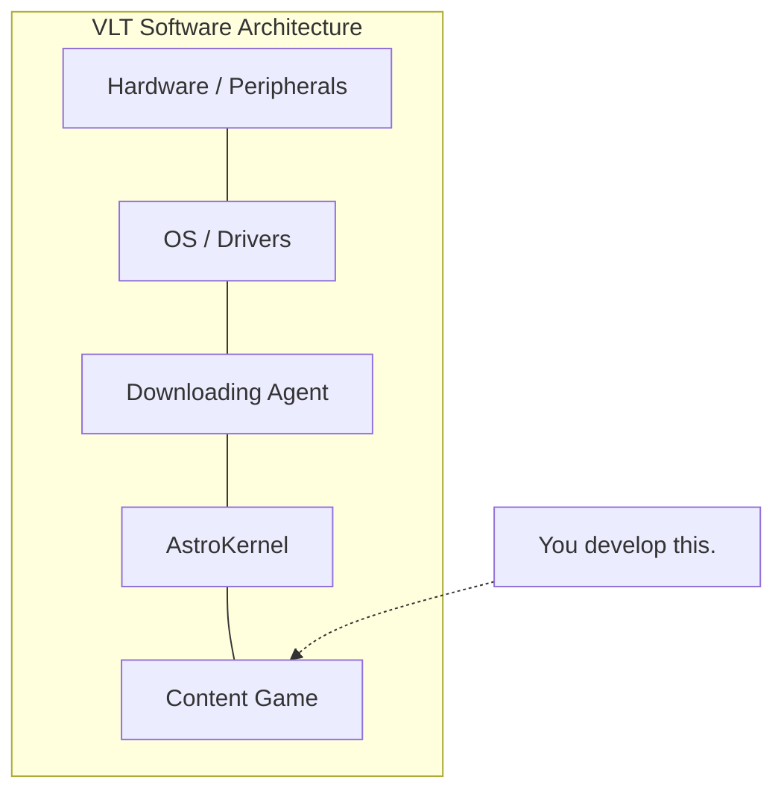

**VLT Software Architecture Layers:**

*   **Content (Game)** (Note: You develop this.)
*   **AstroKernel**
*   **Downloading Agent**
*   **OS / Drivers**
*   **Hardware / Peripherals**

# VLT Software Architecture
ASTRO CORP.
***

## Downloading agent
- The process is launched at the beginning handling tasks of
    * Downloading, installing and/or updating contents (games), and then
    * Checking software integrity, and eventually
    * Launching process "AstroKernel"

## AstroKernel version 2 (abbr. AK2)
- Process "AK2" contains many modules to support contents (games) running, like process management, peripheral management, configurations/accounting/audit/gameplay services, non-volatile RAM access, network communication, etc.

# VLT Software Architecture
ASTRO CORP.

### Content (a.k.a. downloadable content, game)

- A content is a software program with its data, downloaded from central system.
- Contents are classified into **Game**, **Attendant function**, **Game lobby**, **Attendant lobby**, and **Modules**.
- Content is launched by AK2 as a child process. Content and AK2 communicate with each other through inter-process communication (IPC).

# VLT Software Architecture
ASTRO CORP.

- Only Game lobby process with none or at most one content process is being run at the same time.

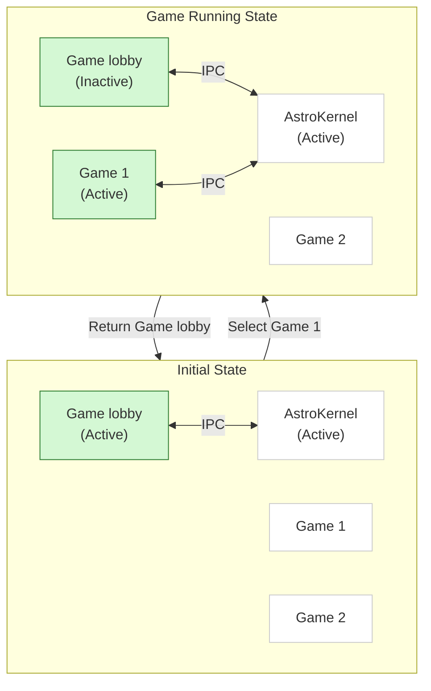

# VLT Software Architecture
ASTRO CORP.

## Runtime environment

<table>
  <tbody>
    <tr>
        <td>Item</td>
        <td>Specification</td>
    </tr>
    <tr>
        <th>Logic Board</th>
        <th>PSM G920, GX-217, 2 cores<br/>8GB RAM</th>
    </tr>
    <tr>
        <th>OS</th>
        <th>CentOS 7 64 bits with Kernel 4.18 (Embedded)</th>
    </tr>
    <tr>
        <th>Monitors</th>
        <th>Two monitors are arranged in upper and lower.<br/>Each is with resolution 1920x1080 pixels.</th>
    </tr>
    <tr>
        <th>Touch Panel</th>
        <th>One touch panel covers only the lower monitor.</th>
    </tr>
    <tr>
        <th>Video</th>
        <th>Graphics engine HD8000, X11, OpenGL 4.5.0</th>
    </tr>
    <tr>
        <th>Audio</th>
        <th>Onboard 5.1 channel</th>
    </tr>
    <tr>
        <th>Payment device</th>
        <th>Ticket printer, Bill acceptor</th>
    </tr>
  </tbody>
</table>

# VLT Software Architecture
ASTRO CORP.

## Runtime environment (Cont.)

<table>
  <tbody>
    <tr>
        <td>Item</td>
        <td>Specification</td>
    </tr>
    <tr>
        <th>Buttons and Backlights</th>
        <th>The image displays a layout of physical or virtual buttons for a gaming terminal: <br/> - Top row: TICKET OUT (Pink), MENÙ (Green), AUTOSTART (Blue), RACCOGLI (Blue), MIN BET (Blue), MAX BET (Blue) <br/> - Bottom row: Two large START buttons (Red) on the left and right sides.</th>
    </tr>
    <tr>
        <th>Storage</th>
        <th>128GB SSD</th>
    </tr>
    <tr>
        <th>NVRAM</th>
        <th>8K bytes for each game</th>
    </tr>
  </tbody>
</table>

# AstroGDK – Introduction
ASTRO CORP.

* Astro Game Development Kits (AstroGDK) provides a software environment including header files, libraries, samples, toolkits, simulator, and documents, for developer to develop and test games.

* Develop games run on platforms of Windows and Linux. Astro VLT runs Linux. So only need the Linux-version games eventually.

* Linux development machine (Linux box)
    - The same hardware with VLT box
    - Build, run, test your game

# AstroGDK – Introduction
ASTRO CORP.

## Development models
- Win box and Linux box (suggestion)
- Linux box only
- Linux VM

## Differences between Linux box and VLT box

<table>
  <tbody>
    <tr>
        <td>VLT box</td>
        <td>Shared (Intersection)</td>
        <td>Linux box</td>
    </tr>
    <tr>
        <td>Embedded Linux OS<br/>VPN/Security<br/>Downloading agent<br/>Pruned X</td>
        <td>Libraries<br/>Configurations<br/>File systems<br/>Drivers<br/>AstroKernel</td>
        <td>Full Linux OS<br/>Build /debug environment.<br/>Full X (X-window system)</td>
    </tr>
  </tbody>
</table>

# AstroGDK – Introduction
ASTRO CORP.

* API for game development:
    - Interface "ak2api": a message-based software API composed of few C functions and a number of C structures.
    - It is wrapped in dll/so file format, so for those programming languages which can access C or dll/so file, like C / C++ / Python / C# / JS, etc., may apply the API to develop games.

* All communications between game program and the system are totally and only through the API.

# AstroGDK – Introduction
ASTRO CORP.

AstroKernel exports client-end application programming interface “ak2api”. (C header file “ak2api.h”)

```mermaid
graph TD
    subgraph "Game by C/C++,..."
        G1[Game codes/data] --- A1[ak2api (so/dll)]
    end

    subgraph "Game by Unity"
        G2[Game codes/data] --- F2[Astro game framework<br/>for Unity (C# script)] --- A2[ak2api (so/dll)]
    end

    AK[AstroKernel]

    A1 <==>|IPC| AK
    A2 <==>|IPC| AK

    API((ak2api)) -.-> A1
    API -.-> A2

    style G1 fill:#a0f0e0,stroke:#000
    style A1 fill:#f0d060,stroke:#000
    style G2 fill:#a0f0e0,stroke:#000
    style F2 fill:#fff0c0,stroke:#000
    style A2 fill:#f0d060,stroke:#000
    style AK fill:#f0a000,stroke:#000
    style API fill:none,stroke:none,color:red
```

# AstroGDK – Introduction

ASTRO CORP.

## Development flow and sections in Document.

```mermaid
graph TD
    A[Set up development environment<br/>(Section 2)] --> B[Programming<br/>(Section 3)]
    B --> C[Run / Debug / Test<br/>(Section 4)]
    C --> B
    C --> D[Submit Game (to AstroGS)<br/>(Section 5)]
```

# AstroGDK – Setup (PSM G920)

## Typical connection

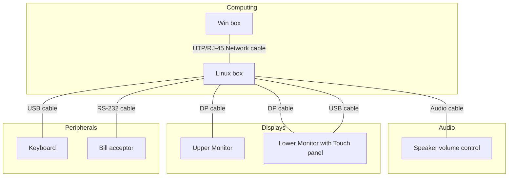

### Configure the monitors and networks

# AstroGDK – Setup (Astro H61)

## Typical connection

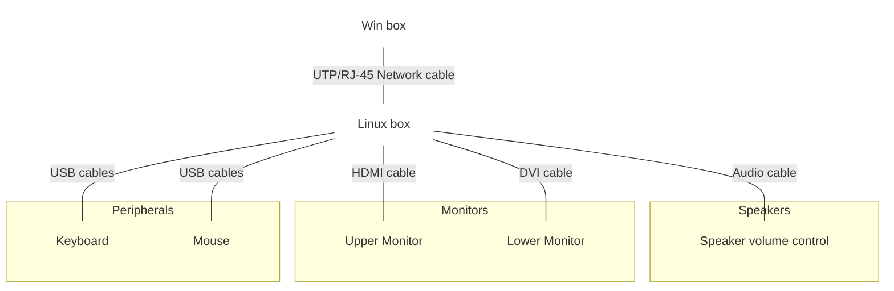

### Connection Details for Linux box:
*   **Network:** UTP/RJ-45 Network cable connected to Win box.
*   **Audio:** Speaker volume control connected to Speaker port.
*   **Display:**
    *   HDMI cable connected to Upper Monitor.
    *   DVI cable connected to Lower Monitor.
*   **Input Devices:**
    *   USB cables for Keyboard and Mouse.
*   **Rear Panel Ports identified:**
    *   Touch Screen
    *   Bill Acceptor
    *   Ticket Printer
    *   Speaker
    *   USB R I/O
    *   Lower Monitor (DVI)
    *   Upper Monitor (HDMI)

# AstroGDK – Setup
ASTRO CORP.

### Steps to setup and program in developer’s Windows machine (Win box)
- Install and setup AstroGDK.
- Set up directory of game source. Note, root directory of GDK and root directory of game source must be under the same directory (eg. MyProjects\\) in parallel.
- Start to program, run, test on Win box

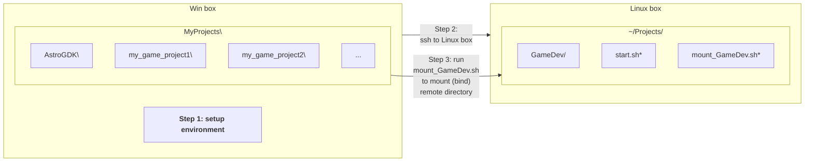

AstroGDK – Setup
ASTRO CORP.

# Steps to develop in Linux development machine (Linux box)
- Config upper directory (eg. MyProjects\\) as share folder (by network neighborhood/CIFS).
- Use ssh client (eg. putty) to connect to Linux box.

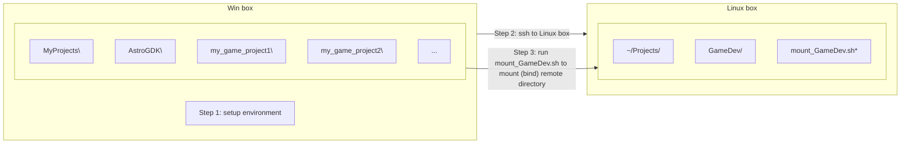

# AstroGDK – Setup
ASTRO CORP.

## Steps to develop in Linux box (cont.)

*   Execute `mount_GameDev.sh` to mount remote shared folder in Win box (eg. Work) to here mount-point `~/Projects/GameDev/`.
*   Start to develop, run, test on Linux box
*   After game compiled, may execute `start.sh` to launch AK2 and then Game lobby.

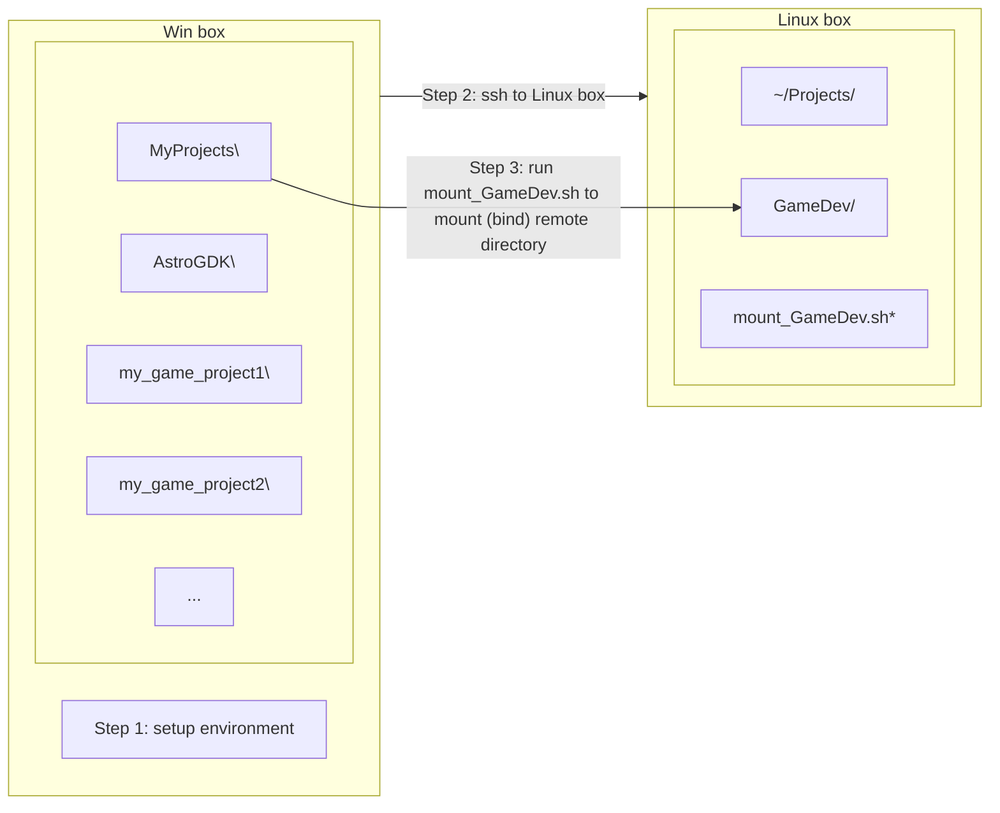

# AstroGDK – Setup (Linux VM)

### Steps to develop in Linux VM
- Use ‘Shared Folder’ to access project folder from Linux VM.

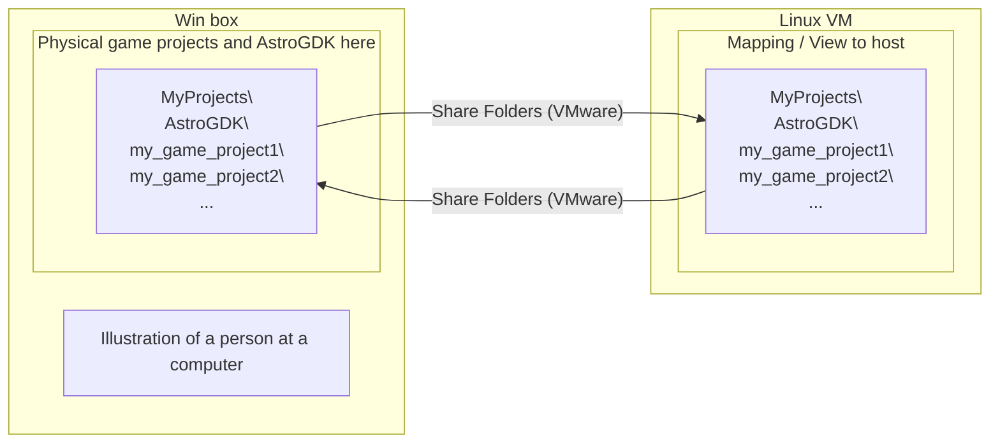

# AK2API – Programming
ASTRO CORP.
***

* ## Header files (C/C++ language)
  ```c
  #include “ak2api.h”                /* main header file of ak2api */
  #include “ak2api_market_c6b.h”     /* market-dependent header file */
  ```

* ## Link your program with libak2api.so (or ak2api.dll)

* ## Terminate your program with defined exit codes.

* ## Run in a process, and non-exclusive window mode in full screen dimension.

# AK2API – Programming
ASTRO CORP.

## Ability of running you game in different resolutions

- 2D technology

```mermaid
graph TD
    GP[Game program] --> LBB[Logic Back buffer<br/>e.g. 1920x1080<br/>(memory)]
    API[API to<br/>copy/resize]
    
    LBB -- resize --> M1[Monitor<br/>with 1680x1050<br/>(Physical video memory)]
    LBB -- copy --> M2[Monitor<br/>with 1920x1080<br/>(Physical video memory)]

    style GP fill:#4472C4,color:white
    style API fill:#00B0F0,color:black
    style LBB fill:#FFFF00,color:black
    style M1 fill:#92D050,color:black
    style M2 fill:#92D050,color:black
```

- 3D technology – apply the back buffer as texture

# AK2API – Programming
ASTRO CORP.

## Functions

— Initialize/release ak2api module and IPC:
* `ak2api_init(...)`, `ak2api_init_until_complete()`
* `ak2api_cfg_get_item(...)`
* `ak2api_exit()`

— Transmit/receive messages:
* `ak2api_get_message(void *p_msg)`
* `ak2api_send_message(const struct ak2msg_base *p_msg)`

— NVRAM handling:
* `ak2api_nvbuf_get_buffer(char **pp_nvbuf_buffer,...)`
* `ak2api_nvbuf_commit()`
* `ak2api_nvbuf_if_synced()`

# AK2API – Programming
ASTRO CORP.

## Messages
- In form of C `struct`, containing size, message code, and following fields.

```c
// Definition of base/head of a message structure.
// A complete message structure is this structure tailed optional part.
struct ak2msg_base
{
    int size;           // byte size of the complete message structure
    char code[27];      // message code/string here. (note! case sensitive)

    // optional/appened data from here
};
```

## Prefix of message code
- "ac_": the message is from AK2 to Content (game)
- "ca_": the message is from Content (game) to AK2

# AK2API – Programming
ASTRO CORP.

*   Process initialize/destroy (**init** / **exit**):
    *   `ak2api_init(...)`, `ak2api_init_until_complete()`
    *   `ak2api_exit()`

*   Configuration (**cfg**):
    *   `ak2api_cfg_get_item()` to get configuration data.
    *   “ac_cfg_updated”

*   Process flow (**flow**):
    *   “ca_flow_start”, “ac_flow_terminate”
    *   “ac_flow_suspend”, “ac_flow_resume”

# AK2API – Programming
ASTRO CORP.

## Game match (game):
- “ca_game_start”, “ac_game_start_acked”
- “ca_game_step”
- “ca_game_end”, “ac_game_end_acked”
- “ca_game_snapshot”, “ac_game_snapshot2”

## About odds (rng / jp / outcome):
- “ca_rng_request”, “ac_rng_result”
- “ca_jp_hit_check”, “ac_jp_hit_result”,
- “ca_jp_award”, “ca_jp_award_acked”
- “ca_outcome_request”, “ac_outcome_result”

# AK2API – Programming
ASTRO CORP.

## Accounting (**credit** / **meter**):
- “ac_credit_changed”
- “ca_credit_payout”
- “ca_meter_query”, “ac_meter_info”

## NVRAM buffer (**nvbuf**):
- `ak2api_nvbuf_get_buffer()` to get pointer of NVRAM buffer.
- `ak2api_nvbuf_commit()`
- `ak2api_nvbuf_if_synced()`

# AK2API – Programming
ASTRO CORP.

* Low-level I/O (**touch** / **key** / **light**):
    - “**ac_touch_pressed**”, “**ac_touch_released**”
    - “**ac_key_down**”, “**ac_key_up**”
    - “**ca_light_on**”, “**ca_light_off**”

* Message exchange (**get** / **send**):
    - `ak2api_get_message()`, `ak2api_send_message()`

* (Others):
    - “ca_jp_broadcast”
    - “ca_atmosphere”, “ca_atmosphere2”

# AK2API – State Machine
ASTRO CORP.

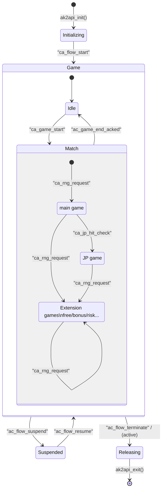

# AK2API – main flow
ASTRO CORP.

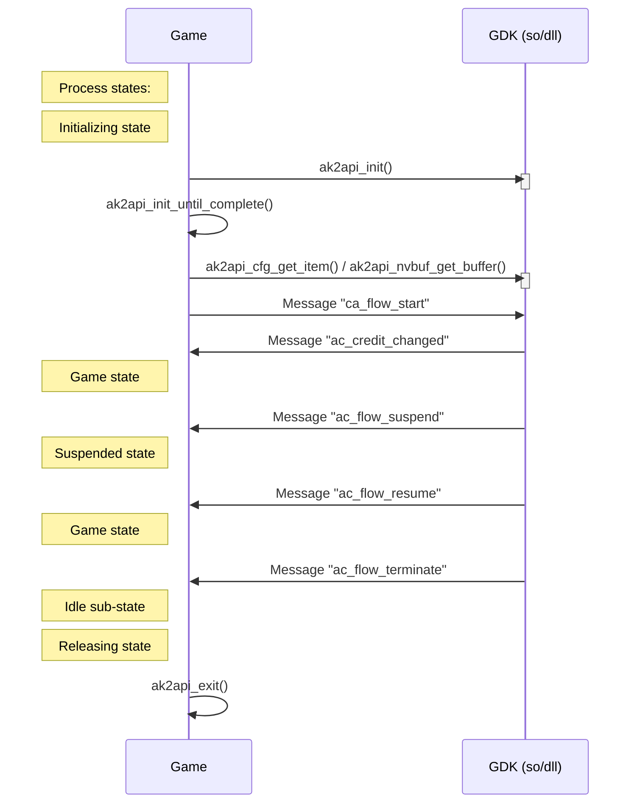

# AK2API – game flow (main/jp)
ASTRO CORP.

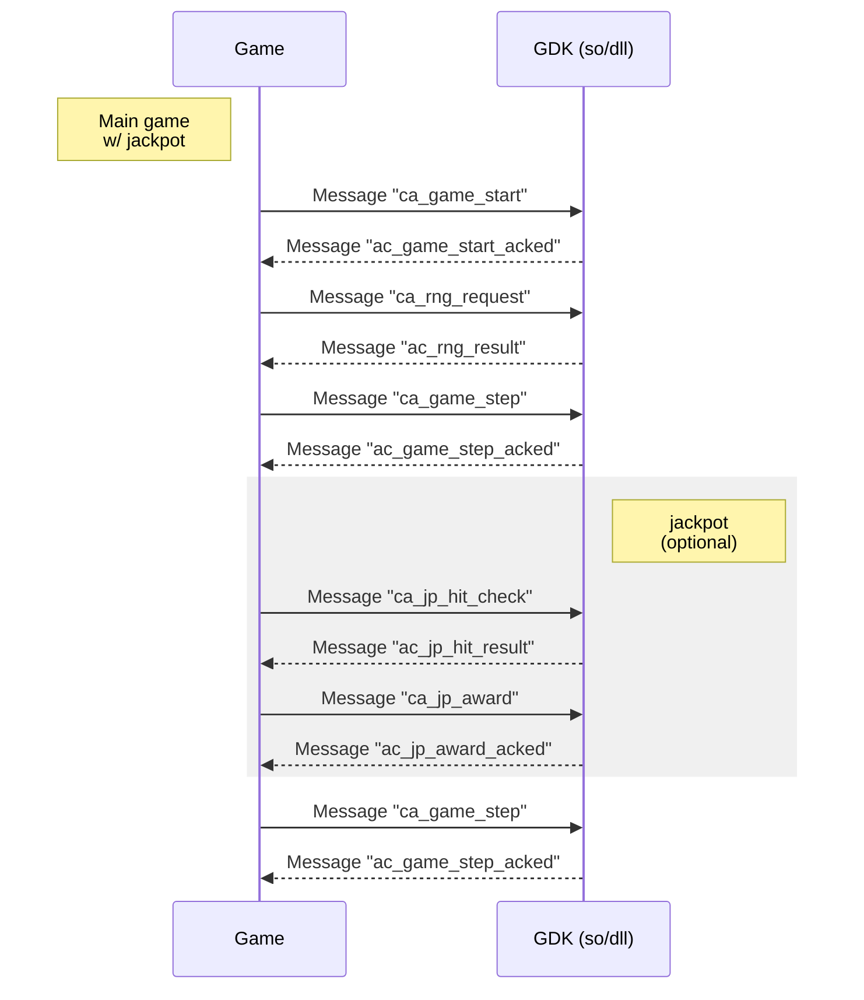

(cont.)

# AK2API – game flow (step/end)
ASTRO CORP.

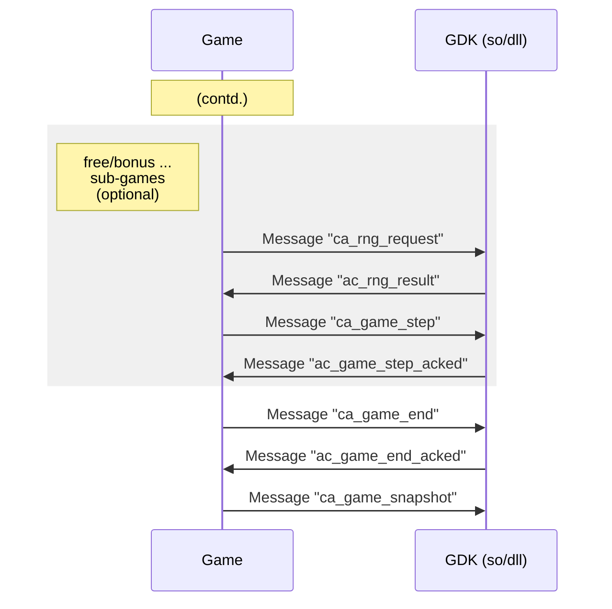

ASTRO CORP.

# AK2API – accounting
ASTRO CORP.

## Payout flow

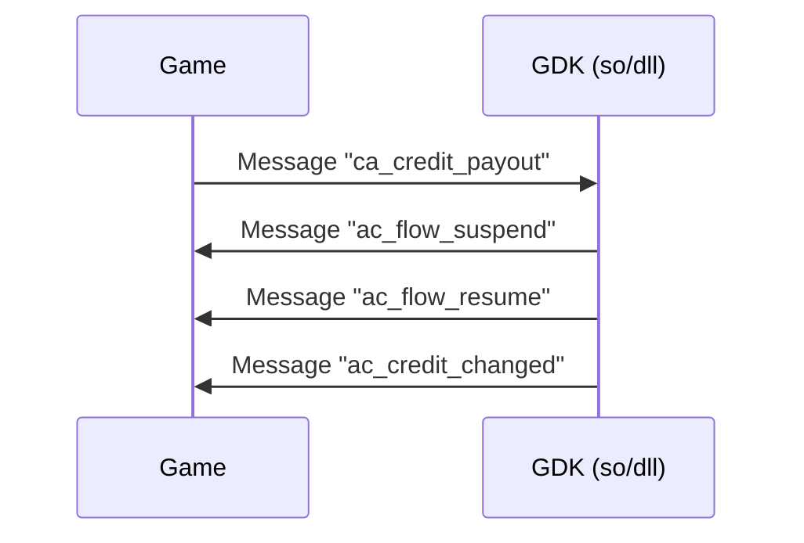

## Query meters

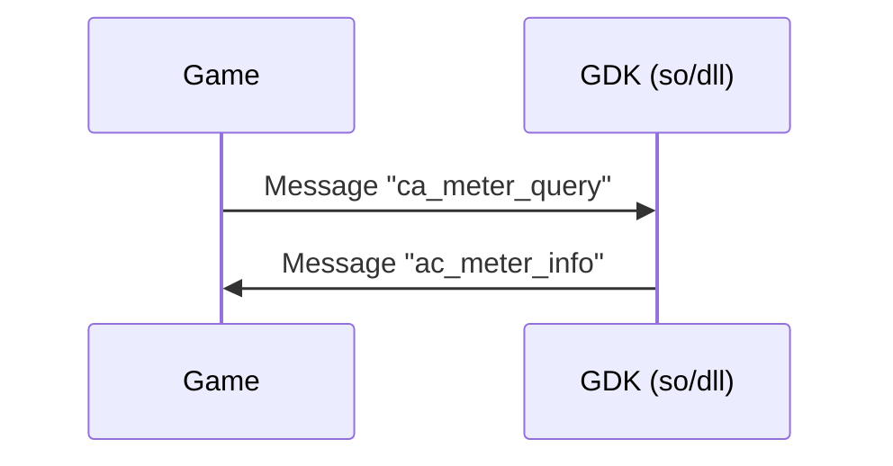

# AK2API – nvram
ASTRO CORP.

**Process states:**

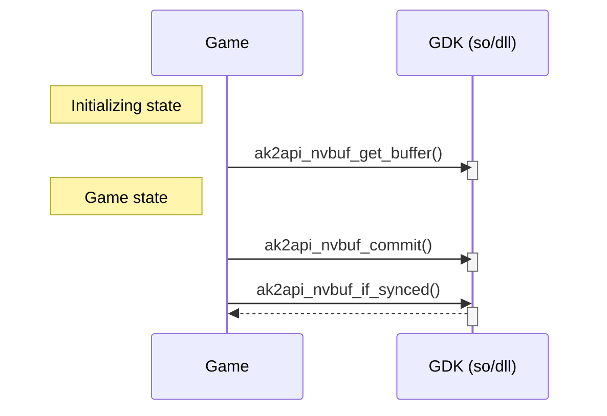

ASTRO CORP.

# AK2API – low-level I/O
ASTRO CORP.

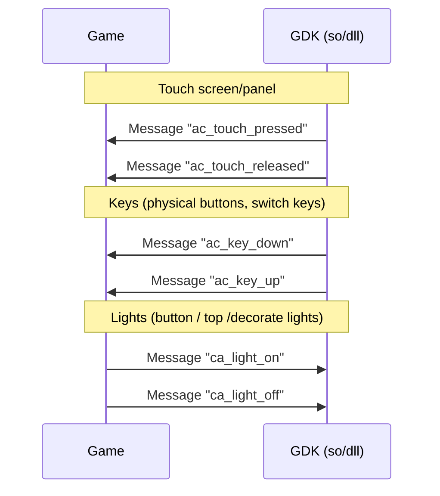

# AK2API – other issues
ASTRO CORP.

* Reporting game outcome in defined format
    - Game steps – report of main game, free game, bonus game, etc.
    - Game end – report of total bet and won.

* Incidents, Responsible gaming (Money/Time), Tax info
    - All controlled and displayed by AstroKernel
    - Game is suspended during message period.

* Use only necessary system resources, e.g. CPU and FPS

* Sound volume control
    - Sound material and hardware control

# AK2API – Sample (init/destroy)
ASTRO CORP.

```c
struct ak2msg_base msg;
int result_code;

...

// Initialize ak2api module
if ( ( result_code = ak2api_init() ) < 0 )
    error handling ...
while ( ( result_code = ak2api_until_complete() ) == 1 )
    wait a second or do other things.
if ( result_code < 0 )
    error handling ...

// other initialization here
...

// Tell AK2 that initialization of content has done.
memset( &msg, 0, sizeof *msg );
strcpy( msg.code, "ca_flow_start" );
msg.size = (int)sizeof *msg;
if ( ( result_code = ak2api_send_message( &msg ) ) < 0 )
    error handling ...

// Main loop here
...

// Release resource of content
...
ak2api_destroy();
exit( 0 );
```

# AK2API – Sample (main loop)
ASTRO CORP.

```c
struct ak2msg_base msg;
char msg_buf[AK2API_MAX_MESSAGE_SIZE];
int result_code;

...

// Main loop here
while ( ... )
{
    if ( ( result_code = ak2api_get_message( msg_buf ) ) < 0 )
        // error handling or exit main loop ...

    // if message received, ...
    if ( result_code > 0 )
    {
        // Refer to 'msg' here
        if ( 0 == strcmp( ((struct ak2msg_base *)msg_buf)->code, "ac_touch_pressed" ) )
            ...
        else if ( 0 == strcmp( ((struct ak2msg_base *)msg_buf)->code, "ac_touch_released" ) )
            ...
    }
    ...
}
```

# AstroGDK – Run and Test
ASTRO CORP.

* Main execution binary must be named of “app” (Linux) or “app.exe” (Windows)

* Customize configuration files of AstroKernel
    - VLT.xml, list.xml, hwlayout.xml, debug.xml

* Launch your game from Game lobby
    - Add/modify item into list.xml
    - Start your game by click the icon in UI of game lobby

* Launch your game from command line (directly)
    `# start.sh <path_of_game> [enter]`

# AstroGDK – Run and Test
ASTRO CORP.

*   Simulate devices and events
    -   Buttons – Keyboard
    -   Touch panel – Mouse
    -   Bill acceptor – keyboard to insert bill
    -   Ticket printer – (none)
    -   Incident – Keyboard to simulate door open/close

*   Connection with real or simulation devices
    -   Controlled by debug.xml

*   Responsible gaming configurations
    -   Configure through UI of Game lobby

# AstroGDK – Run and Test

*   Helper interface of feeding random numbers manually and monitoring the control states (lights control).
    - telnet, TCP/IP listen port 10000

*   Log for debugging
    - While starting AstroKernel from batch script “start.sh” or “start.bat”, any messages output to **stdout** (standard output) and **stderr** (standard error) will be output to log file “AstroGDK\Runtime\data\ask.log”.

*   Clean NVRAM files to initial the state

# AstroGDK – Game Submission
ASTRO CORP.

* Game submission package. E.g. Game "Atlantis" version 1.3.0.4

* logo.png – for Downloader, icon.png, icon.webm, bouncing.webm, movie.avi – for Game lobby

* Above three media must follow defined name and format.

* Submit to test lab with **Game submission form** and **Game submission package.**

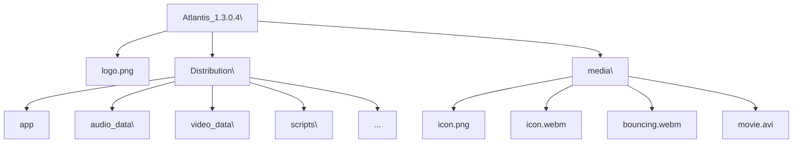

# AstroGDK – QA
ASTRO CORP.

---

A yellow sticky note pinned with a red pushpin in the center of the page says:
**Thank you**

The background features a large, faded watermark of the ASTRO CORP. logo.