Astro Logo

# Astro Game Development Kits
## Programming Guide
## BASE and for Italian VLT

AstroGDK version 3.2
AK2API version 1.8.7 for Italian VLT (Comma 6b)

S/N: SYSDEV-AGDK-001

Copyright © 2017-2022 Astro Corp. All Rights Reserved.

Astro Logo

THE INFORMATION IN THIS DOCUMENT IS CONFIDENTIAL, IT MAY NOT BE REPRODUCED, STORED, COPIED OR OTHERWISE RETRIEVED AND/OR RECORDED IN ANY FORM IN WHOLE, OR IN PART, NOR MAY ANY OF THE INFORMATION CONTAINED THEREIN BE DISCLOSED.

Astro Game Development Kits - Programming Guide (BASE)
AstroGDK 3.2 (AK2API 1.8.7 for Italian VLT)
Astro

# Revision History

<table>
  <tbody>
    <tr>
        <td>Rev</td>
        <td>Date (YMD)</td>
        <td>Release Note</td>
    </tr>
    <tr>
        <td>1.0</td>
        <td>2017/12/11</td>
        <td>New for AstroGDK 0.2</td>
    </tr>
    <tr>
        <td>1.1</td>
        <td>2017/12/28<br/>2018/1/10</td>
        <td>For AstroKernel 0.3rev1<br/>Add keyboard mapping<br/>Correct several mistakes.</td>
    </tr>
    <tr>
        <td>1.2</td>
        <td>2018/1/11</td>
        <td>More detail</td>
    </tr>
    <tr>
        <td>1.3</td>
        <td>2018/1/22</td>
        <td>More detail and sequence diagram</td>
    </tr>
    <tr>
        <td>1.5</td>
        <td>2018/3/26</td>
        <td>Add more descriptions and pictures.<br/>For AstroGDK 1.5</td>
    </tr>
    <tr>
        <td>1.5.1</td>
        <td>2018/4/2</td>
        <td>Add more descriptions and FAQ<br/>For AstroGDK 1.5.1</td>
    </tr>
    <tr>
        <td>1.6</td>
        <td>2018/5/11</td>
        <td>Modify the resolution of monitor to 1680x1050.<br/>Add detail description of Game recovery.<br/>New-version format of outcome detail.<br/>Add message “ac_game_step_acked”.<br/>Add description about jackpot.<br/>Improve function of helper interface.<br/>Increase size of game NVRAM from 4K to 8K bytes.<br/>Fix issues reported by GLI.<br/>Several typo and bugs fixed.<br/>For AK2API version 1.6.x.</td>
    </tr>
    <tr>
        <td>1.6.1</td>
        <td>2018/5/26</td>
        <td>Add description about game recovery in startup. (page 55)</td>
    </tr>
    <tr>
        <td>1.6.1<br/>(rev 1)</td>
        <td>2018/9/28</td>
        <td>● Add more libraries information. (table 1.4-2)<br/>● Game program may read touch panel event from AK2API or from mouse pointer alternatively. (table 1.4-2)<br/>● Emphasize that both attached monitors must be the same in native resolutions. (sect 2.1.2, 2.1.4)<br/>● Add explanation about how game program linking with AK2API library or object. (sect 3.1.6)<br/>● Clarify the termination of game program in more details for different groups of exit codes. (sect 3.3.3 (3))<br/>● Remove tag ‘EPL’ from Free game of outcome. (sect 3.5)<br/>● Add and explain the configuration file hwlayout.xml (sect 4.1)<br/>● Move all FAQ stuff to another document. “Astro Game Development Kits - Programming FAQ”</td>
    </tr>
    <tr>
        <td>2.0</td>
        <td>2019/2/8</td>
        <td>● New for AstroGDK 2.0 and AK2API 1.7.0;<br/>● Add logic unit PSM G920, and declare Astro H61 will be obsolete (sect 1.3);<br/>● Describe that OS (including libraries/utilities) of Astro H61 was upgraded to CentOS 7 64 bits totally the same with PSM G920, like OpenGL 4.5, SDL / SDL2 2.0.8, Mesa 17.2.3, gcc 4.8 / gcc 7, alsa 1.1.4, mpv 0.29, Xfce4, etc., and define the binary format must be ELF32 mainly (sect 1.4);<br/>● Add media player ‘mpv’ and video hw decoder support (sect 1.4, 3.8.6);</td>
    </tr>
  </tbody>
</table>

Copyright © 2017-2022 By Astro Corp. All Rights Reserved. Page 2
The information in this document is confidential, it may not be reproduced, stored, copied or otherwise retrieved and/or recorded in any form in whole, or in part, nor may any of the information contained therein be disclosed.

Astro Game Development Kits - Programming Guide (BASE)
AstroGDK 3.2 (AK2API 1.8.7 for Italian VLT)
Astro

<table>
  <tbody>
    <tr>
        <td colspan="2"></td>
        <td>* Add Linux virtual machine (Linux VM) and describe it (sect 1.5.1, 1.5.2);<br/>* Describe outer view and connection types of PSM G920 (sect 2.1.3);<br/>* Describe the default networking settings of PSM G920 (sect 2.1.4);<br/>* Describe PSM G920 must change display setting manually (sect 2.1.5);<br/>* Describe how Linux VM loaded, run and cooperate with Win box (sect 2.1.6, 2.4);<br/>* Describe VLT box only provided 32-bit libak2api.so (sect 3.1);<br/>* Change name prefix of AK2API function `ak2api_run_as_active_mode()` to “`ap2apiex_`” (sect 3.1.1, 4.3.4);<br/>* Add AK2API function `ak2api_exit()` (sect 3.1.2, 3.3.2);<br/>* Add AK2API message “ca_atmosphere2” for control of LED strip with script (sect 3.1.5, 3.2.10);<br/>* Describe concept of uniform distribution / coverage of used random numbers (sect 3.2.3);<br/>* Describe message “ca_jp_hit_check” and “ca_jp_award” are only used for central jackpot (3.2.3);<br/>* Clarify how to cancel RNG request with ‘wait’ timer and handle RNG timeout in case of emergency event (sect 3.2.3);<br/>* Fix typo of message names. (sect 3.2.4, 3.2.5)<br/>* Add support of touch panels if which simulate system mouse pointer (3.2.7);<br/>* Describe the game state will be in idle state by default after recovery from emergency case of terminal (exit code 12 of sect 3.3.2);<br/>* Clarify that character ‘|’ cannot be part of column data (sect 3.5.2);<br/>* Clarify the difference of columns STK and VSTK by example (sect 3.5.2);<br/>* Describe no matter system jackpot and/or local jackpot both must report outcome detail of “Jackpot Win/Game” (3.5.2).<br/>* Describe how to verify integrity of accounting data of outcome detail (sect 3.5.3)<br/>* Change value of configure item ‘min_bet_ce’ to 10 eurocent according to new regulation C6b 2018 (sect 3.6);<br/>* Emphasize the sound volume strength defined in this paragraph is a requirement (sect 3.7.2)<br/>* Describe the game system disables central (system) jackpot in production environment currently (sect 1.4, 3.8.3)<br/>* Describe game program can only run with non-exclusive window mode (sect 3.8.5);<br/>* Change several tags of file list.xml and hwlayot.xml. (sect 4.1.2, 4.1.3);<br/>* Describe how `&lt;device type=”CreditIn” …/&gt;` control simulation of money insertion (sect 4.1.3);<br/>* Describe tag “magic_credit” in debug.xml was removed and replaced by `&lt;device type=”CreditIn …”/&gt;` in hwlayout.xml (sect 4.1.4);<br/>* Describe how to terminate X window by [Ctrl]-[Alt]-[Backspace] (sect 4.3.3);</td>
    </tr>
  </tbody>
</table>

Copyright © 2017-2022 By Astro Corp. All Rights Reserved. Page 3
The information in this document is confidential, it may not be reproduced, stored, copied or otherwise retrieved and/or recorded in any form in whole, or in part, nor may any of the information contained therein be disclosed.

Astro Game Development Kits - Programming Guide (BASE)
AstroGDK 3.2 (AK2API 1.8.7 for Italian VLT)
Astro

<table>
  <tbody>
    <tr>
        <td>2.1</td>
        <td>2019/5/24</td>
        <td>● New for AstroGDK 2.1 (AK2API 1.7.1)<br/>● Fix crash problem if calling ak2api_exit() after ak2api_destory().<br/>● Fix of non-complete value ranges (only 15 bits) of random number.<br/>● Describe that the only way to launch AstroKernel in command line is to run “./start.sh”. No “./ask” or “. ./start.sh” allowed. (sect 4.3.1)<br/>● Correct the definition of configuration item “game_match”/“max_won_ce” as The maximum won of a game match. ... (sect 3.6)<br/>● Add description of how to configure different keyboard layout. (sect 2.1.6)<br/>● Add description of using option “-m32” to generate 32-bit executable binary for gcc build environment. (sect 3.1.6)<br/>● More clear description about linking with “AK2API” library. (sect 3.1.7)<br/>● More clarification about exit code 13, 14, 19, 20, others. (sect 3.3.2)<br/>● Describe that it’s safe a game program can just call ak2api_exit() without previous ak2api_destroy(). (sect 3.3.2)<br/>● More detail about messages “ca_atmosphere” and “ca_atmosphere2”. And describe that last arriving message will take priority of run. (sect 3.2.10)<br/>● Describe usage of several important options of utility ‘mpv’, especially the option --quiet is strongly required. And describe concept of how to terminate running ‘mpv’ process. (sect 3.8.6)<br/>● Add C/Xlib sample code of how to acquire resolution of logic monitor. (sect 3.9.3)<br/>● More descriptions and few definition modifications about payout flow, especially in case of AstroKernel rejects payout, and new manner for preventing from race conditions. (sect 3.2.4)<br/>● Add description of storing format and target directory of snapshot images.<br/>● Add definition of physical button “CYCLE BET” with key id “cycle_bet” (sect 1.4, 3.2.8)<br/>● Fix several typo.<br/>● Change log about game submission, please refer to section Revision History of document “Astro Game Development Kit - Game Submission for Integration Test - v2.1”.</td>
    </tr>
    <tr>
        <td>2.6</td>
        <td>2019/9/20</td>
        <td>● New for AstroGDK 2.6, AK2API 1.8.0. (Astro system 2.6, Disk image v22)<br/>● When launching game from Game lobby, Game lobby will stay inactive without termination like before. And Game lobby will be re-active right after game quit. (sect 1.2.3)<br/>● Improve function ak2api_exit() to be more reliable to pass exit code.<br/>● Function ak2api_destroy() is obsolete. Just call function ak2api_exit(exit_code) to terminate game program. (sect 3.1.2, 3.3.2)<br/>● Message “ac_flow_stop” is obsolete and will be ignored by AstroKernel. (sect 3.1.5)<br/>● AstroKernel sends message “ac_flow_terminate” only while game is in idle state. (sect 3.2.2)<br/>● In suspended state (between “ac_flow_suspend” and “ac_flow_resume”), game process will not receive any message except “ac_flow_resume”. (sect 3.2.2).<br/>● In suspended state (between "ac_flow_suspend" and "ac_flow_resume"), AstroKernel will ignore all events from physical keys/buttons.<br/>● Add configuration items “sys_info”/”dim_w” and “dim_h” to report the</td>
    </tr>
  </tbody>
</table>

Copyright © 2017-2022 By Astro Corp. All Rights Reserved. Page 4
The information in this document is confidential, it may not be reproduced, stored, copied or otherwise retrieved and/or recorded in any form in whole, or in part, nor may any of the information contained therein be disclosed.

Astro Game Development Kits - Programming Guide (BASE)
AstroGDK 3.2 (AK2API 1.8.7 for Italian VLT)

<table>
  <thead>
    <tr>
        <th></th>
        <th></th>
        <th>dimension of virtual monitor in units of pixels. (sect 3.6)</th>
    </tr>
    <tr>
        <th></th>
        <th></th>
        <th>● Modify startup script “Runtime/start.sh” below two values from 0 to 1 to<br/>enable VSync waiting:<br/>export vblank_mode=1<br/>export __GL_SYNC_TO_VBLANK=1</th>
    </tr>
    <tr>
        <th></th>
        <th></th>
        <th>● Fix few typo (sect 3.8.6)</th>
    </tr>
  </thead>
  <tbody>
    <tr>
        <td>2.7</td>
        <td>2020/10/1</td>
        <td>● New AstroGDK 2.7, AK2API 1.8.6, Disk embedded v25, aligned with Astro game<br/>system 2.7.</td>
    </tr>
    <tr>
        <td></td>
        <td></td>
        <td>● Add notice of when game recovery, game is also responsible of restoring states<br/>of button lights. (sect 3.3.1)</td>
    </tr>
    <tr>
        <td></td>
        <td></td>
        <td>● Change definition of configuration item "accounting"/"AU". For money-based<br/>games which display and play in money, it is 0. For credit-based games which<br/>display and play in credits, it is greater than 0 as conversion factor between<br/>money and credits. (sect 3.6)</td>
    </tr>
    <tr>
        <td></td>
        <td></td>
        <td>● Add description about NOT setting environment variable SDL_AUDIODRIVER in<br/>game program to prevent from conflicting with system’s audio driver. (sect<br/>3.7.1)</td>
    </tr>
    <tr>
        <td></td>
        <td></td>
        <td>● Add description about providing sound volume control on game UI. And it’s<br/>appreciated to be provided in NEXT platform. (sect 3.7.3 added)</td>
    </tr>
    <tr>
        <td></td>
        <td></td>
        <td>● Revise the description of SDL_CreateWindow(), should use parameter<br/>SDL_WINDOW_BORDERLESS to create window for full-screen window mode<br/>instead of incorrect parameter SDL_WINDOW_FULLSCREEN_DESKTOP (sect<br/>3.8.5)</td>
    </tr>
    <tr>
        <td></td>
        <td></td>
        <td>● Game program can call function ak2apiex_get_screen_dimension() to acquire<br/>resolution of logic monitor. (sect 3.8.7)</td>
    </tr>
    <tr>
        <td></td>
        <td></td>
        <td>● Minor revisions to list.xml. Add tag &lt;acceptablecoinsce&gt; and &lt;currency_config&gt;.<br/>(sect 4.1.1)</td>
    </tr>
    <tr>
        <td></td>
        <td></td>
        <td>● Add description of individual &lt;tag&gt; map to which configuration items. (sect<br/>4.1.1)</td>
    </tr>
    <tr>
        <td></td>
        <td></td>
        <td>● Emphasize the value of content_id in list.xml must be 11-character in length<br/>and with the first character “A”. (sect 4.1.2)</td>
    </tr>
    <tr>
        <td></td>
        <td></td>
        <td>● Change to use &lt;device type=”PRN” module=”NulPrn”&gt; to define virtual ticket<br/>printer device in hwlayout.xml especially in development environment (sect<br/>4.1.3)</td>
    </tr>
    <tr>
        <td></td>
        <td></td>
        <td>● Add description of how to use physical I/O, PSM G920 IO or Astro H61 USBRIO,<br/>by modifying configure file hwlayout.xml. (sect 4.1.3)</td>
    </tr>
    <tr>
        <td></td>
        <td></td>
        <td>● Add description of how to set up a standalone physical machine environment<br/>with all peripheral devices connected. (sect 4.1.5 added)</td>
    </tr>
    <tr>
        <td></td>
        <td></td>
        <td>● Add description about the limit of internal socket used by game program. (sect<br/>3.8.8 added)</td>
    </tr>
    <tr>
        <td></td>
        <td></td>
        <td>● Add support of 64-bit game binary. AstroGDK provides 64-bit version<br/>libak2api_64.so for 64-bit program to link. (sect 1.4)</td>
    </tr>
    <tr>
        <td></td>
        <td></td>
        <td>● Add description of always putting not pre-installed third-party runtime together<br/>with game release. (sect 1.5.7 added)</td>
    </tr>
    <tr>
        <td></td>
        <td></td>
        <td>● Physical buttons CYCLE BET (cycle_bet) and/or MIN BET (min_bet) are optionally<br/>supported by cabinets. (sect 1.4, 3.2.8)</td>
    </tr>
    <tr>
        <td></td>
        <td></td>
        <td>● Add new message “ca_game_snapshot2” which is able to do snapshot on</td>
    </tr>
  </tbody>
</table>

Copyright © 2017-2022 By Astro Corp. All Rights Reserved. Page 5
The information in this document is confidential, it may not be reproduced, stored, copied or otherwise retrieved and/or recorded in any form in whole, or in part, nor may any of the information contained therein be disclosed.

Astro Game Development Kits - Programming Guide (BASE)
AstroGDK 3.2 (AK2API 1.8.7 for Italian VLT)

<table>
  <thead>
    <tr>
        <th></th>
        <th></th>
        <th>bottom or upper monitor according to given parameter. (sect 3.2.3.5)</th>
    </tr>
    <tr>
        <th></th>
        <th></th>
        <th>● Add new configuration items “sys_info”/”AK2_version”, and add “accounting”/”currency_code”, “accounting”/”show_precision” for more portability.</th>
    </tr>
    <tr>
        <th></th>
        <th></th>
        <th>● Fix the verification formula for accounting integrity of outcome detail. (sect 3.5.3)</th>
    </tr>
    <tr>
        <th></th>
        <th></th>
        <th>● Change the name and definition to “ca_game_step”.outcome_won_ce. Add description and example to describe it in detail. (sect 3.5.5 added)</th>
    </tr>
    <tr>
        <th></th>
        <th></th>
        <th>● Fix several typo and unclear meanings.</th>
    </tr>
  </thead>
  <tbody>
    <tr>
        <td>2.7 Rev 1</td>
        <td>2021/3/26</td>
        <td>● Modify hardware specification of PSM G920 logic unit. (sect 1.3)</td>
    </tr>
    <tr>
        <td>2.9</td>
        <td>2021/7/23</td>
        <td>● New AstroGDK 2.9, AK2API 1.8.6. Aligned with Astro game system 2.8 and 2.9.</td>
    </tr>
    <tr>
        <td></td>
        <td></td>
        <td>● Add two cabinets – STORM and SLANT-TOP. (sect 1.3)</td>
    </tr>
    <tr>
        <td></td>
        <td></td>
        <td>● Add description of that the ak2api module must be linked only to the first game process, not to other game sub-processes. (sect 3.1.1)</td>
    </tr>
    <tr>
        <td></td>
        <td></td>
        <td>● Emphasize that any message raised in period of suspended state will be queued internally and then sent to game program immediately once resume. (sect 3.2.2)</td>
    </tr>
    <tr>
        <td></td>
        <td></td>
        <td>● Clarify how the ‘wait’ timer of RNG-request works during the period of suspended state. (sect 3.2.3.1)</td>
    </tr>
    <tr>
        <td></td>
        <td></td>
        <td>● Add description and sample code about supporting multi-touch function. (sect 3.8.10)</td>
    </tr>
    <tr>
        <td></td>
        <td></td>
        <td>● Add description of restriction that a game program is not allowed to add, modify, remove, and rename any stuff in game directory and all its sub-directories for software integrity check requirement by certain Regulations. (sect 3.8.11)</td>
    </tr>
    <tr>
        <td></td>
        <td></td>
        <td>● Add rule that &lt;device type="CreditIn" ... &lt;/device&gt; defined in hwlayout.xml would be take effect only if file debug.xml exists. (sect 4.1.3)</td>
    </tr>
    <tr>
        <td></td>
        <td></td>
        <td>● Add definitions on hwlayout.xml to support different types of touch panels. (sect 4.1.3)</td>
    </tr>
    <tr>
        <td></td>
        <td></td>
        <td>● Add definition on hwlayout.xml to support CCTalk-standard coin acceptor device. (sect 4.1.3)</td>
    </tr>
    <tr>
        <td></td>
        <td></td>
        <td>● Clarify the relationship of two types of loading animations and prevent from the ‘gap’ between. (sect 3.8.9)</td>
    </tr>
    <tr>
        <td></td>
        <td></td>
        <td>● Modify few sequence diagrams to follow the real implementation. They are incorrect in previous-version documents. (sect 3.4.2, 3.4.3)</td>
    </tr>
    <tr>
        <td></td>
        <td></td>
        <td>● Modify the introduction of configuration items to be clearer. (sect 3.6)</td>
    </tr>
    <tr>
        <td></td>
        <td></td>
        <td>● Fix the bug in sample code about CPU usage control. (sect 3.8.4)</td>
    </tr>
    <tr>
        <td></td>
        <td></td>
        <td>● Add description about how to close process in Windows (sec.4.3.3)</td>
    </tr>
    <tr>
        <td>2.9.1</td>
        <td>2021/11/29</td>
        <td>● Emphasis that when preparing a message, all non-used fields must be valued with 0’s. (sect 3.1.4)</td>
    </tr>
    <tr>
        <td></td>
        <td></td>
        <td>● Emphasis that game programming should configure wait-timeout of RNG request to 2 minutes (sect. 3.2.3.2)</td>
    </tr>
    <tr>
        <td></td>
        <td></td>
        <td>● Several bugs fixed on runtime (see changelog.txt).</td>
    </tr>
  </tbody>
</table>

Copyright © 2017-2022 By Astro Corp. All Rights Reserved. Page 6
The information in this document is confidential, it may not be reproduced, stored, copied or otherwise retrieved and/or recorded in any form in whole, or in part, nor may any of the information contained therein be disclosed.

Astro Game Development Kits - Programming Guide (BASE)
AstroGDK 3.2 (AK2API 1.8.7 for Italian VLT)
Astro

<table>
  <tbody>
    <tr>
        <td>3.2</td>
        <td>2022/7/5</td>
        <td>● New AstroGDK 3.2, AK2API 1.8.7. Aligned with Astro game system 3.1 and 3.2.<br/>● Clarify that amounts in outcome detail of Energy game (‘EG’) must be money (in units of cents), not points, to prevent from ambiguity in accounting (sect 3.5.2)<br/>● Correct and provide more examples of outcome details. (sect 3.5.2)<br/>● Support simulation of insertion and removal of health card. (sect 2.1.3, 4.1.1, 4.1.3, 4.4.1, 4.4.4)<br/>● Few typo fixed.</td>
    </tr>
  </tbody>
</table>

Copyright © 2017-2022 By Astro Corp. All Rights Reserved. Page 7
The information in this document is confidential, it may not be reproduced, stored, copied or otherwise retrieved and/or recorded in any form in whole, or in part, nor may any of the information contained therein be disclosed.

Astro Game Development Kits - Programming Guide (BASE)
AstroGDK 3.2 (AK2API 1.8.7 for Italian VLT)
Astro

# Contents

Revision History .....................................................................................................................................2
Contents .................................................................................................................................................8
1 Introduction ......................................................................................................................................12
* 1.1 Definitions of Terms And Acronyms ......................................................................................12
* 1.2 VLT Software Architecture .....................................................................................................13
    - 1.2.1 Downloading agent .....................................................................................................13
    - 1.2.2 AstroKernel (AK)..........................................................................................................13
    - 1.2.3 Content (Downloadable content / Game) ..................................................................14
* 1.3 VLT Hardware Specification ...................................................................................................15
* 1.4 Game Runtime Specification..................................................................................................17
* 1.5 AstroGDK Architecture...........................................................................................................22
    - 1.5.1 What is AstroGDK........................................................................................................22
    - 1.5.2 Development Model ...................................................................................................23
    - 1.5.3 Differences between Linux Box and VLT Box..............................................................24
    - 1.5.4 Programming Interface “AK2API” ...............................................................................25
    - 1.5.5 Development Languages and Environments ..............................................................25
    - 1.5.6 Link to Dynamic Shared Object from Your Development Language ..........................26
    - 1.5.7 Link to Non-pre-installed Third-Party Runtime ..........................................................27
    - 1.5.8 Development Flow ......................................................................................................27
2 Setup of Development Environment ................................................................................................29
* 2.1 Setup of Physical Devices and Connections ...........................................................................29
    - 2.1.1 Minimum Requirement of Win Box ............................................................................29
    - 2.1.2 Hardware Connections – Logic Unit Type I: Astro H61 (Obsolete).............................29
    - 2.1.3 Hardware Connections – Logic Unit Type II: PSM G920 .............................................33
    - 2.1.4 Configure the Networking ..........................................................................................35
    - 2.1.5 Configure the Display Setting .....................................................................................36
    - 2.1.6 Configure Keyboard Layout ........................................................................................39
    - 2.1.7 Setup for Linux Virtual Machine .................................................................................40
* 2.2 Install and Configure Win Box................................................................................................44
    - 2.2.1 Install AstroGDK ..........................................................................................................44
    - 2.2.2 Set up AstroKernel Configuration Files.......................................................................45
    - 2.2.3 Locate Your Game Project ..........................................................................................46

Copyright © 2017-2022 By Astro Corp. All Rights Reserved. Page 8
The information in this document is confidential, it may not be reproduced, stored, copied or otherwise retrieved and/or recorded in any form in whole, or in part, nor may any of the information contained therein be disclosed.

Astro Game Development Kits - Programming Guide (BASE)
AstroGDK 3.2 (AK2API 1.8.7 for Italian VLT)
Astro

2.3 Cooperation of Win Box and Linux Box ................................................................................................ 47
2.4 Cooperation of Win Box and Linux VM ................................................................................................. 50
3 AK2API Programming ................................................................................................................................... 51
* 3.1 Introduction .......................................................................................................................................... 51
    * 3.1.1 First Game Process ...................................................................................................................... 51
    * 3.1.2 Header Files ................................................................................................................................. 53
    * 3.1.3 C Functions .................................................................................................................................. 53
    * 3.1.4 Messages ..................................................................................................................................... 54
    * 3.1.5 Prefix of Message Code ............................................................................................................... 54
    * 3.1.6 Functions and Messages in Categories ....................................................................................... 54
    * 3.1.7 Hint of Compiling with 'gcc' Compiler ....................................................................................... 56
    * 3.1.8 Link with "AK2API" Library or Object .......................................................................................... 57
* 3.2 Flow Diagrams and Descriptions ........................................................................................................... 58
    * 3.2.1 State Machine ............................................................................................................................. 58
    * 3.2.2 Main Process and Read Configuration Data Flow ..................................................................... 59
    * 3.2.3 Game Flow .................................................................................................................................. 61
    * 3.2.4 Accounting – Payout Flow ........................................................................................................... 68
    * 3.2.5 Accounting – Query Meter Flow ................................................................................................. 70
    * 3.2.6 NVRAM Flow ............................................................................................................................... 71
    * 3.2.7 Low-level I/O Flow – Touch Panel ............................................................................................... 73
    * 3.2.8 Low-level I/O Flow – Physical Buttons / Keys ............................................................................. 75
    * 3.2.9 Low-level I/O Flow – Lights / Lamps ........................................................................................... 76
    * 3.2.10 Atmosphere Control ................................................................................................................. 77
* 3.3 Game Recovery ..................................................................................................................................... 79
    * 3.3.1 Introduction ................................................................................................................................ 79
    * 3.3.2 Exit Code ..................................................................................................................................... 80
    * 3.3.3 Programming of Game Recovery ................................................................................................ 83
* 3.4 System and Regulation-Related Events ................................................................................................ 88
    * 3.4.1 Incident and Security Events ....................................................................................................... 88
    * 3.4.2 Tax Information ........................................................................................................................... 88
    * 3.4.3 Responsible Gaming .................................................................................................................... 89
* 3.5 Outcome Detail ..................................................................................................................................... 90
    * 3.5.1 Introduction ................................................................................................................................ 90
    * 3.5.2 Format of Outcome Detail and Summary ................................................................................... 91
    * 3.5.3 Verify Accounting Integrity of Outcome Detail .......................................................................... 94

Copyright © 2017-2022 By Astro Corp. All Rights Reserved. Page 9
The information in this document is confidential, it may not be reproduced, stored, copied or otherwise retrieved and/or recorded in any form in whole, or in part, nor may any of the information contained therein be disclosed.

Astro Game Development Kits - Programming Guide (BASE)
AstroGDK 3.2 (AK2API 1.8.7 for Italian VLT)
Astro

3.5.4 Samples of Outcome ...................................................................................................94
3.5.5 Reporting Outcome Detail ..........................................................................................96
3.6 Configuration Items for C6b Game ........................................................................................98
3.7 Sound Drivers and Volume Control .....................................................................................102
3.7.1 Sound Drivers............................................................................................................102
3.7.2 Volume Strength in Sound Materials........................................................................102
3.7.3 Provide Sound Volume Control on Game UI ............................................................102
3.7.4 Global Sound Volume Control ..................................................................................102
3.8 Other Issues of Game Programming....................................................................................103
3.8.1 Connection Broken with AstroKernel .......................................................................103
3.8.2 Run with Different AK2API Version...........................................................................103
3.8.3 Jackpot ......................................................................................................................104
3.8.4 Release Unused CPU Resource .................................................................................105
3.8.5 Window Mode ..........................................................................................................105
3.8.6 Play Media Files by ‘mpv’..........................................................................................106
3.8.7 Acquire Resolution of Logic Monitor ........................................................................108
3.8.8 Internal Socket Used by Game program...................................................................108
3.8.9 Two Types of Loading Animations ............................................................................109
3.8.10 Multi-touch Function ..............................................................................................110
3.8.11 Read-only Game Directory......................................................................................112
3.9 Sample Code Pieces .............................................................................................................113
3.9.1 Initialize and Release ................................................................................................113
3.9.2 Main Loop .................................................................................................................114
# 4 Run and Test Game .........................................................................................................................115
## 4.1 Customize AstroKernel Configuration Files .........................................................................115
4.1.1 File: VLT.xml ..............................................................................................................116
4.1.2 File: list.xml ...............................................................................................................119
4.1.3 File: hwlayout.xml (or hwlayout.win32.xml) ............................................................121
4.1.4 File: debug.xml ..........................................................................................................124
4.1.5 Configure Files for Standalone Physical Machine .....................................................125
## 4.2 Game Execution File Name ..................................................................................................127
## 4.3 Methods to Launch Game....................................................................................................128
4.3.1 Run Game from Game Lobby....................................................................................128
4.3.2 Run Game from Command Line................................................................................132
4.3.3 Close Game Lobby and Game Process......................................................................134

Copyright © 2017-2022 By Astro Corp. All Rights Reserved. Page 10
The information in this document is confidential, it may not be reproduced, stored, copied or otherwise retrieved and/or recorded in any form in whole, or in part, nor may any of the information contained therein be disclosed.

Astro Game Development Kits - Programming Guide (BASE)
AstroGDK 3.2 (AK2API 1.8.7 for Italian VLT)
Astro

4.3.4 Run Game for Debugging Friendly in Win Box ................................................................... 135
4.4 Simulate Devices and Events ........................................................................................................... 137
4.4.1 Keyboard to Simulate Buttons / Key and Events .................................................................. 137
4.4.2 Mouse to Simulate Touch Panel ........................................................................................... 138
4.4.3 Bill Acceptor and Ticket Printer ............................................................................................ 138
4.4.4 Simulation of Insertion and Removal of Health Card ........................................................... 139
4.5 Simulate Responsible Gaming Events .............................................................................................. 140
4.6 Helper Interface ............................................................................................................................... 141
4.6.1 Introduction .......................................................................................................................... 141
4.6.2 Feed Random numbers and Check Light States ................................................................... 141
4.7 Log for Debugging ............................................................................................................................ 143
4.8 NVRAM Files and Reset .................................................................................................................... 144
APPENDIX A – SAMPLE GAMES .............................................................................................................. 145

Copyright © 2017-2022 By Astro Corp. All Rights Reserved. Page 11
The information in this document is confidential, it may not be reproduced, stored, copied or otherwise retrieved and/or recorded in any form in whole, or in part, nor may any of the information contained therein be disclosed.

Astro Game Development Kits - Programming Guide (BASE)
AstroGDK 3.2 (AK2API 1.8.7 for Italian VLT)
Astro

# 1 Introduction

The document describes Astro Game Development Kits (AstroGDK) for software engineers to develop games which can be downloaded and then run on video lottery terminals (VLT) of Astro Game System (AstroGS). The document also assumes the engineer who refers to this document should have had enough experience in computer programming and basic concept of developing video game.

## 1.1 Definitions of Terms And Acronyms

<table>
  <tbody>
    <tr>
        <td>Term</td>
        <td>Meaning</td>
    </tr>
    <tr>
        <th>AstroGDK</th>
        <th>Astro Game Development Kits</th>
    </tr>
    <tr>
        <th>VLT</th>
        <th>Video Lottery Terminal</th>
    </tr>
    <tr>
        <th>AstroGS</th>
        <th>Astro Game System</th>
    </tr>
    <tr>
        <th>TITO</th>
        <th>Ticket In / Ticket Out</th>
    </tr>
    <tr>
        <th>RNG</th>
        <th>Random Number Generator (In AstroGS, it is the RNG server in Central system)</th>
    </tr>
    <tr>
        <th>AK / AK2</th>
        <th>AstroKernel (Version 2)</th>
    </tr>
    <tr>
        <th>AK2API</th>
        <th>The client-end programming interface for game to communicate with AstroKernel</th>
    </tr>
    <tr>
        <th>Game match<br/>(Match)</th>
        <th>A match starts from player betting, then the match should go through main game, and maybe additional jackpot game, risk game, bonus game, free game, etc., to the end of the match with final outcome calculated and displayed.</th>
    </tr>
    <tr>
        <th>Game round<br/>(Round)</th>
        <th>A match is composed of one or multiple rounds. A round can be e.g. a main game, a risk game (double-up), a bonus game, an extra spin, a free game, an energy game, etc. Usually a round may apply one or more random number to determine its outcome.</th>
    </tr>
    <tr>
        <th>VLT box</th>
        <th>The physical logic unit running embedded OS with essential runtime libraries inside the VLT cabinet.</th>
    </tr>
    <tr>
        <th>Linux box</th>
        <th>The physical logic unit, the same specification with VLT box but running generic OS and with comprehensive runtime and development libraries / tool set installed, provided for game developer to develop, build, and test game programs.</th>
    </tr>
    <tr>
        <th>Linux VM</th>
        <th>The virtual machine, in form of VMware image, a complete virtual version of Linux box. Provided for game developer to develop, build, and test game programs on their Windows PC desktop.</th>
    </tr>
  </tbody>
</table>

Copyright © 2017-2022 By Astro Corp. All Rights Reserved. Page 12
The information in this document is confidential, it may not be reproduced, stored, copied or otherwise retrieved and/or recorded in any form in whole, or in part, nor may any of the information contained therein be disclosed.

Astro Game Development Kits - Programming Guide (BASE)
AstroGDK 3.2 (AK2API 1.8.7 for Italian VLT)
Astro

## 1.2 VLT Software Architecture

The VLT software blocks inside a VLT as below:

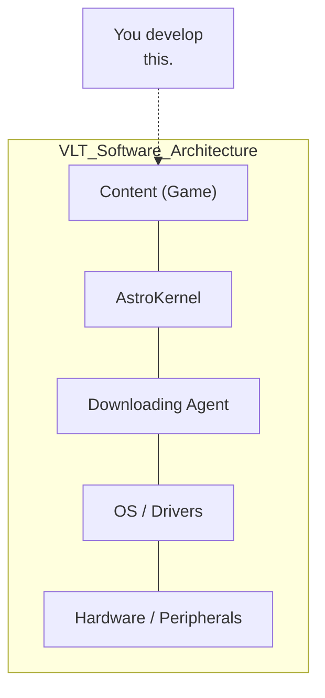

### 1.2.1 Downloading agent

The process is launched at the beginning of power cycle which handles tasks of downloading from repository of Venue server, installing and/or updating contents (games), checking software integrity, and eventually launching process "AstroKernel".

### 1.2.2 AstroKernel (AK)

Process "AstroKernel" is launched by Downloading agent. AstroKernel contains many modules to support contents (games) running, like process management, peripheral management, configurations/accounting/audit/game-play services, non-volatile RAM access, network communication, etc. AstroKernel exports the client-end programming interface, called "AK2API", for game programs to communicate with it.

Copyright © 2017-2022 By Astro Corp. All Rights Reserved. Page 13
The information in this document is confidential, it may not be reproduced, stored, copied or otherwise retrieved and/or recorded in any form in whole, or in part, nor may any of the information contained therein be disclosed.

Astro Game Development Kits - Programming Guide (BASE)
AstroGDK 3.2 (AK2API 1.8.7 for Italian VLT)
Astro

### 1.2.3 Content (Downloadable content / Game)

A content is a software program with related data. It must be packaged and published by Content packager utility first, and then downloaded to VLT by Downloading agent.

Contents of Astro Game System are classified into types of **Game**, **Attendant function**, **Game lobby**, **Attendant lobby**, and **Modules**. The documentation focuses only on Game-type content.

Content is launched by AK as a child process. AK and child process communicate with each other through inter-process communication (IPC / JSON). The process "Game lobby" will always exist with none or at most one content process run at the same time. For example when a player selects a game icon, the process "Game lobby" will be put to background (inactive) and launch the process of selected game.

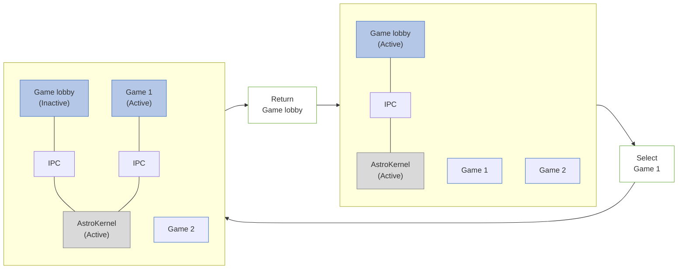

Copyright © 2017-2022 By Astro Corp. All Rights Reserved. Page 14
The information in this document is confidential, it may not be reproduced, stored, copied or otherwise retrieved and/or recorded in any form in whole, or in part, nor may any of the information contained therein be disclosed.

Astro Game Development Kits - Programming Guide (BASE)
AstroGDK 3.2 (AK2API 1.8.7 for Italian VLT)
Astro

## 1.3 VLT Hardware Specification

VLT hardware is a rigid cabinet containing modern x86 motherboard and attached peripherals.
The basic specification below:

### Logic Unit Type 1: Astro H61 (Obsolete)

<table>
  <tbody>
    <tr>
        <td>Item</td>
        <td>Specification</td>
    </tr>
    <tr>
        <th>Motherboard</th>
        <th>Jetway H61, Intel 64-bit CPU, 2 cores, Celeron 1620</th>
    </tr>
    <tr>
        <th>RAM</th>
        <th>DDR3, 4 GB</th>
    </tr>
    <tr>
        <th>Graphics</th>
        <th>Graphics engine: nVidia GT1030 or later, 2GB video RAM</th>
    </tr>
    <tr>
        <th>Audio</th>
        <th>Onboard 5.1 channels audio, Realtek ALC662</th>
    </tr>
    <tr>
        <th>Network</th>
        <th>Onboard 100/1000Mb Ethernet, Realtek RTL8111EVL</th>
    </tr>
    <tr>
        <th>Storage</th>
        <th>Industrial grade SATA2 SSD, 128GB.</th>
    </tr>
    <tr>
        <th>Upper Monitor</th>
        <th>Wide screen monitor, 22'' 16:10, 1680x1050</th>
    </tr>
    <tr>
        <th>Lower Monitor</th>
        <th>Wide screen monitor, 22'' 16:10, 1680x1050<br/>Capacitive touch screen (3M touch system)</th>
    </tr>
    <tr>
        <th>Effect Lamp / Display</th>
        <th>(Optional) Single color lamp<br/>(Image of a red dome light on a cabinet)</th>
    </tr>
    <tr>
        <th>Buttons and backlights</th>
        <th>(Depend on market) 8 buttons with individual backlights.</th>
    </tr>
    <tr>
        <th>Key switches</th>
        <th>(Depend on market),<br/>1 key switch used to enter attendant menu.<br/>(Image of a key and lock)</th>
    </tr>
    <tr>
        <th>Payment devices</th>
        <th>(Depend on market) Banknote, TITO</th>
    </tr>
    <tr>
        <th>Speakers / Amplifier</th>
        <th>The stereo speakers with external amplifier and volume control knobs.</th>
    </tr>
  </tbody>
</table>

> [!IMPORTANT]
> Note! Astro H61 will be phased out and we will be putting focus on PSM G920 on.

### Logic Unit Type 2: PSM G920 Production PC

<table>
  <tbody>
    <tr>
        <td>Item</td>
        <td>Specification</td>
    </tr>
    <tr>
        <th>Motherboard</th>
        <th>PSM G920, AMD GX-217GI APU, dual cores, up to 2.0GHz</th>
    </tr>
    <tr>
        <th>RAM</th>
        <th>DDR4, 8 GB</th>
    </tr>
    <tr>
        <th>Graphics</th>
        <th>Graphics engine: AMD RADEON R6E, video RAM shared with system memory</th>
    </tr>
    <tr>
        <th>Audio</th>
        <th>2 channels audio stereo</th>
    </tr>
    <tr>
        <th>Network</th>
        <th>Onboard 100/1000Mb Ethernet</th>
    </tr>
    <tr>
        <th>Storage</th>
        <th>SSD, 120GB.</th>
    </tr>
    <tr>
        <th>Upper Monitor</th>
        <th>Wide screen monitor, 24'' 16:9, 1920x1080 (FHD)</th>
    </tr>
  </tbody>
</table>

Copyright © 2017-2022 By Astro Corp. All Rights Reserved. Page 15
The information in this document is confidential, it may not be reproduced, stored, copied or otherwise retrieved and/or recorded in any form in whole, or in part, nor may any of the information contained therein be disclosed.

Astro Game Development Kits - Programming Guide (BASE)
AstroGDK 3.2 (AK2API 1.8.7 for Italian VLT)
Astro

<table>
  <tbody>
    <tr>
        <td>Lower Monitor</td>
        <td>Wide screen monitor, 24’’ 16:9, 1920x1080 (FHD)<br/>Projected capacitive touch screen (PCAP) (3M touch system)</td>
    </tr>
    <tr>
        <td>Effect Lamp / Display</td>
        <td>(Optional) LED strips (RGB color) around monitors. [The image shows a monitor with a blue glowing border.]</td>
    </tr>
    <tr>
        <td>Buttons and backlights</td>
        <td>(Depend on market) 8 buttons with individual backlights.</td>
    </tr>
    <tr>
        <td>Key switches</td>
        <td>(Depend on market),<br/>1 key switch used to enter attendant menu. [The image shows a set of keys and a lock cylinder.]</td>
    </tr>
    <tr>
        <td>Payment devices</td>
        <td>(Depend on market) Banknote, TITO</td>
    </tr>
    <tr>
        <td>Speakers / Amplifier</td>
        <td>The stereo speakers with external amplifier and volume control knobs.</td>
    </tr>
  </tbody>
</table>

Figure: Cabinets in Italy VLT market currently (Model name, Logic unit):

*   **ST_D22G (Astro H61)**: An upright cabinet with two screens, a "GAMEMAX VLT" topper, and a "VLT VIDEO LOTTERY TERMINAL" panel below the button deck.
*   **MYVLT (PSM G920)**: A tall upright cabinet with three screens. The top screen displays "Sisal", and the base features "NEXT" branding.
*   **SG (PSM G920)**: A slim upright cabinet with two screens and "SG GAMING" branding on the lower front panel.
*   **SLANT-TOP (PSM G920)**: A cabinet with an angled lower section for seated play, featuring a chrome-style trim.
*   **STORM (PSM G920)**: A modern upright cabinet with a red and black color scheme and two screens.

Copyright © 2017-2022 By Astro Corp. All Rights Reserved. Page 16
The information in this document is confidential, it may not be reproduced, stored, copied or otherwise retrieved and/or recorded in any form in whole, or in part, nor may any of the information contained therein be disclosed.

Astro Game Development Kits - Programming Guide (BASE)
AstroGDK 3.2 (AK2API 1.8.7 for Italian VLT)
Astro

## 1.4 Game Runtime Specification

A VLT runs 64-bit Linux embedded operation system, with plenty of drivers and 32/64-bit libraries pre-installed and configured. A game must understand the runtime environment and may directly refer to these resources without the need of additional files along with the game package.

In point of view of game design (Table 1.4-1):

<table>
  <tbody>
    <tr>
        <td>Item</td>
        <td>Specification</td>
    </tr>
    <tr>
        <th>Video resolution</th>
        <th>Two monitors each with resolution 1680x1050, or 1920x1080.<br/>Arrange in upper (top) and lower (bottom). So totally logic resolution is 1680x2100 (old Astro H61, and some of future cabinets), or 1920x2160 (PSM G920 SG/MYVLT).<br/><br/>&gt; **Note!** Always keep in mind that it's possible to have different resolutions for different types of cabinets. Only guarantee that same resolutions in both monitors.</th>
    </tr>
    <tr>
        <th>Binary format</th>
        <th>Suggested to be in form of 32-bit ELF (ELF32), or 64-bit ELF64.<br/>(From AstroGDK 2.7, it provides experimental 64-bit libak2api_64.so for linking, so 64-bit ELF64 binary is supported.)</th>
    </tr>
    <tr>
        <th>2D or 3D</th>
        <th>Support 2D and 3D hardware (nVidia / AMDGPU / OpenGL). So 3D games are welcome.</th>
    </tr>
    <tr>
        <th>Audio</th>
        <th>May use up to 5.1 audio channels.</th>
    </tr>
    <tr>
        <th>Private storage</th>
        <th>Two game-dependent storages:<br/>(1) a block of NVRAM buffer (8K bytes) to store non-volatile data.<br/>(2) a private directory in hard disk (HDD or SDD) to store data.<br/>Except above, game process must not access any other directories and storages.</th>
    </tr>
    <tr>
        <th>Touch panel</th>
        <th>Touch panel covers only the lower (bottom) monitor.<br/>A player can click, double-click, press/move/release on the touch panel as input event.</th>
    </tr>
    <tr>
        <th>Jackpot</th>
        <th>No central jackpot supported for the time being.</th>
    </tr>
    <tr>
        <th>Payment</th>
        <th>Game must not handle the payment.<br/>Payment activities are totally handled by AstroKernel and Game lobby.</th>
    </tr>
  </tbody>
</table>

Copyright © 2017-2022 By Astro Corp. All Rights Reserved. Page 17
The information in this document is confidential, it may not be reproduced, stored, copied or otherwise retrieved and/or recorded in any form in whole, or in part, nor may any of the information contained therein be disclosed.

Astro Game Development Kits - Programming Guide (BASE)
AstroGDK 3.2 (AK2API 1.8.7 for Italian VLT)
Astro

<table>
  <tbody>
    <tr>
        <td rowspan="2">Physical buttons layout (Sisal)</td>
        <td colspan="6">TICKET OUT (Pink)</td>
        <td>MENÙ (Green)</td>
        <td>AUTOSTART (Blue)</td>
        <td>RACCOGLI (Blue)</td>
        <td>MIN BET (Blue)</td>
        <td>MAX BET (Red)</td>
    </tr>
    <tr>
        <td colspan="3">START (Red)</td>
        <td colspan="3">START (Red)</td>
        <td colspan="5"></td>
    </tr>
  </tbody>
</table>

Each physical button has its backlight behind which is able to be in state of ON or OFF.
Some cabinet would support physical button CYCLE BET.

<table>
  <thead>
    <tr>
        <th>Virtual Buttons (key id) and Backlights (light id) Mapping</th>
        <th>Virtual buttons (key id)</th>
        <th>Virtual backlights (light id)</th>
        <th>Physical buttons</th>
    </tr>
  </thead>
  <tbody>
    <tr>
        <td rowspan="8"></td>
        <td>payout</td>
        <td>payout</td>
        <td>TICKET OUT</td>
    </tr>
    <tr>
        <td>menu</td>
        <td>menu</td>
        <td>MENÙ</td>
    </tr>
    <tr>
        <td>auto</td>
        <td>auto</td>
        <td>AUTOSTART</td>
    </tr>
    <tr>
        <td>take</td>
        <td>take</td>
        <td>RACCOGLI</td>
    </tr>
    <tr>
        <td>min_bet</td>
        <td>min_bet</td>
        <td>MIN BET (optional)</td>
    </tr>
    <tr>
        <td>max_bet</td>
        <td>max_bet</td>
        <td>MAX BET</td>
    </tr>
    <tr>
        <td>cycle_bet</td>
        <td>cycle_bet</td>
        <td>CYCLE BET (optional)</td>
    </tr>
    <tr>
        <td>start</td>
        <td>start</td>
        <td>START</td>
    </tr>
  </tbody>
</table>

> ! Note! Physical buttons CYCLE BET (cycle_bet) and / or MIN BET (min_bet) may be optionally available by different types of cabinets.

The specification of runtime libraries/modules listed below:
**On both Logic Units - Astro H61 and PSM G920 (Table 1.4-2)**

<table>
  <thead>
    <tr>
        <th>Item</th>
        <th>Specification</th>
    </tr>
  </thead>
  <tbody>
    <tr>
        <td rowspan="2">Operating System &amp; Kernel</td>
        <td>CentOS 7, 64-bit</td>
    </tr>
    <tr>
        <td>Kernel 4.18.5 (patched and customized)</td>
    </tr>
    <tr>
        <td></td>
        <td>! Note! Operating system and libraries of Astro H61 was upgraded to CentOS 7 64-bit totally the same with of PSM G920 from AstroGS/AstroGDK version 2.0.</td>
    </tr>
    <tr>
        <td>Basic Libraries</td>
        <td>All basic libraries are 32-bit and 64-bit versions included.</td>
    </tr>
    <tr>
        <td></td>
        <td>glibc.so.6 (GLIBC_2.17), libstdc++ 6.0.20 (GLIBCXX_3.4.20) (including libstdc++.so.5)</td>
    </tr>
    <tr>
        <td></td>
        <td>zlib 1.2.7, bzip2 1.0.6, json-c 0.11/0.13, tinyxml, libffi-5.0.6/6.0.1 ...</td>
    </tr>
    <tr>
        <td>Script Runtimes</td>
        <td>Bash 4.2.46, Python 2.6(32-bit/default), Python 2.7(64-bit), Perl 5.16.3, Lua 5.1.4</td>
    </tr>
  </tbody>
</table>

Copyright © 2017-2022 By Astro Corp. All Rights Reserved. Page 18
The information in this document is confidential, it may not be reproduced, stored, copied or otherwise retrieved and/or recorded in any form in whole, or in part, nor may any of the information contained therein be disclosed.

Astro Game Development Kits - Programming Guide (BASE)
AstroGDK 3.2 (AK2API 1.8.7 for Italian VLT)
Astro

<table>
  <tbody>
    <tr>
        <td>OS Utilities</td>
        <td>grep, awk, sed, sha*sum, tee, cut, diff, dd, vi, bzip2, etc.</td>
    </tr>
    <tr>
        <td>Video Libraries</td>
        <td>**All essential video libraries are 32-bit and 64-bit versions included.**<br/>OpenGL API 4.5 (see below Item ‘OpenGL’ for detail),<br/>GLX version 1.4<br/>glib2-2.54.2, libX11-1.6.5, libXft-2.3.2, libXrandr-1.5.1, libavcodec.so.52/56<br/>Xvidcore-1.3.4, libudev1-219, libjpeg-turbo-1.2.90, libpng-1.5.13, libpng12-1.2.50,<br/>libwayland-client-1.14.0, libwayland-cursor-1.14.0, libxkbcommon-0.7.1, ffmpeg 2.8.11,<br/>libGLEW 1.10.0/1.9.0<br/>Mesa lib 17.2.3 (dri, libGL, libGLU 9.0, libGLES, libwayland-egl, libgbm, filesystem)<br/>SDL 1.2.15 (ttf 2.0.11, mixer 1.2.12, image 1.2.12, gfx 2.0.24, net 1.2.8)<br/>SDL2 2.0.9 (ttf 2.0.14, gfx 1.0.3, mixer 2.0.4, net 2.0.1, image 2.0.4)<br/>freetype-2.4.11, fontconfig-2.10.95</td>
    </tr>
    <tr>
        <td>Audio Libraries</td>
        <td>**All essential audio libraries are 32-bit and 64-bit versions included.**<br/>ALSA audio driver 1.1.4 (with ALSA to OSS plugin)<br/>alsa-lib-1.1.4, alsa-plugins-oss-1.1.1, pulseaudio-10.0, jack-audio 1.9.9, openal-soft-1.16.0</td>
    </tr>
    <tr>
        <td>Video/Audio</td>
        <td>Utility mpv 0.29 (/usr/bin/mpv) (Please refer to Section 3.8.5 for detail)</td>
    </tr>
    <tr>
        <td>HW decoder</td>
        <td>The video hardware decode is based on VDPAU API by default.<br/>Format for HW decode: MPEG-4 part 2, H.264/MPEG4 AVC, VC-1, H.265 HEVC.</td>
    </tr>
    <tr>
        <td>OpenGL<br/>for Astro H61</td>
        <td>OpenGL version string: 4.5 (4.5.0 NVIDIA 410.78)<br/>OpenGL shading language version string: 4.50 NVIDIA<br/>OpenGL extensions:<br/>&amp;nbsp;&amp;nbsp;GL_AMD_multi_draw_indirect, GL_AMD_seamless_cubemap_per_texture,<br/>&amp;nbsp;&amp;nbsp;GL_AMD_vertex_shader_viewport_index, GL_AMD_vertex_shader_layer,<br/>&amp;nbsp;&amp;nbsp;GL_ARB_arrays_of_arrays, GL_ARB_base_instance, GL_ARB_bindless_texture,<br/>&amp;nbsp;&amp;nbsp;GL_ARB_blend_func_extended, GL_ARB_buffer_storage,<br/>&amp;nbsp;&amp;nbsp;GL_ARB_clear_buffer_object, GL_ARB_clear_texture, GL_ARB_clip_control,<br/>&amp;nbsp;&amp;nbsp;GL_ARB_color_buffer_float, GL_ARB_compatibility,<br/>&amp;nbsp;&amp;nbsp;GL_ARB_compressed_texture_pixel_storage, GL_ARB_conservative_depth,<br/>&amp;nbsp;&amp;nbsp;. . .<br/>&amp;nbsp;&amp;nbsp;GL_NV_vertex_program2_option, GL_NV_vertex_program3,<br/>&amp;nbsp;&amp;nbsp;GL_NV_viewport_array2, GL_NV_viewport_swizzle, GL_NVX_conditional_render,<br/>&amp;nbsp;&amp;nbsp;GL_NVX_gpu_memory_info, GL_NVX_nvenc_interop, GL_NV_shader_thread_group,<br/>&amp;nbsp;&amp;nbsp;GL_NV_shader_thread_shuffle, GL_KHR_blend_equation_advanced,<br/>&amp;nbsp;&amp;nbsp;GL_KHR_blend_equation_advanced_coherent, GL_SGIS_generate_mipmap,<br/>&amp;nbsp;&amp;nbsp;GL_SGIS_texture_lod, GL_SGIX_depth_texture, GL_SGIX_shadow,<br/>&amp;nbsp;&amp;nbsp;GL_SUN_slice_accum<br/><br/>(Get complete information by command: `glxinfo -v`)<br/>(Please keep in mind, the physical video RAM may be 2GB or more, usually 2GB)</td>
    </tr>
    <tr>
        <td>OpenGL<br/>for PSM G920</td>
        <td>OpenGL version string: 4.5 (AMD CARRIZO, DRM 3.26, HD8000)<br/>OpenGL shading language version string: 4.50<br/>OpenGL extensions:<br/>&amp;nbsp;&amp;nbsp;GL_AMD_conservative_depth, GL_AMD_draw_buffers_blend,<br/>&amp;nbsp;&amp;nbsp;GL_AMD_performance_monitor, GL_AMD_pinned_memory,<br/>&amp;nbsp;&amp;nbsp;GL_AMD_seamless_cubemap_per_texture, GL_AMD_shader_stencil_export,</td>
    </tr>
  </tbody>
</table>

Copyright © 2017-2022 By Astro Corp. All Rights Reserved. Page 19
The information in this document is confidential, it may not be reproduced, stored, copied or otherwise retrieved and/or recorded in any form in whole, or in part, nor may any of the information contained therein be disclosed.

Astro Game Development Kits - Programming Guide (BASE)
AstroGDK 3.2 (AK2API 1.8.7 for Italian VLT)
Astro

<table>
  <tbody>
    <tr>
        <td rowspan="2"></td>
        <td>GL_AMD_shader_trinary_minmax, GL_AMD_vertex_shader_layer,<br/>GL_AMD_vertex_shader_viewport_index, GL_ANGLE_texture_compression_dxt3,<br/>GL_ANGLE_texture_compression_dxt5, GL_ARB_ES2_compatibility,<br/>GL_ARB_ES3_1_compatibility, GL_ARB_ES3_2_compatibility,<br/>. . .<br/>GL_EXT_texture_sRGB_decode, GL_EXT_texture_shared_exponent,<br/>GL_EXT_texture_snorm, GL_EXT_texture_swizzle, GL_EXT_timer_query,<br/>GL_EXT_transform_feedback, GL_EXT_vertex_array_bgra,<br/>GL_IBM_multimode_draw_arrays, GL_KHR_context_flush_control, GL_KHR_debug,<br/>GL_KHR_no_error, GL_KHR_robust_buffer_access_behavior, GL_KHR_robustness,<br/>GL_MESA_pack_invert, GL_MESA_shader_integer_functions,<br/>GL_MESA_texture_signed_rgba, GL_NVX_gpu_memory_info,<br/>GL_NV_conditional_render, GL_NV_depth_clamp, GL_NV_packed_depth_stencil,<br/>GL_NV_texture_barrier, GL_NV_vdpau_interop, GL_OES_EGL_image, GL_S3_s3tc<br/><br/>(Get complete information by command: `glxinfo -v`)</td>
    </tr>
    <tr>
        <td>X11</td>
        <td>Xfce4 X-window manager and desktop;<br/>xorg.conf is configured to use a single video buffer to cover two monitors;<br/>Coordinates of video buffer is “(0, 0)” to “(1919, 2159) or (1679, 2099)” (below figure);<br/>Game process must run in **NON-EXCLUSIVE WINDOW MODE**. Exclusive full-screen mode is prohibited.</td>
    </tr>
    <tr>
        <td>Video buffer Mapping (xorg.conf)</td>
        <td rowspan="2">The image illustrates the video buffer mapping for a dual-monitor setup. It shows a large rectangular "Video buffer (Logic view 1680x2100 or 1920x2160)" represented by a dashed blue border. Inside this buffer, two physical monitors are stacked vertically on the left side: an "Upper monitor" and a "Lower monitor (with Touch panel)". The coordinate (0, 0) is marked at the top-left corner of the logic view, with a red dashed arrow pointing towards the bottom-right corner of the buffer area.</td>
    </tr>
    <tr>
        <td colspan="2">! Note! It’s possible to have different physical resolutions for different types of cabinets. So resolution of the Video buffer would be also different.</td>
    </tr>
    <tr>
        <td>Network</td>
        <td>(none)</td>
    </tr>
    <tr>
        <td>Buttons input</td>
        <td>AK2API (AstroKernel) only</td>
    </tr>
    <tr>
        <td>Touch input</td>
        <td>AK2API (AstroKernel), or just read mouse pointer (e.g. XLib) from system.</td>
    </tr>
    <tr>
        <td>NVRAM access</td>
        <td>AK2API (AstroKernel) only</td>
    </tr>
    <tr>
        <td>Configurations information</td>
        <td>AK2API (AstroKernel) only</td>
    </tr>
    <tr>
        <td>Payment</td>
        <td>AK2API (AstroKernel) only</td>
    </tr>
  </tbody>
</table>

Copyright © 2017-2022 By Astro Corp. All Rights Reserved. Page 20
The information in this document is confidential, it may not be reproduced, stored, copied or otherwise retrieved and/or recorded in any form in whole, or in part, nor may any of the information contained therein be disclosed.

Astro Game Development Kits - Programming Guide (BASE)
AstroGDK 3.2 (AK2API 1.8.7 for Italian VLT)
Astro

<table>
  <tbody>
    <tr>
        <td>Virtual memory</td>
        <td>12GB maximum<br/>(Please assume the physical RAM is usually 4GB only)</td>
    </tr>
  </tbody>
</table>

> [!IMPORTANT]
> *On both types of logic units Astro H61 and PSM G920, there are totally the same software environments except few drivers especially the video/audio ones. But if applying some libraries like OpenGL / SDL, etc., may basically ignore the differences.*

Copyright © 2017-2022 By Astro Corp. All Rights Reserved. Page 21
The information in this document is confidential, it may not be reproduced, stored, copied or otherwise retrieved and/or recorded in any form in whole, or in part, nor may any of the information contained therein be disclosed.

Astro Game Development Kits - Programming Guide (BASE)
AstroGDK 3.2 (AK2API 1.8.7 for Italian VLT)
Astro

## 1.5 AstroGDK Architecture

### 1.5.1 What is AstroGDK

Astro Game Development Kits (AstroGDK) provides a pure software environment including header files, libraries, samples, toolkits, simulator, and documents, for developer to develop and test games on both Windows and Linux operation systems.

With AstroGDK, you can develop and test game on your own Windows PC, called Developer's Windows machine (Win box), or directly on a Linux machine. **Note, a real VLT (VLT box), no matter Astro H61 or PSM G920, is always a Linux machine, so any VLT game must eventually be built and run in Linux.** To build and test on Linux may use Linux development virtual machine (Linux VM), or a physical one, the Linux development machine (Linux box). The Linux VM and Linux box made and provided by Astro Corp. both contain the same essential build tools and libraries. And their software environment and Linux box's hardware environment are almost the same with a real VLT box. The differences between Linux box and VLT box will be described in later Section 1.5.3.

Linux VM is new from AstroGDK version 2.0. It is in form of VMware image and is a complete virtual version of Linux box except very few differences on hardware drivers and configurations. It provides a pure-software Linux development environment. Developer may build and run game software on Linux VM first before running it on physical Linux box for saving money and time. In this document, "Linux development environment" includes Linux box and Linux VM.

> **Note! Astro VLT runs Linux OS, so any VLT game must eventually be built and run on Linux. A programmer can develop VLT games completely under Linux environment disregarding any Windows stuff.**

> **Q: Should I make the game able to run in Window and Linux both? Why AstroGDK provides support of game development in Windows platform?**
>
> **A: You do NOT need to develop Windows-version game. Linux-version one is enough. It's OK for you to totally ignore support of Windows platform.**
>
> The reason AstroGDK provides this support is that in our experience, practically speaking, majority of programmers are familiar to develop and debug software in Windows platform, e.g. Visual Studio. Also, it's easier for prototyping and implementing the design concept of game in early stage.

Copyright © 2017-2022 By Astro Corp. All Rights Reserved. Page 22
The information in this document is confidential, it may not be reproduced, stored, copied or otherwise retrieved and/or recorded in any form in whole, or in part, nor may any of the information contained therein be disclosed.

Astro Game Development Kits - Programming Guide (BASE)
AstroGDK 3.2 (AK2API 1.8.7 for Italian VLT)
Astro

### 1.5.2 Development Model

The basic principle about development model with Win box and Linux box (Linux VM) is that the game projects and AstroGDK are put in the Win box, and configure the root folder of game projects and AstroGDK as share folder beforehand, and then the Linux box (Linux VM) mounts that share folder to its local directory. So tools and utilities run in Linux box (Linux VM) can access all stuff of game projects and AstroGDK, and also produce outputs to Win box.

This development model keeps the Linux box (Linxu VM) simple and pure, because you don’t need to copy game projects and AstroGDK files to Linux box. All project-dependent files and outputs are stored in Win box, not in the Linux box, so a developer can just sit by the Win box to do almost all development jobs. It will also be convenient to install or update the new version of game projects and / or AstroGDK, without modifying Linux box anymore. Please refer to Section 2.3 and 2.4 for detail of setup of cooperation. Below figures describe the concept:

```mermaid
graph LR
    subgraph Win_box [Win box]
        direction TB
        P1[Physical game projects<br/>and AstroGDK here]
        subgraph Win_Files [MyProjects\]
            A1[AstroGDK\]
            M1[my_game_project1\]
            M2[my_game_project2\]
            D1[...]
        end
    end

    subgraph Linux_box [Linux box]
        direction TB
        P2[Mapping / View to remote]
        subgraph Linux_Files [MyProjects\]
            A2[AstroGDK\]
            M3[my_game_project1\]
            M4[my_game_project2\]
            D2[...]
        end
    end

    Win_Files <-->|Network<br/>Neighborhood<br/>(CIFS), or<br/>NFS| Linux_Files
```
*Figure – Cooperation between Win box and Linux box (Section 2.3)*

```mermaid
graph LR
    subgraph Win_box_VM [Win box]
        direction TB
        P3[Physical game projects<br/>and AstroGDK here]
        subgraph Win_Files_VM [MyProjects\]
            A3[AstroGDK\]
            M5[my_game_project1\]
            M6[my_game_project2\]
            D3[...]
        end
        
        subgraph Linux_VM [Linux VM]
            direction TB
            P4[Mapping / View to host OS]
            subgraph VM_Files [MyProjects\]
                A4[AstroGDK\]
                M7[my_game_project1\]
                M8[my_game_project2\]
                D4[...]
            end
        end
    end

    Win_Files_VM <-->|Share<br/>Folders<br/>(VMware)| VM_Files
```
*Figure – Cooperation between Win box and Linux VM (Section 2.4)*

Copyright © 2017-2022 By Astro Corp. All Rights Reserved. Page 23
The information in this document is confidential, it may not be reproduced, stored, copied or otherwise retrieved and/or recorded in any form in whole, or in part, nor may any of the information contained therein be disclosed.

Astro Game Development Kits - Programming Guide (BASE)
AstroGDK 3.2 (AK2API 1.8.7 for Italian VLT)
Astro

> ! Development model described here is just for your reference. You may refer to it or just use your own.

### 1.5.3 Differences between Linux Box and VLT Box

Compare the Linux box and the VLT box, that hardware specifications are totally the same, both contain SSD, TPM, and PSM IO. Compare the Linux box or Linux VM with the VLT box, most of software specifications are also the same, with several differences about OS, development environment, and security mechanism. Concept in below graph:

<table>
  <thead>
    <tr>
        <th>VLT box</th>
        <th>Shared Components</th>
        <th>Linux box / VM</th>
    </tr>
  </thead>
  <tbody>
    <tr>
        <td>Embedded Linux OS</td>
        <td>Libraries</td>
        <td>Full Linux OS</td>
    </tr>
    <tr>
        <td>VPN/Security</td>
        <td>Configurations</td>
        <td>Build /debug environment.</td>
    </tr>
    <tr>
        <td>Downloading agent</td>
        <td>File systems</td>
        <td></td>
    </tr>
    <tr>
        <td></td>
        <td>Drivers</td>
        <td></td>
    </tr>
    <tr>
        <td></td>
        <td>AstroKernel</td>
        <td></td>
    </tr>
  </tbody>
</table>

Figure: Comparison of software between VLT box v.s. Linux box

Copyright © 2017-2022 By Astro Corp. All Rights Reserved. Page 24
The information in this document is confidential, it may not be reproduced, stored, copied or otherwise retrieved and/or recorded in any form in whole, or in part, nor may any of the information contained therein be disclosed.

Astro Game Development Kits - Programming Guide (BASE)
AstroGDK 3.2 (AK2API 1.8.7 for Italian VLT)
Astro

### 1.5.4 Programming Interface "AK2API"

As mentioned above, AstroKernel exports the client-end programming interface, called "AK2API", for game programs to communicate with it. So in other words, the core concept of AstroGDK is to provide definitions and supports about the interface. You may see the header file "ak2api.h" which is inside the AstroGDK for detail.

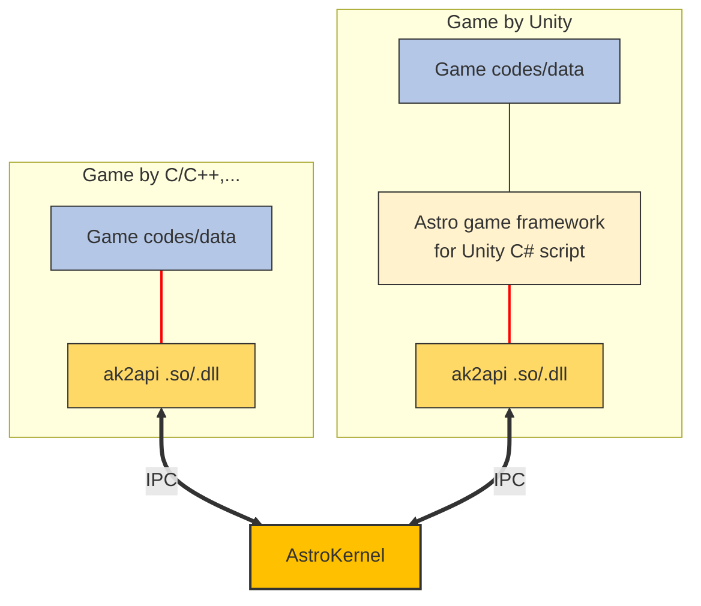

"AK2API" doesn't provide some other functions that a game usually must have, like graphics, audio, compression, thread, etc. You must prepare them by yourself. In other words, you may use your familiar and/or favorite game engine / framework to provide those functions. Note, if you intend to develop game in both operation systems, you must also handle the cross-platform issues.

### 1.5.5 Development Languages and Environments

The "AK2API" is totally written in C language, and is implemented and provided in form of dynamic shared object (.so/.dll), named **libak2api.so (ak2api.dll)** and **libak2api_64.so**, the latter is for 64-bit binary. So theoretically speaking, a programming language can be used to develop games with AstroGDK if it can be built into 32-bit and 64-bit Linux runtime executable binaries and can link with standard dynamic shared object (.so). For example, programming languages like C/C++, Java, Python, Node.js, C#(Mono), Go, Pascal(Delphi), Swift, etc. are all qualified. So we can say that wide-range languages can be used to develop games with AstroGDK.

Copyright © 2017-2022 By Astro Corp. All Rights Reserved. Page 25
The information in this document is confidential, it may not be reproduced, stored, copied or otherwise retrieved and/or recorded in any form in whole, or in part, nor may any of the information contained therein be disclosed.

Astro Game Development Kits - Programming Guide (BASE)
AstroGDK 3.2 (AK2API 1.8.7 for Italian VLT)
Astro

AstroGDK provides tools/libraries of both Windows and Linux operations systems, so a programmer can develop and run games under Windows and/or Linux for his habit and/or tools in hand. Note, as mentioned in Section 1.5.1, the game software eventually must be built and run under Linux before integrating into Astro game system, so you can skip all Windows-related stuff.

> **Note! AstroGDK and VLT provide 32-bit shared object libak2api.so (ak2api.dll) and 64-bit libak2api_64.so for game process to link.**
> **File libak2api_64.so is supported from Astro game system 2.7.**

### 1.5.6 Link to Dynamic Shared Object from Your Development Language

About how your programming language used in developing game links with dynamic shared object (.so), the **libak2api.so** (or 64-bit **libak2api_64.so**), please refer to the programming guide or reference manual of that language. Some reference links in below:

<table>
  <thead>
    <tr>
        <th>Language</th>
        <th>Reference links</th>
    </tr>
  </thead>
  <tbody>
    <tr>
        <td>C/C++</td>
        <td>https://www.cs.swarthmore.edu/~newhall/unixhelp/howto_C_libraries.html</td>
    </tr>
    <tr>
        <td>Java</td>
        <td>By JNI (Java Native Interface):<br/>http://learn-from-the-guru.blogspot.tw/2007/12/java-native-interface-jni-tutorial-hell.html</td>
    </tr>
    <tr>
        <td>Python</td>
        <td>By module ctyps:<br/>https://helloacm.com/calling-c-shared-library-from-python-code-linux-version/amp/</td>
    </tr>
    <tr>
        <td>Node.js</td>
        <td>There are several methods e.g. SWIG, Node FFI:<br/>http://www.swig.org/Doc3.0/Javascript.html#Javascript<br/>https://github.com/node-ffi/node-ffi/wiki/Node-FFI-Tutorial</td>
    </tr>
    <tr>
        <td>C#</td>
        <td>http://www.mono-project.com/docs/advanced/pinvoke/</td>
    </tr>
    <tr>
        <td>Go</td>
        <td>https://blog.golang.org/c-go-cgo</td>
    </tr>
    <tr>
        <td>Pascal</td>
        <td>http://ba.mirror.garr.it/mirrors/freepascal/docs-pdf/CinFreePascal-old.pdf</td>
    </tr>
    <tr>
        <td>Swift</td>
        <td>http://masteringswift.blogspot.tw/2016/02/swift-for-linux-part-2-using-c.html</td>
    </tr>
  </tbody>
</table>

Copyright © 2017-2022 By Astro Corp. All Rights Reserved. Page 26
The information in this document is confidential, it may not be reproduced, stored, copied or otherwise retrieved and/or recorded in any form in whole, or in part, nor may any of the information contained therein be disclosed.

Astro Game Development Kits - Programming Guide (BASE)
AstroGDK 3.2 (AK2API 1.8.7 for Italian VLT)
Astro

### 1.5.7 Link to Non-pre-installed Third-Party Runtime

If game program requires certain runtime / libraries which are not pre-installed in Linux box, must put the total stuff of runtime / libraries to be together with game release. For example, for game which applying NODE.js and NW.js (node-webkit) must put and organize all necessary files of NODE.js and NW.js to part of game release - below directory Distribution/ of game submission package.

> **Note!** *Put all files of non-pre-installed runtime/library together with your game release.*

Together-with-game-release may lead to a large-size game release but it will be simpler and reduces impact to total system.

AstroGDK maintenance team will consider integrating common-used and version-stable runtime / libraries into VLT disk in future system release.

### 1.5.8 Development Flow

The first thing is to set up the development environment (refer to Section 2), and then you can start to develop and test.

In our experience, usually develop, debug, and test game in Developer's Windows machine, and afterwards build to Linux execution binaries and test in Linux development machine. But this is not absolutely required. You can completely develop your game in Linux environment disregarding any Windows stuff. The most important thing is that your game program must access the client-interface "AK2API" (refer to Section 4), to be able to communicate with AstroKernel.

If requesting Game lobby can read icon picture to indicate this game and movie clips (for promotion) from your media files, must prepare them in proper format and location (refer to Doucment: Astro Game Development Kits - Game Submission for Integration Test.pdf).

After developing and testing in development environment done, next, is to package and then submit it to Astro Game System. You put your game execution binary with related stuff together in form of Game Submission Package (refer to Doucment: Astro Game Development Kits - Game Submission for Integration Test.pdf), and finally deliver it to operator or test laboratory.

Copyright © 2017-2022 By Astro Corp. All Rights Reserved. Page 27
The information in this document is confidential, it may not be reproduced, stored, copied or otherwise retrieved and/or recorded in any form in whole, or in part, nor may any of the information contained therein be disclosed.

Astro Game Development Kits - Programming Guide (BASE)
AstroGDK 3.2 (AK2API 1.8.7 for Italian VLT)
Astro

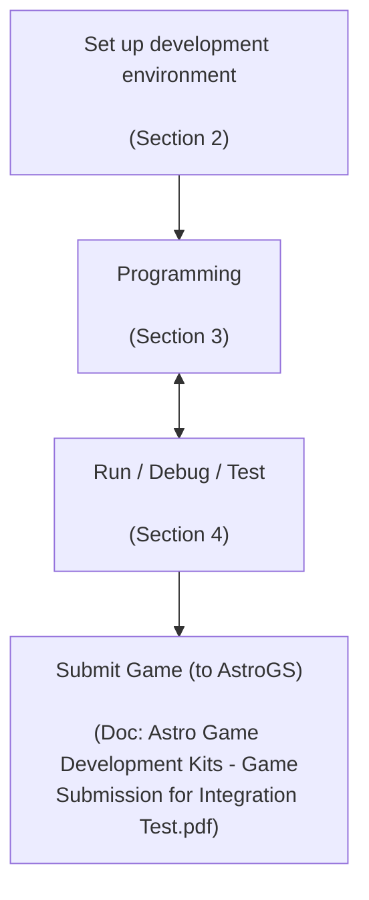

Copyright © 2017-2022 By Astro Corp. All Rights Reserved. Page 28
The information in this document is confidential, it may not be reproduced, stored, copied or otherwise retrieved and/or recorded in any form in whole, or in part, nor may any of the information contained therein be disclosed.

Astro Game Development Kits - Programming Guide (BASE)
AstroGDK 3.2 (AK2API 1.8.7 for Italian VLT)
Astro

# 2 Setup of Development Environment

This chapter describes how to set up game development environment with AstroGDK. The complete development environment includes two boxes, the first is your PC, the Developer's Windows machine (Win box), and the second is the Linux development machine (Linux box). Please refer to Section 1.5 beforehand to have a basic concept. From AstroGDK 2.0, Linux VM is provided which plays a virtual Linux box running on Win box for convenience.

With this setup, you can develop both Window-version and Linux-version games. According to Section 1.5.2 development model, even you develop only Linux-version game (because Astro Game System needs only Linux-version game), still suggest you to follow all below steps to construct both Win box and Linux box, and also install AstroGDK in Win box rather than directly install in Linux box.

## 2.1 Setup of Physical Devices and Connections
Sections from 2.1.1 to 2.1.6 describe the setup of Linux box. Section 2.1.7 describes Linux VM.

### 2.1.1 Minimum Requirement of Win Box
Minimum specification requirement of Developer's Windows machine as below:
* x86 processor (Intel Core i5 or i7 is recommended)
* 4GB RAM
* 1GB left of disk space before installing AstroGDK
* Windows 7 or later
* Ability of networking access

The image shows a standard desktop PC setup including a monitor displaying the Windows logo, a system unit, a keyboard, and a mouse.

### 2.1.2 Hardware Connections – Logic Unit Type I: Astro H61 (Obsolete)

The image on the left shows a top angle view of the Astro H61 logic unit, a rectangular metal chassis with ventilation grilles.

The image on the right shows the rear view and I/O ports of the Astro H61 logic unit with the following labels:
* **Touch Screen**: Serial port
* **Bill Acceptor**: Serial port
* **Ticket Printer**: Serial port
* **LAN**: Ethernet port
* **Speaker**: Audio jacks
* **Lower Monitor**: DVI port
* **Upper Monitor**: DisplayPort
* **USB R I/O**: Multiple USB ports

Figure: Top angle view
Figure: Rear view and I/O ports

Copyright © 2017-2022 By Astro Corp. All Rights Reserved. Page 29
The information in this document is confidential, it may not be reproduced, stored, copied or otherwise retrieved and/or recorded in any form in whole, or in part, nor may any of the information contained therein be disclosed.

Astro Game Development Kits - Programming Guide (BASE)
AstroGDK 3.2 (AK2API 1.8.7 for Italian VLT)
Astro

Depend on your purpose and availability of real peripherals, you may just use Linux box without attaching any real peripherals, or optionally attach one or more real peripherals and the others the virtual peripherals. The reference of peripherals and their corresponding virtual ones below:

<table>
  <tbody>
    <tr>
        <td>Physical device (default connection port)</td>
        <td>Corresponding virtual device</td>
    </tr>
    <tr>
        <th>Touch panel ( Serial port COM3)</th>
        <th>Mouse pointer and buttons (Section 4.4.2)</th>
    </tr>
    <tr>
        <th>Bill Acceptor (Serial port COM1)</th>
        <th>Keyboard (Section 4.4.1, 4.4.3)</th>
    </tr>
    <tr>
        <th>Ticket printer (Serial port COM2)</th>
        <th>NULL ticket printer (Section 4.4.3)</th>
    </tr>
    <tr>
        <th>Card reader (USB)</th>
        <th>NULL card reader / Keyboard</th>
    </tr>
    <tr>
        <th>Buttons / Sensors / Key switches (USB RIO)</th>
        <th>Keyboard (Section 4.4.1)</th>
    </tr>
    <tr>
        <th>Upper monitor (HDMI)</th>
        <th>(none)</th>
    </tr>
    <tr>
        <th>Lower monitor (DVI)</th>
        <th>(none)</th>
    </tr>
    <tr>
        <th>Speaker</th>
        <th>(none)</th>
    </tr>
  </tbody>
</table>

About specifications of above devices, may refer to Section 1.3 for detail.
Note, two monitors are essential for Linux box if requiring running game on it. Resolutions of both monitors must be the same with each other, but it is permitted to not be the same with the VLT if your game design and/or graphics programming consideration are flexible to be able to run in different types of resolutions. Linux box itself is able to adapt many sorts of resolutions of monitors, but requires two LCD monitors attached must be the same in native resolutions.

> [!IMPORTANT]
> Note! Both monitors attached to Linux box must be the same in native resolutions.

Examples of several connection types below:
* Case 1: Just for building (compile, link) game software only:

The diagram shows a **Win box** (PC with monitor, keyboard, and mouse) connected to a **Linux box** (rear view of a server/industrial PC) via a blue **UTP/RJ-45 Network cable**.

The Linux box rear panel includes labels for various ports:
* Touch Screen
* Bill Acceptor
* Ticket Printer
* Lower Monitor
* Upper Monitor
* Speaker
* USB R I/O

Copyright © 2017-2022 By Astro Corp. All Rights Reserved. Page 30
The information in this document is confidential, it may not be reproduced, stored, copied or otherwise retrieved and/or recorded in any form in whole, or in part, nor may any of the information contained therein be disclosed.

Astro Game Development Kits - Programming Guide (BASE)
AstroGDK 3.2 (AK2API 1.8.7 for Italian VLT)
Astro

*   Case 2: Building game software and run with virtual peripherals. (Mouse to simulate touch panel; Keyboard to simulate buttons, sensors, key switches, and money-in):

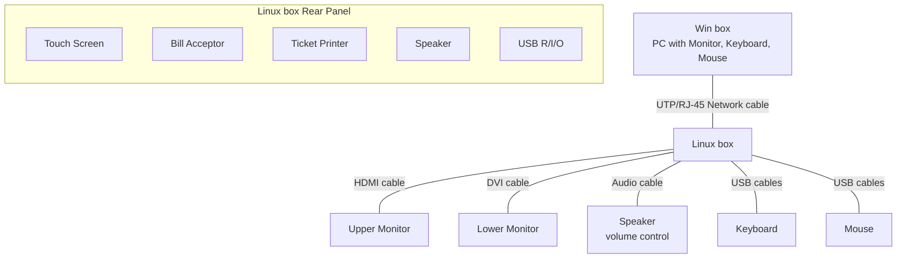

*   Case 3: Building game software and run with Touch panel and the others virtual peripherals.

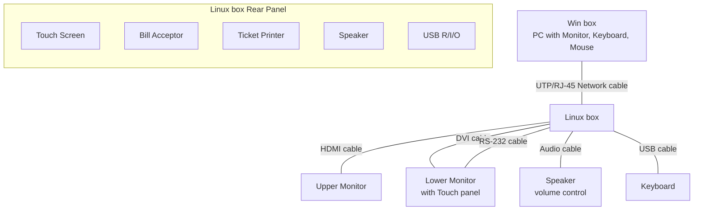

Copyright © 2017-2022 By Astro Corp. All Rights Reserved. Page 31
The information in this document is confidential, it may not be reproduced, stored, copied or otherwise retrieved and/or recorded in any form in whole, or in part, nor may any of the information contained therein be disclosed.

Astro Game Development Kits - Programming Guide (BASE)
AstroGDK 3.2 (AK2API 1.8.7 for Italian VLT)
Astro

*   Case 4: Building game software and run with Touch panel, Bill acceptor, and the others virtual peripherals.

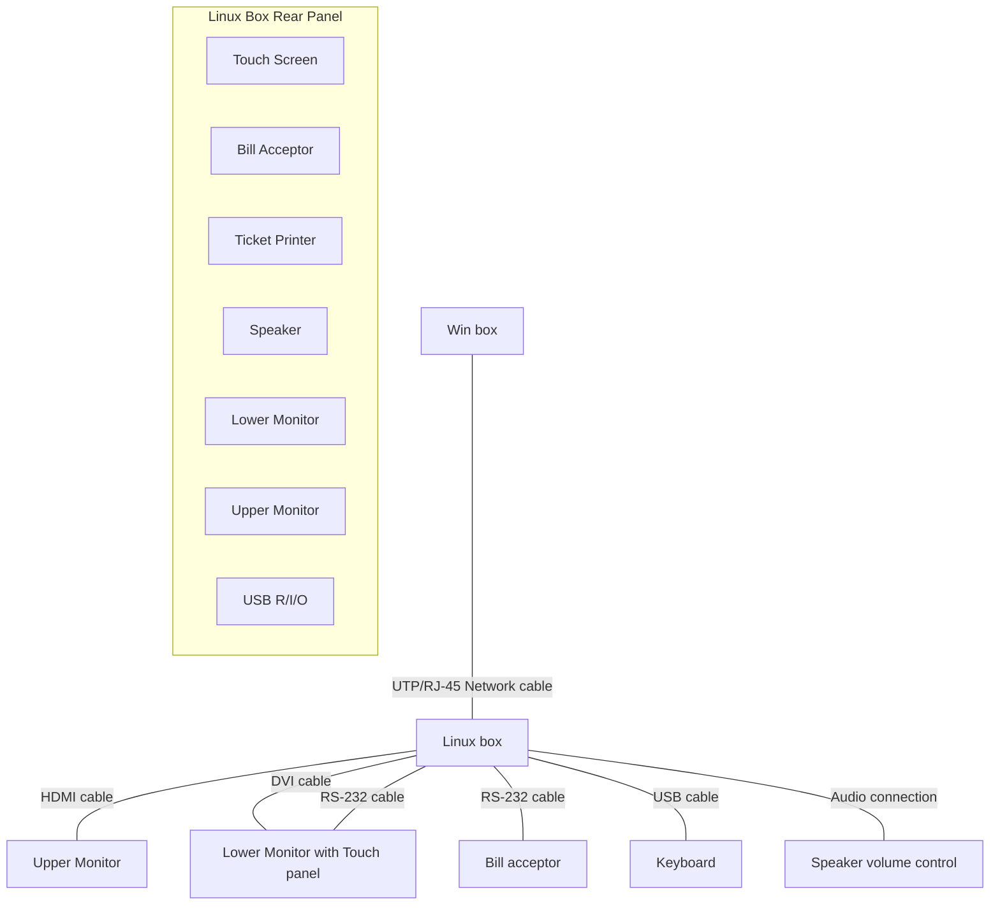

The diagram illustrates the hardware setup for Case 4, showing a Windows PC (Win box) connected via network to a Linux box. The Linux box serves as the central hub, connecting to:
*   **Speaker volume control**
*   **Upper Monitor** via HDMI cable.
*   **Lower Monitor with Touch panel** via DVI cable and RS-232 cable.
*   **Bill acceptor** via RS-232 cable.
*   **Keyboard** via USB cable.

It is also able to replace the VLT box inside the cabinet of VLT with the Linux box, or just replace the SSD, for development in a most real environment.

Copyright © 2017-2022 By Astro Corp. All Rights Reserved. Page 32
The information in this document is confidential, it may not be reproduced, stored, copied or otherwise retrieved and/or recorded in any form in whole, or in part, nor may any of the information contained therein be disclosed.

Astro Game Development Kits - Programming Guide (BASE)
AstroGDK 3.2 (AK2API 1.8.7 for Italian VLT)
Astro

### 2.1.3 Hardware Connections – Logic Unit Type II: PSM G920

The following images show the PSM G920 logic unit from different perspectives:

*   **Figure: Mounting view**: A 3D perspective view of the blue PSM G920 enclosure.
*   **Figure: Top view (I/O ports of peripherals)**: Shows the top panel with various ports labeled:
    *   POWER, PWR RST
    *   DP3, DP2 (LOWER Monitor), DP1 (UPPER Monitor)
    *   Touch Panel (USB ports)
    *   LAN 2 (eth0 DHCP), LAN 1 (eth1 Static/Debug)
    *   USB 3-4, USB 1-2
    *   Speaker, AUDIO
    *   COM4, COM3
    *   Bill Acceptor (COM1)
    *   Ticket Printer (COM2)
*   **Figure: Bottom view (GPIO)**: Shows the bottom panel with various connectors labeled:
    *   INPUT CN21
    *   OUTPUT CN26
    *   PWR OUT (LED strip)
    *   TAMPER
    *   CCT2, CCT1 (Coin acceptor)
    *   WEN, CNT, EXP

Depend on your purpose and availability of real peripherals, you may just use Linux box without attaching any real peripherals, or optionally attach one or more real peripherals and the others the virtual peripherals. The reference of peripherals and their corresponding virtual ones for PSM G920 below:

<table>
  <tbody>
    <tr>
        <td>Physical device (default connection port)</td>
        <td>Corresponding virtual device</td>
    </tr>
    <tr>
        <th>Touch panel (USB port (black color))</th>
        <th>Mouse pointer and buttons (Section 4.4.2)</th>
    </tr>
    <tr>
        <th>Bill Acceptor (Serial port COM1)</th>
        <th>Keyboard (Section 4.4.1, 4.4.3)</th>
    </tr>
    <tr>
        <th>Ticket printer (Serial port COM2)</th>
        <th>NULL ticket printer (Section 4.4.3)</th>
    </tr>
    <tr>
        <th>Coin Acceptor (CCT1)</th>
        <th>(none)</th>
    </tr>
    <tr>
        <th>Card reader (USB)</th>
        <th>NULL card reader / Keyboard</th>
    </tr>
    <tr>
        <th>Buttons / Sensors / Key switches (CN21,TAMPER)</th>
        <th>Keyboard (Section 4.4.1)</th>
    </tr>
    <tr>
        <th>Upper monitor (DP1)</th>
        <th>(none)</th>
    </tr>
    <tr>
        <th>Lower monitor (DP2)</th>
        <th>(none)</th>
    </tr>
    <tr>
        <th>Speaker</th>
        <th>(none)</th>
    </tr>
    <tr>
        <th>LED strip (PWR OUT / CN28)</th>
        <th>(none)</th>
    </tr>
  </tbody>
</table>
(Reference: “181004 – G920 Integration sheet v.1.02.pdf”)

Copyright © 2017-2022 By Astro Corp. All Rights Reserved. Page 33
The information in this document is confidential, it may not be reproduced, stored, copied or otherwise retrieved and/or recorded in any form in whole, or in part, nor may any of the information contained therein be disclosed.

Astro Game Development Kits - Programming Guide (BASE)
AstroGDK 3.2 (AK2API 1.8.7 for Italian VLT)
Astro

Example of connection type for PSM G920 below (Case 4):

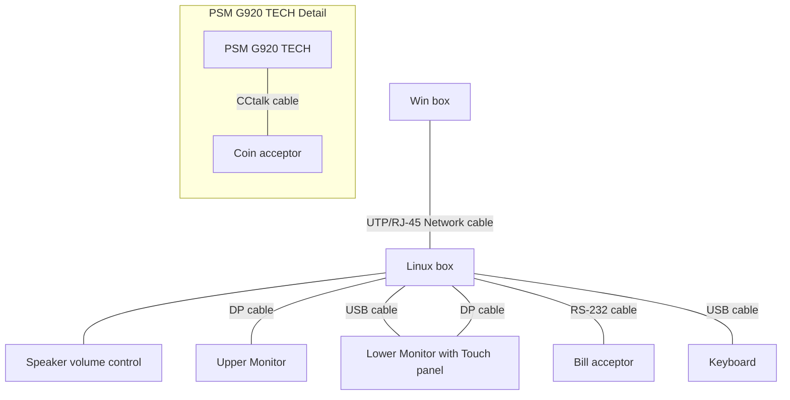

The diagram above illustrates the following connections:
*   **Win box** connects to the **Linux box** via a **UTP/RJ-45 Network cable**.
*   **Linux box** connects to:
    *   **Speaker volume control** (Audio connection).
    *   **Upper Monitor** via a **DP cable**.
    *   **Lower Monitor with Touch panel** via both a **USB cable** and a **DP cable**.
    *   **Bill acceptor** via an **RS-232 cable**.
    *   **Keyboard** via a **USB cable**.
*   The **PSM G920 TECH** unit (shown in detail at the bottom) connects to the **Coin acceptor** via a **CCtalk cable**.

Copyright © 2017-2022 By Astro Corp. All Rights Reserved. Page 34
The information in this document is confidential, it may not be reproduced, stored, copied or otherwise retrieved and/or recorded in any form in whole, or in part, nor may any of the information contained therein be disclosed.

Astro Game Development Kits - Programming Guide (BASE)
AstroGDK 3.2 (AK2API 1.8.7 for Italian VLT)
Astro

### 2.1.4 Configure the Networking

The networking parameters of Linux box must be configured correctly for that Win box can connect to it. We assume the networking of Win box (your personal PC) had been configured, so just describe how to configure the networking of Linux bow below. By the way, we suggest, but not necessary, to put Linux box and Win box both within a LAN environment.

The factory default networking parameters of Linux box **Astro H61** below:

<table>
  <tbody>
    <tr>
        <td>Item</td>
        <td>Values</td>
        <td></td>
    </tr>
    <tr>
        <th>eth0</th>
        <th>(static)</th>
        <th></th>
    </tr>
    <tr>
        <td></td>
        <td>IP address</td>
        <td>172.16.3.148</td>
    </tr>
    <tr>
        <td></td>
        <td>Subnet mask</td>
        <td>255.255.0.0</td>
    </tr>
    <tr>
        <td></td>
        <td>Gateway</td>
        <td>(empty)</td>
    </tr>
    <tr>
        <td>Login account</td>
        <td>root</td>
        <td></td>
    </tr>
    <tr>
        <td>Login password</td>
        <td>123456</td>
        <td></td>
    </tr>
    <tr>
        <td>SSH listen port</td>
        <td>22 (sshd)</td>
        <td></td>
    </tr>
  </tbody>
</table>

The factory default networking parameters of Linux box **PSM G920** is in below. The interface eth0 is configured to DHCP client, means it is able to dynamically allocate its IP address from DHCP server. The interface eth1, it's configured as above Astro H61.

<table>
  <tbody>
    <tr>
        <td>Interface</td>
        <td>Configurations</td>
        <td></td>
    </tr>
    <tr>
        <th>eth0 (label LAN2)</th>
        <th>Dynamic allocation from DHCP server.</th>
        <th></th>
    </tr>
    <tr>
        <th>eth1 (label LAN1)</th>
        <th>(static)</th>
        <th></th>
    </tr>
    <tr>
        <td></td>
        <td>IP address</td>
        <td>172.16.3.148</td>
    </tr>
    <tr>
        <td></td>
        <td>Subnet mask</td>
        <td>255.255.0.0</td>
    </tr>
    <tr>
        <td></td>
        <td>Gateway</td>
        <td>(empty)</td>
    </tr>
    <tr>
        <td>Login account</td>
        <td>root</td>
        <td></td>
    </tr>
    <tr>
        <td>Login password</td>
        <td>123456</td>
        <td></td>
    </tr>
    <tr>
        <td>SSH listen port</td>
        <td>22 (sshd)</td>
        <td></td>
    </tr>
  </tbody>
</table>

You may need to modify the network parameters to suit your network environment. To do this, for example, edit the file **"/etc/sysconfig/network-scripts/ifcfg-eth0"** for Astro H61, or **"/etc/sysconfig/network-scripts/ifcfg-eth1"** for PSM G920, to modify networking parameters like IP address, Subnet mask, and optional Gateway, DNS, etc.

Copyright © 2017-2022 By Astro Corp. All Rights Reserved. Page 35
The information in this document is confidential, it may not be reproduced, stored, copied or otherwise retrieved and/or recorded in any form in whole, or in part, nor may any of the information contained therein be disclosed.

Astro Game Development Kits - Programming Guide (BASE)
AstroGDK 3.2 (AK2API 1.8.7 for Italian VLT)
Astro

When done, reboot it, or run command “service network restart” or “systemctl restart network” to take effect.

```bash
# Content of /etc/sysconfig/network-scripts/ifcfg-eth0
DEVICE=eth0
NM_CONTROLLED=yes
ONBOOT=yes
IPADDR=172.16.3.148
NETMASK=255.255.0.0
BOOTPROTO=none
#BOOTPROTO=dhcp
TYPE=Ethernet
DNS1=172.16.1.3
DNS2=8.8.8.8
IPV6INIT=no
USERCTL=no

"/etc/sysconfig/network-scripts/ifcfg-eth0" 12L,
```

```bash
# Terminal session
[root@Jetway-H61-VLT ~]# vi /etc/sysconfig/network-scripts/ifcfg-eth0
[root@Jetway-H61-VLT ~]# service network restart
Shutting down interface eth0:                              [  OK  ]
Shutting down loopback interface:                           [  OK  ]
Bringing up loopback interface:                             [  OK  ]
Bringing up interface eth0:                                 [  OK  ]
[root@Jetway-H61-VLT ~]# 
```

*Figure - edit file with utility “vi”*

After setting done, may run command “ping” in a “cmd window” in Win box, with the IP address of the Linux box as parameter, to verify whether the network setting is correct.

> [!IMPORTANT]
> May contact your IT guy or someone who is familiar with Linux for help.

> [!IMPORTANT]
> One Linux box is possible to be shared by multiple Win boxes by configuring multiple login accounts and maybe working directories.
> Multiple Win boxes which share the same Linux box can build game software simultaneously but only one game process is able to be run at the same time.

### 2.1.5 Configure the Display Setting

Linux box uses X-Window System (the X) as basic graphics platform. Usually you don’t need to modify display settings, because by default X-Windows of Linux box is able to adapt many sorts of resolutions only requiring two LCD monitors attached must be the same in native resolutions.

Copyright © 2017-2022 By Astro Corp. All Rights Reserved. Page 36
The information in this document is confidential, it may not be reproduced, stored, copied or otherwise retrieved and/or recorded in any form in whole, or in part, nor may any of the information contained therein be disclosed.

Astro Game Development Kits - Programming Guide (BASE)
AstroGDK 3.2 (AK2API 1.8.7 for Italian VLT)
Astro

Below steps is for Astro H61 only and is just for your reference. If still requesting modifying display setting, e.g. for special monitors or native resolutions:

*   Step 1: Attach monitors, keyboard and mouse to the Linux box, and power on.
*   Step 2: Log on to Linux box locally, not remotely, with above monitors and keyboard. It will be in text mode by default right after logon;
*   Step 3: Launch X by command "**startx**" or "**startxfce4**" ("startx" is a symbolic link to latter);
*   Step 4: Open a terminal (console) and run the utility "**nvidia-settings**";
*   Step 5: Configure the settings and save it when done.

```
login as: root
password:
Last login: Wed Mar 21 06:14:41 2018 from 172.16.3.1
+---------------------------------------+
| Welcome to AstroGDK Building Machine  |
+---------------------------------------+
Note:
1. Do jobs in/under your home directory, so will not interfere with others.
2. May use 'mount.cifs' (a Samba/CIFS client) to mount remote directory here.
   (usually the development directory in your own PC). Syntax example:
   $ sudo mount.cifs //172.16.3.100/Work ./Work -o user=james,pass=*****
Good Luck

[root@Jetway-H61-VLT ~]# startx
```
Figure - run "startx"

The process continues with opening a terminal and running the configuration utility as shown in the following sequence:

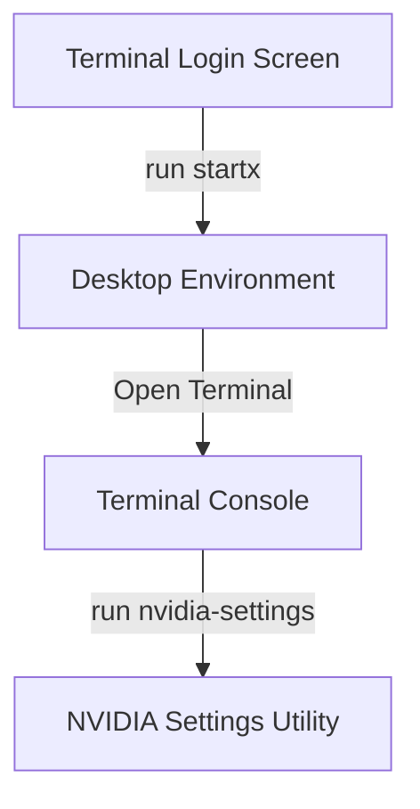

**Figure – open a terminal to get a console**
The image shows a Linux desktop environment (XFCE/Gnome style). The user navigates to:
Applications -> System Tools -> Terminal
A tooltip says "Use the command line".

**Figure- run "nvidia-settings"**
The image shows a terminal window with the following text:
```
root@Jetway-H61-VLT:~
File Edit View Search Terminal Help

Using X configuration file: "/etc/X11/xorg.conf".
Backed up file '/etc/X11/xorg.conf' as
'/etc/X11/xorg.conf.backup'
New X configuration file written to
'/etc/X11/xorg.conf'

[root@Jetway-H61-VLT ~]# nvidia-settings
```

Copyright © 2017-2022 By Astro Corp. All Rights Reserved. Page 37
The information in this document is confidential, it may not be reproduced, stored, copied or otherwise retrieved and/or recorded in any form in whole, or in part, nor may any of the information contained therein be disclosed.

Astro Game Development Kits - Programming Guide (BASE)
AstroGDK 3.2 (AK2API 1.8.7 for Italian VLT)
Astro

The following images show the NVIDIA X Server Settings interface for configuring dual monitors.

**NVIDIA X Server Settings - Upper Monitor Configuration**

The screenshot shows the "X Server Display Configuration" menu. In the Layout area, two monitors are stacked vertically. The top monitor is selected.

<table>
  <tbody>
    <tr>
        <td>Selection:</td>
        <td>NOV DVI (DVI-D-0)</td>
        <td></td>
    </tr>
    <tr>
        <td>Configuration:</td>
        <td>X screen 0</td>
        <td></td>
    </tr>
    <tr>
        <td>Resolution:</td>
        <td>1280x800 (scaled)</td>
        <td>Auto</td>
    </tr>
    <tr>
        <td>Orientation:</td>
        <td>No Rotation</td>
        <td>No Reflection</td>
    </tr>
    <tr>
        <td>Position:</td>
        <td>Absolute</td>
        <td>+0+0</td>
    </tr>
    <tr>
        <td>[x] Make this the primary display for the X screen</td>
        <td colspan="2"></td>
    </tr>
  </tbody>
</table>

*Figure – configure upper monitor, the coordinate of left-top corner must be (0,0) (Astro H61 only)*

***

**NVIDIA X Server Settings - Lower Monitor Configuration**

The screenshot shows the "X Server Display Configuration" menu. In the Layout area, the bottom monitor is selected.

<table>
  <tbody>
    <tr>
        <td>Selection:</td>
        <td>NOV DVI (HDMI-0)</td>
        <td></td>
    </tr>
    <tr>
        <td>Configuration:</td>
        <td>X screen 0</td>
        <td></td>
    </tr>
    <tr>
        <td>Resolution:</td>
        <td>1280x800 (scaled)</td>
        <td>Auto</td>
    </tr>
    <tr>
        <td>Orientation:</td>
        <td>No Rotation</td>
        <td>No Reflection</td>
    </tr>
    <tr>
        <td>Position:</td>
        <td>Absolute</td>
        <td>+0+800</td>
    </tr>
    <tr>
        <td>[ ] Make this the primary display for the X screen</td>
        <td colspan="2"></td>
    </tr>
  </tbody>
</table>

*Figure – configure lower monitor just below the upper monitor. (Astro H61 only)*

In both screens, the buttons at the bottom are: `Apply`, `Detect Displays`, `Advanced...`, `Reset`, `Save to X Configuration File`, `Help`, and `Quit`.

Copyright © 2017-2022 By Astro Corp. All Rights Reserved. Page 38
The information in this document is confidential, it may not be reproduced, stored, copied or otherwise retrieved and/or recorded in any form in whole, or in part, nor may any of the information contained therein be disclosed.

Astro Game Development Kits - Programming Guide (BASE)
AstroGDK 3.2 (AK2API 1.8.7 for Italian VLT)
Astro

The coordinate of left-top corner of upper monitor must be (0, 0), and the coordinate of left-top corner of lower monitor must be adjacent with the left-bottom corner of upper monitor. Finally, select the button **“Save to X Configuration File”** to store the new settings, and then restart the X or just reboot the Linux box to take effect.

> **Note!** PSM G920 of Linux box does not provide GUI utility like what nVidia provides. Intending to modify the layout configuration of monitors, you must have knowledge to directly edit content of the file /etc/X11/xorg.conf. Please always back up it before modifying.

### 2.1.6 Configure Keyboard Layout
The Linux box / VM is configured to use keyboard layout American ‘us’ by default. To change to the other keyboard layout, e.g. Italian ‘it’, just run below command to configure it permanently:

```bash
[root@ASTRODEV-VM ~]#
[root@ASTRODEV-VM ~]# localectl set-keymap it    it - to Italian keyboard layout
[root@ASTRODEV-VM ~]#                           us - to United States.
                                                fr - to French
```

> **Note!** We don’t suggest using the utility “setup” and then “Keyboard configuration” to modify keyboard layout. Because it would remove also the ability of using “[Ctrl]-[Alt]-[Backspace]” to terminate X.

More detail please refer to
https://linuxconfig.org/how-to-change-system-keyboard-keymap-layout-on-centos-7-linux

Copyright © 2017-2022 By Astro Corp. All Rights Reserved. Page 39
The information in this document is confidential, it may not be reproduced, stored, copied or otherwise retrieved and/or recorded in any form in whole, or in part, nor may any of the information contained therein be disclosed.

Astro Game Development Kits - Programming Guide (BASE)
AstroGDK 3.2 (AK2API 1.8.7 for Italian VLT)
Astro

### 2.1.7 Setup for Linux Virtual Machine

#### 2.1.7.1 Minimum Requirement of Win Box
Minimum specification requirement of Win box running Linux VM as below:
* x86 processor (Intel Core i5 or i7 is recommended)
* 8GB RAM
* 30GB left of disk space before installing Linux VM image
* Windows 7 or later
* Ability of networking access is not necessary

#### 2.1.7.2 Load and Run Linux VM
As below steps to land and Run Linux VM:
* Step 1: Install software VMware Workstation Player or VMware Workstation Pro, abbrev. "VM Player" below (version 12 or later) to Win box;
* Step 2: Copy the Linux VM image to any of directory, e.g. "**C:\VM\CentOS 7 64-bit DEV\\**";
* Step 3: Launch VM Player, choose File $\rightarrow$ Open, and choose "**C:\VM\CentOS 7 64-bit DEV\CentOS 7 64-bit DEV.vmdk**" to open it.
* Step 4: Select the opened VM, and click on "Play virtual machine" to launch the Linux VM.

#### 2.1.7.3 Default Configurations of Linux VM
For an opened virtual machine, may select "Edit virtual machine settings" or "Manage $\rightarrow$ Virtual Machine Settings..." from VM Player to view or modify the configuration of the virtual machine. The default configuration of Linux VM as below:

Copyright © 2017-2022 By Astro Corp. All Rights Reserved. Page 40
The information in this document is confidential, it may not be reproduced, stored, copied or otherwise retrieved and/or recorded in any form in whole, or in part, nor may any of the information contained therein be disclosed.

Astro Game Development Kits - Programming Guide (BASE)
AstroGDK 3.2 (AK2API 1.8.7 for Italian VLT)
Astro

# Virtual Machine Settings

The following image shows the Virtual Machine Settings dialog box in VMware:

<table>
  <thead>
    <tr>
        <th>Device</th>
        <th>Summary</th>
        <th>Device status</th>
    </tr>
  </thead>
  <tbody>
    <tr>
        <td>Memory</td>
        <td>2 GB</td>
        <td>[ ] Connected</td>
    </tr>
    <tr>
        <td>Processors</td>
        <td>1</td>
        <td>[x] Connect at power on</td>
    </tr>
    <tr>
        <td>Hard Disk (SCSI)</td>
        <td>20 GB</td>
        <td></td>
    </tr>
    <tr>
        <td>CD/DVD (IDE)</td>
        <td>Auto detect</td>
        <td>Network connection</td>
    </tr>
    <tr>
        <td>Network Adapter</td>
        <td>Host-only</td>
        <td>( ) Bridged: Connected directly to the physical network</td>
    </tr>
    <tr>
        <td>USB Controller</td>
        <td>Present</td>
        <td>[ ] Replicate physical network connection state</td>
    </tr>
    <tr>
        <td>Sound Card</td>
        <td>Auto detect</td>
        <td>[Configure Adapters]</td>
    </tr>
    <tr>
        <td>Printer</td>
        <td>Present</td>
        <td>( ) NAT: Used to share the host's IP address</td>
    </tr>
    <tr>
        <td>Display</td>
        <td>Auto detect</td>
        <td>(x) Host-only: A private network shared with the host</td>
    </tr>
    <tr>
        <td></td>
        <td>( ) Custom: Specific virtual network</td>
        <td></td>
    </tr>
    <tr>
        <td></td>
        <td>[VMnet0]</td>
        <td></td>
    </tr>
    <tr>
        <td></td>
        <td>( ) LAN segment:</td>
        <td></td>
    </tr>
    <tr>
        <td></td>
        <td>[ ]</td>
        <td></td>
    </tr>
    <tr>
        <td></td>
        <td>[LAN Segments...] [Advanced...]</td>
        <td></td>
    </tr>
    <tr>
        <td>[Add...] [Remove]</td>
        <td>[OK] [Cancel] [Help]</td>
        <td></td>
    </tr>
  </tbody>
</table>

Some subjects described below:
*   **Networking:**
    It is configured a private network between Host OS and Linux VM only. Developer can use ‘ssh’ from Host OS (Win box) to connect to the Linux VM.
    About IP address of the Linux VM, may execute command “ip a” or “ifconfig” to acquire.

*   **X Window and Display Resolution:**
    It is configured to enable Accelerate 3D graphics with Graphics memory equal or greater than 1GB, and be able to launch X window desktop by command ‘startx’ or ‘startxfce4’. And the resolution and dimension of display of X may be modified dynamically by adjusting the outer window frame of the Linux VM in period of X launched.

The following image shows a terminal window:
```
CentOS 7 64-bit DEV - VMware Workstation 15 Player ... [ _ ] [ □ ] [ X ]
Player ▾ | [||] [▶] [⟳] [⌨] [◫] [>] [📁] [🕒] [🖨] [🔌] [👥] [⚙] [🌐] [🖥] [⌨]
[root@ASTRODEV-VM ~]#
[root@ASTRODEV-VM ~]# startx_
```

Copyright © 2017-2022 By Astro Corp. All Rights Reserved. Page 41
The information in this document is confidential, it may not be reproduced, stored, copied or otherwise retrieved and/or recorded in any form in whole, or in part, nor may any of the information contained therein be disclosed.

Astro Game Development Kits - Programming Guide (BASE)
AstroGDK 3.2 (AK2API 1.8.7 for Italian VLT)
Astro

Two screenshots of the CentOS 7 64-bit DEV virtual machine running in VMware Workstation Player are shown side-by-side. A double-headed arrow between them indicates resizing. The first screenshot shows a smaller window with a red circle highlighting the bottom-right corner for resizing. The second screenshot shows the window expanded vertically.

*Figure – resize dimension of X by mouse cursor*

*   **Shared Folders:**
    Linux VM had installed and configured VMware Tools which provides ability of sharing folders of Host OS (Win box) to be accessed by/from Linux VM. Developer may choose "Edit virtual machine settings" or "Manage $\rightarrow$ Virtual Machine Settings..." from UI of VM Player, and then choose page "Options", and then as right figure:

The following table represents the "Virtual Machine Settings" dialog box shown in the image:

<table>
  <thead>
    <tr>
        <th>Hardware</th>
        <th>Options</th>
        <th colspan="2"></th>
    </tr>
  </thead>
  <tbody>
    <tr>
        <td rowspan="10">Settings<br/>General<br/>Power<br/>Shared Folders<br/>VMware Tools<br/>Unity<br/>Autologin</td>
        <td>Summary<br/>CentOS 7 64-bit DEV<br/>Enabled<br/>Time sync on<br/>Not supported</td>
        <td colspan="2">Folder sharing<br/>Shared folders expose your files to programs in the virtual machine. This may put your computer and your data at risk. Only enable shared folders if you trust the virtual machine with your data.</td>
    </tr>
    <tr>
        <th>( ) Disabled</th>
        <th colspan="2"></th>
    </tr>
    <tr>
        <th>(x) Always enabled</th>
        <th colspan="2"></th>
    </tr>
    <tr>
        <th>( ) Enabled until next power off or suspend</th>
        <th colspan="2"></th>
    </tr>
    <tr>
        <th colspan="2">Folders</th>
        <th></th>
    </tr>
    <tr>
        <th>Name</th>
        <th>Host Path</th>
        <th></th>
    </tr>
    <tr>
        <td>[x] MyProjects</td>
        <td>C:\MyProjects</td>
        <td></td>
    </tr>
    <tr>
        <th colspan="3"></th>
    </tr>
    <tr>
        <td colspan="2">Add...</td>
        <td>Remove</td>
        <td>Properties</td>
    </tr>
    <tr>
        <th colspan="3"></th>
    </tr>
    <tr>
        <td colspan="2">OK</td>
        <td>Cancel</td>
        <td>Help</td>
    </tr>
  </tbody>
</table>
*(Note: In the screenshot, red circles and arrows highlight "Shared Folders" in the Settings list, the "Always enabled" radio button, and the "Add..." button.)*

Copyright © 2017-2022 By Astro Corp. All Rights Reserved. Page 42
The information in this document is confidential, it may not be reproduced, stored, copied or otherwise retrieved and/or recorded in any form in whole, or in part, nor may any of the information contained therein be disclosed.

Astro Game Development Kits - Programming Guide (BASE)
AstroGDK 3.2 (AK2API 1.8.7 for Italian VLT)
Astro

> ! *Note! Don’t disable the Accelerate 3D graphics in setting of Linux VM. If disabled, will lead to failure of launching X in some PC hardware.*

### 2.1.7.3 Virtual Devices and Connections
Linux VM runs inside the Win box (Host OS of VM). It has no physical external I/O ports and can only use resources of host OS like keyboard, mouse, and monitor, etc. It can only use display of Host OS, and keyboard to simulate buttons/switchs, door events, etc., and mouse to simulate touch panel.

Copyright © 2017-2022 By Astro Corp. All Rights Reserved. Page 43
The information in this document is confidential, it may not be reproduced, stored, copied or otherwise retrieved and/or recorded in any form in whole, or in part, nor may any of the information contained therein be disclosed.

Astro Game Development Kits - Programming Guide (BASE)
AstroGDK 3.2 (AK2API 1.8.7 for Italian VLT)
Astro

## 2.2 Install and Configure Win Box

### 2.2.1 Install AstroGDK

Installing AstroGDK files is easy as below:

*   Unrar AstroGDK package named **"AstroGDK-\<target>-v\<version>.rar"**, and extract the folder **"AstroGDK"** to a specific folder named **"AstroGDK"** in your PC.
    E.g. **C:\MyProjects\AstroGDK\\**
    Note! The upper directory of "AstroGDK\\" - in above example "**C:\MyProjects\\**", can be any location and any name you choose. Example in below figure:

    The image shows two screenshots. The first is a WinRAR window displaying the contents of "AstroGDK-v1.0.rar", which includes two folders: "AstroGDK" and "AstroGDKSamples". The second screenshot is a Windows File Explorer window showing the directory "C:\MyProjects" containing the extracted "AstroGDK" folder.

*   Run "**vc_redist.x86.exe**" in directory "**AstroGDK\Support\\**" to set up Visual C++ Redistributable package. This is required only if intending to developing Windows-version games, but no hurt to always set up it.

Copyright © 2017-2022 By Astro Corp. All Rights Reserved. Page 44
The information in this document is confidential, it may not be reproduced, stored, copied or otherwise retrieved and/or recorded in any form in whole, or in part, nor may any of the information contained therein be disclosed.

Astro Game Development Kits - Programming Guide (BASE)
AstroGDK 3.2 (AK2API 1.8.7 for Italian VLT)
Astro

[The image shows a Windows File Explorer window at the path `C:\MyProjects\AstroGDK\Support`. Inside the folder is an executable file named `vc_redist.x86.exe` with a modification date of 2017/5/25.]

[The image shows the Microsoft Visual C++ 2017 Redistributable (x86) - 14.14.26429 Setup window. The user has checked the box "I agree to the license terms and conditions" and the "Install" button is highlighted.]

### 2.2.2 Set up AstroKernel Configuration Files

AstroKernel would refer to certain configuration files to define its behavior. Follow below step to create local-version configuration files which are independent from (factory) default ones:

*   Copy all files in **"AstroGDK\Runtime\\_config\\*"** to directory **"AstroGDK\\_config\\"**

[The image shows a Windows File Explorer window at the path `C:\MyProjects\AstroGDK\Runtime\_config`. The folder contains four XML documents: `debug.xml`, `hwlayout.xml`, `list.xml`, and `VLT.xml`. These are labeled as "configuration files". An arrow points from this folder to the `AstroGDK\_config` folder, which is labeled "(local)", while the source folder under `Runtime` is labeled "(default)".]

Copyright © 2017-2022 By Astro Corp. All Rights Reserved. Page 45
The information in this document is confidential, it may not be reproduced, stored, copied or otherwise retrieved and/or recorded in any form in whole, or in part, nor may any of the information contained therein be disclosed.

Astro Game Development Kits - Programming Guide (BASE)
AstroGDK 3.2 (AK2API 1.8.7 for Italian VLT)
Astro

The files under "**AstroGDK\\_config\\***" can be customized in accordance with your need in period of developing, please refer to Section 4.1 for detail. By carrying out above step again, you may always restore local-version configuration files from default ones.

When AstroKernel "**AstroGDK\Runtime\ask.exe**" is launched, it will refer to its local-version configuration files in directory "**AstroGDK\\_config\\**" first. If no file is there, will change back to refer to its default ones in directory "**AstroGDK\Runtime\\_config\\**".

> ! Note! AstroKernel refers to its configuration files in directory "AstroGDK\\_config\\*" first, and then directory "AstroGDK\Runtime\\_config\\*" only if specific file is not in previous directory.

### 2.2.3 Locate Your Game Project

Basically you can locate your game project directory, e.g. "my_game_project1" anywhere. But we strongly suggest locating it according to a specific rule that all game-team members comply. In Astro Corp, it's required to locate it in parallel with directory "AstroGDK", so both directories may look like:

**C:\MyProjects\AstroGDK\\**
**C:\MyProjects\my_game_project1\\**

Example in below figure:

The image shows a Windows File Explorer window at the path `C:\MyProjects`.
The left navigation pane shows:
*   MyProjects
    *   AstroGDK
    *   my_game_project1
        *   Distribution
        *   Doc
        *   media
        *   Source
        *   Test

The main file list view shows:
<table>
  <thead>
    <tr>
        <th>名稱</th>
        <th>修改日期</th>
        <th>類型</th>
        <th>大小</th>
    </tr>
  </thead>
  <tbody>
    <tr>
        <td>AstroGDK</td>
        <td>2018/3/18 下午 08:41</td>
        <td>檔案資料夾</td>
        <td></td>
    </tr>
    <tr>
        <td>my_game_project1</td>
        <td>2018/3/18 下午 09:45</td>
        <td>檔案資料夾</td>
        <td></td>
    </tr>
  </tbody>
</table>

We also strongly suggest that, under directory "**my_game_project1\\**", if any of paths/files of AstroGDK is referred, always describes it in relative path, not absolute path. For example, use "**..\AstroGDK\Inc\\**" to refer to header files of AstroGDK rather than "**C:\MyProjects\AstroGDK\Inc\\**" from "**my_game_project1\\**". So the directory structures (from C:\MyProjects\\) can be moved to any place without breaking the paths/files references.

Copyright © 2017-2022 By Astro Corp. All Rights Reserved. Page 46
The information in this document is confidential, it may not be reproduced, stored, copied or otherwise retrieved and/or recorded in any form in whole, or in part, nor may any of the information contained therein be disclosed.

Astro Game Development Kits - Programming Guide (BASE)
AstroGDK 3.2 (AK2API 1.8.7 for Italian VLT)
Astro

## 2.3 Cooperation of Win Box and Linux Box

This section describes how to put Linux box and Win box both cooperated with each other. Refer to below steps: These steps also work between Win box and Linux VM but we suggest using another way described in Section 2.4.

*   Step 1: Refer to above Section 2.1 and 2.2 to set up your devices, connections, and development environment.

    **Win box**
    Step 1: setup environment
    MyProjects\
        AstroGDK\
        my_game_project1\
        my_game_project2\
        ...

*   Step 2: Use ssh client, e.g. putty, MobaXterm, KiTTY, mRemoteNG, etc., to connect and log on to Linux box from Win box.

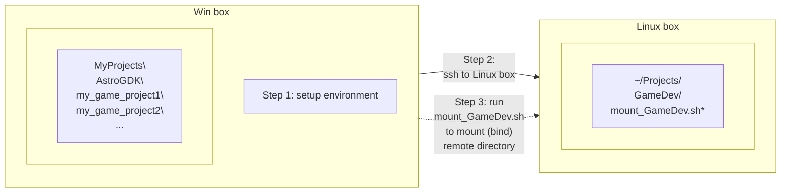

> Note! Developer always sits by the Win box, through ssh client run in Win box, to manipulate the Linux box.

Copyright © 2017-2022 By Astro Corp. All Rights Reserved. Page 47
The information in this document is confidential, it may not be reproduced, stored, copied or otherwise retrieved and/or recorded in any form in whole, or in part, nor may any of the information contained therein be disclosed.

Astro Game Development Kits - Programming Guide (BASE)
AstroGDK 3.2 (AK2API 1.8.7 for Italian VLT)
Astro

*   Step 3: Mount (binding / mapping) the root folder of game projects and AstroGDK in Win box, here "**MyProjects\\**" for example, to a specific local directory e.g. "**~/Projects/GameDev/**" in Linux box by running batch script "**mount_GameDev.sh**"; When done, Linux box will be able to access everything of AstroGDK and your game projects.

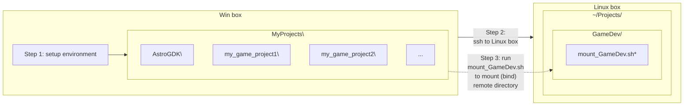

The key point, the directory in Win box, e.g. "**MyProjects\\**", must be configured as a share folder by networking neighborhood (CIFS) beforehand, so other computer including Linux box can see the share folder. About how to define a specific folder to be a share folder, please refer to Microsoft web or related web resources.

Before running batch script "**mount_GameDev.sh**", usually would modify it once with correct username and password to be able to mount to remote share folder in Win box, as below:

```bash
#
# Use this to mount ./GameDev to certain remote Windows directory (share folder).
# May need to change username and password for authentication of share folder before running this.
#
# Created by Astro Corp.
#
mount -t cifs -o username="user",password="password" //`echo $SSH_CLIENT | awk '{print $1}'`/$1 ./GameDev
~
~
~
:wq!
```

Copyright © 2017-2022 By Astro Corp. All Rights Reserved. Page 48
The information in this document is confidential, it may not be reproduced, stored, copied or otherwise retrieved and/or recorded in any form in whole, or in part, nor may any of the information contained therein be disclosed.

Astro Game Development Kits - Programming Guide (BASE)
AstroGDK 3.2 (AK2API 1.8.7 for Italian VLT)
Astro

Running “mount_GameDev.sh” to mount by example as below:

The image shows a Windows File Explorer window at the path `OS (C:) > MyProjects`.
The folder structure on the left sidebar shows:
- MyProjects (highlighted with a red box)
- AstroGDK share folder
- AstroGDKSamples
- my_game_project1
- National Instruments Downloads
- PerfLogs
- Program Files

The main pane shows the contents of "MyProjects":
<table>
  <thead>
    <tr>
        <th>名稱</th>
        <th>修改日期</th>
    </tr>
  </thead>
  <tbody>
    <tr>
        <td>AstroGDK</td>
        <td>2018/3/19 上午 05:25</td>
    </tr>
    <tr>
        <td>AstroGDKSamples</td>
        <td>2018/3/19 上午 04:24</td>
    </tr>
    <tr>
        <td>my_game_project1</td>
        <td>2018/3/18 下午 09:45</td>
    </tr>
  </tbody>
</table>
*The share folder “C:\MyProjects” with share name “MyProject” in Win box.*

The image shows a terminal window (SSH console) with the following text:
```
Using username "root".
root@172.16.3.148's password:
Send automatic password
Last login: Thu Mar 22 04:31:05 2018 from 172.16.3.1
+---------------------------------------+
| Welcome to AstroGDK Building Machine  |
+---------------------------------------+
Note:
1. Do jobs in/under your home directory, so will not interfere with others.
2. May use 'mount.cifs' (a Samba/CIFS client) to mount remote directory here.
   (usually the development directory in your own PC). Syntax example:
   $ sudo mount.cifs //172.16.3.100/Work ./Work -o user=james,pass=*****
Good Luck

[root@Jetway-H61-VLT ~]# cd Projects
[root@Jetway-H61-VLT ~/Projects]# ls -l
total 8
drwxr-xr-x 2 root root 4096 Nov 20 16:52 GameDev
-rwxr-xr-x 1 root root  321 Jan  1 23:43 mount_GameDev.sh
[root@Jetway-H61-VLT ~/Projects]# ls -l GameDev/
total 0    before mount, directory is empty
[root@Jetway-H61-VLT ~/Projects]# ./mount_GameDev.sh MyProjects    mount the share
[root@Jetway-H61-VLT ~/Projects]# ls -l GameDev/
total 0
drwxr-xr-x 0 root root 0 Mar 19 05:25 AstroGDK
drwxr-xr-x 0 root root 0 Mar 19 04:24 AstroGDKSamples    Now, can see remote files.
drwxr-xr-x 0 root root 0 Mar 18 21:45 my_game_project1
[root@Jetway-H61-VLT ~/Projects]#
```
*Annotations in the terminal screenshot:*
- A red box around `ls -l GameDev/` with the note "before mount, directory is empty".
- A red box around `./mount_GameDev.sh` and a yellow box around `MyProjects` with the notes "share name" and "mount the share".
- A red box around the listed directories `AstroGDK`, `AstroGDKSamples`, and `my_game_project1` with the note "Now, can see remote files."

*In ssh console, mount the remote share folder “MyProjects” to local directory “~/Projects/GameDev/”*

Say it again! Developer sits by the Win box, through ssh client run in Win box, to log on to the Linux box, to mount share folder of Win box to a certain directory of Linux box by executing script ./mount_GameDev.sh.

*   Step 4: develop, compile, debug, and test on Linux box.

Copyright © 2017-2022 By Astro Corp. All Rights Reserved. Page 49
The information in this document is confidential, it may not be reproduced, stored, copied or otherwise retrieved and/or recorded in any form in whole, or in part, nor may any of the information contained therein be disclosed.

Astro Game Development Kits - Programming Guide (BASE)
AstroGDK 3.2 (AK2API 1.8.7 for Italian VLT)
Astro

## 2.4 Cooperation of Win Box and Linux VM

The concept is like below figure. To share the project folder(s) of host OS (Win box) which is able to be accessed by Linux VM.

```mermaid
graph LR
    subgraph Win_box [Win box]
        direction TB
        subgraph Physical [Physical game projects and AstroGDK here]
            P_Content["MyProjects\<br/>AstroGDK\<br/>my_game_project1\<br/>my_game_project2\<br/>..."]
        end
        
        subgraph Linux_VM [Linux VM]
            direction TB
            subgraph Mapping [Mapping / View to host OS]
                M_Content["MyProjects\<br/>AstroGDK\<br/>my_game_project1\<br/>my_game_project2\<br/>..."]
            end
        end
    end
    
    P_Content <-->|Share Folders<br/>(VMware)| M_Content
```

*Figure – Cooperation between Win box and Linux VM (Section 2.4)*

Developer may choose “Edit virtual machine settings” or “Manage Virtual Machine Settings...” from UI of VM Player, then choose page “Options”, and then choose as below figure to add a share folder. All share folders will be located in the directory /mnt/hgfs/\<Share Name\> of Linux VM.

**Virtual Machine Settings**
<table>
  <thead>
    <tr>
        <th>Hardware</th>
        <th>Options</th>
        <th colspan="3"></th>
    </tr>
  </thead>
  <tbody>
    <tr>
        <td rowspan="7">Settings<br/>General<br/>Power<br/>Shared Folders<br/>VMware Tools<br/>Unity<br/>Autologin</td>
        <td rowspan="7">Summary<br/>CentOS 7 64-bit DEV<br/>Enabled<br/>Time sync on<br/>Not supported</td>
        <td>Folder sharing<br/>Shared folders expose your files to programs in the virtual machine. This may put your computer and your data at risk. Only enable shared folders if you trust the virtual machine with your data.<br/>( ) Disabled<br/>(x) Always enabled<br/>( ) Enabled until next power off or suspend</td>
        <td colspan="2"></td>
    </tr>
    <tr>
        <td></td>
        <td>Folders</td>
        <td></td>
    </tr>
    <tr>
        <td></td>
        <td>Name</td>
        <td>Host Path</td>
    </tr>
    <tr>
        <td></td>
        <td>[x] MyProjects</td>
        <td>C:\MyProjects</td>
    </tr>
    <tr>
        <td></td>
        <td>[Add...]</td>
        <td>[Remove]</td>
        <td>[Properties]</td>
    </tr>
    <tr>
        <td></td>
        <td>[OK]</td>
        <td>[Cancel]</td>
        <td>[Help]</td>
    </tr>
  </tbody>
</table>

Copyright © 2017-2022 By Astro Corp. All Rights Reserved. Page 50
The information in this document is confidential, it may not be reproduced, stored, copied or otherwise retrieved and/or recorded in any form in whole, or in part, nor may any of the information contained therein be disclosed.

Astro Game Development Kits - Programming Guide (BASE)
AstroGDK 3.2 (AK2API 1.8.7 for Italian VLT)
Astro

# 3 AK2API Programming

## 3.1 Introduction
AstroKernel exports its client-end programming interface (API), called “AK2API”, for game programs to communicate with system.

“AK2API” is a message-based API composed of **several C functions and a number of C structures**. Its implementation is wrapped in .dll/.so file, so for any programming language which can access C or .dll/.so file, like C / C++ / Python / C# / JS, etc., may also apply the API to communicate with AstroKernel and therefore able to be used as game programming language. For developing game in Unity technology, AstroGDK provides “Astro game framework for Unity”, which is built on top of “AK2API”. Now it supports Unity version 5.x.

The definition and declaration of “AK2API” is in header file **“ak2api.h”**. You may often need to refer to it in programming phase. If developing game in non-C/C++ languages, must refer to and follow specification of “AK2API” to implement corresponding interface into the language you choose.

> File *“ak2api.h”* itself is well-documented and may contain some useful information not detailed described in this document.

The implementation of “AK2API” is present in dynamic library **ak2api.dll** for Windows, and shared object **libak2api.so** (or **libak2api_64.so**) for Linux.

From AstroGDK 2.0, the operating system of VLT was upgraded to 64-bit Linux, and which is able to run 32-bit and 64-bit programs. So your game program could be developed and compiled into 32-bit and / or 64-bit executable binary, just link with corresponding libak2api.so (32-bit) or libak2api_64.so (64-bit).

### 3.1.1 First Game Process
In usual case, the first game process (“First Game Process”) is launched by AstroKernel as AstroKernel’s direct child process. The first game process would usually spawn other child processes as needed.

Copyright © 2017-2022 By Astro Corp. All Rights Reserved. Page 51
The information in this document is confidential, it may not be reproduced, stored, copied or otherwise retrieved and/or recorded in any form in whole, or in part, nor may any of the information contained therein be disclosed.

Astro Game Development Kits - Programming Guide (BASE)
AstroGDK 3.2 (AK2API 1.8.7 for Italian VLT)
Astro

Anyway, one rule needs to follow that the AK2API module (e.g. libak2api.so) must be linked only to the first game process (which is named "app" or "app.exe". Refer to section 4.2), not to other game sub-processes. Because the IPC (Inter-Process Communication) would only be built between AstroKernel and its first process for current system version.

Below figure shows relationship of processes:

```mermaid
graph LR
    subgraph father [ (father) ]
        AK[AstroKernel<br/>process]
    end

    subgraph child [ (child) ]
        FGP[First game<br/>process<br/>(app or app.exe)]
        AKM[AK2API module<br/>(libak2api.so)]
        FGP --- AKM
    end

    subgraph grandchild [ (grandchild) ]
        OSP[Other<br/>sub-processes]
    end

    AK -- launch --> FGP
    FGP <--> |IPC| AK
    FGP -- launch --> OSP
```

> [!IMPORTANT]
> AK2API module libak2api.so (or ak2api.dll) must be linked only to the first game process, the "app" (or "app.exe").

Copyright © 2017-2022 By Astro Corp. All Rights Reserved. Page 52
The information in this document is confidential, it may not be reproduced, stored, copied or otherwise retrieved and/or recorded in any form in whole, or in part, nor may any of the information contained therein be disclosed.

Astro Game Development Kits - Programming Guide (BASE)
AstroGDK 3.2 (AK2API 1.8.7 for Italian VLT)
Astro

### 3.1.2 Header Files

For programming in C/C++, must include header files as below. They are originally located in **"AstroGDK/Inc"**:

```c
#include "ak2api.h"                /* main header file of AK2API */
#include "ak2api_market_c6b.h"     /* market-dependent header file for C6b */
#include "ak2apiEX.h"              /* (optional for debugging purpose) */
#include "ak2sysutil.h"            /* (optional for some system helpers) */
```

#### Note
*   Include **"ak2api_market_c6b.h"**, or someone like "ak2api_market_c6a.h", "ak2api_market_macau.h", etc., for market or regulation-dependent definitions. It may alter, extend, or narrow definitions or functions of "ak2api.h". Refer into this kind of header file for market-dependent information.
*   Include **"ak2apiEX.h"** only if intending to call function "**int ak2apiex_run_as_active_mode()**" for purpose of friendly debugging in Windows development environment. Please refer to Section 4.3.4 for detail.

> [!IMPORTANT]
> Name of function "*ak2api_run_as_active_mode()*" was changed to prefix "*ap2apiex_*" from AstroGDK 2.0. The old name is still kept and may be removed in the future release.

### 3.1.3 C Functions

List of C functions:
*   int ak2api_init(...)
*   int ak2api_init_until_complete()
*   int ak2api_cfg_get_item(...)
*   void ak2api_exit(int exit_code)
*   int ak2api_get_message(void *p_msg)
*   int ak2api_send_message(const struct ak2msg_base *p_msg)
*   int ak2api_nvbuf_get_buffer(char **pp_nvbuf_buffer,...)
*   int ak2api_nvbuf_commit()
*   int ak2api_nvbuf_if_synced()
*   int ak2apiex_run_as_active_mode()

Copyright © 2017-2022 By Astro Corp. All Rights Reserved. Page 53
The information in this document is confidential, it may not be reproduced, stored, copied or otherwise retrieved and/or recorded in any form in whole, or in part, nor may any of the information contained therein be disclosed.

Astro Game Development Kits - Programming Guide (BASE)
AstroGDK 3.2 (AK2API 1.8.7 for Italian VLT)
Astro

### 3.1.4 Messages
All messages are defined in form of C struct, containing size, message code, and optional fields.
Basic definition of the C struct below:
```c
struct ak2msg_base
{
    int size;          // byte size of the complete message structure excluding tailed padding.
    char code[24];     // message code/string here. (Note! Case sensitive)

    // optional/appended data from here
};
```

#### 3.1.4.1 Preparation of Message
When preparing a message for sending, it's required to keep all non-used or reserved fields with zeros for security reason, except there is special comment for it. It's a good manner to reset the whole structure to zeros first before filling message stuff. Please refer to ak2api.h for sample code of how to preparing a message.

### 3.1.5 Prefix of Message Code
The prefix of message code tells the transmission direction:
*   "ac_" : the message is transmitted from AstrKernel to Content (game)
*   "ca_" : the message is transmitted from Content (game) to AstroKernel

### 3.1.6 Functions and Messages in Categories
<table>
  <thead>
    <tr>
        <th>Process initialize / destroy (init / destroy / exit)</th>
        <th colspan="2"></th>
    </tr>
  </thead>
  <tbody>
    <tr>
        <td>int ak2api_init() <br/> int ak2api_init_until_complete() <br/> void ak2api_exit()</td>
        <td>The functions are about initialization and release of ak2api module and communication channel (IPC) with AstroKernal.</td>
        <td></td>
    </tr>
    <tr>
        <th>Configuration (cfg)</th>
        <th colspan="2"></th>
    </tr>
    <tr>
        <td>int ak2api_cfg_get_item() <br/> message "ac_cfg_updated"</td>
        <td>The function and message is for game program to get configuration data.</td>
        <td></td>
    </tr>
    <tr>
        <th>Messages exchange (get / send)</th>
        <th colspan="2"></th>
    </tr>
    <tr>
        <td>int ak2api_get_message() <br/> int ak2api_send_message()</td>
        <td>The functions are called by game program to get or send messages (data, commands, responses) with AstroKernel.</td>
        <td></td>
    </tr>
  </tbody>
</table>

Copyright © 2017-2022 By Astro Corp. All Rights Reserved. Page 54
The information in this document is confidential, it may not be reproduced, stored, copied or otherwise retrieved and/or recorded in any form in whole, or in part, nor may any of the information contained therein be disclosed.

Astro Game Development Kits - Programming Guide (BASE)
AstroGDK 3.2 (AK2API 1.8.7 for Italian VLT)
Astro

<table>
  <thead>
    <tr>
        <th></th>
        <th colspan="2">NVRAM buffer (nvbuf)</th>
    </tr>
  </thead>
  <tbody>
    <tr>
        <td>int ak2api_nvbuf_get_buffer()<br/>int ak2api_nvbuf_commit()<br/>int ak2api_nvbuf_if_synced()</td>
        <td>The functions are called by game program to access and manage its game-dependent NVRAM buffer.</td>
        <td></td>
    </tr>
    <tr>
        <th></th>
        <th colspan="2">Process flow (flow)</th>
    </tr>
    <tr>
        <td>message “ca_flow_start”<br/>message “ac_flow_terminate”<br/>message “ac_flow_suspend”<br/>message “ac_flow_resume”</td>
        <td>These messages are about process flow.</td>
        <td></td>
    </tr>
    <tr>
        <th></th>
        <th colspan="2">Game match (game)</th>
    </tr>
    <tr>
        <td>message “ca_game_start”<br/>message “ac_game_start_acked”<br/>message “ca_game_step”<br/>message “ac_game_step_acked”<br/>message “ca_game_end”<br/>message “ac_game_end_acked”<br/>message “ca_game_snapshot”<br/>message “ca_game_snapshot2”</td>
        <td>These messages are about a single game match (cycle), and eventually take a snapshot of game outcome.<br/><br/>Message “ca_game_snapshot2” is provided from AstroGDK 2.7.</td>
        <td></td>
    </tr>
    <tr>
        <th></th>
        <th colspan="2">About odds (rng / jp / outcome)</th>
    </tr>
    <tr>
        <td>message “ca_rng_request”<br/>message “ac_rng_result”<br/>message “ca_jp_hit_check”<br/>message “ac_jp_hit_result”,<br/>message “ca_jp_award” (not support yet)<br/>message “ca_jp_award_acked” (not support yet)</td>
        <td>These messages are about outcome determination.</td>
        <td></td>
    </tr>
    <tr>
        <th></th>
        <th colspan="2">Accounting (credit / meter)</th>
    </tr>
    <tr>
        <td>message “ac_credit_changed”<br/>message “ca_credit_payout”<br/>message “ca_meter_query”<br/>message “ac_meter_info”</td>
        <td>These messages are about payout, credits, and meters information.</td>
        <td></td>
    </tr>
    <tr>
        <th></th>
        <th colspan="2">Low-level I/O (touch / key / light)</th>
    </tr>
    <tr>
        <td>message “ac_touch_pressed”<br/>message “ac_touch_released”<br/>message “ac_key_down”<br/>message “ac_key_up”</td>
        <td>The messages are about low-level I/O, like touch panel, key (button), and button light control, etc.</td>
        <td></td>
    </tr>
  </tbody>
</table>

Copyright © 2017-2022 By Astro Corp. All Rights Reserved. Page 55
The information in this document is confidential, it may not be reproduced, stored, copied or otherwise retrieved and/or recorded in any form in whole, or in part, nor may any of the information contained therein be disclosed.

Astro Game Development Kits - Programming Guide (BASE)
AstroGDK 3.2 (AK2API 1.8.7 for Italian VLT)
Astro

<table>
  <tbody>
    <tr>
        <td>message “ca_light_on”<br/>message “ca_light_off”</td>
        <td></td>
        <td></td>
    </tr>
    <tr>
        <th>Misc.</th>
        <th colspan="2"></th>
    </tr>
    <tr>
        <td>message “ac_jp_broadcast” (not support yet)<br/>message “ca_atmosphere”<br/>message “ca_atmosphere2”</td>
        <td></td>
        <td></td>
    </tr>
    <tr>
        <th>Special</th>
        <th colspan="2"></th>
    </tr>
    <tr>
        <td>void ak2apiex_run_as_active_mode()</td>
        <td>Call this function to launch AstroKernel by game process for debug purpose. Please refer to Section 4.3.4 for description about this.</td>
        <td></td>
    </tr>
  </tbody>
</table>

> ! Note! Function **ak2api_destroy()** is declared **obsolete**. While intending to quit, please just call **ak2api_exit()** without previous **ak2api_destroy()**. (from AstroGDK 2.6)

> ! Note! Message **“ca_flow_stop”** is **obsolete** and will always be ignored. (from AstroGDK 2.6)

### 3.1.7 Hint of Compiling with ‘gcc’ Compiler
The gcc/g++ installed in Linux box / VM generates 64-bit executable binary by default. To generate 32-bit one please add option ‘-m32’. For example:

<table>
  <tbody>
    <tr>
        <td># gcc a.c</td>
        <td>← will generate 64-bit executable binary.</td>
    </tr>
    <tr>
        <td># gcc -m32 a.c</td>
        <td>← will generate 32-bit executable binary</td>
    </tr>
  </tbody>
</table>

Copyright © 2017-2022 By Astro Corp. All Rights Reserved. Page 56
The information in this document is confidential, it may not be reproduced, stored, copied or otherwise retrieved and/or recorded in any form in whole, or in part, nor may any of the information contained therein be disclosed.

Astro Game Development Kits - Programming Guide (BASE)
AstroGDK 3.2 (AK2API 1.8.7 for Italian VLT)
Astro

### 3.1.8 Link with “AK2API” Library or Object

There are files **“ak2api.lib”** for Windows, and **“libak2api.so” (“libak2api_64.so”)** for Linux under directory **“AstroGDK/Lib/”** for your program to link dynamically at runtime. Above files contain just exported interface only, and without any runtime logic. Game program links **“Lib/ak2api.lib”** (Windows) or **“Lib/libak2api.so” (“Lib/libak2api_64.so”)** (Linux) in compile-time to store the interface into the binary. While game program is launched, will be able to know which file to load and how to link **“Runtime/ak2api.dll”** (Window) or **“Runtime/libak2api.so” (“Runtime/libak2api_64.so”)** (Linux) in run-time.

*   **Lib/ak2api.lib:** exported interface (declaration) (“implib”) of ak2api.dll on Windows. It was originally converted from .def to .lib by Visual studio C/C++ series toolset.

*   **Lib/libak2api.so:** a dummy 32-bit libak2api.so in Linux. No any runtime logic inside, just interface declaration. It is used for program to link it to know what export interface of AK2API (in form of ELF, by gcc toolset) is. Example of command line: (use -L option to indicate where the directory of AstroGDK/Lib/)
    ```bash
    gcc -m32 -o app game.c -L path/to/AstroGDK/Lib -lak2api -ldl
    ```

*   **Lib/libak2api_64.so:** similar to Lib/libap2api.so, but this is 64-bit version. Example of command line:
    ```bash
    gcc -o app game.c -L path/to/AstroGDK/Lib -lak2api_64 -ldl
    ```

Copyright © 2017-2022 By Astro Corp. All Rights Reserved. Page 57
The information in this document is confidential, it may not be reproduced, stored, copied or otherwise retrieved and/or recorded in any form in whole, or in part, nor may any of the information contained therein be disclosed.

Astro Game Development Kits - Programming Guide (BASE)
AstroGDK 3.2 (AK2API 1.8.7 for Italian VLT)
Astro

## 3.2 Flow Diagrams and Descriptions
This section describes the flow diagram of functions and messages and how to use them in individual categories.

### 3.2.1 State Machine
The developer must keep in mind about the states transition defined by “AK2API” as below diagram. Specific functions or messages may only be enabled to call or exchange in certain state.

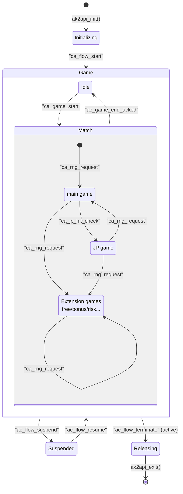

Copyright © 2017-2022 By Astro Corp. All Rights Reserved. Page 58
The information in this document is confidential, it may not be reproduced, stored, copied or otherwise retrieved and/or recorded in any form in whole, or in part, nor may any of the information contained therein be disclosed.

Astro Game Development Kits - Programming Guide (BASE)
AstroGDK 3.2 (AK2API 1.8.7 for Italian VLT)
Astro

## 3.2.2 Main Process and Read Configuration Data Flow

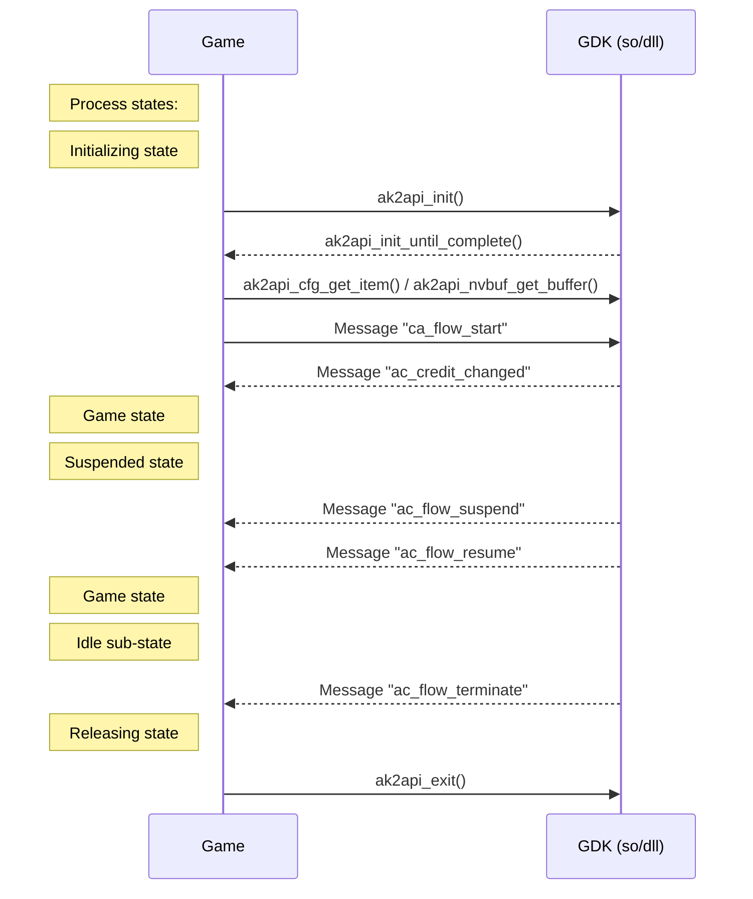

Content (game) process must call **ak2api_init()** first to initialize ak2api module, which build the communication between Content process and AstroKernel in non-blocking manner. After calling **ak2api_init()**, must repeatedly call **ak2api_init_until_complete()** until ak2api module is initialized successfully or error happened. The parameters passed to **ak2api_init()** tell this game whether supports central (system) jackpot, whether requests NVRAM buffer, and required I/O manner, etc.

When ak2api module is ready, game program would usually calls **ak2api_cfg_get_item()** and **ak2api_nvbuf_get_buffer()** to get essential configuration data and its NVRAM buffer, and start to initialize itself, e.g. load game data, construct data objects, etc., When initialization is totally done, game program must send message **"ca_flow_start"** to tell AstroKernel that the game program itself is ready and able to exchange generic messages. After sending **"ca_flow_start"**, AstroKernel will send message **"ac_credit_changed"** to tell the up-to-date current credits immediately.

Game program can call **ak2api_cfg_get_item()** anytime to fetch information of its identification, runtime environment information, or those configuration data passed to it. Please refer to **ak2api.h**

Copyright © 2017-2022 By Astro Corp. All Rights Reserved. Page 59
The information in this document is confidential, it may not be reproduced, stored, copied or otherwise retrieved and/or recorded in any form in whole, or in part, nor may any of the information contained therein be disclosed.

Astro Game Development Kits - Programming Guide (BASE)
AstroGDK 3.2 (AK2API 1.8.7 for Italian VLT)
Astro

and **ak2api_market_xxx.h** for complete references, and refer to Section 3.6 for explanation of those important configuration items especially for C6b market.

In cases of some special events like door opened, devices broken, link down, etc., AstroKernel would require game process to suspend its running by sending message "**ac_flow_suspend**". And then send "**ac_flow_resume**" to require going on while events disappeared or resolved. In suspended state - between "**ac_flow_suspend**" and "**ac_flow_resume**", game process will not receive any message from AstroKernel except "**ac_flow_resume**". Any message raised during period of suspended state will be queued internally first, and then sent to game process immediately right after "**ac_flow_resume**".

If AstroKernel requests to terminate the game process, would send message "**ac_flow_terminate**" to game process in **idle state**. If the game is not in idle state now, AstroKernel will wait until it is. While game process receives this message, must release and eventually quit itself by calling **ak2api_exit(0)**. A game process can also actively terminate itself by just calling **ak2api_exit()** directly with corresponding exit code which tells the reason of quit. About definition of exit codes, please refer to Section 3.3.2 for detail.

> ! Message "*ca_flow_stop*" is ignored by AstroKernel from AstroGDK 2.6. Game program need not send this massage any more. (from AstroGDK 2.6)

> ! Note! The standard way to quit game program is calling **ak2api_exit(exit_code)**. (from AstroGDK 2.6)

> ! Message "**ac_flow_terminate**" will be sent only when game is in **idle state** (not in any of other states). (from AstroGDK 2.6)

> ! In suspended state - between "**ac_flow_suspend**" and "**ac_flow_resume**", game process will not receive any message except "**ac_flow_resume**". (from AstroGDK 2.6)

Copyright © 2017-2022 By Astro Corp. All Rights Reserved. Page 60
The information in this document is confidential, it may not be reproduced, stored, copied or otherwise retrieved and/or recorded in any form in whole, or in part, nor may any of the information contained therein be disclosed.

Astro Game Development Kits - Programming Guide (BASE)
AstroGDK 3.2 (AK2API 1.8.7 for Italian VLT)
Astro

### 3.2.3 Game Flow

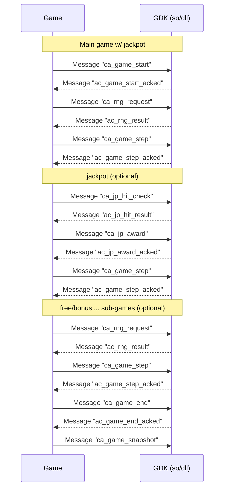

In **idle state**, while player bets, game must send message **"ca_game_start"** to AstroKernel to request starting a game match "match".

#### 3.2.3.1 Game Start
AstroKernel will acknowledge **"ca_game_start"** by message **"ac_game_start_acked"** with a flag **bool_enabled** is 1(true) or 0(false), which tells whether or not to go ahead. The flag **bool_enabled** may be 0(false) if,
(1) money spent had reached the limit (responsible gaming setting), or
(2) AstroKernel determined that current credits are not enough, or
(3) AstroKernel had decided requesting game program to quit.
In case of the **bool_enabled** is 0(false), game program must terminate the game match and just go back to **idle state** as if the game match never started.

Copyright © 2017-2022 By Astro Corp. All Rights Reserved. Page 61
The information in this document is confidential, it may not be reproduced, stored, copied or otherwise retrieved and/or recorded in any form in whole, or in part, nor may any of the information contained therein be disclosed.

Astro Game Development Kits - Programming Guide (BASE)
AstroGDK 3.2 (AK2API 1.8.7 for Italian VLT)
Astro

Usually message **"ac_game_start_acked"** would be replied very soon by AstroKernel after **"ca_game_start"** in normal situation. But in case of hitting the money limit (responsible gaming setting), AstroKernel will pop up a dialog box to ask player "Continue" or "Stop", and the **"ac_game_start_acked"** will be blocked until player answers. Please refer to Section 3.4 for detail.

Two scenarios of handling **"ac_game_start_acked"** with **bool_enabled=0(false)** as below diagrams:

### Sequence Diagram - Game Start Failed (Scenario 1)
```mermaid
sequenceDiagram
    participant Game
    participant AstroKernel
    Game->>AstroKernel: "ca_game_start"
    Note left of Game: start rolling wheels
    Note left of Game: keep on rolling
    AstroKernel-->>Game: "ac_game_start_acked"(bool_enabled=0)
    Note left of Game: stop rolling;<br/>back to idle state
```

### Sequence Diagram - Game Start Failed (Scenario 2)
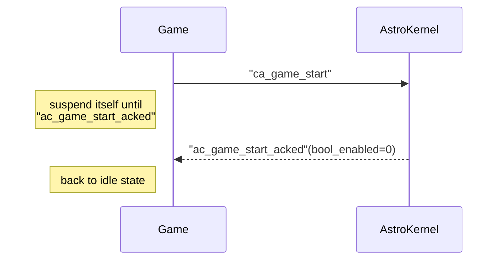

> **Note!** When receiving **"ac_game_start_acked"** with **bool_enabled=0**, game process must just go back to **idle state**. It means the game match is NOT allowed to begin by system.

When message **"ac_game_start_acked"** with **bool_enabled=1(true)** received, the game match is really begun. The first thing is usually about determining main game with random number(s). Game program requests one or more random numbers by sending message **"ca_rng_request"** for main game and optional following sub-game(s).

### 3.2.3.2 Random Number Request and Handle
Game program sends message **"ca_rng_request"** to request one or up to 63 random numbers at once and get random number(s) from message **"ac_rng_result"** soon later. Each random number returned is an unsigned integer and always in range of 0 to 2<sup>31</sup>-1 (0 ~ 2147483647). If game requests custom value ranges, e.g. 1 ~ 1024, must convert it by game program self, for example, in C/C++, may perform formula as below (% is 'modulus' operation returning remainder):

Copyright © 2017-2022 By Astro Corp. All Rights Reserved. Page 62
The information in this document is confidential, it may not be reproduced, stored, copied or otherwise retrieved and/or recorded in any form in whole, or in part, nor may any of the information contained therein be disclosed.

Astro Game Development Kits - Programming Guide (BASE)
AstroGDK 3.2 (AK2API 1.8.7 for Italian VLT)
Astro

```c
custom_random_number = (received_random_number % 1024) + 1;
```

> ! Note! Each random number provided by Astro game system is always an unsigned integer in range of 0 to 2147483647 ($2^{31} - 1$).

Some regulations, e.g. Italy C6b, request uniform distribution of individual random numbers without any bias. In this case game program must carry out modulus operation by power-of-2 value only. For example, it must get custom random numbers in range of like 0 ~ 7, 1 ~ 256, etc. NOT 0 ~ 6, 0 ~ 60.

```c
custom_random_number = received_random_number % 8;      (0 ~ 7, uniform distribution)
custom_random_number = received_random_number % 7;      (0 ~ 6, non-uniform / bias)
```

> ! Regulation C6b requires strict uniform distribution on all random numbers domain.

Right after handling the main game, optionally, may send message **"ca_jp_hit_check"** to check if hitting a central jackpot. If hitting, right after display the jackpot award information to player, game program must send message **"ca_jp_award"** to report the jackpot awarding was confirmed.

> ! Note! Only send message **"ca_jp_hit_check"** and **"ca_jp_award"** for central (system) jackpots. Don't send any of both for the local or other types of jackpots.

Right after raising **"ca_rng_request"** by game program, AstroKernel will take charge of requesting random numbers with central RNG. If meeting problem in central RNG module or bad networking, random number(s) cannot be received within a period, AstroKernel will request RNG over and over automatically until it gets the random number(s). The game may cancel the waiting by terminating itself suddenly by exit code **11** or **12**. The exit code 11 (RNG timeout) tells AstroKernel to just return bet amount to player as the game match not happened. The exit code 12 (Inner logic error) tells AstroKernel that the game met a fatal error of math / logic / state and could not go on, and requests AstroKernel to do recovery or reset the accounting states of the terminal before going further. About exit code, please refer to Section 3.3.2 or header file **ak2api.h** for detail.

After requesting RNG, game process must start a 'wait' timer to prevent from waiting forever. If the timer timed out, the game process must cancel the wait by terminating itself with specific exit code **11** or **12** depending on situation described in above paragraph. In case of meeting message **"ac_flow_suspend"** (entering **suspended state**) in period of requesting RNG, the game process

Copyright © 2017-2022 By Astro Corp. All Rights Reserved. Page 63
The information in this document is confidential, it may not be reproduced, stored, copied or otherwise retrieved and/or recorded in any form in whole, or in part, nor may any of the information contained therein be disclosed.

Astro Game Development Kits - Programming Guide (BASE)
AstroGDK 3.2 (AK2API 1.8.7 for Italian VLT)
Astro

must keep on waiting for random number(s). The 'wait' timer may or may not suspend in period of **suspended state**.

For examples:
*   In case of still counting timeout in period of **suspended state**, timeout may happen during suspended state if **suspended state** too long, and therefore cancel wait and terminate immediately when 'resume'.
*   In case of stopping counting timeout in period of **suspended state**. The 'timer' will stop counting during period of **suspended state**, and resume to count when 'resume'.

In experience and practice, it is strongly recommended to configure wait timeout of RNG request to 2 minutes.

> ! *Note! The wait timeout of RNG request should be configured to 2 minutes.*

Copyright © 2017-2022 By Astro Corp. All Rights Reserved. Page 64
The information in this document is confidential, it may not be reproduced, stored, copied or otherwise retrieved and/or recorded in any form in whole, or in part, nor may any of the information contained therein be disclosed.

Astro Game Development Kits - Programming Guide (BASE)
AstroGDK 3.2 (AK2API 1.8.7 for Italian VLT)
Astro

Three sequence diagrams below show how AstroKernel requests RNG over and over in case of network or central server problem until it gets random number(s) or until game process actively cancels it by just terminating itself with exit code 11 or 12.

### Sequence Diagram - Scenario 1 - Wait

```mermaid
sequenceDiagram
    participant Game
    participant AstroKernel
    participant RNG

    Game->>AstroKernel: request RNG
    loop retry
        AstroKernel-->>RNG: request RNG
        RNG--xAstroKernel: (lost / timeout)
    end
    RNG->>AstroKernel: (got)
    AstroKernel->>Game: random number
```

### Sequence Diagram - Scenario 2 - Cancel

```mermaid
sequenceDiagram
    participant Game
    participant AstroKernel
    participant RNG

    Game->>AstroKernel: request RNG
    loop retry
        AstroKernel-->>RNG: request RNG
        RNG--xAstroKernel: (lost / timeout)
    end
    Note left of Game: don't want to wait.<br/>exit(11);
    Note right of Game: show error message;<br/>back to Game lobby;<br/>return bet amount
```

### Sequence Diagram - Scenario 3 - Abort

```mermaid
sequenceDiagram
    participant Game
    participant AstroKernel
    participant RNG

    Game->>AstroKernel: request RNG
    loop retry
        AstroKernel-->>RNG: request RNG
        RNG--xAstroKernel: (lost / timeout)
    end
    Note left of Game: don't want to wait,<br/>and cannot go on;<br/>exit(12);
    Note right of Game: show error message;<br/>block VLT until<br/>recovery procedure<br/>by operator
```

Copyright © 2017-2022 By Astro Corp. All Rights Reserved. Page 65
The information in this document is confidential, it may not be reproduced, stored, copied or otherwise retrieved and/or recorded in any form in whole, or in part, nor may any of the information contained therein be disclosed.

Astro Game Development Kits - Programming Guide (BASE)
AstroGDK 3.2 (AK2API 1.8.7 for Italian VLT)
Astro

### 3.2.3.3 Game Steps
When game program requested and receives random number(s), will transfer it to outcome, which includes final won amount, main game, none or multiple sub-game(s), and symbols of wheels, won amount of main game and each sub-game, etc. Game program must send message "**ca_game_step**" for each game round (step) right before the game round will be displayed. AstroKernel will acknowledge "**ca_game_step**" with message "**ac_game_step_acked**" later soon. After getting "**ac_game_step_acked**", game program can start to display outcome of this step to player, and then start next step or end this match. The outcome data contained in message "**ca_game_step**" include (1) the won amount and visualization data of this step displayed to player, and if receiving random number(s) right before this step, will also include (2) the random number(s) received and used, and (3) the won amount derived from random number(s). Please see Section 3.5.5 for detail.

> ! Note! Outcome can be displayed / realized to player ONLY AFTER getting acknowledgment signal "**ac_game_step_acked**" from system. Refer to Section 3.3.3 for detail of sequence number and game recovery between game steps.

### 3.2.3.4 Game End
If having realized all outcome of a match, game process must send message "**ca_game_end**" to request to end the "match". The message also reports the summary of this match. AstroKernel will acknowledge it with message "**ac_game_end_acked**" very soon by AstroKernel in normal situation, except TAX procedure is triggered that AstroKernel will pop up a tax information box, and the "**ac_game_end_acked**" will be belatedly replied. Please refer to Section 3.4 for detail.

> ! Q: Can the game program simply suspend itself in period of "**ca_game_start**" and "**ac_game_start_acked**", period of during "**ca_game_step**" and "**ac_game_step_acked**", and period of during "**ca_game_end**" and "**ac_game_ended**".
> A: Yes, it should be OK. In practice situation, the "acked" message is usually very soon returned within 20~30 milliseconds. Several games are designed in this way.

### 3.2.3.5 Snapshot Request
Eventually, game process must always take a snapshot of the display of final outcome for every game match. After getting message "**ac_game_end_acked**", keep the final display of match frozen and send message "**ca_game_snapshot**" or "**ca_game_snapshot2**" immediately to request AstroKernel to do a snapshot. It's very different with other messages that the message "**ca_game_snapshot**" (or "**ca_game_snapshot2**") works in blocking manner, it takes about 50

Copyright © 2017-2022 By Astro Corp. All Rights Reserved. Page 66
The information in this document is confidential, it may not be reproduced, stored, copied or otherwise retrieved and/or recorded in any form in whole, or in part, nor may any of the information contained therein be disclosed.

Astro Game Development Kits - Programming Guide (BASE)
AstroGDK 3.2 (AK2API 1.8.7 for Italian VLT)
Astro

milliseconds blocking time before returning from function **ak2api_send_message()** for this message.

Astro VLT maps two physical monitors into a single logic video buffer. Message **"ca_game_snapshot"** takes the snapshot image from the bottom-half area of the logic video buffer. See below figure for concept.

The following diagram illustrates the mapping of physical monitors to the logic video buffer:

```mermaid
graph TD
    subgraph Physical_Monitors [Physical Monitors]
        UM[Upper monitor]
        LM[Lower monitor<br/>with Touch panel]
    end

    subgraph Logic_Video_Buffer [Video buffer]
        direction TB
        TopHalf[Top-half area]
        BottomHalf[Bottom-half area]
        
        subgraph Logic_View [Logic view]
            LV[1680x2100<br/>or 1920x2160]
        end
    end

    UM -.-> TopHalf
    LM -.-> BottomHalf
    
    Note1[AstroKernel takes snapshot<br/>from here] -- points to --> BottomHalf
    Origin["(0, 0)"] -- points to --> TopHalf
```

From AstroGDK 2.7, the new message **"ca_game_snapshot2"** is able to take the snapshot image from bottom-monitor or upper-monitor according to given parameter **'flag'**. If **flag=0**, it is totally the same manner with **"ca_game_shapshot"** the bottom area of video buffer (bottom monitor). If **flag=1**, it takes snapshot from the top-half of the video buffer.

All snapshot images are in form of JPG files stored in directory and file name as **"AstroGDK/Runtime/data/snapshot/snapNNN.jpg"** (NNN is the sequence number starts from 000, 001, 002, ..., so on, and then 998, 999, 000, ...).

### 3.2.3.6 Outcome Detail Report
About reporting outcome to central system, as described above, game process must send message **"ca_game_step"** to report outcomes of each round; and send message **"ca_game_end"** to report summary of this whole match. Some regulations, like C6b, may require detailed information of outcome, including the random numbers used, the symbols displayed to player, etc. of main game and derived sub-games. Outcome information is reported by field **"result"** of above two types of messages. The format of outcome detail may refer to Section 3.5.

Copyright © 2017-2022 By Astro Corp. All Rights Reserved. Page 67
The information in this document is confidential, it may not be reproduced, stored, copied or otherwise retrieved and/or recorded in any form in whole, or in part, nor may any of the information contained therein be disclosed.

Astro Game Development Kits - Programming Guide (BASE)
AstroGDK 3.2 (AK2API 1.8.7 for Italian VLT)
Astro

## 3.2.4 Accounting – Payout Flow

```mermaid
sequenceDiagram
    actor Player
    participant Game as Game program
    participant AK as AK2API<br/>AstroKernel

    Player->>Game: press cash-out button
    Game->>AK: "ca_credit_payout"

    rect rgb(240, 240, 240)
    Note over Player, AK: If AstroKernel accepts to do payout
    AK-->>Game: "ac_flow_suspend"
    Note right of AK: communicate with system
    Note right of AK: print ticket
    AK-->>Player: ticket
    AK-->>Game: "ac_flow_resume"
    AK-->>Game: "ac_credit_changed"
    end

    rect rgb(240, 240, 240)
    Note over Player, AK: If AstroKernel rejects to do payout
    AK-->>Game: "ac_flow_suspend"
    AK-->>Game: "ac_flow_resume"
    end
```

In **idle state**, a game process can request to pay out current credits by sending message **"ca_credit_payout"**. This action will raise a payout flow. AstroKernel will always reply message **"ac_flow_suspend"** immediately, and then carry out the payout. After had done the payout or maybe rejected it, AstroKernel will end the payout flow by sending message **"ac_flow_resume"**.

Usually, a successful payout would reset the current credits to zero, so a message **"ac_credit_changed"** would naturally be sent by AstroKernel right after message **"ac_flow_resume"** in case of successful payout.

New requirement for preventing from race conditions that game process must enter **suspend state** automatically when it sends message **"ca_credit_payout"** ( ignore arriving **"ac_flow_suspend"**), and resumed when receiving message **"ac_flow_resume"** later.

Copyright © 2017-2022 By Astro Corp. All Rights Reserved. Page 68
The information in this document is confidential, it may not be reproduced, stored, copied or otherwise retrieved and/or recorded in any form in whole, or in part, nor may any of the information contained therein be disclosed.

Astro Game Development Kits - Programming Guide (BASE)
AstroGDK 3.2 (AK2API 1.8.7 for Italian VLT)
Astro

> [!IMPORTANT]
> Note! Game program should send message **"ca_credit_payout"** only in cases of **idle state** and current credits are greater than zero.

> [!IMPORTANT]
> When error happened e.g. paper jam or printer malfunction in period of payout, game program will not be informed and need not do anything. Complicated payment transaction is transparent to game program.

Copyright © 2017-2022 By Astro Corp. All Rights Reserved. Page 69
The information in this document is confidential, it may not be reproduced, stored, copied or otherwise retrieved and/or recorded in any form in whole, or in part, nor may any of the information contained therein be disclosed.

Astro Game Development Kits - Programming Guide (BASE)
AstroGDK 3.2 (AK2API 1.8.7 for Italian VLT)
Astro

### 3.2.5 Accounting – Query Meter Flow

```mermaid
sequenceDiagram
    participant Game
    participant GDK as GDK (so/dll)
    Game->>GDK: Message "ca_meter_query"
    GDK->>Game: Message "ac_meter_info"
```

In **idle state** and **match state**, game process may query meter information anytime by sending message **"ca_meter_query"**.

The "AK2API" interface supports meters like "current_credits" <00C>, "total bet" <000>, "total win" <01C>, "total jp win" <01D>, "total in" <008>, "total out" <002>, etc. All are in units of cents or Eurocents. VLT game program usually refers only to "current_credits". The complete and detailed information please refer to message **"ac_meter_info"** described in **ak2api.h** and maybe **ak2api_market_<market_id>.h**.

Copyright © 2017-2022 By Astro Corp. All Rights Reserved. Page 70
The information in this document is confidential, it may not be reproduced, stored, copied or otherwise retrieved and/or recorded in any form in whole, or in part, nor may any of the information contained therein be disclosed.

Astro Game Development Kits - Programming Guide (BASE)
AstroGDK 3.2 (AK2API 1.8.7 for Italian VLT)
Astro

### 3.2.6 NVRAM Flow

```mermaid
sequenceDiagram
    participant Game
    participant GDK as GDK (so/dll)

    Note left of Game: Process states:
    Note left of Game: Initializing state
    Game->>GDK: ak2api_nvbuf_get_buffer()
    activate GDK
    deactivate GDK

    Note left of Game: Game state
    Game->>GDK: ak2api_nvbuf_commit()
    activate GDK
    deactivate GDK
    Game->>GDK: ak2api_nvbuf_if_synced()
    activate GDK
    GDK-->>Game: 
    deactivate GDK
```

NVRAM here means a kind of special storage device whose data stored inside will not lose even in period of power cycle. Game software may request an 8K-byte (8192) of block of NVRAM dedicated to it to store its private data inside. By passing member **bool_request_nvram=1** of struct **ak2msg_init_control** to function **ak2api_init()** and calling **ak2api_nvbuf_get_buffer()** later in **initializing state** to fetch a mirror buffer (NVRAM buffer) - a block of memory with its data mapping to NVRAM device.

Game process may read and write/update the NVRAM buffer. When a series of write/update action(s) are done, may call **ak2api_nvbuf_commit()** to raise a request to update "current modifications" in NVRAM buffer back to real NVRAM device.

It is always an atomic action to update data from NVRAM buffer to NVRAM device. It means the committed modifications will be totally written to NVRAM device or none. For example, after updating NVRAM buffer and then calling **ak2api_nvbuf_commit()**, meet an accident, e.g. power cycle. After reboot, data in NVRAM device will be the data before modified or the data completely at when calling **ak2api_nvbuf_commit()**.

In detail, function **ak2api_nvbuf_commit()** just copies the current NVRAM buffer into an inner memory buffer, raises an updating request, and returns immediately, totally in a non-blocking manner. The actual action of updating NVRAM devices is carried out in background. After returning from **ak2api_nvbuf_commit()**, game process can continue to read / write the NVRAM buffer and can call **ak2api_nvbuf_commit()** again. Sometimes game process must know whether the last

Copyright © 2017-2022 By Astro Corp. All Rights Reserved. Page 71
The information in this document is confidential, it may not be reproduced, stored, copied or otherwise retrieved and/or recorded in any form in whole, or in part, nor may any of the information contained therein be disclosed.

Astro Game Development Kits - Programming Guide (BASE)
AstroGDK 3.2 (AK2API 1.8.7 for Italian VLT)
Astro

committed modifications has been completely written to NVRAM before going further, e.g. significant accounting data updated, or game state changed, etc. To achieve this, game process can call **ak2api_nvbuf_if_synced()** to get the last sync (update) state whether the committed modifications had been written completely. Below sample codes show how to confirm whether all updates have been written to NVRAM device after the last **ak2api_nvbuf_commit()**:

```c
while ( ( result = ak2api_nvbuf_if_synced() ) == 1 ) {
    sleep few millisecond, or do something here.
}
if ( result == 0 )
    // success, all updates have been synced to NVRAM
```

Please refer to Section 3.3 where discusses relationship between NVRAM and game recovery.

Copyright © 2017-2022 By Astro Corp. All Rights Reserved. Page 72
The information in this document is confidential, it may not be reproduced, stored, copied or otherwise retrieved and/or recorded in any form in whole, or in part, nor may any of the information contained therein be disclosed.

Astro Game Development Kits - Programming Guide (BASE)
AstroGDK 3.2 (AK2API 1.8.7 for Italian VLT)
Astro

### 3.2.7 Low-level I/O Flow – Touch Panel

```mermaid
sequenceDiagram
    participant Game
    participant GDK as GDK (so/dll)
    GDK->>Game: Message "ac_touch_pressed"
    GDK->>Game: Message "ac_touch_released"
```

In **idle state** and **match state**, when player presses on or releases from the touch panel, AstroKernel will immediately send one of both messages with coordinate (x, y). Note, the coordinate (x, y) is logical coordinate, in range of left-top corner (0, 0) to right bottom (9999, 9999), relative to touch panel.

<table>
    <tr>
        <td>![Upper monitor]</td>
        <td></td>
    </tr>
    <tr>
        <td>![Lower monitor (with Touch panel) showing (0,0) at top-left and (9999,9999) at bottom-right]</td>
        <td>*Figure – logical coordinate mapping to touch panel.*</td>
    </tr>
</table>Alternatively, game program can also read system’s mouse event directly instead of touch panel messages described above. Handling touch panel messages or reading system mouse events have the same effect, so developer just chooses one method to implement. Some development environments, like Unity3D, read system mouse event by default and able to show more visual effects. The coordinate (x, y) returned from mouse event is the same with definition of X-window and usually in units of pixels. If resolution of each monitor is 1680x1050 for example (above figure), the returned coordinate of mouse pointer which clicks on the left-top corner of lower monitor will be (x=0, y=1050), on the left-bottom corner of lower monitor will be (x=0, y=2099).

Copyright © 2017-2022 By Astro Corp. All Rights Reserved. Page 73
The information in this document is confidential, it may not be reproduced, stored, copied or otherwise retrieved and/or recorded in any form in whole, or in part, nor may any of the information contained therein be disclosed.

Astro Game Development Kits - Programming Guide (BASE)
AstroGDK 3.2 (AK2API 1.8.7 for Italian VLT)
Astro

Many kinds of touch panels provide device drivers which support ability of transforming touch panel signal to mouse event. For these, AstroKernel keeps on polling incoming system mouse events and generates corresponding AK2API messages **"ac_touch_pressed"** and **"ac_touch_released"**. For those without this kind of ability, AstroKernel will provide the support of reading signals from the touch panel device and then convert each signal to system mouse event, as below:

### From physical touch panel (duplicate to two sources)

```mermaid
graph LR
    subgraph " "
    A[Physical touch panel] -- "Direct serial I/O" --> B[Touch Panel Module (AK)]
    B -- "Convert to mouse event" --> C(System Event Queue)
    B -- "ac_touch_pressed<br/>ac_touch_released" --> D[AK2API]
    C -- "get mouse event" --> E[Xlib]
    end
    
    style A fill:#5B9BD5,color:white
    style B fill:#70AD47,color:white
    style C fill:#8497B0,color:black
    style D stroke:none,fill:none
    style E stroke:none,fill:none
```

Game program may support multi-touch function. Please refer to Section 3.8.10 for detail.

Copyright © 2017-2022 By Astro Corp. All Rights Reserved. Page 74
The information in this document is confidential, it may not be reproduced, stored, copied or otherwise retrieved and/or recorded in any form in whole, or in part, nor may any of the information contained therein be disclosed.

Astro Game Development Kits - Programming Guide (BASE)
AstroGDK 3.2 (AK2API 1.8.7 for Italian VLT)
Astro

### 3.2.8 Low-level I/O Flow – Physical Buttons / Keys

```mermaid
sequenceDiagram
    participant Game
    participant GDK as GDK (so/dll)
    GDK->>Game: Message "ac_key_down"
    GDK->>Game: Message "ac_key_up"
```

In **idle state** and **match state**, when a player presses or releases any of physical buttons or an attendant rotates key switches, AstroKernel will immediately send one of both messages **"ac_key_down"** and **"ac_key_up"** with specific key id.

The definitions of key ids may be dependent on different target market and cabinet design, so the accurate definitions are always in market-dependent header file, e.g. **"ak2api_market_c6b.h"**.

Below lists all key id and light id defined in C6b market by Sisal for your reference:

<table>
  <tbody>
    <tr>
        <td>Virtual buttons<br/>(key id)</td>
        <td>Virtual backlits<br/>(light id)</td>
        <td>Physical buttons</td>
        <td>Comment in player's point of view</td>
    </tr>
    <tr>
        <th>payout</th>
        <th>payout</th>
        <th>TICKET OUT</th>
        <th>Press it to request payout.</th>
    </tr>
    <tr>
        <th>menu</th>
        <th>menu</th>
        <th>MENÙ</th>
        <th>Press it to request returning to Game lobby.</th>
    </tr>
    <tr>
        <th>auto</th>
        <th>auto</th>
        <th>AUTOSTART</th>
        <th>Press it to enable/disable AUTO PLAY.</th>
    </tr>
    <tr>
        <th>take</th>
        <th>take</th>
        <th>RACCOGLI</th>
        <th>Press it to collect win amount and/or energy point back to credits.</th>
    </tr>
    <tr>
        <th>min_bet</th>
        <th>min_bet</th>
        <th>MIN BET</th>
        <th>Press it to change bet amount to minimum and play once.</th>
    </tr>
    <tr>
        <th>max_bet</th>
        <th>max_bet</th>
        <th>MAX BET</th>
        <th>Press it to change bet amount to maximum and play once.</th>
    </tr>
    <tr>
        <th>cycle_bet</th>
        <th>cycle_bet</th>
        <th>CYCLE BET</th>
        <th>Press it to cycle each kind of bet amount the game supports.</th>
    </tr>
    <tr>
        <th>start</th>
        <th>start</th>
        <th>START</th>
        <th>Press it to play game once.</th>
    </tr>
  </tbody>
</table>

> [!IMPORTANT]
> Note! Not all types of cabinets support physical button CYCLE BET and/or button MIN BET.

Copyright © 2017-2022 By Astro Corp. All Rights Reserved. Page 75
The information in this document is confidential, it may not be reproduced, stored, copied or otherwise retrieved and/or recorded in any form in whole, or in part, nor may any of the information contained therein be disclosed.

Astro Game Development Kits - Programming Guide (BASE)
AstroGDK 3.2 (AK2API 1.8.7 for Italian VLT)
Astro

### 3.2.9 Low-level I/O Flow – Lights / Lamps

```mermaid
sequenceDiagram
    participant Game
    participant GDK as GDK (so/dll)
    Game->>GDK: Message "ca_light_on"
    Game->>GDK: Message "ca_light_off"
```

In **idle state** and **match state**, game program may control a specific light to be on or off by sending message **"ca_light_on"** or **"ca_light_off"** with specific light id. Majority of these lights are the backlight of physical buttons, so for these backlights, names of individual light ids are designed to be the same with corresponding button ids. When a game is launched, all lights are turned off by default.

> [!IMPORTANT]
> Note! When a game program is launched, right before entering, all lights are turned off by default.

The definitions of light ids, may be dependent on target market and cabinet design, so the accurate definitions are always in market-dependent header file, e.g. **"ak2api_market_c6b.h"**. Please refer to Section 3.2.8, header file **"ak2api_market_c6b.h"** or Section 1.4 for detail.

Copyright © 2017-2022 By Astro Corp. All Rights Reserved. Page 76
The information in this document is confidential, it may not be reproduced, stored, copied or otherwise retrieved and/or recorded in any form in whole, or in part, nor may any of the information contained therein be disclosed.

Astro Game Development Kits - Programming Guide (BASE)
AstroGDK 3.2 (AK2API 1.8.7 for Italian VLT)

### 3.2.10 Atmosphere Control

```mermaid
sequenceDiagram
    participant Game
    participant GDK as GDK (so/dll)
    Game->>GDK: Message "ca_atmosphere"/ON
    Game->>GDK: Message "ca_atmosphere"/OFF
```

In **idle state** and **match state**, game process may hope to control some devices to generate special effects to player. For example, while game win, flash the green lights and play special sound effects. Message **"ca_atomosphere"** and **"ca_atmosphere2"** can help to do that.

By sending message **"ca_atmosphere"** with specific atmosphere id, game process can request AstroKernel to play specific pre-designed effect. Of course, game software may control the sounds and lights totally by itself without applying this function. The definitions of atmosphere ids of message **"ca_atmosphere"** are usually dependent on target market and cabinet design, so the accurate definitions are always in market-dependent header file, e.g. **"ak2api_market_c6b.h"**. But it always has the basic atmosphere id "win" – to flash the topper green lamp or output green color to LED strip.

Message **"ca_atmosphere2"** is new from AstroGDK 2.0 and only effective for those cabinets decorating LED strips. Game program sends this message with a piece of script to directly control color, luminance, and animation of LED strips. A single script can contain one or more LED control commands together. About syntax and functions of LED control commands, please directly refer to header file **ak2api.h** for detail.

The image shows a computer monitor with a blue LED light strip glowing around its outer frame.

Figure – LED strip around monitor.

Copyright © 2017-2022 By Astro Corp. All Rights Reserved. Page 77
The information in this document is confidential, it may not be reproduced, stored, copied or otherwise retrieved and/or recorded in any form in whole, or in part, nor may any of the information contained therein be disclosed.

Astro Game Development Kits - Programming Guide (BASE)
AstroGDK 3.2 (AK2API 1.8.7 for Italian VLT)
Astro

In period of Game lobby, game loading, or no message **“ca_atmosphere”** or **“ca_atmosphere2”** takes effect now, AstroKernel will take output control of LED strip. AstroKernel may output several default scenario to LED strip in cases of normal or error situations. When message **“ca_atmosphere”** or **“ca_atmosphere2”** arrives, AstroKernel will always terminate current scenario and run the new arriving one immediately.

For cabinet without LED strip, the message **“ca_atmosphere2”** is ignored. For cabinet with LED strip, both messages **“ca_atmosphere”** and **“ca_atmosphere2”** are output to LED strip.

### 3.2.11 Call for System Dialog
Not supported for Italian market for the time being.

### 3.2.12 Wins Crosses Game Matches (Cashpot-type Game)
This is a special type of game supporting storing win amount in a Cash pot and may be later collected by player or reset to zero due to certain symbol happened.
Not supported and also not compliant with Italian VLT Regulation.

Copyright © 2017-2022 By Astro Corp. All Rights Reserved. Page 78
The information in this document is confidential, it may not be reproduced, stored, copied or otherwise retrieved and/or recorded in any form in whole, or in part, nor may any of the information contained therein be disclosed.

Astro Game Development Kits - Programming Guide (BASE)
AstroGDK 3.2 (AK2API 1.8.7 for Italian VLT)
Astro

## 3.3 Game Recovery

### 3.3.1 Introduction
When a game program is running but meets certain accident like power cycle, or something which leads the game program terminated abnormally, the game program will usually be re-launched automatically by AstroKernel after booting. In this kind of re-launch, the game program has the major responsibility to do the "Game Recovery" which means to recover itself to the state right before accident and then go ahead. If the game program is launched in a normal way - player selected it on the Game lobby, not re-launched automatically by AstroKernel, the game program does not need to do the "Game Recovery" and always start in **idle state**.

A game program can allocate an 8K-byte (8192 bytes) block of NVRAM to store its private data, for example, like current states, persistent data, inner counters, etc. for purpose of later game recovery.

When a game program is launched, it must always refer to its NVRAM buffer in very early phase to determine whether or not doing game recovery. If the data inside are **all zero's (0's) filled**, it means the game program is launched in a normal way - player selected it on the Game lobby, therefore no game recovery is required. Game program may fill NVRAM with custom data, and always begin in **idle state**. If the data inside **are valid**, it means the game program is re-launched automatically by AstroKernel after booting, game program must do "Game Recovery" to continue from its previous state according to the data. If the data inside **are destroyed or corrupted**, the game program must terminate itself immediately with exit code 12 (Inner logic error). Game program must have the ability to validate stuff of NVRAM buffer, to determine one of three states: (1) all zero's, (2) valid data, (3) invalid data.

When a game program is running, AstroKernel always keeps on monitoring state of the game process. If detecting game process is terminated in abnormal way or meeting power cycle, AstroKernel will re-launch the same game program, not Game lobby, as the first process after booting, and then the game program will be required to do game recovery. If detecting game program is terminated in normal way, AstroKernel will just re-activate the Game lobby. About the detection of termination state, AstroKernel will refer to (1) the exit code and (2) the last game state of the game process, to determine whether or not the game program was terminated in a normal way.

Copyright © 2017-2022 By Astro Corp. All Rights Reserved. Page 79
The information in this document is confidential, it may not be reproduced, stored, copied or otherwise retrieved and/or recorded in any form in whole, or in part, nor may any of the information contained therein be disclosed.

Astro Game Development Kits - Programming Guide (BASE)
AstroGDK 3.2 (AK2API 1.8.7 for Italian VLT)
Astro

**If a game is launched in a normal way - selected by player in Game lobby, AstroKernel will reset the game’s NVRAM by filling all zero’s before launching the game program.** The game program will see its NVRAM buffer all zero’s and therefore initialize the NVRAM buffer and start in **idle state**.

In certain situation, game program must refer to the configuration item “run_mode”/“step_seq_acked” to recover itself to a special state. Refer to Section 3.3.3 for more detail.

> ! When game recovery was required, doesn’t forget to also restore states of button lights.

### 3.3.2 Exit Code
A game program may quit in normal or abnormal situation. No matter what situations lead to quit, the last call is usually like **ak2api_exit(exit_code)** which returns the exit code to its parent process - AstroKernel. It’s very important for AstroKernel to refer to **exit_code** of game process to decide how to continue.

“AK2API” provides function **ak2api_exit(exit_code)** for game program to pass **exit_code** to AstroKernel and terminate itself immediately. It is very similar to C function **exit(exit_code)**, but **ak2api_exit(exit_code)** provides more reliable means to deliver **exit_code** to AstroKernel.

More detail following. Function **ak2api_exit(exit_code)** uses a special way which guarantees to deliver passed **exit_code** to AstroKernel, but exit() does not and may be possible to pass tampered exit code back in some cases. For example, if encountering “Segmentation Fault” in period of terminating process, will change exit code to 11. **ak2api_exit(exit_code)** is especially designed for those complex game programs, e.g. many running threads and/or poor-managed resources, requiring quit immediately and guarantee sending expected exit code to AstroKernel. Always call **ak2api_exit()**, not exit(), to terminate your game programs. Please refer to header file **ak2api.h** for more detail.

> ! Always call **ak2api_exit()**, not C function **exit()** or **_exit()**, to terminate your game programs. (from AstroGDK 2.6)

> ! Note! Function **ak2api_destroy()** is declared **obsolete**. Please just call **ak2api_exit()** without prior **ak2api_destroy()**. (from AstroGDK 2.6)

Copyright © 2017-2022 By Astro Corp. All Rights Reserved. Page 80
The information in this document is confidential, it may not be reproduced, stored, copied or otherwise retrieved and/or recorded in any form in whole, or in part, nor may any of the information contained therein be disclosed.

Astro Game Development Kits - Programming Guide (BASE)
AstroGDK 3.2 (AK2API 1.8.7 for Italian VLT)
Astro

Briefing each exit code below:

<table>
  <tbody>
    <tr>
        <td>Exit code</td>
        <td>Name of exit</td>
        <td>Condition</td>
    </tr>
    <tr>
        <th>0</th>
        <th>Normal exit in idle</th>
        <th>Game exits normally.</th>
    </tr>
    <tr>
        <th>11</th>
        <th>RNG timeout</th>
        <th>Request random number(s) for main game (bet amount from current credit) but time-out. After quit, the last bet amount will be returned.<br/>(Please refer to figure Sequence Diagram–Scenario 2 in Section 3.2.3)</th>
    </tr>
    <tr>
        <th>12</th>
        <th>Inner logic error</th>
        <th>Encounter fatal error about math, logic, state, NVRAM data corrupted, and those incidents which cannot be recovered / handled anymore.<br/>(Please refer to figure Sequence Diagram–Scenario 3 in Section 3.2.3)</th>
    </tr>
    <tr>
        <th>13</th>
        <th>Generic I/O error</th>
        <th>Encounter error about open, create, read / write, manipulate files and data. E.g. file not exist, wrong file size, file / data corrupted, wrong file / data format, CRC error, exec process failed, etc.</th>
    </tr>
    <tr>
        <th>14</th>
        <th>Out of system resource error</th>
        <th>Encounter error about allocating memory or system resource, etc.</th>
    </tr>
    <tr>
        <th>19</th>
        <th>AK2API error</th>
        <th>Calling AK2API function but it, even after several retries, returns error code, including meeting IPC broken or AstroKernel terminated.</th>
    </tr>
    <tr>
        <th>20</th>
        <th>Other error</th>
        <th>Encounter error not listed above.</th>
    </tr>
    <tr>
        <th>(others)</th>
        <th>(Reserved)</th>
        <th>(Reserved and do not use)</th>
    </tr>
  </tbody>
</table>

More technical detail of each exit code below:

<table>
  <tbody>
    <tr>
        <td>Exit code</td>
        <td>Detail</td>
    </tr>
    <tr>
        <th>0</th>
        <th>● Game program exit( 0 ) only in case of **idle state**.<br/>● If AstroKernel receives exit_code=0 but game is not in **idle state** then, AstroKernel will see game as quit by exit_code=20 (Other error).</th>
    </tr>
    <tr>
        <th>11</th>
        <th>● Game program exit( 11 ) only in case of requesting random number(s) for main game but time-out, and **game program understands that returning the last bet amount to player (current credits) is safe without problem.**<br/>(The main / base game is the first game round in a game match and its bet amount is from current credits.)<br/>● When AstroKernel receives exit_code=11 and if game state is in **match state** then, AstroKernel will return the bet amount back to current credits, see the game state is ended in **idle state**, and then launch Game lobby. If game state is not in **match state**, AstroKernel will just launch Game lobby without returning bet amount.</th>
    </tr>
    <tr>
        <th>12</th>
        <th>● Game program exit( 12 ) while encountering unrecovered error or state, e.g. the game</th>
    </tr>
  </tbody>
</table>

Copyright © 2017-2022 By Astro Corp. All Rights Reserved. Page 81
The information in this document is confidential, it may not be reproduced, stored, copied or otherwise retrieved and/or recorded in any form in whole, or in part, nor may any of the information contained therein be disclosed.

Astro Game Development Kits - Programming Guide (BASE)
AstroGDK 3.2 (AK2API 1.8.7 for Italian VLT)
Astro

<table>
  <tbody>
    <tr>
        <td rowspan="3"></td>
        <td>program has gone to an unhandled state that’s not considered in design, accounting data corrupted or consistency broken, NVRAM data corrupted and unable to recover automatically, etc., and the only way to resolve is to reset the terminal by operator.</td>
        <td></td>
    </tr>
    <tr>
        <td>*</td>
        <td>The majority of conditions to raise exit( 12 ) in C6b game are about incomplete random number sequence in one game match. Regulation C6b cannot accept a game match without required number of random numbers to determine it. E.g. if a game match had got one or partial random numbers and had realized them before but cannot get remaining random numbers needed for the game match, the game program must exit( 12 ).<br/>E.g. a game match requires three random numbers to completely determine its outcome. Has got two random numbers, but cannot get the third random number for a long time over a defined limit. The game match cannot be closed and cannot go on either, so the only way to go on is to exit( 12 ) to request resetting the terminal by operator.</td>
    </tr>
    <tr>
        <td>*</td>
        <td>When AstroKernel receives exit_code=12, will keep on blocking the terminal forever, even after power cycle / reboot. To resolve it, operator must do action of “force detach” to the terminal through POS or Management console (Back office). “Force detach” will cash out a balance ticket (to player) and reset all accounting state and game state of the terminal, and therefore any of games launched later will be in **idle state** by default.</td>
    </tr>
    <tr>
        <td>13, 14, 19, 20, (others)</td>
        <td>*</td>
        <td>AstroKernel assumes these problems are possible to be solved by re-running the game program, e.g. out of memory event leads to exit( 14 ).</td>
    </tr>
    <tr>
        <td></td>
        <td>*</td>
        <td>When AstroKernel receives one of these exit codes, will block the terminal for few minutes to display message on monitor, and then power cycle (reboot) the terminal.<br/>After power cycle (rebooting), AstroKernel will re-launch the same game later. The game will do game recovery and have the chance to go on.</td>
    </tr>
    <tr>
        <td></td>
        <td>*</td>
        <td>A kind of situation would happen that if problem could not be solved by power cycle, the terminal would keep on power cycle over and over. Operator can eventually do action “force detach” to stop this situation.</td>
    </tr>
    <tr>
        <td></td>
        <td>*</td>
        <td>The ultimate way, operator can do action of “force detach” to the terminal through POS or Management console (Back office) to cash out a balance ticket (to player) and reset accounting and game states of the terminal.</td>
    </tr>
  </tbody>
</table>

By the way, it’s a good practice, before exiting program in any case, program should do its best to release all resources allocated, and eventually call **ak2api_exit(exit_code)** to exit, example below:

```c
// release resources allocated before.
// close handles, close files, free memory ...
...
ak2api_exit( exit_code );
```

Copyright © 2017-2022 By Astro Corp. All Rights Reserved. Page 82
The information in this document is confidential, it may not be reproduced, stored, copied or otherwise retrieved and/or recorded in any form in whole, or in part, nor may any of the information contained therein be disclosed.

Astro Game Development Kits - Programming Guide (BASE)
AstroGDK 3.2 (AK2API 1.8.7 for Italian VLT)
Astro

> ! Note! The standard way to quit game program is to call **ak2api_exit(exit_code)**. (mandatory from AstroGDK 2.6)

### 3.3.3 Programming of Game Recovery

A game programmer must always keep in mind that the power cycle and abnormal termination would happen in any time and on any of codes. So it's necessary to analyze and then design several recovery points for game recovery. When game recovery is required, game program will be able to recover itself to the last state – one of those recovery points actually. This usually requires enough experience in system programming.

"Atomic action" is an important concept in programming to keep data and state integrity. For game recovery requirement, it often means state and related data must be updated to NVRAM device total completely or none at all. For example, when game program receives random number and converts it to outcome (set of symbols, win amount, free game number, etc.), must store new game state and outcome data to NVRAM in atomic action.

"Principle of retransmission request" is another important concept to prevent from losing actions and data. If game program sends a request and then meet power cycle (or terminated abnormally) before getting reply or acknowledgement of that request, the game program has the responsibility of retransmitting last request again. For example, game program sends message "**ca_game_start**" and then meets power cycle before receiving "**ac_game_start_acked**", game program must send message "**ca_game_start**" again when game recovery.

For VLT/C6b game, the outcome of a game step (game round) can be displayed and realized to player ONLY AFTER "acknowledgement signal of the game step" is received and committed to game's NVRAM device. If the outcome of a game step had been acknowledged by system, but then meeting power cycle before it could be sent or committed to game's NVRAM, when the game program is re-launched after power cycle, the configuration item "**run_mode**"/"**step_seq_acked**" will be valued greater than 0 which indicates the sequence number of the last acknowledged game step. In this situation, three possibilities below:

*   if game is in **match state**, and awaiting "**ac_game_step_acked**" and sequence number matches, will see last game step had been acknowledged by system, and therefore must commit/sync it to game's NVRAM device, and then realize and display it.

Copyright © 2017-2022 By Astro Corp. All Rights Reserved. Page 83
The information in this document is confidential, it may not be reproduced, stored, copied or otherwise retrieved and/or recorded in any form in whole, or in part, nor may any of the information contained therein be disclosed.

Astro Game Development Kits - Programming Guide (BASE)
AstroGDK 3.2 (AK2API 1.8.7 for Italian VLT)
Astro

*   If game is in **match state**, but not awaiting **"ac_game_step_acked"** or sequence number does not match, just ignore configuration item **“run_mode”/“step_seq_acked”**, and usually go on to restart last game step. Follow “Principle of retransmission request” described above.
*   If game is NOT in **match state**, means the states between AstroKernel and game are not synchronized, game program must terminate with exit code **12** (Inner logic error).

Below sequence diagrams provide concepts of programming about game recovery and sample recovery points. These recovery points are just for reference, and you may have your design. Also need to know something about below diagrams:
*   Things inside one yellow box must be carried out in atomic action.
*   “commit/sync” means to write completely to NVRAM device.

Copyright © 2017-2022 By Astro Corp. All Rights Reserved. Page 84
The information in this document is confidential, it may not be reproduced, stored, copied or otherwise retrieved and/or recorded in any form in whole, or in part, nor may any of the information contained therein be disclosed.

Astro Game Development Kits - Programming Guide (BASE)
AstroGDK 3.2 (AK2API 1.8.7 for Italian VLT)
Astro

### (1) Game start and Game step:

**Sequence Diagram - Game start and Game step (NVRAM/Recovery)**

```mermaid
sequenceDiagram
    participant Game
    participant AstroKernel

    Note over Game: player bet
    Note over Game: commit/sync "game started" flag and bet amount
    Note left of Game: [recovery point 1]
    Game->>AstroKernel: "ca_game_start" (bet amount)
    Note over AstroKernel: confirm and store
    AstroKernel->>Game: "ac_game_start_acked" (bool_enabled=1)
    Note over Game: commit/sync "game start acked" flag
    Note left of Game: [recovery point 2]
    Note over Game: game step seq#1
    Note over Game: commit/sync "step started seq#1" flag
    Note left of Game: [recovery point 3: "step started"]
    Game->>AstroKernel: "ca_rng_request"
    Note over AstroKernel: request RNG with central
    AstroKernel->>Game: "ac_rng_result" (Random number)
    Note over Game: produce Outcome from Random number
    Note over Game: commit/sync Outcome (without Random number)
    Game->>AstroKernel: "ca_game_step" (seq#1)<br/>(formated Outcome with Random number)
    Note over AstroKernel: confirm and store
    Note right of AstroKernel: [recovery point A1: "step determined"]
    AstroKernel->>Game: "ac_game_step_ack"
    Note over Game: commit/sync "step acked" flag<br/>(acknowledgement signal)
    Note left of Game: [recovery point 4: "step acked"]
    Note over Game: display outcome, and<br/>able to start next step (or game end)
    Note over Game: game step seq#2
    Note over Game: commit/sync "step started seq#2" flag
    Note left of Game: [recovery point 3: "step started"]
```

Copyright © 2017-2022 By Astro Corp. All Rights Reserved. Page 85
The information in this document is confidential, it may not be reproduced, stored, copied or otherwise retrieved and/or recorded in any form in whole, or in part, nor may any of the information contained therein be disclosed.

Astro Game Development Kits - Programming Guide (BASE)
AstroGDK 3.2 (AK2API 1.8.7 for Italian VLT)
Astro

Remark:
*   The box "commit/sync Outcome (without Random number)" means to store Outcome (in your format) in game's NVRAM device. It cannot contain information of random number if this is C6b game, it is mandatory by Regulation.
*   One game step may request none, one, or multiple random numbers to determine this game step (game round).
*   [recovery point 2] and [recovery pointer 3] could be combined to one recovery point.
*   For AstroKernel, if meeting power cycle after [recovery point A1] and before receiving next "**ca_game_step**" and/or "**ca_game_end**", it will always have the configuration item "run_mode" / "step_seq_acked" valued greater than 0.

### (2) Startup of game program:

Sequence Diagram - Startup (NVRAM/Recovery)

```mermaid
graph TD
    START(( )) --> INIT[ak2api_init()<br/>ak2api_init_until_complete()]
    INIT --> IS_RECOVERY{configuration run_mode.mode == "recovery"}
    
    IS_RECOVERY -- no --> EXIT0(exit(0))
    EXIT0 --> END1(( ))
    
    IS_RECOVERY -- yes --> NVRAM_ZERO{nvram all zero's?}
    
    NVRAM_ZERO -- yes --> INIT_NVRAM[init nvram, and<br/>start in idle state]
    
    NVRAM_ZERO -- no --> NVRAM_CORRUPT{nvram corrupted?}
    
    NVRAM_CORRUPT -- yes --> EXIT12_1(exit(12))
    EXIT12_1 --> END2(( ))
    
    NVRAM_CORRUPT -- no --> STEP_ACKED{configuration run_mode.step_seq_acked(seq#N) > 0}
    
    STEP_ACKED -- no --> RECOVERY_USUAL[recovery from nvram as usual]
    
    STEP_ACKED -- yes --> MATCH_STATE{is in match state?}
    
    MATCH_STATE -- no --> EXIT12_2(exit(12))
    EXIT12_2 --> END3(( ))
    
    MATCH_STATE -- yes --> WAITING_ACK{"is waiting \"ac_game_step_acked\"(seq#N)?"}
    
    WAITING_ACK -- no --> IGNORE[ignore it<br/>recovery from nvram as usual]
    
    WAITING_ACK -- yes --> REGARD[regard as "ac_game_step_acked" received<br/>store the signal to nvram]
    
    REGARD --> DISPLAY[display/realize outcome<br/>(stored in nvram before)]
    
    INIT_NVRAM --> JOIN1{ }
    RECOVERY_USUAL --> JOIN1
    IGNORE --> JOIN1
    DISPLAY --> JOIN1
    
    JOIN1 --> END4(( ))
```

Copyright © 2017-2022 By Astro Corp. All Rights Reserved. Page 86
The information in this document is confidential, it may not be reproduced, stored, copied or otherwise retrieved and/or recorded in any form in whole, or in part, nor may any of the information contained therein be disclosed.

Astro Game Development Kits - Programming Guide (BASE)
AstroGDK 3.2 (AK2API 1.8.7 for Italian VLT)
Astro

### (3) Termination of game program:

A special situation may happen. When game process was terminated with specific exit code, it is possible to meet power cycle before AstroKernel receives and handles the exit code. So after rebooting, the game program will be re-launched automatically and required game recovery.

Below strategies describe how to handle above situation:
*   For exit code=0, 11, 12, refer to the below diagram. When re-launched, game program will recover and start from [recovery point: "exit"], and therefore just terminate with the same exit code immediately.

**Sequence Diagram - Exit for exit_code= 0, 11, 12 (Recovery)**

```mermaid
sequenceDiagram
    participant Game
    participant AstroKernel

    Note over Game, AstroKernel: After Initialization

    Note right of Game: intend to exit
    Note right of Game: commit/sync "exit_code=0, 11, or 12"
    Note left of Game: [recovery point: "exit"]
    Game->>Game: exit( exit_code )
    Game-->>AstroKernel: exit code
    Note right of AstroKernel: got exit code
```

*   For all other exit codes (not 0, 11, 12), suggest to give the chance to retry last procedure again, so just recover to the last recovery point. So when quitting with these kinds of exit codes, do not need to commit/sync exit code and not create the [recovery point: "exit"] as above diagram.

Note, it makes no sense to set any [recovery point] in Initialization phase of game program.

Copyright © 2017-2022 By Astro Corp. All Rights Reserved. Page 87
The information in this document is confidential, it may not be reproduced, stored, copied or otherwise retrieved and/or recorded in any form in whole, or in part, nor may any of the information contained therein be disclosed.

Astro Game Development Kits - Programming Guide (BASE)
AstroGDK 3.2 (AK2API 1.8.7 for Italian VLT)
Astro

## 3.4 System and Regulation-Related Events
A very basic requirement of terminal is, when certain events like "Door open", "Linking down", "Tax information", "Warning of responsible gaming", etc. happened, the game-play must be frozen and corresponding information will be showed up on display.

Good news is that, most system and regulation-related events are monitored, handled, and displayed by AstroKernel. Game program does not need to handle these types of events except suspended only. Detailed situations will be described in below paragraphs.

### 3.4.1 Incident and Security Events
When any of incidents of device/network/security, like "door open", "logic box open", "linking down", "paper out", "bill Jam", etc., are detected by AstroKernel, AstroKernel will immediately send **"ac_flow_suspend"** to request game process to freeze game's display and flow, and at the same time AstroKernel will pop up a message box to display the incident message box until the incident is gone away. Sequence diagram as below left:

#### Sequence Diagram - Incidents Detected
```mermaid
sequenceDiagram
    participant Game
    participant AstroKernel
    Note over Game, AstroKernel: any of incedents detected
    AstroKernel->>Game: "ac_flow_suspend"
    Note right of AstroKernel: show incident message up<br/>until all incidents vanished
    AstroKernel->>Game: "ac_flow_resume"
```

#### Sequence Diagram - Tax Info
```mermaid
sequenceDiagram
    participant Game
    participant AstroKernel
    Game->>AstroKernel: "ca_game_end"
    AstroKernel->>Game: "ac_game_end_acked"(net_won)
    Note over Game, AstroKernel: If Tax happened
    AstroKernel->>Game: "ac_flow_suspend"
    Note right of AstroKernel: show "tax info"<br/>for about 10 seconds<br/>[Close]
    AstroKernel->>Game: "ac_flow_resume"
```

### 3.4.2 Tax Information
When total win amount of a game match exceeds pre-defined threshold, AstroKernel will pop up a message box containing tax information, including win amount, tax percentage, tax threshold, tax amount, net amount, etc. for about 10 seconds. See the sequence diagram in above right.

Copyright © 2017-2022 By Astro Corp. All Rights Reserved. Page 88
The information in this document is confidential, it may not be reproduced, stored, copied or otherwise retrieved and/or recorded in any form in whole, or in part, nor may any of the information contained therein be disclosed.

Astro Game Development Kits - Programming Guide (BASE)
AstroGDK 3.2 (AK2API 1.8.7 for Italian VLT)
Astro

### 3.4.3 Responsible Gaming

About responsible gaming, a.k.a. healthy hint, a player can configure limits of time and money in Game lobby beforehand. When reaching any of limits, e.g. time is up, AstroKernel will pop up a dialog box asking player to "continue" or "stop" the game-play. Sequence diagrams as below:

#### Sequence Diagram - Money Limit

```mermaid
sequenceDiagram
    participant Game
    participant AstroKernel

    Game->>AstroKernel: "ca_game_start"
    
    Note over Game, AstroKernel: If reaching money limit
    
    AstroKernel->>Game: "ac_flow_suspend"
    Note right of AstroKernel: show dialog to ask<br/>[Continue] or [Stop]?
    AstroKernel->>Game: "ac_flow_resume"
    
    rect rgb(240, 240, 240)
    Note over Game, AstroKernel: Continue
    AstroKernel->>Game: "ac_game_start_acked"(bool_enabled=1)
    Note left of Game: (as usual)
    end
    
    rect rgb(240, 240, 240)
    Note over Game, AstroKernel: Stop
    AstroKernel->>Game: "ac_game_start_acked"(bool_enabled=0)
    AstroKernel->>Game: "ac_flow_terminate"
    Note left of Game: entering "idle" state
    Note left of Game: release and exit(0)
    end
```

#### Sequence Diagram - Time Limit

```mermaid
sequenceDiagram
    participant Game
    participant AstroKernel

    Note right of AstroKernel: time is up
    AstroKernel->>Game: "ac_flow_suspend"
    Note right of AstroKernel: show dialog to ask<br/>[Continue] or [Stop]?
    AstroKernel->>Game: "ac_flow_resume"
    
    rect rgb(240, 240, 240)
    Note over Game, AstroKernel: Continue
    Note left of Game: (as usual)
    end
    
    rect rgb(240, 240, 240)
    Note over Game, AstroKernel: Stop
    AstroKernel->>Game: "ac_flow_terminate"
    Note left of Game: entering "idle" state
    Note left of Game: release and exit(0)
    end
```

Copyright © 2017-2022 By Astro Corp. All Rights Reserved. Page 89
The information in this document is confidential, it may not be reproduced, stored, copied or otherwise retrieved and/or recorded in any form in whole, or in part, nor may any of the information contained therein be disclosed.

Astro Game Development Kits - Programming Guide (BASE)
AstroGDK 3.2 (AK2API 1.8.7 for Italian VLT)
Astro

## 3.5 Outcome Detail

### 3.5.1 Introduction
Regulation C6b requires storing information of game outcome in Central system. Because outcome is realized inside game program, game program has the responsibility to report the information of outcome detail to AstroKernel and then Central system through "AK2API".

The information of outcome detail must include but not limit, the random number(s) used, the symbols displayed to player, the bet and won amount, etc., of main game and of sub-games like free game, risk game, bonus game, double up, extra spin, energy game, etc. On the whole, **reported information must be enough to reconstruct and verify the same game match totally.** The format of outcome detail is basically required to be friendly and readable enough for certain people.

Game program sends message **"ca_game_step"** with the field **"result"** filled with outcome detail of each game round (main game and sub-games) and finally sends message **"ca_game_end"** with field **"result"** filled with summary of the game match. The field **"result"** can only fill string up to 199 visible characters plus tailed '\0'(NUL) character. Invisible and control characters like 'BACKSPACE', 'NUL', etc. are not allowed.

Basic definition of outcome detail:
*   Game match vs. Game round: a "Game match" is composed of one or more "Game rounds".
*   Outcome vs. Outcome detail: an "Outcome" of a game match is combined of all "Outcome detail" of each game round plus the eventual summary.
*   Basic format of an outcome detail: an outcome detail is formed by a string containing visible characters of ASCII 32 ~ 127. Special or multi-byte characters are ~~not~~ allowed. Each column / field inside the string is separated by character '|'.
*   The column "RN:\<numbers>": the values of random number(s) which were from Central RNG and was used for determining the outcome. Those not from Central RNG or not used for determining outcome cannot be stored in the column.
    For example, at a certain moment, the game program requested 5 random numbers and 831234567, 234560178, 1334013923, 204567890, 867890101 received, the game program only uses the first three random numbers to calculate outcome and denies the last two. It then rescales the three random numbers to values 67, 78, and 89 for final outcome calculation. The column `RN` must be "RN: 831234567,234560178,1334013923".

Copyright © 2017-2022 By Astro Corp. All Rights Reserved. Page 90
The information in this document is confidential, it may not be reproduced, stored, copied or otherwise retrieved and/or recorded in any form in whole, or in part, nor may any of the information contained therein be disclosed.

Astro Game Development Kits - Programming Guide (BASE)
AstroGDK 3.2 (AK2API 1.8.7 for Italian VLT)
Astro

> Note! columen “RN:\<numbers>”: the values stored must be just those random numbers (direct values) come from central RNG and really used to determine outcome. Those not from central RNG and not used for determining outcome cannot be stored here.

### 3.5.2 Format of Outcome Detail and Summary

Notation in below format description:
*   `<...>` variables / data
*   `[...]` optional
*   `|` character ‘ | ’, used as the separator of adjacent columns (not meanings of “or”). Note! Don’t contain ‘ | ’ inside the data of column.

#### (1) Main game / MG

`RN:<numbers>|MG|STK:<amount>|WIN:<amount>|<other data/fields describing this main game>`
or
`[RN:<numbers>|]MG|VSTK:<amount>|WIN:<amount>|<other data/fields describing this main game>`

*   `RN:<numbers>`: the central random number(s) used for the main (base) game;
*   `MG`: type of outcome detail: main (base) game;
*   `STK:<amount>`: the bet amount from “current credit” in units of cents;
*   `VSTK:<amount>`: the virtual/displayed bet amount (no accounting changed);
*   `WIN:<amount>`: the win amount in units of cents;

If main game supports function like “holding and change symbols”, it is possible to have multiple main game rounds. See below example.

#### (2) Energy game / EG

`RN:<numbers>|EG|STK:<amount>|WIN:<amount>|<other data describing this energy game>`
or
`[RN:<numbers>|]EG|VSTK:<amount>|WIN:<amount>|<other data describing this energy game>`

*   `RN:<numbers>`: the central random number(s) used for the energy game;
*   `EG`: type of outcome detail: energy game;
*   `STK:<amount>`: the bet amount from “energy point” (in units of cents ~~ /points ~~); Must always convert energy point here to be in units of cents.
*   `VSTK:<amount>`: the virtual/displayed bet amount (no accounting changed);
*   `WIN:<amount>`: the win amount in units of cents.;

Copyright © 2017-2022 By Astro Corp. All Rights Reserved. Page 91
The information in this document is confidential, it may not be reproduced, stored, copied or otherwise retrieved and/or recorded in any form in whole, or in part, nor may any of the information contained therein be disclosed.

Astro Game Development Kits - Programming Guide (BASE)
AstroGDK 3.2 (AK2API 1.8.7 for Italian VLT)
Astro

### (3) Free game / FG

`[RN:<numbers>|]FG<n>|VSTK:<amount>|WIN:<amount>|<other data/fields describing this free game>`

*   `RN:<numbers>`: the central random number(s) used for the free game;
*   `FG<n>`: type of outcome detail: free game;
    `<n>` is the order number of this free game, from 1, 2, 3, ...;
*   `VSTK:<amount>`: the virtual/displayed bet amount (no accounting changed);
*   `WIN:<amount>`: the win amount in units of cents;

### (4) Extra Spin / ES

`[RN:<numbers>|]ES|VSTK:<amount>|WIN:<amount>|<other data/fields describing this extra spin>`

*   `RN:<numbers>`: the central random number(s) used for the extra spin;
*   `ES`: type of outcome detail: extra spin;
*   `VSTK:<amount>`: the virtual/displayed bet amount (no accounting changed);
*   `WIN:<amount>`: the win amount in units of cents;

### (5) Bonus Game / BG

`[RN:<numbers>|]BG|[VSTK:<amount>|]WIN:<amount>|<other data/fields describing this bonus game>`

*   `RN:<numbers>`: the central random number(s) used for the bonus game;
*   `BG`: type of outcome detail: bonus game;
*   `VSTK:<amount>`: the virtual/displayed/bring-in bet amount (no accounting changed);
*   `WIN:<amount>`: the win amount in units of cents;

Note, for continuous bonus games, if the win would be passed from previous to next.

### (6) Risk Game (Double-Up Game) / RG

`[RN:<numbers>|]RG|STK:<amount>|WIN:<amount>|<other data/fields describing this risk game>`

*   `RN:<numbers>`: the central random number(s) used for the risk game;
*   `RG`: type of outcome detail: risk game;
*   `STK:<amount>`: the initial bet/bring-in amount usually from "win" (in units of cents);
*   `WIN:<amount>`: the final win amount in units of cents;

### (7) Jackpot Win/Game

Copyright © 2017-2022 By Astro Corp. All Rights Reserved. Page 92
The information in this document is confidential, it may not be reproduced, stored, copied or otherwise retrieved and/or recorded in any form in whole, or in part, nor may any of the information contained therein be disclosed.

Astro Game Development Kits - Programming Guide (BASE)
AstroGDK 3.2 (AK2API 1.8.7 for Italian VLT)
Astro

`[RN:<numbers>|]JP|[VSTK:<amount>|]LVL:<level>|WIN:<amount>|<other data/fields describing this jackpot game>`

*   `RN:<numbers>`: the central random number(s) used for the jackpot win/game;
*   `JP`: type of outcome detail: jackpot win/game;
*   `VSTK:<amount>`: the virtual/displayed bet amount in units of cents;
*   `LVL:<level>`: the jackpot level to be hit;
    0=unknown or local jackpot, 1=the first jackpot level, 2=the second, ... so on;
*   `WIN:<amount>`: the jackpot win amount in units of cents;

> **Note! No matter central (system) jackpot and / or local jackpot, both must report outcome detail of "Jackpot Win / Game".**

### (8) Summary of Game Match (Game End) / END

`END|STK:<amount>|WIN:<amount>|[JPWIN:<amount>|]<other data/fields describing this summary>`

*   `END`: this is summary of the game match;
*   `STK:<amount>`: the bet amount from "current credits" in units of cents;
*   `WIN:<amount>`: the final win amount in units of cents;
*   `JPWIN:<amount>`: the total JP win amount in units of cents;

**Note:**
*   For column `RN:<numbers>`, multiple numbers must be divided by character space ' ' or comma ',';
*   Outcome details, above (1) ~ (7), are output by message **"ca_game_step"**; Summay, above (8), is output by message **"ca_game_end"**;
*   For Main game, Energy game, Free game, Extra spin, must include information of all symbols displayed.
    For Bonus game, Risk game, it's better to include description for it and/or "player selection" if there is;
*   For Bonus games, the reported 'WIN;' must be win amount
*   Take care of difference of columns `STK` and `VSTK`. The former means to take player's credits to play (accounting changed), but the latter not (no accounting changed);
    - For example, energy point is seen as player's credits, because they can be easily moved to current credits. So use `STK` to describe energy points bet;

Copyright © 2017-2022 By Astro Corp. All Rights Reserved. Page 93
The information in this document is confidential, it may not be reproduced, stored, copied or otherwise retrieved and/or recorded in any form in whole, or in part, nor may any of the information contained therein be disclosed.

Astro Game Development Kits - Programming Guide (BASE)
AstroGDK 3.2 (AK2API 1.8.7 for Italian VLT)
Astro

*   For example, both Free game and Ultra spin don’t have column `STK` in outcome detail, because ‘bet amount’ of this type of game is actually from previous non-credit type of ‘win’, e.g. 20 free games, or 10 Ultra spins, which is not relating to accounting.

### 3.5.3 Verify Accounting Integrity of Outcome Detail
To verify the correctness of accounting data of outcome detail sequence of a game match may carry out below formula:
(1) $SUM((\sim END).WIN) - SUM((\sim MG).STK)$ must equal to $END.WIN$
(2) $MG.STK$ must equal to $END.STK$
If not, the integrity of accounting data of outcome detail is incorrect.

Remark:
*   amount of specific column is expressed in form of "`<outcome-detail>.<column>`". E.g. `END.WIN`, means the amount of column `WIN` of outcome detail ‘`END`’ (summary); `MG.STK`, means the amount of column `STK` of outcome detail ‘`MG`’ (main game);
*   "`(~<outcome-detail>)`" means all outcome details except the specific one. E.g. `(~END).WIN`, means all columns `WIN` of all outcome details except outcome detail ‘`END`’;
*   `SUM()` is the function of summation. E.g. `SUM((~END).WIN)`, means the summation of all columns `WIN` except column `END.WIN`;

### 3.5.4 Samples of Outcome
Below samples of outcome details are fetched from the game “Monkey 7” of Astro Corp. for your references.

**(1) No win**
`"RN:128900201|MG|STK:50|WIN:0|R1:MB 7 SB, R2:Le BB MB, R3:Ta Ba Ma, R4:Gr Le BB, R5:Ba Ma SB"`
`"END|STK:50|WIN:0|BGW:0, Total:0, PTSTK:0"`

**(2) Win with main game supports “holding and change symbols”**
`"RN:1895423101|MG|STK:50|WIN:0|R1:Wa Ta Ch, R2:Le Le SB, R3:Wa Ta Gr, R4:SB Ma 7, R5:MB Ma MB"`
`"MG|VSTK:50|WIN:150|R1:MB MB Wa, R2:Le Ta BB, R3:MB BB Le, R4:Gr 7 Ma, R5:MB Di MB, BET:*3"`
`"END|STK:50|WIN:150|BGW:150, Total:150, PTSTK:0"`

**(3) Win with energy games**
`"RN:1103231910|MG|STK:50|WIN:500|R1:BB Ch Gr, R2:BB SB Di, R3:Ma BB Gr, R4:Ch Wa BB, R5:Wa BB MB, BET:*10"`

Copyright © 2017-2022 By Astro Corp. All Rights Reserved. Page 94
The information in this document is confidential, it may not be reproduced, stored, copied or otherwise retrieved and/or recorded in any form in whole, or in part, nor may any of the information contained therein be disclosed.

Astro Game Development Kits - Programming Guide (BASE)
AstroGDK 3.2 (AK2API 1.8.7 for Italian VLT)

`"RN:462467188|EG|STK:50|WIN:0|R1:Le Le BB, R2:7 Ch Ta, R3:BB MB Ma, R4:BB MB Ta, R5:Le Ta Ma"`
`"RN:1827622111|EG|STK:50|WIN:100|R1:7 Le BB, R2:Ta Gr BB, R3:BB Wa SB, R4:BB BB Ba, R5:Ta BB 7"`
`"END|STK:50|WIN:500|BGW:500, PTMG:1 100, Total:600, PTSTK:100"`

### (4) Lose in energy games
`"RN:2100231910|MG|STK:50|WIN:100|R1:BB Ch Gr, R2:BB SB Di, R3:Ma BB Ge, R4:Ch Wa BB, R5:Ha BB MB, BET:*2"`
`"RN:638291180|EG|STK:50|WIN:50|R1:Le Le BB, R2:7 Ch Ta, R3:BB MB Ma, R4:BB MB Ta, R5:Le Ta Ma"`
`"RN:1207622111|EG|STK:50|WIN:0|R1:MB Gr Le, R2:BB MB Wa, R3:Bo Ta Ta, R4:Bo Ba MB, R5:Wa Ma SB"`
`"RN:1027622111|EG|STK:50|WIN:0|R1:7 Le BB, R2:Ta Gr BB, R3:BB Wa SB, R4:BB BB Ba, R5:Ta BB 7"`
`"END|STK:50|WIN:0|BGW:150, PTMG:1 100, Total:150, PTSTK:150"`

### (5) Win with bonus games (two random numbers derive the whole match)
`"RN:719983021 1480023999|MG|STK:50|WIN:0|R1:MB Gr Le, R2:BB MB Wa, R3:Bo Ta Ta, R4:Bo Ba MB, R5:Wa Ma SB"`
`"BG|VSTK:50|WIN:1200|ET:COLORFUL"`
`"BG|VSTK:50|WIN:50|ET:GREEN"`
`"BG|VSTK:50|WIN:100|ET:RED"`
`"BG|VSTK:50|WIN:50|ET:GREEN"`
`"BG|VSTK:50|WIN:0|ET:BLACK"`
`"END|STK:50|WIN:1400|BGW:0, BN(PACMAN):1 1400, Total:1400, PTSTK:0"`

### (6) Win with bonus games (use individual random numbers to determine individual bonus games)
`"RN:137894006|MG|STK:50|WIN:0|R1:MB Gr Le, R2:BB MB Wa, R3:Bo Ta Ta, R4:Bo Ba MB, R5:Wa Ma SB"`
`"RN:2071937692|BG|VSTK:50|WIN:1000|R1:7 7 7, R2:7 7 7, R3:7 7 7, R4:7 7 7, R5:7 7 7"`
`"RN:215778957|BG|VSTK:50|WIN:400|R1:7 7, R2: 7, R3:7 7 7, R4:7 7 , R5:7 7"`
`"END|STK:50|WIN:1400|BGW:0, BN(7BONUS):1 1400, Total:1400, PTSTK:0"`

### (7) Lose in risk (double-up) game (use 5 random numbers to determine main game)
`"RN:2100231910 234123479 1823918234 817362701 1900234321|MG|STK:50|WIN:1000|R1:BB Ch Gr, R2:BB SB Di, R3:Ma BB Ge, R4:Ch Wa BB, R5:Ha BB MB, BET:*20"`
`"RN:1378940061|RG|STK:1000|WIN:2000|DU:BLACK WON, 1000->2000"`
`"RN:380020120|RG|STK:2000|WIN:4000|DU:BLACK WON, 2000->4000"`
`"RN:1410188891|RG|STK:4000|WIN:0|DU:RED LOST, 4000->0"`
`"END|STK:50|WIN:0|BGW:0, DU(7BONUS):1000 2000 4000 0, Total:7000, PTSTK:0"`

> [!IMPORTANT]
> In C6b Regulation it requests that collecting all random numbers **"RN:\<numbers\>"** from outcome details of a game match and then feed them in sequence **with the same BET amount**, will get exactly the same final WIN amount of the game match.

Copyright © 2017-2022 By Astro Corp. All Rights Reserved. Page 95
The information in this document is confidential, it may not be reproduced, stored, copied or otherwise retrieved and/or recorded in any form in whole, or in part, nor may any of the information contained therein be disclosed.

Astro Game Development Kits - Programming Guide (BASE)
AstroGDK 3.2 (AK2API 1.8.7 for Italian VLT)
Astro

### 3.5.5 Reporting Outcome Detail

Game program sends message **"ca_game_step"** to report outcome detail of individual game rounds. Data contained in this message include:

(1) the won amount and visualization data of this step displayed to player;

If there is random number(s) received right before this step, will also include:

(2) those received and used (for determining outcome) random number(s);
(3) the won amount derived from random number(s), a.k.a. outcome won;

The structure definition of **"ca_game_step"** as below:

```c
struct ak2msg_ca_game_step
{
  struct ak2msg_base header;
  int seq;
  long long outcome_won_ce;
  long long jp_won_ce;
  char result[AK2API_MAX_NOTE_SIZE];
};
```

From AstroGDK 2.7, the original field **won_ce** was changed its name and definition to **outcome_won_ce**, and which will store the outcome won amount derived from math module from received random number(s), the won amount may be realized in this step or maybe following steps instead of just the won amount of this step. Explanations by examples:

**Example 1:**

Bet (bet:200) => fetch one random number ==> main game (won:0) + bonus game (won:1000) => END

<table>
  <tbody>
    <tr>
        <td>Original (obsolete)</td>
        <td colspan="4"></td>
    </tr>
    <tr>
        <td>ca_game_step: seq=1, won_ce=0, result="RN:12345678</td>
        <td>MG</td>
        <td>STK:200</td>
        <td>WIN:0</td>
        <td>..."</td>
    </tr>
    <tr>
        <td>ca_game_step: seq=2, won_ce=1000, result="BG</td>
        <td>WIN:1000</td>
        <td>..."</td>
        <td colspan="2"></td>
    </tr>
    <tr>
        <td>ca_game_end: won_ce=1000, result="END</td>
        <td>STK:200</td>
        <td>WIN:1000</td>
        <td>..."</td>
        <td></td>
    </tr>
    <tr>
        <td>New requirement</td>
        <td colspan="4"></td>
    </tr>
    <tr>
        <td>ca_game_step: seq=1, outcome_won_ce=1000, result="RN:12345678</td>
        <td>MG</td>
        <td>STK:200</td>
        <td>WIN:0</td>
        <td>..."</td>
    </tr>
    <tr>
        <td>ca_game_step: seq=2, outcome_won_ce=0, result="BG</td>
        <td>WIN:1000</td>
        <td>..."</td>
        <td colspan="2"></td>
    </tr>
    <tr>
        <td>ca_game_end: won_ce=1000, result="END</td>
        <td>STK:200</td>
        <td>WIN:1000</td>
        <td>..."</td>
        <td></td>
    </tr>
  </tbody>
</table>

**Example 2:**

Copyright © 2017-2022 By Astro Corp. All Rights Reserved. Page 96
The information in this document is confidential, it may not be reproduced, stored, copied or otherwise retrieved and/or recorded in any form in whole, or in part, nor may any of the information contained therein be disclosed.

Astro Game Development Kits - Programming Guide (BASE)
AstroGDK 3.2 (AK2API 1.8.7 for Italian VLT)
Astro

Bet (bet:200) => fetch two random numbers => main game (won:0) + three free games (won:0,500,500) => END

<table>
    <tr>
        <th>Original (obsolete)</th>
    </tr>
    <tr>
        <td>"ca_game_step": seq=1, **won_ce=0**, result="RN:12345678,11111111</td>
        <td>MG</td>
        <td>STK:200</td>
        <td>WIN:0</td>
        <td>..."</td>
    </tr>
    <tr>
        <td>"ca_game_step": seq=2, **won_ce=0**, result="FG1</td>
        <td>WIN:0</td>
        <td>..."</td>
    </tr>
    <tr>
        <td>"ca_game_step": seq=3, **won_ce=500**, result="FG2</td>
        <td>WIN:500</td>
        <td>..."</td>
    </tr>
    <tr>
        <td>"ca_game_step": seq=4, **won_ce=500**, result="FG3</td>
        <td>WIN:500</td>
        <td>..."</td>
    </tr>
    <tr>
        <td>"ca_game_end": won_ce=1000, result="END</td>
        <td>STK:200</td>
        <td>WIN:1000</td>
        <td>..."</td>
    </tr>
    <tr>
        <td></td>
    </tr>
    <tr>
        <td>New requirement</td>
    </tr>
    <tr>
        <td>"ca_game_step": seq=1, **outcome_won_ce=1000**, result="RN:12345678,11111111</td>
        <td>MG</td>
        <td>STK:200</td>
        <td>WIN:0</td>
        <td>..."</td>
    </tr>
    <tr>
        <td>"ca_game_step": seq=2, **outcome_won_ce=0**, result="FG1</td>
        <td>WIN:0</td>
        <td>..."</td>
    </tr>
    <tr>
        <td>"ca_game_step": seq=3, **outcome_won_ce=0**, result="FG2</td>
        <td>WIN:500</td>
        <td>..."</td>
    </tr>
    <tr>
        <td>"ca_game_step": seq=4, **outcome_won_ce=0**, result="FG3</td>
        <td>WIN:500</td>
        <td>..."</td>
    </tr>
    <tr>
        <td>"ca_game_end": won_ce=1000, result="END</td>
        <td>STK:200</td>
        <td>WIN:1000</td>
        <td>..."</td>
    </tr>
</table>### Example 3:
Bet (bet:200) => fetch two random numbers => main game (won:0) + three free games (won:0,500,500) => WON to ENERGY => Bet (bet:100 energy) => fetch one random number => energy game (won:2000 energy) => Collect ENERGY => END

<table>
    <tr>
        <th>Original (obsolete)</th>
    </tr>
    <tr>
        <td>"ca_game_step": seq=1, **won_ce=0**, result="RN:12345678,11111111</td>
        <td>MG</td>
        <td>STK:200</td>
        <td>WIN:0</td>
        <td>..."</td>
    </tr>
    <tr>
        <td>"ca_game_step": seq=2, **won_ce=100**, result="FG1</td>
        <td>WIN:100</td>
        <td>..."</td>
    </tr>
    <tr>
        <td>"ca_game_step": seq=3, **won_ce=400**, result="FG2</td>
        <td>WIN:400</td>
        <td>..."</td>
    </tr>
    <tr>
        <td>"ca_game_step": seq=4, **won_ce=500**, result="FG3</td>
        <td>WIN:500</td>
        <td>..."</td>
    </tr>
    <tr>
        <td>"ca_game_step": seq=5, **won_ce=2000**, result="RN:77777777</td>
        <td>EG</td>
        <td>STK:100</td>
        <td>WIN:2000</td>
        <td>..."</td>
    </tr>
    <tr>
        <td>"ca_game_end": won_ce=2900, result="END</td>
        <td>STK:200</td>
        <td>WIN:2900</td>
        <td>..."</td>
    </tr>
    <tr>
        <td></td>
    </tr>
    <tr>
        <td>New requirement</td>
    </tr>
    <tr>
        <td>"ca_game_step": seq=1, **outcome_won_ce=1000**, result="RN:12345678,11111111</td>
        <td>MG</td>
        <td>STK:200</td>
        <td>WIN:0</td>
        <td>..."</td>
    </tr>
    <tr>
        <td>"ca_game_step": seq=2, **outcome_won_ce=0**, result="FG1</td>
        <td>WIN:100</td>
        <td>..."</td>
    </tr>
    <tr>
        <td>"ca_game_step": seq=3, **outcome_won_ce=0**, result="FG2</td>
        <td>WIN:400</td>
        <td>..."</td>
    </tr>
    <tr>
        <td>"ca_game_step": seq=4, **outcome_won_ce=0**, result="FG3</td>
        <td>WIN:500</td>
        <td>..."</td>
    </tr>
    <tr>
        <td>"ca_game_step": seq=5, **outcome_won_ce=2000**, result="RN:77777777</td>
        <td>EG</td>
        <td>STK:100</td>
        <td>WIN:2000</td>
        <td>..."</td>
    </tr>
    <tr>
        <td>"ca_game_end": won_ce=2900, result="END</td>
        <td>STK:200</td>
        <td>WIN:2900</td>
        <td>..."</td>
    </tr>
</table>

Copyright © 2017-2022 By Astro Corp. All Rights Reserved. Page 97
The information in this document is confidential, it may not be reproduced, stored, copied or otherwise retrieved and/or recorded in any form in whole, or in part, nor may any of the information contained therein be disclosed.

Astro Game Development Kits - Programming Guide (BASE)
AstroGDK 3.2 (AK2API 1.8.7 for Italian VLT)
Astro

## 3.6 Configuration Items for C6b Game

This section will describe those configuration items for game program. Game program may refer to total, or partial of these configuration items according to consideration of flexibility, portability, and programming complexity. E.g. refer to majority of them to allow running this game on more markets with less modification as possible, or refer to less if the target market is very limited and wish to reduce the programming complexity.

Values of configuration items can be read through function `ak2api_cfg_get_item()` by game program anytime after successful `ak2api_init_until_complete()`.

<table>
  <tbody>
    <tr>
        <td>Section</td>
        <td>Item</td>
        <td>Value</td>
        <td>Comment</td>
    </tr>
    <tr>
        <th>run_mode</th>
        <th>mode</th>
        <th>“recovery”</th>
        <th>“recovery”: run game from the last state.<br/>See below paragraph “About run_mode / mode”.</th>
    </tr>
    <tr>
        <th>run_mode</th>
        <th>step_seq_acked</th>
        <th>0 or &lt;sequence number&gt;<br/>(integer)</th>
        <th>If &gt; 0, it is the sequence number of the last game step which had been acknowledged by system. (valid only if mode=”recovery”)</th>
    </tr>
    <tr>
        <th>sys_info</th>
        <th>asset</th>
        <th>&lt;asset number&gt;<br/>(integer)</th>
        <th>Unique ID of the terminal.<br/>Operator provides the asset number to bind to the VLT.</th>
    </tr>
    <tr>
        <th>sys_info</th>
        <th>ui_lang</th>
        <th>“it”</th>
        <th>The language of message on UI.</th>
    </tr>
    <tr>
        <th>sys_info</th>
        <th>aams_cid</th>
        <th>&lt;aams code&gt;<br/>(integer)</th>
        <th>The code id issued by AAMS.</th>
    </tr>
    <tr>
        <th>sys_info</th>
        <th>API_version</th>
        <th>“&lt;major&gt;.&lt;minor&gt;.&lt;rev&gt;”<br/>e.g. “1.8.6”</th>
        <th>The version of the AK2API interface.<br/>Please refer to Section 3.8.2 for detail.</th>
    </tr>
    <tr>
        <th>sys_info</th>
        <th>AK2_version</th>
        <th>“&lt;major&gt;.&lt;minor&gt;.&lt;rev&gt;”<br/>e.g. “2.9.0”</th>
        <th>The version of the AstroKernel software.</th>
    </tr>
    <tr>
        <th>sys_info</th>
        <th>jp_levels</th>
        <th>0<br/>(integer)</th>
        <th>How many levels of central jackpot supported by game system.<br/>Range 0, 1 ~ 16, (0=no central jackpot)</th>
    </tr>
    <tr>
        <th>sys_info</th>
        <th>dim_w</th>
        <th>1680 or 1920 (integer)</th>
        <th>The width of virtual monitor (pixels)</th>
    </tr>
    <tr>
        <th>sys_info</th>
        <th>dim_h</th>
        <th>2100 or 2160 (interger)</th>
        <th>The height of virtual monitor (pixels)</th>
    </tr>
    <tr>
        <th>accounting</th>
        <th>AU</th>
        <th>0 (integer)</th>
        <th>Accounting unit (Eurocents per credit)<br/>0= money-based game. Will display and use</th>
    </tr>
  </tbody>
</table>

Copyright © 2017-2022 By Astro Corp. All Rights Reserved. Page 98
The information in this document is confidential, it may not be reproduced, stored, copied or otherwise retrieved and/or recorded in any form in whole, or in part, nor may any of the information contained therein be disclosed.

Astro Game Development Kits - Programming Guide (BASE)
AstroGDK 3.2 (AK2API 1.8.7 for Italian VLT)
Astro

<table>
  <thead>
    <tr>
        <th></th>
        <th></th>
        <th colspan="2"></th>
        <th></th>
        <th>money directly.<br/>(others)=credit-based game. Game must use this to convert between money and credits, and display in credits (not money). E.g. if it is 10, means 1 credits=10 Eurocents.</th>
    </tr>
  </thead>
  <tbody>
    <tr>
        <td>accounting</td>
        <td>currency_code</td>
        <td>“EUR”</td>
        <td>Currency code following ISO-4217 Table A.1 Alphabetic.</td>
        <td colspan="2"></td>
    </tr>
    <tr>
        <td>accounting</td>
        <td>currency_sign</td>
        <td>€</td>
        <td>Currency sign.</td>
        <td colspan="2"></td>
    </tr>
    <tr>
        <td>accounting</td>
        <td>thousand_mark</td>
        <td>“.”</td>
        <td>Thousand mark. (optional to display)</td>
        <td colspan="2"></td>
    </tr>
    <tr>
        <td>accounting</td>
        <td>decimal_mark</td>
        <td>“,”</td>
        <td>Decimal mark</td>
        <td colspan="2"></td>
    </tr>
    <tr>
        <td>accounting</td>
        <td>show_precision</td>
        <td>2</td>
        <td>The decimal precision when showing currency amount. For example amount 123456 eurocents. If this is 1, will display 1234,5 EUR; if this is 2, will display 1234,56 EUR.</td>
        <td colspan="2"></td>
    </tr>
    <tr>
        <td>game_match</td>
        <td>min_bet_ce</td>
        <td>10 (integer)</td>
        <td>The minimum bet amount of a game match. (Eurocents)</td>
        <td colspan="2"></td>
    </tr>
    <tr>
        <td>game_match</td>
        <td>max_bet_ce</td>
        <td>1000 (integer)</td>
        <td>The maximum bet amount of a game match. (Eurocents)</td>
        <td colspan="2"></td>
    </tr>
    <tr>
        <td>game_match</td>
        <td>max_won_ce</td>
        <td>500000 (integer)</td>
        <td>The maximum won of a game match. (won sum of main game and all sub-games, excluding JP, of this match) (Eurocents)</td>
        <td colspan="2"></td>
    </tr>
    <tr>
        <td>game_match</td>
        <td>won_ce_warning</td>
        <td>500000 (integer)</td>
        <td>When entering game, at beginning, if current credits exceed this amount, game program may provide warning message.</td>
        <td colspan="2"></td>
    </tr>
    <tr>
        <td>game_match</td>
        <td>autorun_enable</td>
        <td>1 (boolean)</td>
        <td>Whether able to have 'autorun' feature (by Law). 1=yes, 0=no.</td>
        <td colspan="2"></td>
    </tr>
    <tr>
        <td>game_match</td>
        <td>risk_enable</td>
        <td>1 (boolean)</td>
        <td>Whether able to have 'risk / double-up' feature (by Law). 1=yes, 0=no.</td>
        <td colspan="2"></td>
    </tr>
    <tr>
        <td>accounting</td>
        <td>tax_percentages</td>
        <td>2000 (integer)</td>
        <td>tax_percentages (0.01%)</td>
        <td colspan="2"></td>
    </tr>
    <tr>
        <td>accounting</td>
        <td>tax_limits</td>
        <td>20000 (integer)</td>
        <td>tax_limits (Eurocents)<br/><br/>Both are for reference only.<br/>Game program does not need to calculate</td>
        <td colspan="2"></td>
    </tr>
  </tbody>
</table>

Copyright © 2017-2022 By Astro Corp. All Rights Reserved. Page 99
The information in this document is confidential, it may not be reproduced, stored, copied or otherwise retrieved and/or recorded in any form in whole, or in part, nor may any of the information contained therein be disclosed.

Astro Game Development Kits - Programming Guide (BASE)
AstroGDK 3.2 (AK2API 1.8.7 for Italian VLT)
Astro

<table>
  <thead>
    <tr>
        <th></th>
        <th></th>
        <th></th>
        <th>about tax. AK will calculate and handle it.</th>
    </tr>
  </thead>
  <tbody>
    <tr>
        <td>accounting</td>
        <td>tax_info</td>
        <td>“&lt;tax policy&gt;”<br/>e.g. “Tutte le vincite sono .... Se alla fine della singola partita la somma ..., supera €200,00 sarà applicata una tassa del 20% sul valore eccedente i €200,00 stessi ed il credito sarà ...”</td>
        <td>Description of tax policy. Certain Regulation (e.g. C6b Para. 14 of Art. 2) requires showing it up.<br/><br/>Note! This message must be showed on (upper) monitor by game program.</td>
    </tr>
    <tr>
        <td>custom</td>
        <td>pz_path</td>
        <td>“&lt;path to directory&gt;”<br/>e.g. “/var/log/PZ/Atlantis/”</td>
        <td>The directory for this game to store its private data there for convenience. The directory is in persistent storage.<br/><br/>Note! Data/files in this directory are possible corrupt or inconsistent in some situations e.g. power cycle. (Not like NVRAM).</td>
    </tr>
  </tbody>
</table>

About “run_mode” / “mode” (and “sub_mode”), detail below:

<table>
  <thead>
    <tr>
        <th>Mode</th>
        <th>Explanation</th>
    </tr>
  </thead>
  <tbody>
    <tr>
        <td>“recovery”</td>
        <td>In general situation, game process is always launched in run mode “recovery”. This mode requires game process to recover itself from the last game state.<br/>Note! In this mode, game process must refer to game-dependent NVRAM buffer for recovery in initialization phase. Two exceptions, the first, if the NVRAM buffer is all zero’s filled, must reinitialize / reset it and start in idle state. The second, if the NVRAM buffer is corrupted, must terminate the game program with exit code 19.<br/><br/>If configuration item “run_mode”/“step_seq_acked” is greater than 0 (seq#N), indicate that previous "ca_game_step" (seq#N) had been acknowledged by system. So game must assume it has received the “ac_game_step_acked” of “ca_game_step”, and start to display outcome of game step. Please refer to Section 3.3.3 for detail.</td>
    </tr>
    <tr>
        <td>“demo”<br/>(Not for C6b)</td>
        <td>A special run mode to just show game features and/or how to play for few minutes. If no any player interaction for a period of time in Game lobby, AstroKernel may randomly enter a game with "demo" mode.</td>
    </tr>
  </tbody>
</table>

Copyright © 2017-2022 By Astro Corp. All Rights Reserved. Page 100
The information in this document is confidential, it may not be reproduced, stored, copied or otherwise retrieved and/or recorded in any form in whole, or in part, nor may any of the information contained therein be disclosed.

Astro Game Development Kits - Programming Guide (BASE)
AstroGDK 3.2 (AK2API 1.8.7 for Italian VLT)
Astro

<table>
  <tbody>
    <tr>
        <td rowspan="3"></td>
        <td>Note! Game program need not support “demo” mode in C6b market.</td>
    </tr>
    <tr>
        <td>“puppet”<br/>(Not for C6b)</td>
        <td>Run game program without access of NVRAM, and start from idle state.<br/>(purposes of demo, testing, history)</td>
    </tr>
    <tr>
        <td>Note! “puppet” mode is not supported in current-version AstroGDK.</td>
    </tr>
  </tbody>
</table>

> ! Note! For current-version AstroGDK, game program does not need to consider that any configuration values would be changed in period of game running (from start of the game process, to end of the game process). So message **“ac_cfg_updated”** will not be sent by AstroKernel in C6b market.

Don’t refer to those configuration items not listed above, which may be not supported or not complete in C6b market.

Copyright © 2017-2022 By Astro Corp. All Rights Reserved. Page 101
The information in this document is confidential, it may not be reproduced, stored, copied or otherwise retrieved and/or recorded in any form in whole, or in part, nor may any of the information contained therein be disclosed.

Astro Game Development Kits - Programming Guide (BASE)
AstroGDK 3.2 (AK2API 1.8.7 for Italian VLT)
Astro

## 3.7 Sound Drivers and Volume Control

### 3.7.1 Sound Drivers
VLT box installs ALSA driver with OSS plug-in, so game program can output sound materials though ALSA or OSS (`/dev/dsp`) driver. VLT box also configures "**export SDL_AUDIODRIVER=alsa**" in booting phase for game program to output sound by SDL/SDL2 libraries through ALSA driver.

> ! Note! Do NOT set environment variable SDL_AUDIODRIVER in game program. E.g. please don't call putenv( "SDL_AUDIODRIVER=xxx" ), which may conflict with system's audio player.

### 3.7.2 Volume Strength in Sound Materials
"AK2API" doesn't provide any interface about sound volume control, so it's important that the sound strength level in sound-related materials, like sound effect, music, and movie clip containing audio channels, etc., must follow a standard to have every game's sounds the consistence level of sound volume.

The rules defined and required by AstroGDK following. Assume the most strength of sound volume is 100% in sound material. Usually about 40% in strength is for lowest level of sound volume, e.g. the background music, and about 95% in strength is for strongest level of sound volume, e.g. bomb, bawl, big winning, etc. Never 100%, if so, the sound would crack easily. Usually a sound director is needed and who has the responsibility to define and unite about this matter.

### 3.7.3 Provide Sound Volume Control on Game UI
Game program may provide sound volume control on game UI. The sound volume control can just adjust the sound volume of this game, and cannot affect sound volume of global and other games.

> ! Note! It's very appreciated to provide sound volume control on Game UI in NEXT platform.

### 3.7.4 Global Sound Volume Control
Astro VLT equips a physical volume control knob to control sound volume for the terminal globally. Please refer to Section 1.3, and diagram in Section 2.1.2 for concept.

Copyright © 2017-2022 By Astro Corp. All Rights Reserved. Page 102
The information in this document is confidential, it may not be reproduced, stored, copied or otherwise retrieved and/or recorded in any form in whole, or in part, nor may any of the information contained therein be disclosed.

Astro Game Development Kits - Programming Guide (BASE)
AstroGDK 3.2 (AK2API 1.8.7 for Italian VLT)
Astro

## 3.8 Other Issues of Game Programming

### 3.8.1 Connection Broken with AstroKernel
When calling functions like `ak2api_get_message()` and `ak2api_send_message()`, it's possible to return error code **-3** which means that communication with AstroKernel was broken. Because both function are called frequently in main loop, especially `ak2api_get_message()`, it supposes to play the role of heartbeat detection. In case of getting error code **-3** from above functions, game process must terminate itself immediately by exit code **19**, without changing its own state.

### 3.8.2 Run with Different AK2API Version
For best compatibility with different version of "AK2API" in run time, a game program may follow below rules.
* For message with unknown message code, just ignore the message and go on.
* For message of known message code but bigger size in message body, still accept it but only handle those fields which your game program knows.
* For message of known code but less size in message body, may **just ignore it and go on**, or still accept it but only handle only those fields exist inside the message.
* Take care of "AK2API" version.

It's a good manner that game software always checks the runtime "AK2API" version by reading configuration item "sys_info" / "API_version" (Section 3.6). Game software will be able to know the compatibility degree with the current runtime "AK2API" as below.

The complete version string is divided into three parts in form of "\<major>.\<minor>.\<revision>". Change of each part follows below rule:
* \<major>: if interface is changed, and is not compatible with the old one.
* \<minor>: if interface is extended, and the original part is compatible with the old one.
* \<revision>: No any interface is changed. Maybe only bug fixed, comments changed.

According to above, for example, your game is programmed and built in "AK2API" version "2.3.4", this can be known by `#define AK2API_VERSION` in header file "**ak2aki.h**". In run time, if reading the runtime "AK2API" version "\<major>.\<minor>.\<revision>" as below:
* \<major> is not 2: not compatible totally and just quit your program.

Copyright © 2017-2022 By Astro Corp. All Rights Reserved. Page 103
The information in this document is confidential, it may not be reproduced, stored, copied or otherwise retrieved and/or recorded in any form in whole, or in part, nor may any of the information contained therein be disclosed.

Astro Game Development Kits - Programming Guide (BASE)
AstroGDK 3.2 (AK2API 1.8.7 for Italian VLT)
Astro

*   `<major>` is 2, and `<minor>` is less than 3: just quit our program, or able to prevent from calling or issuing those functions or messages only present in your version not in the runtime version.
*   `<major>` is 2, and `<minor>` is equal or greater than 3, it's safe to access the runtime "AK2API".
*   Don't care of `<revision>`.

### 3.8.3 Jackpot

Astro Game System supports multiple-level central jackpot. The central jackpot is game math independent, and value of it is progressive accumulated from a percentage of bet amounts of participant games. Function of central jackpot would be enabled or disabled according to regulation or market requirement.

Game program must report whether or not it supports central jackpot when calling function **ak2api_init()**. Afterwards, game program may query configuration item "sys_info"/"jp_level" to know how many jackpot levels the system supports. If it is 0, means the system does not support central jackpot; or from 1 to maximum 16, means the number of jackpot levels the system supports. If game program supports and requests jackpot but system does not support, or the level number is not matched or supported by game program, game program must terminate itself.

If both game and Astro Game System support central jackpot, system/AstroKernel will regularly send message "**ac_jp_broadcast**" to broadcast values of individual jackpot levels, so game can know the jackpot values and may display it. Within a game match, game program may send message "**ca_jp_hit_check**" to check if hitting a jackpot. If hitting, right after displaying the jackpot award information to player, game program must send message "**ca_jp_award**" to report that jackpot awarding is confirmed. May refer to Section 3.2.3 for some more information.

If both or any of game and Astro Game System don't support central jackpot, the message "**ac_jp_broadcast**" will not be broadcasted to the game program, and if game program sends message "**ca_jp_hit_check**", will always get result of "no hit".

> [!IMPORTANT]
> **Note! Astro game system disables the central jackpot in production environment currently. Game program may not support central jackpot.**

Copyright © 2017-2022 By Astro Corp. All Rights Reserved. Page 104
The information in this document is confidential, it may not be reproduced, stored, copied or otherwise retrieved and/or recorded in any form in whole, or in part, nor may any of the information contained therein be disclosed.

Astro Game Development Kits - Programming Guide (BASE)
AstroGDK 3.2 (AK2API 1.8.7 for Italian VLT)
Astro

### 3.8.4 Release Unused CPU Resource

A developer must keep in mind that keeping game's video output and main loop frequency in a stable quality, e.g. keep the FPS (frame per second) to be 30 or 60, is important. To have unlimited or very high FPS is not meaningful to player, and may occupy too much CPU resource leading others in starved state.

A game program also has responsibility to release unused system resources, especially the CPU, to operating system. The release of CPU resource can be achieved by putting itself into sleep mode e.g. nanosleep() / sched_yield() / Sleep(), etc., or by some system call, e.g. read() / write() / poll() / wait() / GetMessage() / WaitForSingleObject(), etc. Sample code of this concept below:

```c
#include "ak2sysutil.h"
// ak2sysutil_get_msec(): get current timestamp (milliseconds elapse from start of process)
// ak2sysutil_sleep_msec(int msec): lead current thread to sleep a given milliseconds
...
    int slice_ms_per_loop = 1000 / FPS;  // quota of time slice per main loop (ms)
    int last_ts, current_ts;             // timestamp (millisecond)

    // Main loop of game process
    while ( ... )
    {
        last_ts = ak2sysutil_get_msec();
        update();        // do jobs for this frame
        current_ts = ak2sysutil_get_msec();

        // Compute the cost of the update()
        // If within slice quota, release excess CPU resource
        if ( current_ts - last_ts < slice_ms_per_loop )
          ak2sysutil_sleep_msec( current_ts - last_ts );
        else
        {
          // FPS will be lower than expectation.
          // The update() might use too much resource. Try to reduce it, or lower the FPS.
          ak2sysutil_sleep_msec( 5 );            // (still release the CPU resource for a mean while)
        }
    }
```

### 3.8.5 Window Mode

About the windows mode, there are two requirements. The first, game process must run in NON-EXCLUSIVE WINDOW MODE, not EXCLUSIVE FULL-SCREEN MODE. It means game program must always create the main window e.g. by XCreateWindow() or SDL_CreateWindow(...SDL_WINDOW_BORDERLESS) in non-exclusive mode first, and then all output should be inside the main window.

Copyright © 2017-2022 By Astro Corp. All Rights Reserved. Page 105
The information in this document is confidential, it may not be reproduced, stored, copied or otherwise retrieved and/or recorded in any form in whole, or in part, nor may any of the information contained therein be disclosed.

Astro Game Development Kits - Programming Guide (BASE)
AstroGDK 3.2 (AK2API 1.8.7 for Italian VLT)
Astro

The second, all windows created by game process must be NON-TOPMOST WINDOW. AstroKernel needs to show pop-up dialog box (system dialog box) in cases of e.g. money or time hit the limit, or emergency issues happened, etc. A custom top-most window may block system dialog box from displayed.

> [!IMPORTANT]
> *Game process must run in NON-EXCLUSIVE WINDOW MODE, and always create NON-TOPMOST WINDOW. For example:*
> *   `XCreateWindow()` *with dimension cover the whole desktop (logic video buffer). Flag 'override-redirect' is not appreciated.*
> *   `SDL_CreateWindow()` *with the last parameter 'SDL_WINDOW_BORDERLESS'.*

### 3.8.6 Play Media Files by 'mpv'

The program 'mpv' is a simple yet powerful command line media player, and has been pre-installed (`/usr/bin/mpv`) into Linux box, Linux VM, and VLT box. Any program may invoke it, e.g. by calling function `spawn()` or `system()` in C program, to play one or more video / audio files (`*.avi`, `*.mkv`, `*.mp3`, `*.ogg`, `*.wav`) simultaneously, or in a sequence (playlist), on X-Window GUI platform. Also, output of movies can be assigned to a custom position and dimension (keep original ratio or not) on the display.

> [!NOTE]
> *For Windows OS, you may download 'mpv' from official web https://mpv.io/installation/*

It is better to play video/audio files able to apply hardware decoder to reduce CPU load. Astro VLT box recommends using MPEG-4 part 2, H.264/MPEG4 AVC, H.265 HEVC, and VC-1 format of video files for hardware decode friendly. Run utility 'vdpauinfo' in Linux box (not Linux VM) to acquire list of hardware codec capabilities. By the way, VP8-format movies (`*.webm`) can be played but cannot apply hardware decode.

Program 'mpv' may refer to configure file **/etc/mpv/encoding-profiles.conf** as its default parameters when launched. Notice that three parameters about hardware decode are pre-configured: `hwdec=auto`, `vo=vdpau`, `hwdec-codecs=all`;
Complete usages and functions of 'mpv' may refer to https://mpv.io/manual/stable/.

For usage example, to play two movies in sequence at specific position (100,200) and dimension (800x600) on monitor, and loop forever, may carry out below command line:

Copyright © 2017-2022 By Astro Corp. All Rights Reserved. Page 106
The information in this document is confidential, it may not be reproduced, stored, copied or otherwise retrieved and/or recorded in any form in whole, or in part, nor may any of the information contained therein be disclosed.

Astro Game Development Kits - Programming Guide (BASE)
AstroGDK 3.2 (AK2API 1.8.7 for Italian VLT)
Astro

```bash
mpv --quiet --keepaspect=no --loop-playlist=inf --geometry=800x600+100+200 ./mv1.avi ./mv2.avi
```

*   `--quiet` : this is strongly suggested to prevent from showing too many messages.
*   `--keepaspect=no` : don’t keep the aspect of original video, and resize/map to definition of output geometry.
*   `--loop-playlist=inf` : loop and play playlist forever.
*   `--geometry=800x600+100+200` : define the video output to “\<width>x\<height>+\<position X>+\<position Y>”, in units of monitor pixels.

Figure – example of running ‘mpv’ on Linux VM:

The image shows two screenshots of a VMware Workstation 15 Player running CentOS 7 64-bit DEV. 

The first screenshot shows a terminal window with the command:
`[root@ASTRODEV-VM ~]# xinit /usr/bin/mpv --quiet --keepaspect=no --loop-playlist=inf --geometry=800x600+100+200 mv1.avi mv2.avi_`

The second screenshot shows the graphical output of the command. A video window is displayed with red annotations indicating its dimensions and position:
- A vertical red line on the left indicates a Y-offset of **200**.
- A horizontal red line at the top indicates an X-offset of **100**.
- A horizontal red line across the top of the video window indicates a width of **800**.
- A vertical red line on the left of the video window indicates a height of **600**.

The video content itself shows a game interface with the text "GIOCO BONUS" and "VINCITA MASSIMA 50,00", "FREE SPIN 5", and "ATLANTIS FREE GAME ACTIVATED".

To terminate a running ‘mpv’ process, may occupy system call kill() or utility ‘kill’ to do that.

Copyright © 2017-2022 By Astro Corp. All Rights Reserved. Page 107
The information in this document is confidential, it may not be reproduced, stored, copied or otherwise retrieved and/or recorded in any form in whole, or in part, nor may any of the information contained therein be disclosed.

Astro Game Development Kits - Programming Guide (BASE)
AstroGDK 3.2 (AK2API 1.8.7 for Italian VLT)
Astro

### 3.8.7 Acquire Resolution of Logic Monitor

Astro VLT organizes two physical monitors into a single logic monitor (single video buffer). Game program may call function `ak2apiex_get_screen_dimension()` to acquire resolution of the logic monitor anytime:

```c
#include "ak2apiEX.h"

int width, height;
ak2apiex_get_screen_dimension(&Width, &Height);
```

Alternatively, below sample code shows how to get the resolution (width / height) of the logic monitor with XLib directly:

```c
#include <X11/Xlib.h>

Display *display;

if ( ( display = XOpenDisplay(NULL) ) == NULL )
{
    // error return
}

// print width and height of logic monitor/screen (logic video buffer)
printf( "WidthOfScreen:%d HeightOfScreen:%d\n",
    XWidthOfScreen(DefaultScreenOfDisplay(display)),
    XHeightOfScreen(DefaultScreenOfDisplay(display)) );
```

The last way, may call function `ak2api_cfg_get_item("sys_info","dim_w" (or "dim_h"))` to get the same values. But his way requests the successful initialization of ak2api ahead.

### 3.8.8 Internal Socket Used by Game program

In principal game program is allowed to create its internal IPC by sockets or those mechanisms supported by Linux system for providing game-play purpose only. Mention again, don’t occupy any system resources including IPC in period of the game program is not launched and running.

For socket IPC, game program is allowed to listen on TCP/UDP ports greater than 1023 but excluding ports 5900, 6000, 6080, 8088, 8089, and 10000, and on localhost interface (127.0.0.1) only,. Listen on port number less than 1023 or on physical or external interfaces are prohibited.

Game program is not allowed to connect to any host other than localhost.

Copyright © 2017-2022 By Astro Corp. All Rights Reserved. Page 108
The information in this document is confidential, it may not be reproduced, stored, copied or otherwise retrieved and/or recorded in any form in whole, or in part, nor may any of the information contained therein be disclosed.

Astro Game Development Kits - Programming Guide (BASE)
AstroGDK 3.2 (AK2API 1.8.7 for Italian VLT)
Astro

### 3.8.9 Two Types of Loading Animations

When clicking game icon on Game lobby UI, will immediately happen an animation circle with sound effect as below telling the system is launching game program.

The image shows a Game Lobby UI with various game icons like "BEER FEST", "BOOK OF CLEOPATRA", and "WILD WEST". A large blue glowing circular loading animation is overlaid in the center of the screen. The UI includes navigation tabs such as "I PIU GIOCATI", "ESCLUSIVA", "NOVITA", and "SCEGLI TU". At the bottom, there are status bars for "IMPOSTA LIMITI", "CREDITO € 0,00", and "TICKET OUT".

Above launching animation will stop immediately once AstroKernel receives message "ca_flow_start". So it's necessary the game program displays its own loading animation immediately right after sending message "ca_flow_start".

We have found certain games which send the message "ca_flow_start" too early before showing its own loading animation, and therefore exist an unfriendly "gap" (no-animation-period) between two animations.

#### Flow Diagram of Loading Animation

```mermaid
sequenceDiagram
    participant AK as AstroKernel
    participant G as Game

    Note over AK: player click on<br/>game icon
    AK->>G: launch game
    Note over AK: display<br/>Launching animation<br/>(circle/sound effect)
    activate AK
    activate G
    Note over G: Initialization<br/>(loading)
    G->>AK: message "ca_flow_start"
    deactivate AK
    Note over AK: stop displaying animation
    Note over G: display<br/>Initialization / Loading<br/>animation
    Note over G: (main loop)
    deactivate G
```

Copyright © 2017-2022 By Astro Corp. All Rights Reserved. Page 109
The information in this document is confidential, it may not be reproduced, stored, copied or otherwise retrieved and/or recorded in any form in whole, or in part, nor may any of the information contained therein be disclosed.

Astro Game Development Kits - Programming Guide (BASE)
AstroGDK 3.2 (AK2API 1.8.7 for Italian VLT)
Astro

### 3.8.10 Multi-touch Function

Game program may support function of multi-touch panel as needed.
AK2API doesn't support any multi-touch-related function. Game program may, but not limit, read multi-touch data from low-end input device (`/dev/input/event#`) of Linux system, through XLib (XI2) or certain third-party libraries, e.g. tslib, libavg.

The sample code below demonstrates how to read single-touch and multi-touch data by means of reading raw data from input device in Linux.

Also note, a VLT in production environment may equip single-touch or multi-touch panel. And only those multi-touch VLT would send multi-finger-contact data. A game program must always support single-touch panel (allow game-play under single-touch panel), and optionally multi-touch one.

References:
* Input sub-system of touch panel in Linux:
https://www.kernel.org/doc/Documentation/input/multi-touch-protocol.txt
* Multi-touch in X:
http://who-t.blogspot.com/2011/12/multitouch-in-x-getting-events.html
https://www.x.org/wiki/Development/Documentation/Multitouch/
* The third-party libraries:
http://www.tslib.org/
https://www.libavg.de/site/projects/libavg/wiki/Multitouch

> ! Note, if using third-party libraries, must put those libraries together with your game package.

Sample code:
```c
...
#include <linux/input.h>      // definition of struct input_event.
...

int main(int argc, char *argv[])
{
    ...
    size_t rb;
    struct input_event ev;
    int i = 0, curx, cury;

    // Disable sending touch panel events to X-Window.
    fp = popen( "xinput list|grep -iE 'touch'|awk -F'id=' '{print $2}'|awk '{print $1}'", "r" );
    fgets( buffer, sizeof buffer, fp );
```

Copyright © 2017-2022 By Astro Corp. All Rights Reserved. Page 110
The information in this document is confidential, it may not be reproduced, stored, copied or otherwise retrieved and/or recorded in any form in whole, or in part, nor may any of the information contained therein be disclosed.

Astro Game Development Kits - Programming Guide (BASE)
AstroGDK 3.2 (AK2API 1.8.7 for Italian VLT)
Astro

```c
pclose( fp );
sprintf( buffer1, "xinput --disable %s", buffer );
fp = popen( buffer1, "r" );
pclose( fp );

// Get the event device file stands for the touch panel.
fp = popen( "ls -l /dev/input/by-id/*ouch* | awk -F'/event' -vOFS=\"\" '{$1=\"\";$1=$1}1' | awk '{printf(\"%s\",$0)}'", "r" );
fgets( buffer, sizeof buffer, fp );
pclose( fp );

// Open the the device file for reading touch panel raw data.
fd = open( name, O_RDONLY );

while ( 1 )  {
    rb = read( fd, &ev, sizeof (struct input_event) ); // read data from touch device.
    ...

    if ( ev.type == EV_ABS ) {      // Read event
       // For single-touch panel or if your program can handle only single-touch event,
       // read ABS_X and ABS_Y is enough.
       if ( ev.code == ABS_X ) {
             curx = ev.value;
             printf( "event=ABS_X, value=%d\n", ev.value );
       }
       else if ( ev.code == ABS_Y ) {
             cury = ev.value;
             printf( "event=ABS_Y, value=%d\n", ev.value );
       }

       // For multi-touch panel, read ABS_MT_SLOT and following
       // ABS_MT_POSITION_X and/or ABS_MT_POSITION_Y.
       else if ( ev.code == ABS_MT_SLOT ) {                // The finger ID
             printf( "event=ABS_MT_SLOT, value=%d\n", ev.value );
       }
       else if ( ev.code == ABS_MT_POSITION_X ) {           // The coordinate X
             printf( "event=ABS_MT_POSITION_X, value=%d\n", ev.value );
       }
       else if ( ev.code == ABS_MT_POSITION_Y ) {
             printf( "event=ABS_MT_POSITION_Y, value=%d\n", ev.value );
       }
       else if ( ev.code == ABS_MT_TRACKING_ID ) {
             printf( "event=ABS_MT_TRACKING_ID, value=%d\n", ev.value );
       }
       ...
    }
    else if ( ev.type == EV_KEY ) {
       if ( ev.code > BTN_MISC ) {
             printf( "Button %d (0x%x) %s",
                ev.code & 0xff,
                ev.code,
                ev.value ? "press" : "release" );
       }
       else {
             printf( "Key %d (0x%x) %s",
                ev.code & 0xff,
```

Copyright © 2017-2022 By Astro Corp. All Rights Reserved. Page 111
The information in this document is confidential, it may not be reproduced, stored, copied or otherwise retrieved and/or recorded in any form in whole, or in part, nor may any of the information contained therein be disclosed.

Astro Game Development Kits - Programming Guide (BASE)
AstroGDK 3.2 (AK2API 1.8.7 for Italian VLT)
Astro

```c
         ev.code & 0xff,
         ev.value ? "press" : "release" );
    }
    printf( "\n" );
   }
   else {
    if ( ev.type == EV_SYN ) {
         printf( "type=%s", "EV_SYN" );
    }
    else if (ev.type == EV_MSC) {
         printf( "type=%s", "EV_MSC" );
    }
    ...
    printf( ", code=0x%x", ev.code );
    printf( ", value=%d\n", ev.value );
   }
}
...
```
The complete version is located in “Support/Sample_codes/touch_event_mt_sample.c”.

### 3.8.11 Read-only Game Directory
A game program is not allowed to add, modify, delete, and rename any stuff in game directory and all its sub-directories. This is because of the requirement of “software integrity check” on all game directories on VLT by certain Regulations, e.g. Italian C6b.

In Linux box and Linux VM, all file system is read-writable, so a developer may not be aware of this restriction. But in VLT box, all game directories are located in read-only partition.

If modifying, copying, or generating file(s) is necessary, e.g. uncompress a zip file before accessing, must do it out of game directory. Game program must uncompress zip file to game’s private storage or /tmp directory. Note, the /tmp is located in ram disk. The size of RAM is limited.

Also, game program must remove added stuff there as possible when no longer use or the game process will be terminated.

> [!IMPORTANT]
> Through AK2API function `ak2api_cfg_get_item("custom", "pz_path")` to get full path of game’s private storage.

Copyright © 2017-2022 By Astro Corp. All Rights Reserved. Page 112
The information in this document is confidential, it may not be reproduced, stored, copied or otherwise retrieved and/or recorded in any form in whole, or in part, nor may any of the information contained therein be disclosed.

Astro Game Development Kits - Programming Guide (BASE)
AstroGDK 3.2 (AK2API 1.8.7 for Italian VLT)
Astro

## 3.9 Sample Code Pieces

### 3.9.1 Initialize and Release

```c
#include "ak2api.h"
#include "ak2api_market_c6b.h"
...

    struct ak2msg_base msg;
    char msg_buf[AK2API_MAX_MESSAGE_SIZE];
    int result_code;
    ...

    // Initialize ak2api module
    if ( ( result_code = ak2api_init() ) < 0 )
        error handling, and exit ...
    while ( ( result_code = ak2api_init_until_complete() ) == 1 )
        wait a second or do other things here...
    if ( result_code < 0 )
        error handling, and exit ...

    // other initialization here e.g. nvram, configurations, game recovery, etc.
    ...

    // Tell AK2 that initialization of the process has done.
    memset( &msg, 0, sizeof *msg );
    strcpy( msg.code, "ca_flow_start" );
    msg.size = (int)sizeof *msg;
    if ( ( result_code = ak2api_send_message( &msg ) ) < 0 )
        error handling, and exit ...

    // Main loop here
    // Note! Waiting for the first "ac_credit_changed" before providing game-play.
    ...

    // Release resources of content
    ...
    //(obsolete) neither send "ca_flow_stop" nor call ak2api_destroy() any more
    ak2api_exit( 0 );
```

Copyright © 2017-2022 By Astro Corp. All Rights Reserved. Page 113
The information in this document is confidential, it may not be reproduced, stored, copied or otherwise retrieved and/or recorded in any form in whole, or in part, nor may any of the information contained therein be disclosed.

Astro Game Development Kits - Programming Guide (BASE)
AstroGDK 3.2 (AK2API 1.8.7 for Italian VLT)
Astro

### 3.9.2 Main Loop

```c
while ( ... )
{
    if ( ( result_code = ak2api_get_message( msg_buf ) ) < 0 )
        // error handling / exit main loop ...

    // if message received, ...
    if ( result_code > 0 )
    {
        // Refer to 'msg' here
        if ( 0 == strcmp( ((struct ak2msg_base *)msg_buf)->code, "ac_touch_pressed" ) )
            ...
        else if ( 0 == strcmp(((struct ak2msg_base *)msg_buf)->code, "ac_touch_released" ) )
            ...
    }
    ...
}
```

Copyright © 2017-2022 By Astro Corp. All Rights Reserved. Page 114
The information in this document is confidential, it may not be reproduced, stored, copied or otherwise retrieved and/or recorded in any form in whole, or in part, nor may any of the information contained therein be disclosed.

Astro Game Development Kits - Programming Guide (BASE)
AstroGDK 3.2 (AK2API 1.8.7 for Italian VLT)

# 4 Run and Test Game

This section describes how to run and test your game. After game software is built into execution binary, several means could be used to run it. These means are different and how to choose depending on debugging requirement, run the game directly or from Game lobby, different operating systems, etc.

Before running game in development environment, must also take care of several configuration files. Maybe you should modify them beforehand to match your runtime or debugging requirement.

> ! Refer to Section 2 Setup of Development Environment to also set up the runtime environment.

> ! Note! The default keyboard of Linux box / VM is configured to American 'us' by default. Please refer t Section 2.1.6 for how to modify.

## 4.1 Customize AstroKernel Configuration Files

AstroKernel will refer to below configuration files:

<table>
  <thead>
    <tr>
        <th>Configuration file</th>
        <th>Description</th>
    </tr>
  </thead>
  <tbody>
    <tr>
        <td>VLT.xml</td>
        <td>The identification and system parameters of the VLT, e.g. Asset number, AAMS Code ID, Tax-related parameters, bet limit, won limit, etc.</td>
    </tr>
    <tr>
        <td>list.xml</td>
        <td>The list of downloadable contents. Each row includes information of content id, name, path, install state, version, etc.<br/>When AstroKernel is launched, If no game path was passed in the command line, AstroKernel will read this file to get the content list, and then launch the Game lobby defined under tag &lt;game-lobby&gt;.</td>
    </tr>
    <tr>
        <td>hwlayout.xml</td>
        <td>This file defines types and connections (ports/interface) of individual peripherals. Some types of peripherals are possible to be set to virtual devices here.<br/>This file is referred in Linux environment only.</td>
    </tr>
    <tr>
        <td>hwlayout.win32.xml</td>
        <td>Like hwlayout.xml, but this file is referred in Windows environment only.</td>
    </tr>
    <tr>
        <td>debug.xml</td>
        <td>This file provides some switches which are helpful in developing and debugging. This file is only referred by AstroGDK-version AstroKernel in development environment, and not exists in production environment. For example, the configuration item of</td>
    </tr>
  </tbody>
</table>

Copyright © 2017-2022 By Astro Corp. All Rights Reserved. Page 115
The information in this document is confidential, it may not be reproduced, stored, copied or otherwise retrieved and/or recorded in any form in whole, or in part, nor may any of the information contained therein be disclosed.

Astro Game Development Kits - Programming Guide (BASE)
AstroGDK 3.2 (AK2API 1.8.7 for Italian VLT)
Astro

<table>
  <tbody>
    <tr>
        <td rowspan="2"></td>
        <td>enabling or disabling software integrity checking; the configuration item of switching the source of RNG is from real RNG server or from manually fed random numbers.</td>
    </tr>
    <tr>
        <td>lobby_setting.json</td>
        <td>Define string tables of multiple languages referred by Game lobby.<br/>(please don’t touch it)</td>
    </tr>
  </tbody>
</table>

In development environment, above files are all stored in local storage. AstroKernel will refer to above configuration files in directory **“AstroGDK\_config\”** first. If no file is there, will change to refer to them in default directory **“AstroGDK\Runtime\_config\”**. About the definitions of locations of configurations files, please refer to Section 2.2.2.

In production environment, **VLT.xml** and **list.xml** are always transferred from Central system through network, and no **debug.xml** exists.

The default configure files provided by AstroGDK (directory AstroGDK/Runtime/_config/) which will be described below are for development environment without physical I/O and without peripheral devices. If requesting to set up a standalone machine with all peripherals attached and without networking, please refer to Section 4.1.5.

### 4.1.1 File: VLT.xml
The file defines identifications and system parameters of the VLT, e.g. Asset number, AAMS Code ID, Tax-related parameters, bet limit, won limit, etc. Example VLT.xml below:

```xml
<?xml version="1.0" encoding="UTF-8" ?>
<VLT>
     <mid>777</mid>
     <asset>777</asset>
     <cid>E0000000777</cid>
     <civ>20180622777</civ>
     <maxoddswince>500000</maxoddswince>
     <maxplayamount>5000</maxplayamount>
     <maxplayhours>9</maxplayhours>
     <taxpercentage>2000</taxpercentage>
     <taxthresholdce>20000</taxthresholdce>
     <jackpot>0</jackpot>
     <taxnotice>Tutte le vincite sono mostrate al lordo. Se alla fine della singola partita la somma di tutte le vincite in essa realizzate, inclusi eventuali jackpot, supera €200,00 sarà applicata una tassa del 20% sul valore eccedente i €200,00 stessi ed il credito sarà incrementato del solo importo al netto della tassazione.</taxnotice>
     <HC_config>0,1,1,18,60</HC_config>
     <ui_lang>it</ui_lang>
     <AU>0</AU>
     <tp_controls>ItalyVLT,CASHABLE TICKET</tp_controls>
     <ramclear>false</ramclear>
```

Copyright © 2017-2022 By Astro Corp. All Rights Reserved. Page 116
The information in this document is confidential, it may not be reproduced, stored, copied or otherwise retrieved and/or recorded in any form in whole, or in part, nor may any of the information contained therein be disclosed.

Astro Game Development Kits - Programming Guide (BASE)
AstroGDK 3.2 (AK2API 1.8.7 for Italian VLT)
Astro

```xml
    <meters></meters>
    <minbetce>10</minbetce>
    <maxbetce>1000</maxbetce>
    <creditlimitce>5000000</creditlimitce>
    <tzadjust>1 2 1459040400 1477789200</tzadjust>
    <acceptablebills>5|10|20|50|100|200|500</acceptablebills>
    <acceptablecoinsce></acceptablecoinsce>
    <billcreditlimitce>1000000</billcreditlimitce>
    <ticketcreditlimitce>1000000</ticketcreditlimitce>
    <currency_config>EUR|€|.|,|2</currency_config>
</VLT>
```

Briefing above items:

<table>
  <tbody>
    <tr>
        <td>Items</td>
        <td>Description / Mapping configuration items</td>
        <td>Remark</td>
    </tr>
    <tr>
        <th>**&lt;mid&gt;, &lt;asset&gt;,**<br/>**&lt;cid&gt;, &lt;civ&gt;**</th>
        <th>Define different types of identifications of this VLT.</th>
        <th>Only meaningful in production environment.</th>
    </tr>
    <tr>
        <td rowspan="3"></td>
        <td>Mapping to configuration items in AK2API:<br/>&amp;nbsp;&amp;nbsp;&amp;nbsp;&amp;nbsp;&lt;mid&gt;: "sys_info"/"DB_id"<br/>&amp;nbsp;&amp;nbsp;&amp;nbsp;&amp;nbsp;&lt;asset&gt;: "sys_info"/"Asset"</td>
        <td></td>
    </tr>
    <tr>
        <th>**&lt;maxoddswince&gt;**</th>
        <th>Define the upper limit of win amount of a single game match, excluding Jackpot win. (in units of Eurocents / cents)</th>
        <th>Highly depend on Regulations. Game may refer to it (preferable) or hard-coding this amount.</th>
    </tr>
    <tr>
        <td>Mapping to configuration items in AK2API:<br/>&amp;nbsp;&amp;nbsp;&amp;nbsp;&amp;nbsp;&lt;maxoddswince&gt;: "game_match"/"max_won_ce "</td>
        <td></td>
    </tr>
    <tr>
        <th>**&lt;maxplayamount&gt;,**<br/>**&lt;maxplayhours&gt;**</th>
        <th>Define the upper limit of parameters about Responsible gaming (Healthy Hint), the maximum money and time played.</th>
        <th></th>
    </tr>
    <tr>
        <th>**&lt;taxpercentage&gt;,**<br/>**&lt;taxthresholdce&gt;,**<br/>**&lt;taxnotice&gt;**</th>
        <th>Definitions about tax.<br/>taxpercentage=2000, means 20,00%;<br/>taxthresholdce=20000, means 20000 Eurocents;<br/>While win amount, including jackpot win, exceeds **&lt;taxthresholdce&gt;**, the tax amount will be the "excess amount" multiplies **&lt;taxpercentage&gt;**;<br/>**&lt;taxnotice&gt;**, the description of tax policy announced to player. Game program must show the text on monitor for C6b market. The text is currently as below:<br/>*Tutte le vincite sono mostrate al lordo. Se alla fine della singola partita la somma di tutte le vincite in essa realizzate, inclusi eventuali jackpot, supera €200,00 sarà applicata una tassa del 20% sul*</th>
        <th>Highly depend on Regulations. AstroKernel would read these for computing tax amount of each game.<br/><br/>Set &lt;taxpercentage&gt; to 0 to disable tax.</th>
    </tr>
  </tbody>
</table>

Copyright © 2017-2022 By Astro Corp. All Rights Reserved. Page 117
The information in this document is confidential, it may not be reproduced, stored, copied or otherwise retrieved and/or recorded in any form in whole, or in part, nor may any of the information contained therein be disclosed.

Astro Game Development Kits - Programming Guide (BASE)
AstroGDK 3.2 (AK2API 1.8.7 for Italian VLT)
Astro

<table>
  <thead>
    <tr>
        <th></th>
        <th>valore eccedente i €200,00 stessi ed il credito sarà incrementato del solo importo al netto della tassazione.</th>
        <th></th>
    </tr>
    <tr>
        <th></th>
        <th>Mapping to configuration items in AK2API:<br/>&amp;lt;taxpercentage&amp;gt;: "accounting"/"tax_percentages"<br/>&amp;lt;taxthresholdce&amp;gt;: "accounting"/"tax_limits"<br/>&amp;lt;taxnotice&amp;gt;: "accounting"/"tax_info"</th>
        <th></th>
    </tr>
  </thead>
  <tbody>
    <tr>
        <td>&amp;lt;minbetce&amp;gt;,<br/>&amp;lt;maxbetce&amp;gt;</td>
        <td>Define the upper and lower limits of a single bet amount globally. (in units of Eurocents / cents)</td>
        <td>Highly depend on Regulations. AstroKernel would read both ahead and may block terminal in case of bet amount is out of range.</td>
    </tr>
    <tr>
        <td rowspan="2"></td>
        <td>Mapping to configuration items in AK2API:<br/>&amp;lt;minbetce&amp;gt;: "game_match"/"min_bet_ce"<br/>&amp;lt;maxbetce&amp;gt;: "game_match"/"max_bet_ce"</td>
        <td rowspan="2"></td>
    </tr>
    <tr>
        <td>&amp;lt;creditlimitce&amp;gt;</td>
        <td>Define the upper limit of credits. While current credits exceed &amp;lt;creditlimitce&amp;gt;, will block the VLT until cashout.</td>
        <td>Highly depend on Regulations.</td>
    </tr>
    <tr>
        <td>&amp;lt;tzadjust&amp;gt;</td>
        <td>About the time zone adjustment. Used to compute the local time. Don’t need to modify them.</td>
        <td></td>
    </tr>
    <tr>
        <td>&amp;lt;acceptablebills&amp;gt;</td>
        <td>Define the list of acceptable banknotes, in units of Euros / Dollars. Every inserted banknote whose amount not in the list will be rejected.</td>
        <td></td>
    </tr>
    <tr>
        <td>&amp;lt;acceptablecoinsce&amp;gt;</td>
        <td>Define the list of acceptable coins, in units of Eurocents / cents. Every inserted coin whose amount not in the list will be ignored.</td>
        <td></td>
    </tr>
    <tr>
        <td>&amp;lt;billcreditlimitce&amp;gt;,<br/>&amp;lt;ticketcreditlimitce&amp;gt;</td>
        <td>About money laundering. While insertion of this bill or ticket whose amount will lead current credits exceeding &amp;lt;billcreditlimitce&amp;gt; or &amp;lt;ticketcreditlimitce&amp;gt;, insertion of this time will be rejected. (in units of Eurocents / cents)</td>
        <td></td>
    </tr>
    <tr>
        <td>&amp;lt;HC_config&amp;gt;</td>
        <td>About health card. Used to verify player’s age. The first value defines whether supporting health card / age verification (0=disabled, 1=enabled)</td>
        <td>Highly depend on Regulations.</td>
    </tr>
    <tr>
        <td>&amp;lt;TP_control&amp;gt;</td>
        <td>About ticket-printer-related parameters</td>
        <td>“ItalyVLT” for C6b market. “CASHABLE TICKET” is the printed title string for cashable ticket.</td>
    </tr>
  </tbody>
</table>

Copyright © 2017-2022 By Astro Corp. All Rights Reserved. Page 118
The information in this document is confidential, it may not be reproduced, stored, copied or otherwise retrieved and/or recorded in any form in whole, or in part, nor may any of the information contained therein be disclosed.

Astro Game Development Kits - Programming Guide (BASE)
AstroGDK 3.2 (AK2API 1.8.7 for Italian VLT)
Astro

<table>
  <tbody>
    <tr>
        <td>&lt;AU&gt;</td>
        <td>Define the conversion rate between credits and money. Only valid if it's not 0.</td>
        <td rowspan="2">Must be 0 for Italy VLT Regulation.</td>
    </tr>
    <tr>
        <th></th>
        <th>Mapping to configuration items in AK2API:<br/> &lt;AU&gt;: "accounting"/"AU "</th>
    </tr>
    <tr>
        <td>&lt;currency_config&gt;</td>
        <td>Define the currency code, currency sign, dollar sign, thousand mark, decimal mark, show precision.</td>
        <td rowspan="2">Highly depend on Regulations.</td>
    </tr>
    <tr>
        <th></th>
        <th>Mapping to configuration items in AK2API:<br/> field1: "accounting"/"currency_code"<br/> field2: "accounting"/"currency_sign"<br/> field3: "accounting"/"thousand_mark "<br/> field4: "accounting"/"decimal_mark "<br/> field5: "accounting"/"show_precision"</th>
    </tr>
  </tbody>
</table>

### 4.1.2 File: list.xml

The file defines the list of downloadable contents. Each row includes information of a content like content id, name, path, install state, version, etc. When AstroKernel is launched, if no game path was passed in the command line, AstroKernel will read this file to get the content list, and then usually launch the Game lobby as the first sub-process defined in tag **\<game-lobby\>**.

> ! If a game path was passed as the command line argument, "run game from command line", the file **list.xml** will be disregarded. AstroKernel will directly refer to the path to launch the game. This manner is convenient for debugging and testing the specific game. (Refer to Section 4.3.2 for detail)

A game developer must understand only **\<games\>** part of file **list.xml**, because a developer needs to modify this part when requiring adding or removing games in the list. Explanation by below example:

```xml
<?xml version="1.0" encoding="UTF-8" ?>
<game-lobby>
     <content id="_GGLB000000" path="../Support/GameLobby/Distribution/"
        media-path="../Support /GameLobby/media/"
        version="1.0.1" mfr-name="Astro Corp." gt-name="Game Lobby" installed="true" />
     <content id="_GGLB0WIN32" path="../Support/GameLobby_win/Distribution/"
        media-path="../Support/GameLobby_win/media/"
        version="1.0.1" mfr-name="Astro Corp." gt-name="Game Lobby" installed="true" />
</game-lobby>
```

Copyright © 2017-2022 By Astro Corp. All Rights Reserved. Page 119
The information in this document is confidential, it may not be reproduced, stored, copied or otherwise retrieved and/or recorded in any form in whole, or in part, nor may any of the information contained therein be disclosed.

Astro Game Development Kits - Programming Guide (BASE)
AstroGDK 3.2 (AK2API 1.8.7 for Italian VLT)
Astro

```xml
<game-lobby-settings>
   <tab idents="new" />
   <filter-category ident="bonus" filter_idents="energy,risk,freespin" />
   <filter-category ident="theme" filter_idents="multiline,adventure,western" />
   <filter-category ident="line" filter_idents="*" />
   <bouncing-button id="1" ident="top_play" content_id="AOSAMPLE001" />
</game-lobby-settings>
<games>
   <content id="AOSAMPLE001" path="../../AstroGDKSamples/SampleGame/Distribution/"
        media-path="../../AstroGDKSamples/SampleGame/media/" version="1.0.0" mfr-name="Astro Corp."
        gt-name="Sample-01" installed="true"
        tab-priorities="1;;;;" filter_idents="risk,western" line_num="10" />
</games>
<attendant-lobby>
   <content id="_ACAL000000" path="../Support/Calibration/Distribution/" version="1.0" mfr-name="Astro Corp." gt-name="Calibration" installed="true"/>
</attendant-lobby>
...
```

The important fields inside `<games><content id=…/>…</games>`:

*   **`content id="<id>"`**, this is manufacturer-given unique id of this game. It must be 11-character length with the first character **"A"**, and the others are case-sensitive alphabet and / or digits; E.g. "A1234567890", "AODRJOKER01".

> [!IMPORTANT]
> Note! Value of content_id must be 11-character in length and with the first character "A". If not following the rule, will result failure.

*   **`path="<path>"`**, where your game executable binary is; Note! Just give the path, need not include execution binary file name.
    (AstroKernel will find execution binary file "app", or "app.exe" in the path defined here. Refer to Section 4.2 for detail).
*   **`media-path="<path>"`**, tells where to put its media files referred only by Game lobby. It's optional;
*   **`installed="true"`** or **`"false"`**, tells whether the game has been installed and is available. Set it to **"true"** to have this game visible in Game lobby, or **"false"** to disable/hide it.
*   The other fields are not important in development environment. When adding new game item:
    Fields like **`version`**, **`mfr-name`**, **`gt-name`**, and **`line_num`**, must be defined by you;
    Fields like **`tab-priorities`**, and **`filter_idents`**, just copy existent strings to here.

Copyright © 2017-2022 By Astro Corp. All Rights Reserved. Page 120
The information in this document is confidential, it may not be reproduced, stored, copied or otherwise retrieved and/or recorded in any form in whole, or in part, nor may any of the information contained therein be disclosed.

Astro Game Development Kits - Programming Guide (BASE)
AstroGDK 3.2 (AK2API 1.8.7 for Italian VLT)
Astro

> ! Note! Both values of "path" and "media-path" inside list.xml must be in path format of Linux, even referred in Windows OS, and always tailed with '/' character.

### 4.1.3 File: hwlayout.xml (or hwlayout.win32.xml)

This file defines types and connections (port / interface) of individual attached peripherals. It may define the keyboard to simulate specific input signals. A sample below:

```xml
<?xml version="1.0" encoding="UTF-8" ?>
<layout>
  <device type="TP" module="Mouse">
    <connect drive="COM3"/>
  </device>
  <device type="BA" module="MEI">
    <connect drive="COM1" />
  </device>
  <device type="PRN" module="NulPrn">
    <connect drive="COM2" />
  </device>
  <device type="CA" module="CCTALK">
    <connect drive="7" />
    <coins country="EURO" accept="1,2,5,10,20,50,100,200" />
  </device>
  <device type="CR" module="NulCR">
    <card type="HYBRID" />
  </device>
  <!-- For PSM G920 I/O, uncomment this
  <device type="AS_DRV" module="PSM">
    <in func="payout" mask="3" />
    <in func="menu" mask="4" />
    <in func="auto" mask="5" />
    <in func="take" mask="6" />
    <in func="min_bet" mask="7" />
    <in func="max_bet" mask="8" />
    <out func="cycle_bet" mask="13" />
    <in func="start" mask="9" />
    <out func="payout" mask="3" />
    <out func="menu" mask="4" />
    <out func="auto" mask="5" />
    <out func="take" mask="6" />
    <out func="min_bet" mask="7" />
    <out func="max_bet" mask="8" />
    <out func="start" mask="9" />
    <!-- below use for ASK only -->
    <in func="key1" mask="10" reserve="1" />
    <in func="door1" mask="41" reserve="1" />
    <in func="door2" mask="45" reserve="1" />
  </device>
  -->
  <!-- For Astro H61 USBRIO (H61), uncomment this
  <device type="AS_DRV" module="RIO">
```

Copyright © 2017-2022 By Astro Corp. All Rights Reserved. Page 121
The information in this document is confidential, it may not be reproduced, stored, copied or otherwise retrieved and/or recorded in any form in whole, or in part, nor may any of the information contained therein be disclosed.

Astro Game Development Kits - Programming Guide (BASE)
AstroGDK 3.2 (AK2API 1.8.7 for Italian VLT)
Astro

```xml
      <in func="payout"   mask="10" />
      <in func="menu"     mask="4" />
      <in func="auto"     mask="2" />
      <in func="take"     mask="0" />
      <in func="min_bet"  mask="20" />
      <in func="max_bet"  mask="22" />
      <in func="start"    mask="18" />
      <out func="payout"  mask="9" />
      <out func="menu"    mask="12" />
      <out func="auto"    mask="10" />
      <out func="take"    mask="8" />
      <out func="min_bet" mask="4" />
      <out func="max_bet" mask="6" />
      <out func="start"   mask="22" />
      <in func="key1"     mask="7" reserve="1" />
      <in func="door1"    mask="26" invert="1" reserve="1" />
      <in func="door2"    mask="25" invert="1" reserve="1" />
      <out func="ready"   mask="1" reserve="1" />
      <out func="alarm"   mask="2" reserve="1" />
   </device>
-->
<device type="GetKey" module="OIS">
   <in func="payout"    keymap="1" />
   <in func="menu"      keymap="2" />
   <in func="auto"      keymap="3" />
   <in func="take"      keymap="4" />
   <in func="min_bet"   keymap="5" />
   <in func="max_bet"   keymap="6" />
   <in func="start"     keymap="7" />
   <in func="cycle_bet" keymap="8" />
   <in func="key1"      keymap="F1" reserve="1" />
   <in func="door1"     keymap="F3" reserve="1" />
   <in func="door2"     keymap="F4" reserve="1" />
   <in func="card"      keymap="INSERT" reserve="1" />
</device>
<device type="CreditIn" module="KeyIn" >
   <config func="min_bet|max_bet" denom="10000" />
</device>
</layout>
```

Briefing some fields below:
*   `<device type="TP" module="Mouse"> </device>`: define the Touch panel device. From mouse pointer by default.
    The parameters may be changed for different types of touch panels. Current definitions as below:
    -   `module="Mouse"`, `drive=(don't care)`: if attaching real mouse, PCAP touch panel, or those touch panels whose device driver would simulate itself to mouse device.
    -   `module="GENERAL"`, `drive=(don't care)`: for those driver-ready USB touch panel, e.g. 3M-EXII, 3M-AGI, GENERALtouch SAW, etc.

Copyright © 2017-2022 By Astro Corp. All Rights Reserved. Page 122
The information in this document is confidential, it may not be reproduced, stored, copied or otherwise retrieved and/or recorded in any form in whole, or in part, nor may any of the information contained therein be disclosed.

Astro Game Development Kits - Programming Guide (BASE)
AstroGDK 3.2 (AK2API 1.8.7 for Italian VLT)
Astro

- ■ `module="GENERALST6001S", drive="<serial comm port>"`: for the serial (RS-232) touch panel with ST6001S controller.
- ■ `module="3M", drive="<serial comm port>"`: for the legacy serial (RS-232) touch panel with 3M controller like EXII 7720SC.
- ● `<device type="BA" ... </device>`: define the Bill acceptor device.
- ● `<device type="PRN" module="NulPrn"> ... </device>`: define the Ticket printer device. The `module="NulPrn"` defines a NULL printer device. May change to `module="ITHACA950"` if attaching a real Ithaca 950L printer device.
- ● `<device type="CA" module="CCTALK">`
  `<connect drive="7" />`
  ...
  `</device>`: define the Coin acceptor device.
  The `module="CCTALK"`: defines that the device follows CCTALK-standard communication.
  The `drive="..."`: if `drive="7"`, the port is "CCT1"; if `drive="8"`, the port is "CCT2".
- ● `<device type="CR" ... </device>`: define the Card reader device. The `module="NulCR"` defines a NULL card reader device. May change to `module="DDM"` if attaching a physical DDM card reader.
- ● `<device type="AS_DRV" module="PSM"> ... </device>` or
  `<device type="AS_DRV" module="RIO"> ... </device>`: the former is for PSM G920 IO, and the latter is for Astro H61 USBRIO. May uncomment specific one block if specific I/O hardware is equipped and used as input signals, or comment both if using only keyboard to simulate input signals. By default both are commented. The tag defines the functions of IO board (hardware).
  Each sub-tag `<in func="..." mask="..." reserve="..."/>` defines a specific input signal—usually the physical button, sensor, or tamper. If set `reserve="1"`, the input signal will not be sent to game program.
  Each sub-tag `<out func="..." mask="..." />` defines a specific output signal – usually the deco LED, alarm, or backlights of corresponding buttons. In development environment, usually does not attach physical cables to I/O board, so please ignore these.

> **Note!** *If using physical I/O, e.g. PSM G920 IO or Astro H61 USBRIO as source of input/output signals, must uncomment the specific block* `<device type="AS_DRV" ...> ... </device>`.

- ● `<device type="GetKey" ... </device>`: define the input simulation signals from keyboard.

Copyright © 2017-2022 By Astro Corp. All Rights Reserved. Page 123
The information in this document is confidential, it may not be reproduced, stored, copied or otherwise retrieved and/or recorded in any form in whole, or in part, nor may any of the information contained therein be disclosed.

Astro Game Development Kits - Programming Guide (BASE)
AstroGDK 3.2 (AK2API 1.8.7 for Italian VLT)
Astro

*   **`<device type="CreditIn" module="KeyIn" >`**
    **`<config func="min_bet|max_bet" denom="10000" />`**
    **`</device>`**: define the simulation signal of input a specific amount of banknote. May define which combination of buttons and the amount to input. It's convenient to simulate inserting money / credits to terminal during development phase. In above example, when pressing both buttons MIN_BET and MAX_BET, no matter real or simulation, will simulate inserting 10000 cents/eurocents into the terminal. This field will be referred only if file debug.xml exists.

File hwlayout.win32.xml is very similar to hwlayout.xml.

### 4.1.4 File: debug.xml

This file provides some switches which are helpful in developing and debugging. This file does not exist and would not be referred in production environment. Example debug.xml below:

```xml
<?xml version="1.0" encoding="UTF-8" ?>
<condition>
    <dc local_rng="1" />
    <ignore link="1" verify="1" detect_dev="1" door_open="0"/>
    <supply nvram_renew="1" show_cursor="1" no_menu="1" no_real_door="1" />
    <vary trace_lv="6" />
</condition>
```

**Tag `<dc ... />`:**
*   **`local_rng="1"`** or **`"0"`**, whether referring to local RNG module instead of Central RNG server. If "1", yes, refer to local RNG only; or "0", no, will refer to Central RNG server. Please always keep it "1" in development environment.

**Tag `<ignore .../>`**: define about whether **ignoring** certain functions:
*   **`link="1"`** or **`"0"`**: whether ignoring the linking down error in the connection between the terminal and Venue server. If "1", yes, ignore it; or "0", no, always raise "link down" message if detecting link down. Please always keep it "1" in development environment.
*   **`verify="1"`**: whether stopping proceeding software integrity checking. Please always keep it "1" in development environment.
*   **`detect_dev="1"`** or **`"0"`**: whether ignoring linking down error with any of peripherals. If "1", yes, ignore it; or "0", no, block and raise "link down with specific device" message when detecting link down with certain peripheral devices. Usually keep it "1" in

Copyright © 2017-2022 By Astro Corp. All Rights Reserved. Page 124
The information in this document is confidential, it may not be reproduced, stored, copied or otherwise retrieved and/or recorded in any form in whole, or in part, nor may any of the information contained therein be disclosed.

Astro Game Development Kits - Programming Guide (BASE)
AstroGDK 3.2 (AK2API 1.8.7 for Italian VLT)
Astro

development environment unless your box is attaching both Ticket printer and Bill acceptor devices and intends to access physical low-level I/O like buttons, keys, etc.
*   `door_open="1"` or `"0"`: whether ignoring door-open signal. If `"1"`, ignore it; or `"0"`, no ignore, and will raise "door open" warning message in case of door-opened condition, no matter real or by simulation.

Tag **`<supply .../>`**: provide misc. controls.
*   `nvram_renew="1"` or `"0"`: whether renewing (create new) a NVRAM buffer in cases of the NVRAM buffer is absent, destroyed, or in bad format. If `"1"`, yes, create new one in cert cases; or `"0"`, no.
*   `show_cursor="1"` or `"0"`: whether showing the mouse cursor on the screen. If setting it to `"1"`, will show the mouse cursor and may use mouse button to simulate pressing and releasing on touch panel easily; If `"0"`, no mouse cursor showed.
*   `no_menu="1"`: whether disabling switching to attendant menu (when switching "key1") in Game lobby. Please always keep it `"1"` in development environment except you intend attach a real touch panel and the calibration is required.
*   `no_real_door="1"` or `"0"`: whether ignoring signal of door-open from physical doors. If `"1"`, ignore; or `"0"`, not ignore. Note, set this option to `"1"` will NOT ignore signal of door-open by pressing `<F3>` or `<F4>` on keyboard. This parameter will be referred only in case of `<ignore door_open="0">`.

Tag **`<vary .../>`**: provide misc. debug controls.
*   `trace_lv ="1"` to `"7"`: defines the least severity level of system/log messages to output. They are 1=critical, 2=alert, 3=error, 4=warning, 5=notice, 6=info, 7=debug. So larger value will get more details. For example, if value is set to 3 (error), any message with level severer or equal than 3, like 3 or 2 (alert), will be output, but lower severity, like 4 (warning), will not.

### 4.1.5 Configure Files for Standalone Physical Machine
It's a good idea to set up a standalone physical machine, Linux box with all peripheral devices connected but without connecting to venue and central system, to test game in more realistic environment.

The default configure files provided by AstroGDK (directory AstroGDK/Runtime/_config/) and described above are for development environment without physical I/O and without peripheral

Copyright © 2017-2022 By Astro Corp. All Rights Reserved. Page 125
The information in this document is confidential, it may not be reproduced, stored, copied or otherwise retrieved and/or recorded in any form in whole, or in part, nor may any of the information contained therein be disclosed.

Astro Game Development Kits - Programming Guide (BASE)
AstroGDK 3.2 (AK2API 1.8.7 for Italian VLT)
Astro

devices. To set up a standalone physical machine with physical I/O and peripheral devices attached, like the figure of case 4 in Section 2.1.2 and 2.1.3, must modify the hwlayout.xml and debug.xml as below:

*   hwlayout.xml:
    Uncomment certain block to enable low-level hardware I/O. For PSM G920 IO, uncomment the block of `<device type="AS_DRV" module="PSM"> ... </device>`, For Astro H61 USBRIO, uncomment the block of `<device type="AS_DRV" module="RIO"> ... </device>`.
    Modify tag `<device type="PRN" ...>` to `<device type="PRN" module="ITHACA950">` to connect real Ithaca 950L ticket printer device.

*   debug.xml:
    *   Must set `detect_device="0"` to enable detecting and connecting with peripherals like Bill acceptor, Ticket printer, and hardware IO board.
    *   May set `no_real_door="0"` if a physical main (slot) door is connected.
    *   Set `no_menu="0"` if and only if the touch panel requires calibration. When set to 0, switch "key1" (attendant key) to launch calibration UI.
        Byte the way PCAP (Projected Capacitive) touch panel need not calibration.
    *   May set `show_cursor="0"` to hide mouse cursor on UI to feel more real.

```xml
<?xml version="1.0" encoding="UTF-8" ?>
<condition>
      <dc local_rng="1" />
      <ignore link="1" verify="1" detect_dev="0" door_open="0"/>
      <supply nvram_renew="1" show_cursor="0" no_menu="0" no_real_door="0" />
      <vary trace_lv="6" />
</condition>
```

AstroGDK provides example configuration files for PSM G920 IO and Astro H61 USBRIO individually in directories:
*   "AstroGDK/Runtime/_config/ASTRO_H61-STANDALONE-USBRIO-3M_SERIAL_TOUCH"
*   "AstroGDK/Runtime/_config/PSM_G920-STANDALONE-PSMIO-PCAP_USB_TOUCH"
Copy specific files inside to directory AstroGDK/_config/, or overide the default one to take effect.

Copyright © 2017-2022 By Astro Corp. All Rights Reserved. Page 126
The information in this document is confidential, it may not be reproduced, stored, copied or otherwise retrieved and/or recorded in any form in whole, or in part, nor may any of the information contained therein be disclosed.

Astro Game Development Kits - Programming Guide (BASE)
AstroGDK 3.2 (AK2API 1.8.7 for Italian VLT)
Astro

## 4.2 Game Execution File Name

The first execution file of a game must be named **"app"** under Linux with execution attribute **"x"** enabled, and named **"app.exe"** under Windows. AstroKernel will launch the execution file only named **"app"** or **"app.exe"** from specific path defined in **"list.xml"** or manually passed in command line.

> **Note!** *The first launched execution file of game must be **"app"** (in Linux) and **"app.exe"** (in Windows). This rule is hard-coded into AstroKernel.*

Copyright © 2017-2022 By Astro Corp. All Rights Reserved. Page 127
The information in this document is confidential, it may not be reproduced, stored, copied or otherwise retrieved and/or recorded in any form in whole, or in part, nor may any of the information contained therein be disclosed.

Astro Game Development Kits - Programming Guide (BASE)
AstroGDK 3.2 (AK2API 1.8.7 for Italian VLT)
Astro

## 4.3 Methods to Launch Game

Several methods to launch game software described below.

For easier explanations in following sections, we assume below example environment:
* AstroGDK is located in **C:\MyProjects\AstroGDK\**
* Your game project is located in **C:\MyProjects\my_game_project1\**
* Game execution binary is located in **C:\MyProjects\my_game_project1\Distribution\**

The image shows a Windows File Explorer window with the following directory structure:
```mermaid
graph TD
    MyProjects --> AstroGDK
    MyProjects --> my_game_project1
    my_game_project1 --> Distribution
    my_game_project1 --> Doc
    my_game_project1 --> media
    my_game_project1 --> Source
    my_game_project1 --> Test
```

Please keep in mind, when a game is launched, AstroKernel’s NVRAM and game’s NVRAM would be read and take effect. It is suggested to reset both NVRAM before launching game if you doubt both NVRAM are not in synchronization, or the initial state is required. In development environment, you may reset all NVRAM by running **“erase_nvram.sh”** (in Linux box) or **“erase_nvram.bat”** (in Win box) under directory AstroGDK/Runtime/. Please refer to Section 4.8 for detail.

### 4.3.1 Run Game from Game Lobby

This is the standard way to run game that Game lobby will appear first like in a real VLT. Game process will be launched right after player selects the specific game (icon) on the Game lobby.

For this method you may prepare the “game icon” media file(s) first for Game lobby to show it for indicating the game. For convenience and temporary use, you may copy from media files of another game, e.g. the directory “SampleGame\media\” which is provided together with the AstroGDK package. If not providing, Game lobby will display a picture “Question Mark” by default to indicate.

In below example, will show how to add a game “MySampleGame” to Game lobby. Assume media files are located in directory C:\MyProjects\my_game_project1\media\\. By the way Game lobby software is part of the AstroGDK and had been configured correctly.

Copyright © 2017-2022 By Astro Corp. All Rights Reserved. Page 128
The information in this document is confidential, it may not be reproduced, stored, copied or otherwise retrieved and/or recorded in any form in whole, or in part, nor may any of the information contained therein be disclosed.

Astro Game Development Kits - Programming Guide (BASE)
AstroGDK 3.2 (AK2API 1.8.7 for Italian VLT)
Astro

The steps and inner logic to run game:

*   Step 1: Modify the configure file **"list.xml"** to add a row which stands for your game. See below example **"list.xml"**, add or modify your game data within red box (Refer to Section 4.1.2 for detail of this file):
    ```xml
    <?xml version="1.0" encoding="UTF-8" ?>
    <game-lobby>
       <content id="_GGLB000000" path="../GameLobby/Distribution/" media-path="../GameLobby/media/"
    version="1.0.1" mfr-name="Astro Corp." gt-name="GameLobby" installed="true" />
       <content id="_GGLB0WIN32" path="../GameLobby_win/Distribution/"
          media-path="../GameLobby_win/media/" version="1.0.1"
          mfr-name="Astro Corp." gt-name="GameLobby" installed="true" />
    </game-lobby>
    <game-lobby-settings>
       ...
    </game-lobby-settings>
    <games>
       <content id="AOSAMPLE001" path="../../AstroGDKSamples/SampleGame/Distribution/"
           media-path="../../AstroGDKSamples/SampleGame/media/" version="1.0.0"
           mfr-name="Astro Corp." gt-name="SampleGame" installed="true"
           tab-priorities="1;;;;"  filter_idents="risk,western" line_num="10" />
       <content id="AOSAMPLE002" path="../../my_game_project1/Distribution/"
           media-path="../../my_game_project1/media/" version="1.0.0" mfr-name="ABC company"
           gt-name="MySampleGame"  installed="true"
           tab-priorities="1;;;;"  filter_idents="risk,western" line_num="10" />
    </games>
    <attendant-lobby>
       <content id="_ACAL000000" path="../Calibration/Distribution/" version="1.0" mfr-name="Astro
    Corp." gt-name="Calibration"  installed="true"/>
    </attendant-lobby>
    ...
    ```

*   Step 2: Launch AstroKernel process by running batch script **"start.sh"** (for Linux) or **"start.bat"** (for Windows). Both batch scripts are located in directory **"AstroGDK/Runtime/"**.
    > For launching AstroKernel (**"ask.exe"**) in Win box:
    > Example 1: run the **"start.bat"** from file explorer.

Copyright © 2017-2022 By Astro Corp. All Rights Reserved. Page 129
The information in this document is confidential, it may not be reproduced, stored, copied or otherwise retrieved and/or recorded in any form in whole, or in part, nor may any of the information contained therein be disclosed.

Astro Game Development Kits - Programming Guide (BASE)
AstroGDK 3.2 (AK2API 1.8.7 for Italian VLT)

![Windows File Explorer showing the contents of C:\MyProjects\AstroGDK\Runtime]
<table>
  <thead>
    <tr>
        <th>名稱</th>
        <th>修改日期</th>
        <th>類型</th>
    </tr>
  </thead>
  <tbody>
    <tr>
        <td>_config</td>
        <td>2018/3/19 上午 05:25</td>
        <td>檔案資料夾</td>
    </tr>
    <tr>
        <td>data</td>
        <td>2018/3/19 下午 02:15</td>
        <td>檔案資料夾</td>
    </tr>
    <tr>
        <td>ak2api.dll</td>
        <td>2018/3/13 下午 05:17</td>
        <td>應用程式擴充</td>
    </tr>
    <tr>
        <td>ask</td>
        <td>2018/3/13 下午 05:17</td>
        <td>檔案</td>
    </tr>
    <tr>
        <td>ask.exe</td>
        <td>2018/3/13 下午 05:17</td>
        <td>應用程式</td>
    </tr>
    <tr>
        <td>ftd2xx.dll</td>
        <td>2018/1/20 上午 02:30</td>
        <td>應用程式擴充</td>
    </tr>
    <tr>
        <td>hwlayout.xml</td>
        <td>2018/1/7 下午 05:28</td>
        <td>XML Document</td>
    </tr>
    <tr>
        <td>libak2api.so</td>
        <td>2018/3/12 下午 09:46</td>
        <td>SO 檔案</td>
    </tr>
    <tr>
        <td>start.bat</td>
        <td>2018/3/19 上午 05:23</td>
        <td>Windows 批次檔案</td>
    </tr>
    <tr>
        <td>start.sh double-click this</td>
        <td>2018/3/19 上午 05:01</td>
        <td>Shell Script</td>
    </tr>
  </tbody>
</table>

Example 2: run the "start.bat" from cmd window:

```cmd
Microsoft Windows [版本 10.0.16299.309]
(c) 2017 Microsoft Corporation.

C:\>\MyProjects\AstroGDK\Runtime\start.bat
```

> For launching AstroKernel ("**ask**") in Linux box or Linux VM:
> (Note! You must ssh and log on to Linux box / VM and mount folder "**MyProjects**" in as described in Section 2.3):
> Example 3: run the "**start.sh**" from ssh console (may run from any directory):

```bash
[root@Jetway-H61-VLT ~/Projects]# cd GameDev/AstroGDK/Runtime/
[root@Jetway-H61-VLT ~/Projects/GameDev/AstroGDK/Runtime]# ./start.sh
```

* Step 3: AstroKernel will read "**AstroKernel/_config/list.xml**" first, or "**AstroKernel/Runtime/_config/list.xml**" if former not found, to know where execution binary of Game lobby is, and then launch Game lobby.

Copyright © 2017-2022 By Astro Corp. All Rights Reserved. Page 130
The information in this document is confidential, it may not be reproduced, stored, copied or otherwise retrieved and/or recorded in any form in whole, or in part, nor may any of the information contained therein be disclosed.

Astro Game Development Kits - Programming Guide (BASE)
AstroGDK 3.2 (AK2API 1.8.7 for Italian VLT)
Astro

The image shows a screenshot of a virtual machine running a game interface.

**Window Title:** CentOS 7 64-bit DEV - VMware Workstation 15 Player

**Game Interface Content:**

*   **Top Section:** A large banner with the text "LE MOVIE" partially visible.
*   **Middle Navigation Bar:**
    *   Icons on the left.
    *   Center logo: **NEXT** VLT TECHNOLOGY.
    *   Text on the right: IL GIOCO È VIETATO AI MINORI E PUÒ CAUSARE DIPENDENZA PATOLOGICA.
*   **Main Menu Area:**
    *   Green button labeled **NOVITÀ**.
    *   Navigation arrows (left and right).
    *   Central game selection box: **SAMPLE GAME**.
    *   Featured game section below:
        *   Label: **TOP PLAYED**
        *   Game Title: **SAMPLE GAME**
        *   Button: **PROVALO SUBITO**
*   **Bottom Status Bar:**
    *   Button: **IMPOSTA LIMITI**
    *   Display: **CREDITO € 0,00**
    *   Button: **TICKET OUT**

Copyright © 2017-2022 By Astro Corp. All Rights Reserved. Page 131
The information in this document is confidential, it may not be reproduced, stored, copied or otherwise retrieved and/or recorded in any form in whole, or in part, nor may any of the information contained therein be disclosed.

Astro Game Development Kits - Programming Guide (BASE)
AstroGDK 3.2 (AK2API 1.8.7 for Italian VLT)
Astro

The sequence of launched processes will be
* **“MyProjects/AstroGDK/Runtime/start.sh(.bat)”** by developer manually, then
* **“MyProjects/AstroGDK/Runtime/ask(.exe)”** from start.sh(.bat), then
* **“MyProjects/AstroGDK/GameLobby/app(.exe)”** from ask(.exe) according to list.xml, then
* **“MyProjects/my_sample_game1/Distribution/app(.exe)”** by user selects it on Game lobby.

The flow diagram below:

```mermaid
graph LR
    Start(( )) -->|launch<br/>start.sh| AK[AstroKernel<br/>process]
    AK -->|launch| GL[Game lobby<br/>process]
    GL -->|Player<br/>select| GP[Game process]
    GP -->|exit| GL
    XML[list.xml<br/>&lt;content id=... path=... &gt;] -.-> AK
```

Game lobby provides the user interface for people to configure Responsible-gaming-related settings, the time limit and money limit. So for testing function of responsible gaming, must use this method described here to launch game program.

> **Note!** *When game is launched from Game lobby by “Player selected”, NOT from “Game recovery”, game’s NVRAM will always be reset (all zeros filled) by AstroKernel right before launching.*

### 4.3.2 Run Game from Command Line
This method instructs AstroKernel to launch game process as the first child process instead of reading **list.xml** and launching the Game lobby. So it’s easier and quicker to launch a game without awareness of manipulating **list.xml**.

Running batch script **“start.sh”** (for Linux) or **“start.bat”** (for Windows) with game path as the first parameter in the command line will run game in this method. The game path may be the path only, or with file name of execution binary appended. The latter means that this method can accept file name of execution binary other than **“app”** or **“app.exe”**.

Copyright © 2017-2022 By Astro Corp. All Rights Reserved. Page 132
The information in this document is confidential, it may not be reproduced, stored, copied or otherwise retrieved and/or recorded in any form in whole, or in part, nor may any of the information contained therein be disclosed.

Astro Game Development Kits - Programming Guide (BASE)
AstroGDK 3.2 (AK2API 1.8.7 for Italian VLT)
Astro

The examples of running game in this way below (according to above example environment):

*   Example 1: run in Linux box or Linux VM:
    ```bash
    [root@Jetway-H61-VLT ~/Projects]# cd GameDev/AstroGDK/Runtime
    [root@Jetway-H61-VLT ~/Projects/GameDev/AstroGDK/Runtime]#
    [root@Jetway-H61-VLT ~/Projects/GameDev/AstroGDK/Runtime]# ./start.sh ../../my_game_project1/Distribution
    ```

*   Example 2: run from 'cmd' in Win box:
    ```cmd
    C:\MyProjects\AstroGDK\Runtime>start.bat ..\..\my_game_project1\Distribution
    ```

*   Example 3: create a "shortcut" file in Win box to do the same thing as Example 2:

    The image shows a Windows shortcut properties dialog for "start.bat - Shortcut".

    <table>
  <thead>
    <tr>
        <th>Field</th>
        <th>Value</th>
    </tr>
  </thead>
  <tbody>
    <tr>
        <td>目標類型: (Target type:)</td>
        <td>Windows 批次檔案 (Windows Batch File)</td>
    </tr>
    <tr>
        <td>目標位置: (Target location:)</td>
        <td>Runtime</td>
    </tr>
    <tr>
        <td>目標(T): (Target:)</td>
        <td>...\Runtime\start.bat ..\..\my_sample_game1\Distribution</td>
    </tr>
    <tr>
        <td>開始位置(S): (Start in:)</td>
        <td>C:\MyProjects\AstroGDK\Runtime</td>
    </tr>
    <tr>
        <td>快速鍵(K): (Shortcut key:)</td>
        <td>無 (None)</td>
    </tr>
    <tr>
        <td>執行(R): (Run:)</td>
        <td>標準視窗 (Normal window)</td>
    </tr>
    <tr>
        <td>註解(O): (Comment:)</td>
        <td>[___]</td>
    </tr>
  </tbody>
</table>

    [ OK (確定) ] [ Cancel (取消) ] [ Apply (套用(A)) ]

Copyright © 2017-2022 By Astro Corp. All Rights Reserved. Page 133
The information in this document is confidential, it may not be reproduced, stored, copied or otherwise retrieved and/or recorded in any form in whole, or in part, nor may any of the information contained therein be disclosed.

Astro Game Development Kits - Programming Guide (BASE)
AstroGDK 3.2 (AK2API 1.8.7 for Italian VLT)

> ! Note! When game is launched in this way, not from Game lobby, game's NVRAM is kept without reset. So it's possible that AstroKernel's NVRAM and game's NVRAM are not in state of synchronization, especially e.g. the game is not the same with the last one launched. If so, must reset NVRAM first to solve the problem by running "erase_nvram.sh" (Linux box) or "erase_nvram.bat" (Win box) first. Please refer to Section 4.8 for detail.

### 4.3.3 Close Game Lobby and Game Process

#### Linux
In Linux development environment, when Game lobby and/or game process is running, you may just press three keys [Ctrl]-[Alt]-[Backspace] together manually to terminate the X window and therefore Game lobby and/or game process terminated.

#### Windows
In Windows, when Game lobby and/or game process is running, you may just click on [X] of console window to terminate running processes.

The image shows a screenshot of a Windows environment running a Game Lobby application and a command prompt window.

**Command Prompt Window Content:**
```
C:\WINDOWS\system32\cmd.exe
07/22 16:32:01 0(A->C): {"ac_glb_conf_result":{"count":1,"bb_count":1,"media_path":"C:/Work/AsProjects/IVA/Shared/SDK_re
lease/AstroGDK-v2.9/AstroGDK/Support/GameLobby_win/media/","setting_file":"C:/Work/AsProjects/IVA/Shared/SDK_release/Ast
roGDK-v2.9/AstroGDK/Runtime/data/lobby_setting.json","tab":"new","fc_count":3}}
07/22 16:32:01 0(A->C): {"ac_glb_conf_category":{"category_index":1,"ident":"bonus","filter":"energy,risk,freespin"}}
07/22 16:32:01 0(A->C): {"ac_glb_conf_category":{"category_index":2,"ident":"theme","filter":"adventure,western"}}
07/22 16:32:01 0(A->C): {"ac_glb_conf_category":{"category_index":3,"ident":"line","filter":"-"}}
07/22 16:32:01 0(A->C): {"ac_glb_conf_content":{"content_index":1,"id":"AOSAMPLE001","version":"1.0","name":"Sample-01",
"media_path":"C:/Work/AsProjects/IVA/Shared/SDK_release/AstroGDK-v2.9/AstroGDKSamples/SampleGame/media/","path":"C:/Work
/AsProjects/IVA/Shared/SDK_release/AstroGDK-v2.9/AstroGDKSamples/SampleGame/Distribution/","priority":"1;;","filter":"
risk,western","line":10}}
07/22 16:32:01 0(A->C): {"ac_glb_conf_bouncing":{"bouncing_index":1,"content_index":1,"label":"top_play"}}
07/22 16:32:01 0(A->C): {"ac_glb_conf_end":null}
07/22 16:32:01 0(A->C): {"ac_glb_hlcfg_result":{"sys_time_m_limit":540,"time_m_limit":0,"sys_bet_ce_limit":500000,"bet_c
e_limit":0}}
[HOST] HC state=-1
[STM_PRELOAD] re-connect Lobby. run-level="1"

[STM_PRELOAD] switch to PICK                                         Click to close

[STM_PICK] switch to PERFORM
07/22 16:32:01 0(A->C): {"ac_glb_hc_state":-1}
07/22 16:32:01 0(A<-C): {"ca_light_off":"payout"}
[NUL_OUT] set lamp 'payout' = 0
07/22 16:32:09 !tick!   61
07/22 16:32:19 !tick!   60
SAS:channel (no implied ACK)
07/22 16:32:29 !tick!   60
```

**Game Lobby Interface:**
The background shows the "NEXT VLT TECHNOLOGY" logo.
There are two buttons labeled "SAMPLE GAME".
The bottom bar contains:
- IMPOSTA LIMITI
- CREDITO € 0,00
- TICKET OUT

Copyright © 2017-2022 By Astro Corp. All Rights Reserved. Page 134
The information in this document is confidential, it may not be reproduced, stored, copied or otherwise retrieved and/or recorded in any form in whole, or in part, nor may any of the information contained therein be disclosed.

Astro Game Development Kits - Programming Guide (BASE)
AstroGDK 3.2 (AK2API 1.8.7 for Italian VLT)

### 4.3.4 Run Game for Debugging Friendly in Win Box

This method is very friendly for debugging, especially in Visual C++ development tool (but not limited to it). And this method is for development in Win box only.

Above two methods in Section 4.3.1 and 4.3.2, your game process is always loaded and launched by AstroKernel process. So it's difficult for debug tool to indirectly locate the game process, and therefore some debugging actions like "Step by step", "Variable watch" could not be carried out.

With a special support, it's possible to launch your game process to be the first process before AstroKernel. The theory is, your game process is launched first. Before its initialization phase, the game process must call below function to launch AstroKernel internally:

`int ak2apiex_run_as_active_mode(const char *hostpath);`

Input parameter **"hostpath"** telling where the AstroKernel executable binary is, e.g. **"..\..\AstroGDK\Runtime\ask.exe"** (it must be `"..\\..\\AstroGDK\\Runtime\\ask.exe"` in C source code), in above example environment. Note, it must include tailed "ask.exe".

Note, when game process is launched, it must load **ak2api.dll** which is put in folder **"AstroKernel\Runtime\"**. Operating system's rule is to find a DLL file in certain system paths and then in those paths defined in environment variable "PATH". In above methods (Section 4.3.1 and 4.3.2), the batch script **"start.bat"** would set up the environment variable "PATH" to **"AstroKernel\Runtime\"** beforehand. But in this method, will not launch "start.bat" first, so you must set up the environment variable "PATH" by yourself before launching your game. For example, carry out below command to set up "PATH" as below:

> [!NOTE]
> **IVA_Central_system_Schema_Schema**
> `C:\MyProjects\AstroGDK\Runtime>SET PATH=C:\MyProjects\AstroGDK\Runtime;%PATH%`

The steps and logic below:
*   Step 1: Launch game process;
*   Step 2: Inside game process, before initialization, call function **ak2apiex_run_as_active_mode()**. Sample code in C language as below:
    ```c
    #include "ak2apiEX.h"        // declaration of ak2apiex_run_as_active_mode() inside

    int main(int argc, char *argv[]) {
    #if defined(_WIN32)
        ak2apiex_run_as_active_mode( "../../AstroGDK/Runtime/ask.exe" );
    #endif
        // start to initialize
    ```

Copyright © 2017-2022 By Astro Corp. All Rights Reserved. Page 135
The information in this document is confidential, it may not be reproduced, stored, copied or otherwise retrieved and/or recorded in any form in whole, or in part, nor may any of the information contained therein be disclosed.

Astro Game Development Kits - Programming Guide (BASE)
AstroGDK 3.2 (AK2API 1.8.7 for Italian VLT)
Astro

*   Step 3: Function **ak2apiex_run_as_active_mode()** will launch AstroKernel process and then return.

The flow diagram below:

```mermaid
graph LR
    Start(( )) -->|1.launch| GameProcess[Game process<br/><br/>ak2apiex_run_as_active_mode()<br/>initialize<br/>main loop]
    Debugger((2.debugger)) -.->|red arrow| GameProcess
    GameProcess -->|3.launch| AstroKernel[AstroKernel<br/>process]
```

Example settings of Property Pages of game project in Visual C++:

<table>
  <thead>
    <tr>
        <th>my_game_project1 Property Pages</th>
        <th colspan="2">? X</th>
        <th colspan="2"></th>
    </tr>
    <tr>
        <th>Configuration: Debug</th>
        <th>Platform: Active(Win32)</th>
        <th>Configuration Manager...</th>
        <th colspan="2"></th>
    </tr>
  </thead>
  <tbody>
    <tr>
        <td>Configuration Properties<br/>General<br/>Debugging<br/>VC++ Directories<br/>▷ C/C++<br/>▷ Linker<br/>▷ Manifest Tool<br/>▷ XML Document Generator<br/>▷ Browse Information<br/>▷ Build Events<br/>▷ Custom Build Step<br/>▷ Code Analysis</td>
        <td colspan="2">Debugger to launch:<br/>Local Windows Debugger</td>
        <td colspan="2"></td>
    </tr>
    <tr>
        <td rowspan="10"></td>
        <td>Command</td>
        <td>$(TargetPath)</td>
        <td colspan="2"></td>
    </tr>
    <tr>
        <td>Command Arguments</td>
        <td>$(TargetDir)..\..\AstroGDK\Runtime\ask.exe — to Astrokernel runtime</td>
        <td colspan="2"></td>
    </tr>
    <tr>
        <td>Working Directory</td>
        <td>$(TargetDir) — run from folder of game runtime</td>
        <td colspan="2"></td>
    </tr>
    <tr>
        <td>Attach</td>
        <td>No</td>
        <td colspan="2"></td>
    </tr>
    <tr>
        <td>Debugger Type</td>
        <td>Auto</td>
        <td colspan="2"></td>
    </tr>
    <tr>
        <td>Environment</td>
        <td>PATH=$(TargetDir)..\..\AstroGDK\Runtime — for game process to find ak2api.dll</td>
        <td colspan="2"></td>
    </tr>
    <tr>
        <td>Merge Environment</td>
        <td>Yes</td>
        <td colspan="2"></td>
    </tr>
    <tr>
        <td>SQL Debugging</td>
        <td>No</td>
        <td colspan="2"></td>
    </tr>
    <tr>
        <td>Amp Default Accelerator</td>
        <td>WARP software accelerator</td>
        <td colspan="2"></td>
    </tr>
    <tr>
        <td colspan="2">Command Arguments<br/>The command line arguments to pass to the application.</td>
        <td colspan="2"></td>
    </tr>
    <tr>
        <td></td>
        <td colspan="2">确定</td>
        <td>取消</td>
        <td>套用(A)</td>
    </tr>
  </tbody>
</table>

> [!IMPORTANT]
> Note, under Linux, no way to launch your game process first before AstroKernel process as what can be done in Win box.

Copyright © 2017-2022 By Astro Corp. All Rights Reserved. Page 136
The information in this document is confidential, it may not be reproduced, stored, copied or otherwise retrieved and/or recorded in any form in whole, or in part, nor may any of the information contained therein be disclosed.

Astro Game Development Kits - Programming Guide (BASE)
AstroGDK 3.2 (AK2API 1.8.7 for Italian VLT)
Astro

## 4.4 Simulate Devices and Events

This section describes how to simulate devices and events in development environment. Assume a typical development environment as below:

```mermaid
graph TD
    WinBox[Win box] -- "UTP/RJ-45 Network cable" --- LinuxBox[Linux box]
    LinuxBox -- "HDMI cable" --- UpperMonitor[Upper Monitor]
    LinuxBox -- "DVI cable" --- LowerMonitor[Lower Monitor]
    LinuxBox -- "USB cables" --- Keyboard[Keyboard]
    LinuxBox -- "USB cables" --- Mouse[Mouse]
    LinuxBox -- "volume control" --- Speaker[Speaker]
    
    subgraph LinuxBox_Ports [Linux box Rear Panel]
        direction TB
        P1[Touch Screen]
        P2[Bill Acceptor]
        P3[Ticket Printer]
        P4[USB R I/O]
    end
```

### 4.4.1 Keyboard to Simulate Buttons / Key and Events

While running your game in Windows and / or Linux development machine (Linux box or Linux VM), may attach a keyboard device and press or release below keys to simulate (1) buttons pressed or released, (2) doors opened or closed, and (3) money input.

<table>
  <tbody>
    <tr>
        <td>Key on keyboard</td>
        <td>Mapping to VLT buttons</td>
    </tr>
    <tr>
        <th>&lt;1&gt;</th>
        <th>TICKET OUT</th>
    </tr>
    <tr>
        <th>&lt;2&gt;</th>
        <th>MENÙ</th>
    </tr>
    <tr>
        <th>&lt;3&gt;</th>
        <th>AUTOSTART</th>
    </tr>
    <tr>
        <th>&lt;4&gt;</th>
        <th>RACCOGLI</th>
    </tr>
    <tr>
        <th>&lt;5&gt;</th>
        <th>MIN BET</th>
    </tr>
    <tr>
        <th>&lt;6&gt;</th>
        <th>MAX BET</th>
    </tr>
    <tr>
        <th>&lt;7&gt;</th>
        <th>START</th>
    </tr>
    <tr>
        <th>&lt;8&gt;</th>
        <th>CYCLE BET</th>
    </tr>
    <tr>
        <th>&lt;INSERT&gt;</th>
        <th>Toggle Insertion and removal of Health card.</th>
    </tr>
  </tbody>
</table>

Copyright © 2017-2022 By Astro Corp. All Rights Reserved. Page 137
The information in this document is confidential, it may not be reproduced, stored, copied or otherwise retrieved and/or recorded in any form in whole, or in part, nor may any of the information contained therein be disclosed.

Astro Game Development Kits - Programming Guide (BASE)
AstroGDK 3.2 (AK2API 1.8.7 for Italian VLT)
Astro

<table>
  <thead>
    <tr>
        <th>Key on keyboard</th>
        <th>Mapping to certain events</th>
    </tr>
  </thead>
  <tbody>
    <tr>
        <td>&lt;F1&gt;</td>
        <td>Press &lt;F1&gt;: switch the “key1” and hold.<br/>Release &lt;F1&gt;: restore the “key1”.<br/>“key1” is the topper key switch on cabinet.<br/>! Note! Game process will not receive key id “key1”. (from AstroGDK 2.6)</td>
    </tr>
    <tr>
        <td>&lt;F2&gt;</td>
        <td>Press &lt;F2&gt;: switch the “key2” and hold.<br/>Release &lt;F2&gt;: restore the “key2”.<br/>“key2” is the key switch near the box of logic unit inside cabinet.<br/>! Note! Game process will not receive key id “key2”. (from AstroGDK 2.6)</td>
    </tr>
    <tr>
        <td>&lt;F3&gt;</td>
        <td>Press &lt;F3&gt;: main door opened and hold.<br/>Release &lt;F3&gt;: main door closed.</td>
    </tr>
    <tr>
        <td>&lt;F4&gt;</td>
        <td>Press &lt;F4&gt;: logic unit (cage) door opened and hold.<br/>Release &lt;F4&gt;: logic unit (cage) door closed.</td>
    </tr>
  </tbody>
</table>

In Section 4.1.3, configure file `hwlayout.xml` is used to define keyboard key codes with corresponding simulated events. E.g. press both key <5> (MIN_BET) and key <6> (MAX_BET) will simulate inserting 10000 cents/eurocents into the terminal.

Also note, intend to block terminal through simulating door-open events by pressed key <F3> or <F4>, must set **door_open=“0”** under tag **\<ignore>** in file **debug.xml**.

> ! Keyboard and mouse devices are disabled on VLT in production environment.

### 4.4.2 Mouse to Simulate Touch Panel
While running your game in Win box or Linux box (including Linux VM), may connect a mouse device and press the mouse button to simulate touch on the touch panel. In development environment, the mouse cursor would be showed up on the monitor by default.

### 4.4.3 Bill Acceptor and Ticket Printer
If setting the option **detect_dev=“1”** under tag **\<ignore>** in debug.xml (Please refer to Section 4.1.4), AstroKernel will ignore the disconnection signals of Bill acceptor and Ticket printer, so will not suspend or raise any event in case disconnection with any of both devices; if setting

Copyright © 2017-2022 By Astro Corp. All Rights Reserved. Page 138
The information in this document is confidential, it may not be reproduced, stored, copied or otherwise retrieved and/or recorded in any form in whole, or in part, nor may any of the information contained therein be disclosed.

Astro Game Development Kits - Programming Guide (BASE)
AstroGDK 3.2 (AK2API 1.8.7 for Italian VLT)
Astro

**detect_dev=“0”**, AstroKernel will block the running and show certain messages by default if disconnection signals detected..

If Bill acceptor is connected, it can accept the banknote but cannot accept ticket because no connection to central system in development environment. Developer may also press keyboard key <5> and <6> at the same time to simulate inserting a banknote (Please refer to Section 4.1.3 and 4.4.1).

For Ticket printer, it is impossible to issue any physical ticket because no connection to central system. When program requests to cash out by issuing ticket in development environment, will just reset current credits to zero as if a cash-out ticket has been printed (NULL ticket printer).

### 4.4.4 Simulation of Insertion and Removal of Health Card
Developer may simulate insertion and removal of health card. Preparation as below:
(1) Set first value in tag `<HC_config>` in configuration file VLT.xml to “1” to enable health card verification function. Look like:
`<HC_config>1,1,1,18,60</HC_config>`

When this function enabled, request passing health card verification before allowing insertion of money to terminal.

(2) Ensure both rows `<device type="CR" module="NulCR">` and `<in func="card" keymap="INSERT" reserve="1" />` exist and valid in configuration file hwlayout.xml.

In runtime, press keyboard key `<INSERT>` [Insert] to simulate to toggle insertion and removal of a health card. For insertion, will always regard inserted health card a valid and aged enough one.

Copyright © 2017-2022 By Astro Corp. All Rights Reserved. Page 139
The information in this document is confidential, it may not be reproduced, stored, copied or otherwise retrieved and/or recorded in any form in whole, or in part, nor may any of the information contained therein be disclosed.

Astro Game Development Kits - Programming Guide (BASE)
AstroGDK 3.2 (AK2API 1.8.7 for Italian VLT)
Astro

## 4.5 Simulate Responsible Gaming Events

Refer to Section 4.3.1, click button "IMPOSTA LIMITI" from Game lobby, you can configure Responsible-gaming-related settings – "Time limit" and "Money limit" as below picture. After configuring done, when time or money is up, a dialog will be popped up to ask player whether or not going on.

The following image shows a VMware Workstation window running CentOS 7 64-bit DEV, displaying the "NEXT VLT TECHNOLOGY" interface for setting gaming limits.

**TOCCA LE FRECCE PER DEFINIRE I LIMITI DI GIOCO**

<table>
    <tr>
        <th>TEMPO</th>
        <th>CREDITO</th>
    </tr>
    <tr>
        <td>[ + ] [ + ] [ + ]</td>
        <td>[ + ] [ + ] [ + ]</td>
    </tr>
    <tr>
        <td>**0:00:00**</td>
        <td>**€ 000,00**</td>
    </tr>
    <tr>
        <td>[ - ] [ - ] [ - ]</td>
        <td>[ - ] [ - ] [ - ]</td>
    </tr>
</table>[ Back Arrow Button ] [ OK Button ]

Copyright © 2017-2022 By Astro Corp. All Rights Reserved. Page 140
The information in this document is confidential, it may not be reproduced, stored, copied or otherwise retrieved and/or recorded in any form in whole, or in part, nor may any of the information contained therein be disclosed.

Astro Game Development Kits - Programming Guide (BASE)
AstroGDK 3.2 (AK2API 1.8.7 for Italian VLT)
Astro

## 4.6 Helper Interface

### 4.6.1 Introduction
AstroKernel provides a helper interface to support debugging and testing in a special way. Currently it supports functions of feeding random numbers manually and checking current light states.

The helper interface which is a small server listened on **TCP port 10000** provided by AstroKernel process. A developer may use utility ‘telnet’ from any PC, laptop, or this Linux box, to connect to the IP address where the AstroKernel process is running with port 10000 to access the interface. For example, if AstroKernel is running on Linux box of IP address 172.16.3.148, run below command to connect to the interface, and then input ‘help’ with [enter] to see function list:

> C:\>telnet 172.16.3.148 10000
> IP address and port of the machine AstroKernel is running on.

```
<<< AstroKernel Helper Interface >>>
input command (e.g. 'help'):
help

"put <num list>" - put random number(s) into queue. (e.g. put 123 456)
"ls"             - list random number(s) in queue
"clear"          - clear queue
"stop"           - stop returning any random number:
"start"          - start to return random number:
"light"          - query states of lights:
"quit"           - quit the helper interface:
"help"           - get command reference:
---------------------------------------
input command (e.g. 'help'):
```

> [!IMPORTANT]
> **Note! Only AstroKernel of AstroGDK version (debug version) provides this interface.**
> *AstroKernel for production does not and was removed.*

### 4.6.2 Feed Random numbers and Check Light States
In development environment, while game process requests random number(s), AstroKernel will reply random number(s) produced by its inner RNG (random number generator) by default.

Copyright © 2017-2022 By Astro Corp. All Rights Reserved. Page 141
The information in this document is confidential, it may not be reproduced, stored, copied or otherwise retrieved and/or recorded in any form in whole, or in part, nor may any of the information contained therein be disclosed.

Astro Game Development Kits - Programming Guide (BASE)
AstroGDK 3.2 (AK2API 1.8.7 for Italian VLT)
Astro

Through the interface, execute command ‘put’ to feed specific random numbers manually. These fed random numbers will be put into an inner queue of AstroKernel. When game process raises request, will get the random number from the inner queue first if inner queue is not empty. When inner queue is empty, will change back to from AstroKernel’s inner RNG.

```
Telnet 172.16.3.148                                            _  □  X
input command (e.g. 'help'):
put 1 2 3                    feeding three random numbers 1, 2, and 3
input command (e.g. 'help'):
ls
1 2 3

input command (e.g. 'help'):
put 7 8 9                    feeding another three random numbers
input command (e.g. 'help'):
ls
1 2 3 7 8 9

input command (e.g. 'help'):
clear
input command (e.g. 'help'):
ls
(empty)

input command (e.g. 'help'):
_
```

Other commands about function of feeding random numbers:
* ‘clear’: clean inner queue. So next request will get from RNG.
* ‘ls’: list all numbers in inner queue.
* ‘stop’ and ‘start’: after executing ‘stop’, AstroKernel will stop returning any of random numbers until executing ‘start’ again. Used to test how game program handles request RNG timeout.

Because the lights cannot be seen in development environment, developer may query states of all button lights through the help interface, example below:

```
Telnet 172.16.3.148                                            _  □  X
input command (e.g. 'help'):
light
payout:[ON] menu:[OFF] auto:[ON] take:[ON] min_bet:[ON] max_bet:[ON] start:[ON]

input command (e.g. 'help'):
_
```

Copyright © 2017-2022 By Astro Corp. All Rights Reserved. Page 142
The information in this document is confidential, it may not be reproduced, stored, copied or otherwise retrieved and/or recorded in any form in whole, or in part, nor may any of the information contained therein be disclosed.

Astro Game Development Kits - Programming Guide (BASE)
AstroGDK 3.2 (AK2API 1.8.7 for Italian VLT)
Astro

## 4.7 Log for Debugging

While starting AstroKernel from batch script **"start.sh"** or **"start.bat"**, any messages output to **stdout** (standard output) or **stderr** (standard error), no matter they are produced from AstroKernel or from game processes, will be output to log file **"AstroKernel\Runtime\data\ask.log"**.

AstroKernel itself will output below types of messages to the log:
*   Messages exchange between AstroKernel and game.
*   Events messages like doors open / close, buttons or key pressed / release, connection linking up / down, devices related events, NVRAM related events, etc.
*   Running states of AstroKernel and game.
*   Debug messages

> [!IMPORTANT]
> Note! For easy to distinct the message sources, it's a good practice to always add a tag, e.g. "[<game name>/<module name>/<message-type>]", in front of each message.

Copyright © 2017-2022 By Astro Corp. All Rights Reserved. Page 143
The information in this document is confidential, it may not be reproduced, stored, copied or otherwise retrieved and/or recorded in any form in whole, or in part, nor may any of the information contained therein be disclosed.

Astro Game Development Kits - Programming Guide (BASE)
AstroGDK 3.2 (AK2API 1.8.7 for Italian VLT)
Astro

## 4.8 NVRAM Files and Reset

NVRAM is a kind of special device used to store persistent data even through power cycle. In AstroGDK, the NVRAM is implemented in generic files stored in hard drive / SSD. AstroKernel and each game have its own NVRAM and located in specific paths.

The paths of NVRAM files in Win box and in Linux box are different as below:
* In Win box, the paths defined below:
    - for AstroKernel: `AstroGDK\Runtime\data\nv-ram` (**nv-ram.backup** is the backup one)
    - for each game: `AstroGDK\Runtime\data\<content-id>\*`
* In Linux box, the paths defined below:
    - for AstroKernel: `/opt/astro/data/nv-ram` (**nv-ram.backup** is the backup one)
    - for each game: `/opt/astro/data/<content-id>/*` (the directory and all below files)

**\<content-id>** is the unique id for each game, and can be found in tag **\<content _id=...>** in **list.xml**.

NVRAM file is required to be accessed very quickly, and therefore use a special I/O method to access and cannot cross network. So that's why the paths are different in both boxes.

You may just delete those NVRAM files to clear (reset) the NVRAM. For example, delete files **nv-ram** and **nv-ram.backup** to clear the NVRAM of AstroKernel; and delete directory **\<content-id>\\** including all below files to clear the NVRAM of specific game. You may also run the batch script **"erase_nvram.sh"** (run in Linux box), or **"erase_nvram.bat"** (run in Win box) to delete all NVRAM for AstroKernel and all games at the same time.

Copyright © 2017-2022 By Astro Corp. All Rights Reserved. Page 144
The information in this document is confidential, it may not be reproduced, stored, copied or otherwise retrieved and/or recorded in any form in whole, or in part, nor may any of the information contained therein be disclosed.

Astro Game Development Kits - Programming Guide (BASE)
AstroGDK 3.2 (AK2API 1.8.7 for Italian VLT)
Astro

# APPENDIX A – SAMPLE GAMES

Two sample games are provided together with the AstroGDK. Both are written in C/C++ and cross platforms of Windows and Linux.

One game "SampleGameConsole" is very simple, only display in text console mode, but very clear to describe the use of "AK2API". The source code file:
*   Sample_game_console.cpp: the only one source code file describing the use of "AK2API"

The other game "SampleGame" is a little more complicated, includes the graphics output, and can even be downloaded to a real VLT. Because some historical issue, the game body is built into game.dll which will be implicitly launched by a shell module "app". The source code files:
*   SameGame.h(.cpp): the main process flow, main loop, access "AK2API" here.
*   SampleGameUI.h(.cpp): provides the graphics functions.

For preparation, put AstroGDK and two sample games in below directory structure, and refer to Section 2 to set up development environment:

The following image shows a Windows File Explorer window with the directory structure:
*   **Address Bar:** C:\MyProjects
*   **Navigation Pane:**
    *   MyProjects
        *   AstroGDK
        *   AstroGDKSamples
            *   SampleGame
            *   SampleGameConsole
    *   National Instruments Downloads
*   **File List View:**
<table>
  <thead>
    <tr>
        <th>名稱</th>
        <th>修改日期</th>
        <th>類型</th>
    </tr>
  </thead>
  <tbody>
    <tr>
        <td>AstroGDK</td>
        <td>2018/3/26 上午 04:36</td>
        <td>檔案資料夾</td>
    </tr>
    <tr>
        <td>AstroGDKSamples</td>
        <td>2018/3/26 下午 07:25</td>
        <td>檔案資料夾</td>
    </tr>
  </tbody>
</table>
2 個項目

Copyright © 2017-2022 By Astro Corp. All Rights Reserved. Page 145
The information in this document is confidential, it may not be reproduced, stored, copied or otherwise retrieved and/or recorded in any form in whole, or in part, nor may any of the information contained therein be disclosed.

Astro Game Development Kits - Programming Guide (BASE)
AstroGDK 3.2 (AK2API 1.8.7 for Italian VLT)
Astro

To build and run sample games in Win box, load the solution file "AstroGDKSamples.vc2017.sln" for Visual C++ 2015/2017. And then may press \<F5\> to build and run.

The following image shows the Windows File Explorer and Visual Studio 2017 interface:

*   **File Explorer Path:** `C:\MyProjects\AstroGDKSamples`
*   **Selected File:** `AstroGDKSamples.vc2017.sln` (double-click to open VC++ and load this solution)
*   **Visual Studio Solution Explorer:**
    *   Solution 'AstroGDKSamples.vc2017' (2 projects)
        *   SampleGame
            *   References
            *   External Dependencies
            *   SampleGame.cpp
            *   SampleGame.h
            *   SampleGameUI.cpp
            *   SampleGameUI.h
        *   SampleGameConsole
            *   References
            *   External Dependencies
            *   sample_game_console.cpp

To build and run sample games in Linux box, through ssh console, which had logged on and mounted share folder before, execute "make" in specific game project directory to build the game.

```bash
root@Jetway-H61-VLT:~/Projects/GameDev/AstroGDKSamples/SampleGame

[root@Jetway-H61-VLT ~]# cd ~/Projects/GameDev/AstroGDKSamples/SampleGame
[root@Jetway-H61-VLT ~/Projects/GameDev/AstroGDKSamples/SampleGame]# make clean
rm -rf Distribution/game Distribution/gamed SampleGameUI.o SampleGame.o SampleGameUI.od SampleGame.od
[root@Jetway-H61-VLT ~/Projects/GameDev/AstroGDKSamples/SampleGame]# make
SampleGameUI.cpp
```

Copyright © 2017-2022 By Astro Corp. All Rights Reserved. Page 146
The information in this document is confidential, it may not be reproduced, stored, copied or otherwise retrieved and/or recorded in any form in whole, or in part, nor may any of the information contained therein be disclosed.

Astro Game Development Kits - Programming Guide (BASE)
AstroGDK 3.2 (AK2API 1.8.7 for Italian VLT)
Astro

The result of build will be output to folder "**Distribution\\**", the red boxes in below picture for individual game projects..

[The image shows a Windows File Explorer window at the path `C:\MyProjects\AstroGDKSamples\SampleGame`. The left sidebar shows a folder hierarchy:
- MyProjects
    - AstroGDK
    - AstroGDKSamples
        - SampleGame
            - **Distribution** (highlighted with a red box)
            - exeshell
            - Lib
            - media
        - SampleGameConsole
            - **Distribution** (highlighted with a red box)
            - media

The main pane lists files and folders:
- Distribution (2018/3/26)
- exeshell (2018/3/26)
- Lib (2018/3/26)
- media (2018/3/26)
- Makefile (2018/3/19)
- SampleGame.cpp (2018/3/26)
- SampleGame.h (2018/3/19)
- SampleGame.o (2018/3/26)
- SampleGame.vcxproj (2018/3/19)
- SampleGame.vcxproj.user (2018/3/19)
- SampleGameUI.cpp (2018/3/19)
- SampleGameUI.h (2018/3/19)]

How to run "**SampleGame**":
*   Method 1: the file "**AstroGDK\Runtime\\_config\list.xml**" has added the item of "**SampleGame**" into list. So you just run "**start.sh**" or "**start.bat**" to launch AstroKernel, and then Game lobby. the game icon which indicates "**SampleGame**" will be displayed and clickable for player. If no touch panel, may use the mouse cursor instead.
*   Method 2: run the batch script "**start.sh**" or "**start.bat**" with the game path as the first parameter in command line, to launch AstroKernel and then the game directly. E.g. run below command line to run it:

```
C:\>cd \MyProjects\AstroGDK\Runtime
C:\MyProjects\AstroGDK\Runtime>start.bat C:\MyProjects\AstroGDKSamples\SampleGame\Distribution
```

*   Method 3: For Win box only, just load the Visual C++ solution file of the game project into Visual C++ Studio, and then press <F5> to build and run it.

Note, it's prevented from leaving the program (by button "menu" or key <2>) and from doing payout (by button "payout"(TICKETOUT) or key <1>), **if win amount is greater than 0.**

Copyright © 2017-2022 By Astro Corp. All Rights Reserved. Page 147
The information in this document is confidential, it may not be reproduced, stored, copied or otherwise retrieved and/or recorded in any form in whole, or in part, nor may any of the information contained therein be disclosed.

Astro Game Development Kits - Programming Guide (BASE)
AstroGDK 3.2 (AK2API 1.8.7 for Italian VLT)
Astro

How to run "SampleGameConsole":
*   Method 1: Because it doesn't support graphics mode, therefore can only be launch by method of command line. E.g. run below command line to run it:

    > [IVA_Central_system_Schema_Schema]
    > `C:\>cd \MyProjects\AstroGDK\Runtime`
    > `C:\MyProjects\AstroGDK\Runtime>start.bat C:\MyProjects\AstroGDKSamples\SampleGameConsole\Distribution_`

*   Method 2: For Win box only, just load the Visual C++ solution file of the game project into Visual C++ Studio, and then press <F5> to build and run it.

Note, if intending to run it in Linux box, must through console of ssh client to run, because AstroKernel would start the X which will lead text-mode output invisible. Also note, it is too simple to handle the UI well, and cannot position itself in fixed position, and sometimes scrolled away.

< End of Document >

Copyright © 2017-2022 By Astro Corp. All Rights Reserved. Page 148
The information in this document is confidential, it may not be reproduced, stored, copied or otherwise retrieved and/or recorded in any form in whole, or in part, nor may any of the information contained therein be disclosed.