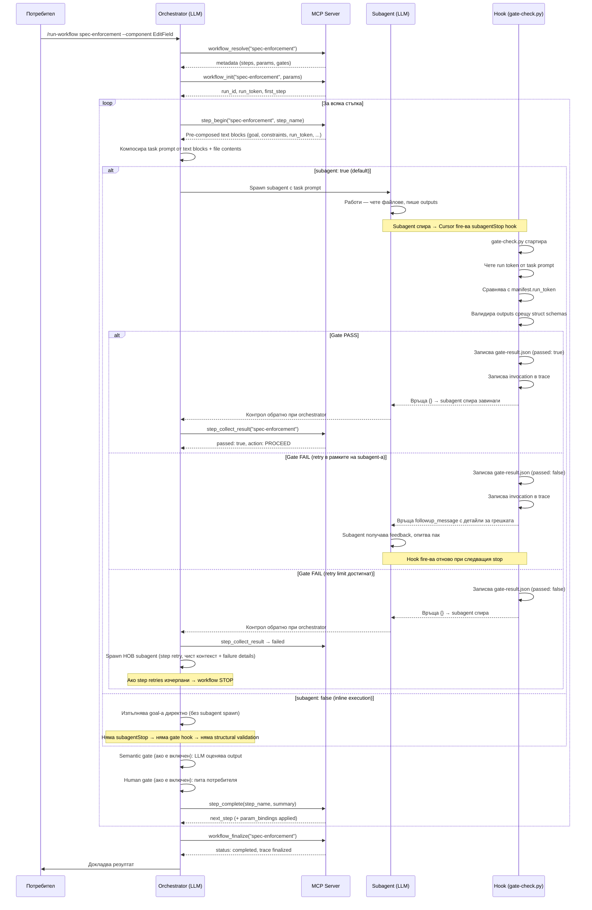

# 02a — Workflows: Cursor Implementation

Как workflow engine-ът работи конкретно в Cursor. Какви файлове участват, какво прави всеки от тях, и как изглежда пълният цикъл от `/run-workflow` до завършване.

> Предполага познаване на workflow концепциите от [02 — Workflows](02-workflows.md).

---

## Файлове и роли

```
.cursor/                                ← Cursor adapter
├── skills/run-workflow/SKILL.md        ← Orchestrator skill (LLM инструкции)
├── hooks.json                          ← Hook routing: subagentStop → gate-check.py
└── mcp.json                            ← MCP server registration (workflow-engine)

.agent/                                 ← Universal engine
├── mcp/
│   └── workflow-engine.py              ← MCP server: workflow orchestration tools
├── scripts/
│   ├── gate-check.py                   ← Structural gate (Python)
│   └── schema-validate.py              ← Schema validator (извиква се от gate-check.py)
├── workflows/
│   ├── templates/
│   │   ├── predefined/                 ← Built-in workflows (read-only)
│   │   └── my_workflows/               ← User-defined workflows
│   └── <name>/                         ← Runtime директория за workflow run
│       ├── manifest.json               ← Runtime state
│       ├── gate-result.json            ← Последен gate резултат
│       ├── context/                    ← Step summaries
│       ├── data/                       ← Step outputs
│       └── trace/                      ← Execution traces
└── docs/                               ← Engine documentation
```

Четири участника работят заедно:

- **MCP Server** (`workflow-engine.py`) — Python процес, spawn-нат от Cursor. Предоставя 7 tool-а за orchestration: `workflow_resolve`, `workflow_init`, `workflow_resume`, `step_begin`, `step_collect_result`, `step_complete`, `workflow_finalize`. Управлява manifest, trace, params, summaries.
- **Orchestrator** (LLM) — извиква MCP tool-ове за state management, spawn-ва subagent-и, обработва gate резултати. Вече **не** манипулира файлове директно — MCP server-ът го прави.
- **Subagent** (LLM) — изпълнява една стъпка в изолиран контекст. Знае само своя goal, inputs и summaries. Не знае за workflow-а.
- **gate-check.py** (Python) — hook, който се задейства автоматично от Cursor при `subagentStop`. Валидира outputs.

---

## Пълният цикъл: от команда до завършване

> **Забележка за `subagent: false` стъпки:** Диаграмата по-долу показва пълния flow за `subagent: true` стъпки. При `subagent: false` (каквито са **всички** стъпки в predefined workflows) orchestrator-ът изпълнява goal-а inline — **не** spawn-ва subagent, hook-ът **не** fire-ва, и structural gate **не** се пуска. Orchestrator-ът директно преминава към semantic/human gates (ако са включени) и `step_complete`.



---

## Orchestrator: какво точно прави?

Orchestrator-ът е `/run-workflow` skill-ът. Когато потребителят го извика, LLM-ът **става orchestrator** — не изпълнява стъпки сам, а управлява целия процес чрез MCP tool-ове:

### Startup (чрез MCP tools)

1. `workflow_resolve` — **Търси workflow** по приоритет, връща metadata
2. **Парсва params** от командата (`--component EditField`)
3. `workflow_init` — **Създава manifest.json**, trace, генерира **run token** (UUID)

Преди MCP server-а orchestrator-ът правеше всичко ръчно: четеше 440-ред SKILL.md, писаше manifest чрез file tools (~30-60 секунди). С MCP — 2-3 tool call-а (~5 секунди).

### Композиране на task prompt (чрез `step_begin`)

`step_begin` MCP tool връща **pre-composed text blocks** — orchestrator-ът само ги конкатенира:

1. **Goal** — вече с resolved `{param}` placeholders
2. **Params** — pre-formatted text (`params_text`)
3. **Input файлове** — inject: `file` (цялото съдържание), `file_if_exists`, или `reference` (само пътят)
4. **Summaries** — от предишни стъпки (ако carry_forward е включен)
5. **Output очаквания** — какви файлове да създаде, в какъв формат
6. **Spec check инструкции** — ако `spec_check: true`: "провери registry, прочети specs, спри при нарушение"
7. **Constraints** — пиши само в output paths, не пипай engine файлове
8. **Run token** — `<!--workflow:run_token:uuid-->` като невидим HTML коментар накрая

### Обработка на gate резултати

**За `subagent: true` стъпки** (след като subagent приключи):

1. Orchestrator-ът **чете `gate-result.json`** (записан от hook-а)
2. Ако **passed** → semantic gate (ако е включен) → human gate (ако е включен) → param bindings → complete step
3. Ако **failed** → spawn нов subagent с original task + failure details (step retry)
4. Ако retries изчерпани → **STOP workflow**, manifest status = `"failed"`
5. Ако `gate-result.json` **липсва** → gate infrastructure failure → **STOP workflow**

**За `subagent: false` стъпки** (inline execution):

Няма subagent → няма `subagentStop` hook → `gate-check.py` **не се пуска** → `gate-result.json` **не се записва**. Orchestrator-ът пропуска structural gate и преминава директно към semantic/human gates (ако са включени).

### Resume

При `--resume` orchestrator-ът чете manifest-а и продължава от текущата стъпка. Completed стъпки се пропускат, summaries от тях са достъпни.

---

## Hook: gate-check.py

**Единственият програматичен enforcement** в системата. Всичко останало е LLM инструкции.

### Кога се задейства?

Cursor автоматично пуска `gate-check.py` при всеки `subagentStop` event. Routing-ът е в `.cursor/hooks.json`:

```json
{
  "hooks": {
    "subagentStop": [{
      "command": "python .agent/scripts/gate-check.py",
      "loop_limit": 25
    }]
  }
}
```

`loop_limit: 25` означава: Cursor ще retry-ва до 25 пъти преди да спре subagent-а принудително.

### Какво прави стъпка по стъпка?

1. **Run token проверка** — чете task prompt-а на subagent-а, търси `<!--workflow:run_token:uuid-->`. Ако липсва или не съвпада с manifest-а → **излиза тихо** (не е workflow subagent, може да е обикновен Cursor subagent). Това предотвратява фалшиви gate-ове.

2. **Output валидация** — за всеки output с `struct:` дефиниция:
   - Resolve пътя (включително `{param}` placeholders и globs)
   - Зареди schema от `structs/<name>.schema.yaml`
   - Пусни `schema-validate.py`:
     - Файлът съществува ли?
     - Валиден JSON/YAML/Markdown?
     - Required полета, типове, patterns, enums
     - Nested обекти и масиви
     - Markdown frontmatter и секции

3. **Записва `gate-result.json`**:
   ```json
   {
     "step": "implement",
     "passed": false,
     "checks": 5,
     "failures": 1,
     "details": ["Missing field: files_modified[].relationship"],
     "loop_count": 2
   }
   ```

4. **Записва invocation в trace** — message count, tool calls, modified files, gate резултат, task prompt

5. **Решава дали subagent-ът продължава:**
   - PASS → връща `{}` → subagent спира
   - FAIL + retries remaining → връща `followup_message` → subagent получава feedback и опитва пак
   - FAIL + retries exhausted → връща `{}` → subagent спира → orchestrator решава

### Два вида retry

| Тип | Кога | Какво се случва | Контекст |
|-----|------|-----------------|----------|
| **Gate retry** | Structural FAIL, retries remaining | `followup_message` → същият subagent поправя | Запазен (същата сесия) |
| **Step retry** | Gate retries изчерпани ИЛИ semantic FAIL | Orchestrator spawn-ва **нов** subagent | Чист (нова сесия + failure details) |

Gate retry е евтин — продължава в същия контекст. Step retry е скъп — нов subagent, нова сесия.

---

## Delegation в Cursor

Когато стъпка има `delegate_to: spec-enforcement`, orchestrator-ът **не spawn-ва subagent**. Стъпката **трябва** да има `subagent: false` в `workflow.yaml` — иначе Cursor може да стартира subagent с по-слаб модел, който не може да интерпретира skill-а и опитва сам да имплементира вместо да делегира.

Вместо това:

1. Чете дефиницията на делегирания workflow
2. Проверява за кръгови делегации (A → B → A)
3. Resolve-ва params от parent-а
4. Създава **manifest в сестринска директория** (`.agent/workflows/<delegated-name>/manifest.json`) — не в подпапка на parent-а
5. Изпълнява стъпките му последователно (спрямо `subagent` настройката на всяка стъпка — inline или subagent + gates)
6. Записва резултата в parent manifest-а: `delegation_result: { status: "completed" }`

Parent-ът не знае колко стъпки съдържа делегираният workflow — вижда само крайния статус. Делегираният workflow използва **собствена gate конфигурация** — не наследява parent-а.

---

## Param propagation при delegation

### Проблемът

Когато parent workflow делегира към друг workflow, делегираният може да **открие нови стойности за params** — например, `spec-write` в auto-discovery mode пита потребителя и научава `component` и `domain`. Тези стойности се записват в делегирания manifest чрез `param_bindings` на стъпката CLARIFY. Но parent-ът **не знае за тях** — неговият manifest все още има празни `{component}` и `{domain}`.

Без решение, следващата стъпка в parent-а (`enforce` → `spec-enforcement`) ще получи празни params и ще се провали.

### Решението: param_bindings на delegation стъпка

Parent-ът може да дефинира `param_bindings` на стъпка с `delegate_to:`. Синтаксисът е същият като за обикновени стъпки, но пътищата се resolve-ват спрямо **делегирания** workflow, не спрямо parent-а:

```yaml
# spec-write-and-implement/workflow.yaml
steps:
  - name: write
    delegate_to: spec-write
    params:
      component: "{component}"
      domain: "{domain}"
      requirements: "{requirements}"
    param_bindings:
      component: "data/approved-requirements.json::component"
      domain: "data/approved-requirements.json::domain"

  - name: enforce
    delegate_to: spec-enforcement
    params:
      component: "{component}"    # ← вече попълнен от bindings
      domain: "{domain}"          # ← вече попълнен от bindings
      spec_path: ".agent/specs/{domain}/{component}.md"
```

### Какво се случва стъпка по стъпка

```
1. Parent стартира с component="" (auto-discovery)
   │
2. Parent делегира към spec-write
   │  spec-write CLARIFY стъпка → потребителят избира "message-queue" / "persistence"
   │  spec-write param_bindings → spec-write manifest.params обновен
   │  spec-write завършва → всички 4 стъпки completed
   │
3. Контролът се връща при parent orchestrator-а
   │  Parent чете param_bindings на delegation стъпката
   │  Resolve path: .agent/workflows/spec-write/data/approved-requirements.json
   │                                  ^^^^^^^^^^
   │                          делегирания workflow, не parent-а
   │  Извлича: component="message-queue", domain="persistence"
   │  Записва в parent manifest.params
   │
4. Parent делегира към spec-enforcement
   │  {component} = "message-queue", {domain} = "persistence"
   │  spec_path = ".agent/specs/persistence/message-queue.md"
   │  Всичко resolve-нато правилно ✓
```

### Ключова разлика: regular step vs delegation step

| | Regular step | Delegation step |
|---|---|---|
| **param_bindings path resolve** | Спрямо текущия workflow runtime dir | Спрямо **делегирания** workflow runtime dir |
| **Защо** | Output файловете са в текущата data/ | Output файловете са в делегирания workflow's data/ |
| **Пример** | `.agent/workflows/spec-write/data/file.json` | `.agent/workflows/spec-write/data/file.json` (но от гледна точка на parent-а `spec-write-and-implement`) |

Тази разлика е логична: при delegation, subagent-ите пишат в директорията на делегирания workflow, не на parent-а. Затова bindings трябва да четат оттам.

---

## Trace: какво се записва и от кого

Trace файлът (`trace/<run-id>.trace.json`) се пише от **двама участника**:

| Кой | Кога | Какво записва |
|-----|------|--------------|
| **Orchestrator** | Startup | Създава файла с метаданни: workflow name, params, gate config, started_at |
| **gate-check.py** | При всеки subagentStop | Append-ва invocation: timing, message count, tool calls, modified files, gate result, task prompt |
| **Orchestrator** | Finalize | Чете файла, update-ва top-level полета (completed_at, totals), добавя synthetic entries за missing стъпки |

**Критично:** Orchestrator-ът **никога не презаписва** trace-а. Чете го, merge-ва нови данни, и записва обратно. Invocation данните от hook-а са irreplaceable runtime data.

---

## Error logs

При проблеми с hook-а:

| Файл | Съдържание |
|------|-----------|
| `.agent/gate-check-invocations.log` | Лог на всяко извикване (стъпка, run token, резултат) |
| `.agent/gate-check-error.log` | Stack traces при crash на hook-а |

Ако orchestrator-ът не намери `gate-result.json` след subagent → проверява тези логове. Ако hook-ът не е fire-нал → **gate infrastructure failure** → workflow STOP.

---

## Diagnostic workflow

За тестване на hook/gate инфраструктурата съществува predefined workflow `hook-diagnostic`. Стартира се с `/run-workflow hook-diagnostic` и проверява:

- Hook fire-ва ли се при subagentStop?
- gate-check.py чете ли manifest-а правилно?
- Schema валидацията работи ли?
- Retry loop-ът функционира ли?

Полезно след първоначален setup или при съмнения за infrastructure проблем.

---

## MCP Server: workflow-engine

### Какво е

Python процес (`.agent/mcp/workflow-engine.py`), регистриран в `.cursor/mcp.json`. Cursor го spawn-ва автоматично при стартиране. Комуникира чрез stdio (JSON-RPC 2.0, newline-delimited). Tools се появяват в Cursor като `mcp__workflow_engine__<tool>`.

### Защо е нужен

Преди MCP server-а, orchestrator-ът (LLM) четеше 440-ред SKILL.md и ръчно създаваше manifest.json, trace файлове, summary файлове — всичко чрез file tools. Това отнемаше **30-60 секунди** startup time. С MCP server-а, всяка операция е единичен tool call — общо ~5 секунди.

### Tools

| Tool | Input | Output |
|------|-------|--------|
| `workflow_resolve` | `name` | Metadata: steps, params, gates, description |
| `workflow_init` | `name`, `params` | Създава manifest + trace, връща `run_id`, `run_token`, `first_step` |
| `workflow_resume` | `name` | Текущ state, summaries, next step |
| `step_begin` | `name`, `step` | **Pre-composed text blocks** за subagent task. За delegation — delegation metadata. |
| `step_collect_result` | `name`, `step` | Чете gate-result.json, връща action: PROCEED / RETRY / STOP |
| `step_complete` | `name`, `step`, `summary` | Обновява manifest, пише summary, прилага param_bindings, връща next_step |
| `workflow_finalize` | `name` | Финализира manifest + trace с aggregates |

### step_begin детайл

Най-важният tool за performance. Вместо LLM-ът ръчно да:
1. Чете workflow.yaml за step config
2. Чете manifest.json за params и run_token
3. Композира constraints, spec_check инструкции, output expectations
4. Записва обновен manifest status

...tool-ът прави всичко с един call и връща готови text блокове:

```json
{
  "type": "regular",
  "goal": "Extract specs from the source document...",
  "params_text": "**Params:** section = \"3.2.1\", source = \"docs/...\"",
  "inputs": [{"path": "data/manifest.json", "inject": "file"}, ...],
  "outputs_text": "**Write outputs to:**\n- `data/findings.json` (must follow struct: ...)",
  "spec_check_text": "**Spec check:** Before making code changes...",
  "constraints_text": "**Constraints:**\n- Write outputs ONLY to...",
  "run_token_text": "<!--workflow:run_token:abc123-->"
}
```

Orchestrator-ът конкатенира блоковете, добавя file contents за `inject: "file"` inputs, и spawn-ва subagent.

### Какво НЕ променя MCP server-ът

- `workflow.yaml` формат — **без промени**
- Predefined workflows — **без промени**
- User workflows (`my_workflows/`) — **без промени**
- `gate-check.py` — **без промени** (hook-ът е независим)
- Struct schemas — **без промени**
- `hooks.json` — **без промени**

MCP server-ът е pure acceleration layer — заменя ръчни file operations с tool calls, без да променя workflow формата или gate поведението.

### Fallback при липса на MCP

Ако MCP tools не са налични (server не е deploy-нат, Cursor не е рестартиран, server crash), orchestrator-ът пада на **manual fallback** — ръчни file operations, същото поведение като преди MCP. SKILL.md съдържа "Manual Fallback" секция (F1-F7) с компресирани инструкции за целия цикъл: намиране на workflow.yaml, създаване на manifest/trace, композиране на subagent task, четене на gate-result.json, обновяване на manifest, финализация.

Няма нужда от промяна на workflow файлове — fallback работи със същите `workflow.yaml` дефиниции.

**⚠️ Важно:** Orchestrator-ът трябва да избере ЕДИН подход (MCP или Manual) в началото и да го ползва за целия run. Смесването създава дублиран state — MCP traces с един run_id + ръчни manifests с друг run_id и фалшиви timestamps — което корумпира workflow историята. Manual fallback също изисква реални timestamps от системния часовник (не placeholder стойности като `12:00:00`).
