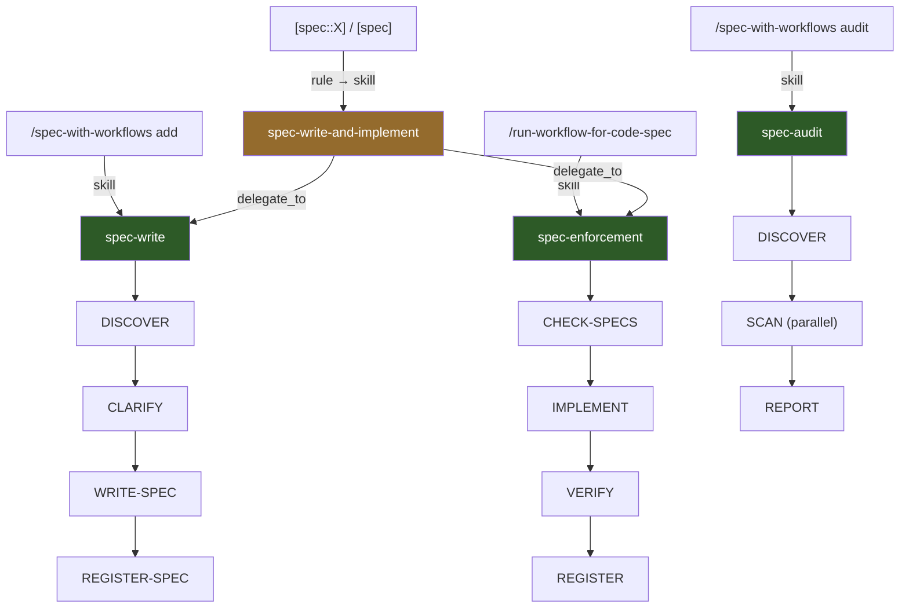
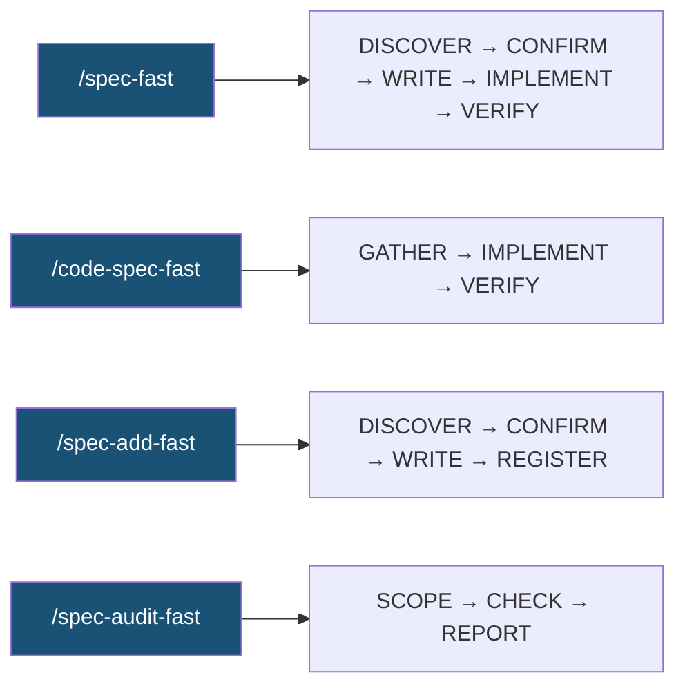

# 03 — Spec Guard

## Проблемът

Когато работиш с LLM (например в Cursor), той няма дългосрочна памет. Всяка чат сесия започва от чист лист. Решения от предишни сесии — "EditField трябва да показва error при надвишен лимит", "exit code 7 означава NVRAM грешка", "recovery процедурата винаги минава през self-test" — просто не съществуват за новия контекст.

Резултат: LLM-ът прави промени, които изглеждат правилни в момента, но нарушават поведение, за което вече си се съгласил. Системата деградира постепенно и незабележимо.

## Решение: Behavioral Specs

Spec Guard дава на LLM-а **дългосрочна памет за правила**. Вместо да разчиташ агентът да помни решения от предишни сесии, ги записваш като **behavioral specifications** — документи с ясни изисквания, които живеят в `.agent/specs/` и са достъпни при всяка сесия.

### Какво е "spec"?

Spec е Markdown файл с ясни изисквания. Всяко изискване има severity:

- **MUST** — задължително. Нарушението е бъг.
- **SHOULD** — препоръчително. Нарушението е warning.
- **MAY** — опционално. Полезно за контекст.

### За какво може да се напише spec?

Spec може да описва **всяко нещо**, за което искаш LLM-ът да помни правилата:

| Какво описва spec-ът | Пример | Обхват |
|----------------------|--------|--------|
| Конкретен компонент | `EditField`, `MessageQueue` | Един клас, модул, или UI елемент. |
| Подсистема | `nvram`, `recovery` | Функционалност, разпръсната в много файлове. |
| Протокол или конвенция | `exit-code`, `error-handling` | Правила, които трябва да се спазват навсякъде. |

Механизмът е еднакъв във всички случаи: spec описва правила, **registry** свързва spec-а с файловете, които го имплементират, а Spec Guard проверява при промяна.

### Как изглежда spec?

За конкретен компонент:

```yaml
---
spec_id: EditField
component: EditField          # Името, с което го извикваш
domain: ui                     # Логическа група
tags: [input, validation]
status: active
---

## Requirements

- **MUST** enforce character limit of 30 characters
- **MUST** show red error message at limit
- **SHOULD** show character count while typing

## Source

- 2026-03-13: Initial spec from [spec::EditField] session
```

За cross-cutting тема:

```yaml
---
spec_id: protocol/exit-code
component: exit-code
domain: protocol
tags: [error-handling, nvram, recovery]
status: active
---

## Requirements

- **MUST** return exit code 7 on NVRAM read failure
- **MUST** return exit code 12 on recovery timeout
- **MUST** never return exit code 0 if self-test failed
```

### Registry: кой spec кой файл пази?

`_registry.json` свързва spec-ове с файловете от codebase-а. Когато LLM-ът се готви да промени файл, проверява registry-то: "има ли spec, който пази този файл?" За компонент mapping-ът сочи към 2-3 файла. За тема като `exit-code` — към 15+.

---

## Два режима на работа

Spec Guard предлага два начина за изпълнение — **workflow режим** и **fast режим**. Правят едно и също, но с различен trade-off между надеждност и скорост.

### Workflow режим

Пълна инфраструктура: manifest следи state, structural gates валидират всяка стъпка, trace записва история. Подходящ за критични промени и когато искаш гаранция, че всичко е минало през проверка.



- **spec-write** — записва spec (без имплементация). 4 стъпки: открива дали spec съществува, изяснява requirements с потребителя, записва файла, регистрира.
- **spec-enforcement** — имплементира код, като пази spec-ове. 4 стъпки: намира засегнати spec-ове, прави промяната, верифицира, регистрира.
- **spec-write-and-implement** — комбинира двата чрез делегация. Не съдържа собствена логика.
- **spec-audit** — read-only проверка. Паралелно сканиране по domain-и.

### Fast режим

Workflow режимът е бавен — 8 стъпки с gates, manifest и trace отнемат ~5-10 минути дори за тривиална промяна. За рутинни задачи това е неоправдан overhead. Fast skills решават проблема: LLM-ът изпълнява същата логика директно в чат сесията, без workflow infrastructure. Резултатът е ~1-2 минути вместо 10.



- **`/spec-fast`** — записва spec + имплементира. Еквивалент на `spec-write-and-implement`, но без gates. Включва **задължително потвърждение** преди записване.
- **`/code-spec-fast`** — имплементира с проверка на spec-ове. Еквивалент на `spec-enforcement`.
- **`/spec-add-fast`** — записва spec без имплементация. Еквивалент на `spec-write`. Включва **задължително потвърждение** преди записване.
- **`/spec-audit-fast`** — read-only audit на spec-ове срещу кода. Еквивалент на `spec-audit`.

### Кога кой режим?

| | Workflow | Fast |
|---|---|---|
| **Structural gates** | Да — Python script валидира outputs | Не |
| **Human gates** | Да — потребителят одобрява | Не |
| **Manifest + trace** | Да — пълна история | Не |
| **Resume при прекъсване** | Да — продължава от последната стъпка | Не |
| **Скорост** | ~5-10 мин | ~1-2 мин |
| **Кога да ползвам** | Критични промени, нови spec-ове | Рутинни промени, бързи spec-ове |

---

## Налични команди

Всяка команда се изпълнява в чат сесия. За повечето задачи има **workflow** вариант (с gates и trace) и **fast** вариант (директно изпълнение, без overhead).

### Нов spec + имплементация

Дефинираш ново поведение **и** го имплементираш в код в една стъпка.

#### `[spec::<Component>] <requirements>` <sup>workflow</sup>

Implicit trigger — Spec Guard rule разпознава pattern-а в съобщението ти и автоматично стартира `spec-write-and-implement` workflow. Минава през пълния цикъл: изяснява requirements → записва spec → имплементира → верифицира. Всяка стъпка минава през structural gate.

```
[spec::<Component>] <описание на изискванията>
[spec] <описание>                                       # auto-discovery (без component)
```

```
[spec::EditField] character limit 30 chars, show red error at limit
[spec] save бутонът трябва да е disabled при submit и да показва spinner
```

#### `/spec-fast` <sup>fast</sup>

Директно изпълнение в чат сесията — discover → **confirm** → write → implement → verify. Същият резултат като `[spec]` trigger-а, но без manifest, gates и trace. Преди да запише spec-а, **винаги показва** как е разбрал изискванията, дали е намерил свързани/конфликтни spec-ове, и дали поведението вече е имплементирано — и чака потвърждение.

```
/spec-fast <component> "<requirements>"
/spec-fast "<requirements>"                             # auto-discovery
/spec-fast <component> "<requirements>" --no-implement  # само spec, без код
```

```
/spec-fast EditField "character limit 30, red error at limit"
/spec-fast "save button disabled on submit, show spinner"
```

### Code change с проверка на spec-ове

Промяна на код **без** създаване на нов spec. Валидира промяната срещу вече съществуващите spec-ове и гарантира, че нищо не е нарушено.

#### `/run-workflow-for-code-spec` <sup>workflow</sup>

Стартира `spec-enforcement` workflow. Анализира кои spec-ове засяга промяната, имплементира кода, верифицира всички requirements и обновява registry-то. Structural gates на всяка стъпка гарантират коректност.

```
/run-workflow-for-code-spec <component> "<instruction>"
/run-workflow-for-code-spec "<instruction>"             # auto-discovery
```

```
/run-workflow-for-code-spec EditField "add input blocking at 31 chars"
/run-workflow-for-code-spec "refactor the message queue retry logic"
```

#### `/code-spec-fast` <sup>fast</sup>

Директно изпълнение — намира засегнати spec-ове, имплементира промяната, верифицира и обновява registry. Ако открие нарушение на MUST requirement, спира изпълнението и пита преди да продължи.

```
/code-spec-fast <component> "<instruction>"
/code-spec-fast "<instruction>"                         # auto-discovery
```

```
/code-spec-fast EditField "add input blocking at 31 chars"
/code-spec-fast "optimize the retry delay in MessageQueue"
```

### Добавяне на spec (без имплементация)

Записваш поведенческа спецификация **без** промяна на код. Полезно когато документираш съществуващо поведение или когато имплементацията ще стане по-късно.

#### `/spec-with-workflows add` <sup>workflow</sup>

Стартира `spec-write` workflow. Преминава през 4 стъпки: discover (проверка дали spec вече съществува) → clarify (изясняване на requirements) → write → register. CLARIFY стъпката има **human gate** — потребителят одобрява формулировката преди записване.

```
/spec-with-workflows add <component>
/spec-with-workflows add                                # auto-discovery
/spec-with-workflows add <component> --requirements "<requirements>"
```

```
/spec-with-workflows add EditField
/spec-with-workflows add EditField --requirements "max 30 chars, red error"
```

#### `/spec-add-fast` <sup>fast</sup>

Директно изпълнение — discover → **confirm** → write → register. Записва spec файла и го добавя в `_index.json` без workflow infrastructure. Преди записване **винаги показва** как е интерпретирал изискванията и дали е намерил свързани spec-ове — и чака потвърждение. Подходящ за бързо документиране на requirements.

```
/spec-add-fast <component> "<requirements>"
/spec-add-fast "<requirements>"                         # auto-discovery
```

```
/spec-add-fast EditField "max 30 chars, red error at limit"
/spec-add-fast "API endpoints must return 429 on rate limit"
```

### Проверка и audit

Read-only анализ — сканира кода срещу записаните spec-ове и генерира отчет за нарушения. Никога не модифицира файлове.

#### `/spec-with-workflows audit` <sup>workflow</sup>

Стартира `spec-audit` workflow — паралелно сканиране по domain-и с structural gates на всяка стъпка. Генерира структуриран отчет с нарушения, групирани по severity. Поддържа `--suggest-fixes` за автоматични предложения за корекции.

```
/spec-with-workflows audit [--domain <name>] [--severity <level>] [--suggest-fixes]
```

```
/spec-with-workflows audit --domain ui --severity must
/spec-with-workflows audit --suggest-fixes
```

#### `/spec-audit-fast` <sup>fast</sup>

Директен audit в чат сесията — scope → check → report. Поддържа филтриране по domain, component или severity. Резултатът е същият отчет, но без manifest, gates и trace.

```
/spec-audit-fast                                        # всички spec-ове
/spec-audit-fast --domain <name>                        # по domain
/spec-audit-fast --component <name>                     # по component
/spec-audit-fast --severity must                        # само MUST requirements
```

```
/spec-audit-fast --domain ui
/spec-audit-fast --component EditField --severity must
```

### Управление на spec-ове

Команди за преглед и навигация на съществуващи spec-ове. Не стартират workflow и не модифицират файлове.

#### `/spec list`

Показва таблица с всички регистрирани spec-ове — component, domain, status и брой requirements по severity. Полезно за бърз преглед на покритието.

```
/spec list
/spec list --domain <name>                              # филтър по domain
```

#### `/spec show <component>`

Показва пълното съдържание на spec файла — metadata, всички requirements и списък с implementing files от registry-то. Полезно за ревю на конкретен spec преди промяна.

```
/spec show <component>
```

```
/spec show EditField
/spec show protocol/exit-code
```

### Implicit protection

Не е команда — работи автоматично при всяка сесия. Spec Guard rule е **винаги активен** и инструктира LLM-а: преди да модифицира файл, да провери `_registry.json`. Ако файлът е регистриран — LLM-ът чете свързаните spec-ове, сверява промяната с requirements и предупреждава при потенциално нарушение.

Това е най-леката форма на защита — без workflow, без gates, без trace. Работи като LLM-базирана предпазна мрежа, която покрива дори случаите, когато потребителят не е извикал explicit команда.

```
"добави dark mode за EditField"
→ LLM проверява _registry.json → открива EditField spec → чете requirements
→ имплементира dark mode → верифицира, че character limit и error message са запазени
→ предупреждава ако промяната нарушава MUST requirement
```

### Обобщение

| Команда | Описание | Режим | Gates | Trace |
|---------|----------|-------|-------|-------|
| `[spec::X]` / `[spec]` | Нов spec + имплементация | Workflow | Structural | Да |
| `/spec-fast` | Нов spec + имплементация | Fast | User confirm | — |
| `/run-workflow-for-code-spec` | Промяна на код с enforcement | Workflow | Structural | Да |
| `/code-spec-fast` | Промяна на код с enforcement | Fast | — | — |
| `/spec-with-workflows add` | Само spec (без код) | Workflow | Human + Structural | Да |
| `/spec-add-fast` | Само spec (без код) | Fast | User confirm | — |
| `/spec-with-workflows audit` | Read-only audit | Workflow | Structural | Да |
| `/spec-audit-fast` | Read-only audit | Fast | — | — |
| `/spec list` | Списък на всички spec-ове | Inline | — | — |
| `/spec show` | Детайли за конкретен spec | Inline | — | — |
| *(обикновен edit)* | Автоматична проверка | Rule | — | — |

---

## Tracing и диагностика

Всеки workflow run записва **trace** в `trace/<run-id>.trace.json`:

- Кои стъпки са изпълнени и колко време са отнели
- Колко gate retry-а е имало (и защо)
- Какви файлове са модифицирани

Полезно за post-mortem (къде и защо се е счупило) и за оптимизация (коя стъпка постоянно fail-ва). За визуализация: `.agent/tools/trace-viewer.html`.

---

## Reliability

| Верига | Шанс за trigger | Гаранция за качество |
|--------|----------------|---------------------|
| `[spec::X]` → rule → workflow | ~69% | Висока (gates) |
| `/spec-with-workflows add` (explicit) | ~95% | Висока (gates) |
| `/run-workflow` (explicit) | ~95% | Висока (gates) |
| Обикновен edit → rule check | ~85% | Средна (LLM проверка) |

За критични промени — explicit workflow. Pattern triggers са convenience, но не са 100% надеждни.

---

## Known Gaps

1. **Нерегистрирани файлове**: Ако файл не е в registry-то, spec guard не го проверява. Решение: периодично `/spec-with-workflows audit --include-unregistered`.

2. **LLM discretion**: Rule е advisory — LLM-ът може да не го последва. Explicit triggers са по-надеждни.

3. **Нов файл без spec**: Ако създадеш нов файл, който имплементира spec, но не го регистрираш — spec guard няма да знае за него.

---

## Имплементация в Cursor

Как Spec Guard е реализиран в Cursor — кои rules, skills и hooks участват, кога се задействат, и пълният flow от user input до execution: **[03a — Spec Guard: Cursor Implementation](03a-spec-guard-cursor-impl.md)**
