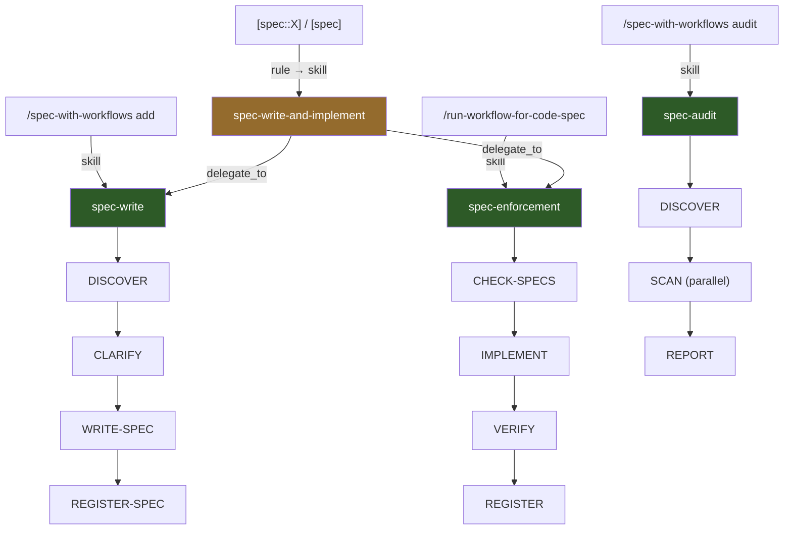
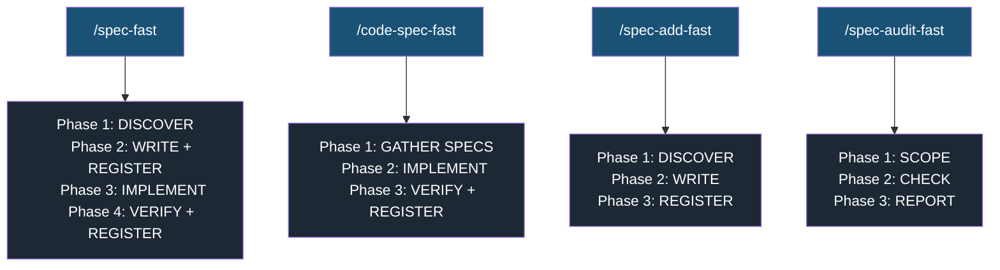

# 03a — Spec Guard: Cursor Implementation

Как Spec Guard е реализиран в Cursor. Какви файлове участват, какво прави всеки от тях, и как user input стига до изпълнение.

> Предполага познаване на use case-ите от [03 — Spec Guard](03-spec-guard.md).
> За общия workflow execution model (orchestrator, gates, hooks, trace): [02a — Workflows: Cursor Implementation](02a-workflows-cursor-impl.md).

---

## Архитектура: два слоя

Spec Guard се състои от **adapter слой** (специфичен за Cursor) и **engine слой** (универсален, IDE-agnostic):

```
.cursor/                          ← Cursor adapter
├── rules/spec-guard.mdc          ← Always-active rule (pattern detection + pre-edit check)
├── skills/
│   ├── spec/SKILL.md             ← /spec skill (add, list, check, audit)
│   ├── run-workflow-for-code-spec/SKILL.md   ← /run-workflow-for-code-spec skill (thin wrapper)
│   └── run-workflow/SKILL.md     ← Orchestrator (общ за всички workflows)
└── hooks.json                    ← Hook routing (subagentStop → gate-check.py)

.agent/                           ← Universal engine
├── specs/                        ← Spec файлове + _registry.json
├── scripts/gate-check.py         ← Structural gate (Python)
├── workflows/templates/          ← Workflow definitions (YAML)
└── docs/                         ← Engine documentation
```

Cursor вижда `.cursor/` — rules, skills, hooks. Engine-ът (`.agent/`) е същият независимо от IDE-то. Бъдещи адаптери (Claude Code, друг IDE) ще имат свой adapter слой, но ще преизползват `.agent/`.

---

## Workflow режим: композиция

Spec-свързаните workflows се композират чрез `delegate_to` — един workflow може да делегира към друг като стъпка:



**spec-write** е самостоятелен workflow за записване на spec. **spec-write-and-implement** го преизползва чрез делегация, после делегира и към **spec-enforcement**. Така логиката "открий → изясни → запиши spec" съществува на едно място.

Всички стъпки в spec-write и spec-enforcement се изпълняват **inline** от оркестратора (`subagent: false`) — без spawn на изолирани subagent-и. Structural gates валидират outputs на всяка стъпка чрез `gate-check.py` hook.

---

## Fast режим: inline skills

Workflow режимът осигурява надеждност, но е бавен (~5-10 мин за 8 стъпки с gates и trace). За рутинни задачи fast skills предлагат същата логика **без** workflow infrastructure (manifest, trace, gates) — LLM-ът следва фазите директно в чат сесията за ~1-2 мин.



| Fast skill | Workflow еквивалент | Какво прави |
|---|---|---|
| `/spec-fast` | `spec-write-and-implement` | Spec + implement (или `--no-implement` за spec only) |
| `/code-spec-fast` | `spec-enforcement` | Code change с проверка на spec-ове |
| `/spec-add-fast` | `spec-write` | Spec only, без имплементация |
| `/spec-audit-fast` | `spec-audit` | Read-only audit на spec-ове срещу кода |

**Разлика:** Няма `gate-check.py`, няма manifest, няма trace. LLM-ът чете и пише `_index.json` и `_registry.json` директно. При грешка — няма автоматичен retry; LLM-ът докладва.

---

## Workflow режим: flow от user input до изпълнение

Всяка команда минава през верига: **user input → rule/skill → workflow → orchestrator + gates**.

### Use case 1 — `[spec::EditField] char limit 30`

Потребителят иска нов spec + имплементация за нещо, което назовава по име.

```
USER INPUT: "[spec::EditField] character limit 30, red error at limit"
    │
    ▼ RULE: spec-guard.mdc (alwaysApply: true)
    │  Разпознава [spec::EditField] pattern
    │  Инструктира LLM-а да извика workflow
    │
    ▼ SKILL: /run-workflow
    │  /run-workflow spec-write-and-implement --component EditField --requirements "..."
    │
    ▼ WORKFLOW: spec-write-and-implement
    │
    ├── delegate_to: spec-write
    │   ├── DISCOVER (inline)
    │   ├── CLARIFY (inline) → human gate → потребителят одобрява requirements
    │   ├── WRITE-SPEC (inline) → spec записан
    │   └── REGISTER-SPEC (inline) → _registry.json обновен
    │
    └── delegate_to: spec-enforcement
        ├── CHECK-SPECS (inline)
        ├── IMPLEMENT (inline)
        ├── VERIFY (inline)
        └── REGISTER (inline)
```

> **Забележка:** Всички стъпки в predefined workflows са `subagent: false` (inline). Structural gate hook **не** fire-ва за inline стъпки. Валидацията разчита на semantic и human gates.

**Trigger:** rule (soft — LLM може да не разпознае pattern-а). **Execution:** workflow (semantic + human gates). **Trace:** записва се.

### Use case 2 — `[spec] save бутонът трябва да е disabled`

```
USER INPUT: "[spec] save бутонът трябва да е disabled при submit"
    │
    ▼ RULE: spec-guard.mdc
    │  Разпознава [spec] pattern (без component name)
    │
    ▼ SKILL: /run-workflow
    │  /run-workflow spec-write-and-implement --requirements "..."
    │  (без --component → auto-discovery mode)
    │
    ▼ WORKFLOW: spec-write-and-implement
    │
    └── Същият flow като Use case 1, но DISCOVER стъпката
        анализира текста, предлага компонент, и пита за потвърждение
```

### Use case 3 — `/run-workflow-for-code-spec EditField "add input blocking"`

Потребителят иска code change с валидация срещу съществуващи spec-ове.

```
USER INPUT: "/run-workflow-for-code-spec EditField 'add input blocking at 31 chars'"
    │
    ▼ SKILL: /run-workflow-for-code-spec
    │  Парсва аргументи: component=EditField, instruction="add input blocking..."
    │  Thin wrapper — веднага делегира:
    │
    ▼ SKILL: /run-workflow
    │  /run-workflow spec-enforcement --component EditField --instruction "..."
    │
    ▼ WORKFLOW: spec-enforcement
    │
    ├── CHECK-SPECS (inline) → намира засегнати spec-ове
    ├── IMPLEMENT (inline) → прави code change
    ├── VERIFY (inline) → проверява spec compliance
    └── REGISTER (inline) → обновява _registry.json
```

> Всички стъпки са `subagent: false` (inline) — structural gate не fire-ва.

### Use case 4 — `/spec-with-workflows audit --domain ui`

```
USER INPUT: "/spec-with-workflows audit --domain ui --severity must"
    │
    ▼ SKILL: /spec-with-workflows
    │  Разпознава подкоманда "audit"
    │  Веднага делегира:
    │
    ▼ SKILL: /run-workflow
    │  /run-workflow spec-audit --domain ui --severity must
    │
    ▼ WORKFLOW: spec-audit
    │
    ├── DISCOVER (subagent) → structural gate + human gate → потребителят одобрява обхвата
    ├── SCAN (parallel subagents) → structural gate → по един за всеки domain
    └── REPORT (subagent) → structural gate → структуриран отчет
```

**Read-only** — никога не пипа код.

### Use case 5 — `/spec-with-workflows add EditField`

```
USER INPUT: "/spec-with-workflows add EditField"
    │
    ▼ SKILL: /spec-with-workflows
    │  Разпознава подкоманда "add"
    │  Делегира към spec-write workflow:
    │
    ▼ SKILL: /run-workflow
    │  /run-workflow spec-write --component EditField
    │
    ▼ WORKFLOW: spec-write
    │
    ├── DISCOVER (inline) → проверява дали spec съществува
    ├── CLARIFY (inline) → human gate → потребителят одобрява
    ├── WRITE-SPEC (inline) → spec записан (без structural gate — inline стъпка)
    └── REGISTER-SPEC (inline) → _registry.json обновен (без structural gate — inline стъпка)
```

> **Забележка:** Всички стъпки на spec-write са `subagent: false` (inline). Structural gate **не** fire-ва при inline execution — валидацията разчита на semantic gate и human gate (за CLARIFY стъпката).

### Use case 6 — Обикновен edit

```
USER INPUT: "добави dark mode за EditField"
    │
    ▼ RULE: spec-guard.mdc (alwaysApply: true)
    │  Няма pattern ([spec::] или [spec]) — rule не делегира
    │  Но инструктира LLM-а: "провери _registry.json преди code edit"
    │
    ├── Файлът е в registry → LLM чете spec → предупреждава при нарушение
    └── Файлът НЕ е в registry → нищо (known gap)
```

---

## Fast режим: flow от user input до изпълнение

Fast skills нямат workflow infrastructure — LLM-ът изпълнява фазите директно. Няма manifest, trace, hook, или gate retry loop.

### `/spec-fast` — spec + implement (бърз)

```
USER INPUT: "/spec-fast EditField 'character limit 30, red error'"
    │
    ▼ SKILL: /spec-fast (inline, без workflow)
    │
    ├── Phase 1: DISCOVER
    │   Чете _index.json, _registry.json
    │   Проверява дали spec съществува, търси overlaps
    │   Ако auto-discovery → предлага component/domain
    │
    ├── Phase 2: WRITE SPEC + REGISTER
    │   Записва .agent/specs/{domain}/{component}.md
    │   Обновява _index.json
    │
    ├── Phase 3: IMPLEMENT
    │   Имплементира new/changed requirements
    │   Проверява за нарушения на други spec-ове
    │   При конфликт → спира и пита потребителя
    │
    └── Phase 4: VERIFY + REGISTER
        Верифицира modified files срещу всички spec-ове
        Обновява _registry.json
```

С `--no-implement` спира след Phase 2 (еквивалент на `/spec-add-fast`).

### `/code-spec-fast` — code change с enforce (бърз)

```
USER INPUT: "/code-spec-fast EditField 'add input blocking at 31 chars'"
    │
    ▼ SKILL: /code-spec-fast (inline, без workflow)
    │
    ├── Phase 1: GATHER SPECS
    │   Targeted: намира primary spec + related specs от _registry.json
    │   Auto-discovery: анализира instruction → предвижда засегнати файлове
    │                   → проверява _registry.json за mapped spec-ове
    │
    ├── Phase 2: IMPLEMENT
    │   Прави code change
    │   Постоянно проверява за spec нарушения
    │   При конфликт → спира и пита потребителя
    │
    └── Phase 3: VERIFY + REGISTER
        Верифицира modified files срещу всички spec-ове
        Обновява _registry.json
```

### `/spec-add-fast` — spec only (бърз)

```
USER INPUT: "/spec-add-fast EditField 'max 30 chars, red error at limit'"
    │
    ▼ SKILL: /spec-add-fast (inline, без workflow)
    │
    ├── Phase 1: DISCOVER
    │   Чете _index.json, проверява _registry.json за existing code
    │   Проверява дали spec съществува, търси overlaps
    │
    ├── Phase 2: WRITE SPEC
    │   Записва .agent/specs/{domain}/{component}.md
    │
    └── Phase 3: REGISTER
        Обновява _index.json
        НЕ пипа _registry.json (няма code changes)
```

### `/spec-audit-fast` — read-only audit (бърз)

```
USER INPUT: "/spec-audit-fast --domain ui"
    │
    ▼ SKILL: /spec-audit-fast (inline, без workflow)
    │
    ├── Phase 1: SCOPE
    │   Чете _index.json, _registry.json
    │   Прилага филтри (--domain, --component, --severity)
    │   Определя кои spec-ове да провери
    │
    ├── Phase 2: CHECK
    │   За всеки spec в обхвата:
    │   Чете spec файла + implementing files от registry
    │   Проверява всяко requirement срещу кода
    │   Определя: compliant / violation / partial / unverifiable
    │
    └── Phase 3: REPORT
        Структуриран отчет: violations, summary по domain
        Read-only — никога не пипа файлове
```

---

## Spec Guard компоненти

### spec-guard.mdc — винаги активният rule

**Файл:** `.cursor/rules/spec-guard.mdc`
**Frontmatter:** `alwaysApply: true`
**Кога е активен:** При всяка Cursor чат сесия, без изключение.

Rule-ът инструктира LLM-а за три неща:

**Pattern detection** — ако потребителят напише `[spec::EditField]` или `[spec]`, LLM-ът трябва да разпознае pattern-а и да извика `/run-workflow`. Тук `EditField` е **идентификаторът** на нещото, за което пишеш spec — може да е клас, модул, подсистема (`nvram`), или конвенция (`exit-code`). Workflow-ът сам определя domain-а.

**Pre-edit check** — преди всяка промяна на код, LLM-ът трябва да провери `_registry.json`, да намери засегнати spec-ове, да ги прочете и да предупреди при нарушение.

**Override protocol** — ако потребителят наистина иска да наруши spec, LLM-ът трябва първо да обнови spec файла, после да промени кода.

Rule-ът е **soft enforcement** — всичко горе е инструкция за LLM-а. LLM-ът може да не го последва.

### /spec skill (view only)

**Файл:** `.cursor/skills/spec/SKILL.md`

| Подкоманда | Какво прави |
|-----------|------------|
| `/spec list` | Чете `_index.json`, показва таблица |
| `/spec show X` | Показва spec + implementing files |

### /spec-with-workflows skill (create/audit via workflows)

**Файл:** `.cursor/skills/spec-with-workflows/SKILL.md`

| Подкоманда | Какво прави | Делегира към workflow? |
|-----------|------------|----------------------|
| `/spec-with-workflows add X` | Делегира към `spec-write` workflow | **Да** |
| `/spec-with-workflows audit` | Делегира към `spec-audit` workflow | **Да** |

### /run-workflow-for-code-spec skill

**Файл:** `.cursor/skills/run-workflow-for-code-spec/SKILL.md`

Thin wrapper — парсва аргументи и веднага извиква `/run-workflow spec-enforcement`. Без собствена логика.

### Fast skills

| Skill | Файл | Какво прави |
|-------|------|-------------|
| `/spec-fast` | `.cursor/skills/spec-fast/SKILL.md` | Spec + implement inline. `--no-implement` за spec only. |
| `/code-spec-fast` | `.cursor/skills/code-spec-fast/SKILL.md` | Code change с spec enforcement inline. |
| `/spec-add-fast` | `.cursor/skills/spec-add-fast/SKILL.md` | Spec only (без код) inline. |
| `/spec-audit-fast` | `.cursor/skills/spec-audit-fast/SKILL.md` | Read-only audit inline. |

Fast skills четат и пишат директно в `.agent/specs/` (`_index.json`, `_registry.json`, spec файлове). Нямат interaction с `gate-check.py`, manifest, или trace — целият enforcement е LLM-базиран.

---

## Hard vs Soft enforcement

| Механизъм | Тип | Кой го изпълнява | Може ли LLM-ът да го пропусне? |
|-----------|-----|-------------------|-------------------------------|
| `spec-guard.mdc` rule | Soft | LLM (инструктиран от rule) | Да — rule е advisory |
| `spec_check` в workflow step | Soft | LLM (инструктиран от orchestrator) | Да — но orchestrator ще забележи |
| `gate-check.py` (structural gate) | **Hard** | Python script (hook) | **Не** — Cursor го пуска автоматично |
| Human gate | **Hard** | Потребител (одобрява/отхвърля) | **Не** — orchestrator чака |

Единственият истински hard enforcement е hook-ът. Всичко останало разчита на LLM compliance.

За детайли как hook-ът, gate retry loop-ът и trace-ът работят в Cursor: [02a — Workflows: Cursor Implementation](02a-workflows-cursor-impl.md).
